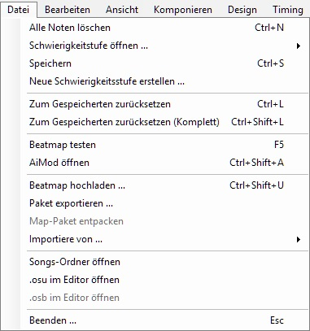
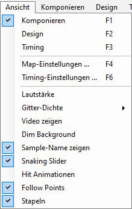
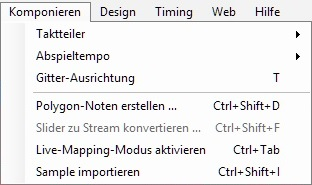
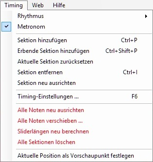
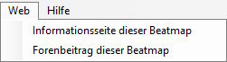

# Menü des Beatmap-Editors

## Datei

| Name | Beschreibung |
| :-- | :-- |
| Alle Noten löschen (`Strg` + `N`) | Entfernt alle Hit-Objekte der Schwierigkeitsstufe. |
| Schwierigkeitsstufe öffnen ... | **Beim Editieren:** Schneller Wechsel zwischen den Schwierigkeitsstufen. **Zur Referenz:** Legt die gewählte Schwierigkeitsstufe über die (aktuell) geöffnete (nur [osu!mania](/wiki/Game_mode/osu!mania)). |
| Speichern (`Strg` + `S`) | Speichert die aktuellen Änderungen (Dateiformate [`.osu`](/wiki/Client/File_formats/osu_(file_format)) und [`.osb`](/wiki/Client/File_formats/osb_(file_format))). |
| Neue Schwierigkeitsstufe erstellen ... | Speichert die aktuellen Änderungen als neue Schwierigkeitsstufe. Die alte Schwierigkeitsstufe bleibt beim erneuten Laden in ihrem zuletzt gespeicherten Zustand erhalten. |
| Zum Gespeicherten zurücksetzen (`Strg` + `L`) | Hebt alle Änderungen der Schwierigkeitsstufe und des Storyboards bis zum letzten Speicherpunkt auf. |
| Zum Gespeicherten zurücksetzen (Komplett) (`Strg` + `Shift` + `L`) | Hebt alle Änderungen der Schwierigkeitsstufe und des Storyboards bis zum letzten Speicherpunkt auf und lädt alle Dateien neu (Sprites, Soundsamples etc.). |
| Beatmap testen (`F5`) | Startet den [Testmodus](/wiki/Client/Beatmap_editor/Test_mode). Aktuelle Änderungen werden für den Test gespeichert. |
| AiMod öffnen (`Strg` + `Shift` + `A`) | [AiMod](/wiki/Client/Beatmap_editor/AiMod) öffnen. |
| Beatmap hochladen ... (`Strg` + `Shift` + `U`) | [Lädt](/wiki/Beatmapping/Beatmap_submission) die Beatmap in das Forum [Work In Progress](https://osu.ppy.sh/community/forums/10) hoch. |
| Paket exportieren ... | Exportiert die Beatmap als [`.osz`-Archiv](/wiki/Client/File_formats/osz_(file_format)) zur manuellen Weitergabe. Der Ordner `Exports` wird geöffnet, in dem die Datei abgelegt wird. |
| Map-Paket entpacken | Entpackt eine Beatmap im Format `.osz2` in einen temporären Ordner, um die darin enthaltenen Daten während des Moddings zu überschreiben.[^osz2-note] |
| Importiere von ... | **bms/bme:** Öffnet Dateien im Format `.bms`/`.bme`, um sie als osu!mania-Schwierigkeitsstufe zu importieren. |
| Songs-Ordner öffnen | Öffnet den Beatmap-Ordner, der die zugehörigen Spieldateien enthält. |
| `.osu` im Editor öffnen | Öffnet die Datei der aktuellen Schwierigkeitsstufe im Texteditor. |
| `.osb` im Editor öffnen | Öffnet die [Storyboard-Datei](/wiki/Storyboard) der Beatmap im Texteditor. |
| Beenden ... (`Esc`) | Verlässt den Beatmap-Editor und fragt, ob kürzliche Änderungen gespeichert werden sollen.[^exit-note] |

## Bearbeiten

| Name | Beschreibung |
| :-- | :-- |
| Rückgängig (`Strg` + `Z`) | Vorherige Bearbeitung rückgängig machen. |
| Wiederherstellen (`Strg` + `Y`) | Vorherige Bearbeitung wiederherstellen. |
| Ausschneiden (`Strg` + `X`) | Ausgewählte Objekte ausschneiden. |
| Kopieren (`Strg` + `C`) | Ausgewählte Objekte in die Zwischenablage kopieren. |
| Einfügen (`Strg` + `V`) | Objekte aus der Zwischenablage einfügen. |
| Löschen (`Entfernen`) | Ausgewählte Objekte löschen. |
| Alles auswählen (`Strg` + `A`) | Alle Hit-Objekte markieren. |
| Klonen (`Strg` + `D`) | Ausgewählte Objekte kopieren und sie einen [Beat](/wiki/Music_theory/Beat) nach der Auswahl einfügen. |
| Auswahl umkehren (`Strg` + `G`) | Kehrt die Richtung von Slidern um und ordnet Hit-Objekte zeitlich so neu an, dass das letzte zum ersten wird usw. |
| Horizontal spiegeln (`Strg` + `H`) | Auswahl an der Y-Achse des Spielfelds spiegeln (links und rechts). |
| Vertikal spiegeln (`Strg` + `J`) | Auswahl an der X-Achse des Spielfelds spiegeln (oben und unten). |
| 90° im Uhrzeigersinn drehen (`Strg` + `>`) | Auswahl um 90° nach rechts um die Spielfeldmitte drehen. |
| 90° gegen den Uhrzeigersinn drehen (`Strg` + `<`) | Auswahl um 90° nach links um die Spielfeldmitte drehen. |
| Rotieren ... (`Strg` + `Shift` + `R`) | Auswahl um einen festgelegten Winkel um die Spielfeldmitte oder die Mitte der Auswahl rotieren. |
| Skalieren ... (`Strg` + `Shift` + `S`) | Verändere die Größe der ausgewählten Objekte, indem die Auswahl weiter vom Spielfeld oder der Mitte der Auswahl weg bzw. über eine oder mehrere Achsen bewegt wird. |
| Samples des ausgewählten Objekts zurücksetzen | Entfernt den [Hitsound](/wiki/Beatmapping/Hitsound) vom ausgewählten Hit-Objekt. |
| Alle Samples zurücksetzen | Entfernt alle festgelegten Hitsounds von den Hit-Objekten in dieser Schwierigkeitsstufe. |
| Combo-Farben zurücksetzen | Setzt alle [Combo-Farben](/wiki/Beatmapping/Colourhaxing) in der aktuellen Schwierigkeitsstufe zurück. |
| Pausen zurücksetzen | Setzt alle [Pausen](/wiki/Beatmap/Break) zurück und platziert diese neben umliegenden Hit-Objekten. |
| Stups zurück (`J`) | Bewegt die Auswahl abhängig vom [Taktteiler](/wiki/Client/Beatmap_editor/Beat_snap_divisor) um einen Beat zurück. |
| Stups vorwärts (`K`) | Bewegt die Auswahl abhängig vom Taktteiler um einen Beat nach vorne. |

## Ansicht

| Name | Beschreibung |
| :-- | :-- |
| Komponieren (`F1`) | Öffnet den Tab [`Compose`](/wiki/Client/Beatmap_editor/Compose). |
| Design (`F2`) | Öffnet den Tab [`Design`](/wiki/Client/Beatmap_editor/Design). |
| Timing (`F3`) | Öffnet den Tab [`Timing`](/wiki/Client/Beatmap_editor/Timing). |
| Map-Einstellungen ... (`F4`) | Öffnet den Dialog [`Song Setup`](/wiki/Client/Beatmap_editor/Song_setup). |
| Timing-Einstellungen ... (`F6`) | Öffnet den Dialog [`Timing and Control Points`](/wiki/Client/Beatmap_editor/Timing). |
| Lautstärke | Anpassen der Lautstärke von Musik oder Samples. |
| Gitter-Dichte (`G`) | Legt die [Gittergröße](/wiki/Beatmapping/Grid_snapping) im Spielfeld fest, das für die [Platzierung](/wiki/Beatmapping/Snapping) von Objekten wichtig ist. |
| Video zeigen | Stellt die Sichtbarkeit des Hintergrundvideos und des Storyboards ein. |
| Dim Background | Durch Abdunkeln des Hintergrunds werden die Hit-Objekte im [Testmodus](/wiki/Client/Beatmap_editor/Test_mode) besser sichtbar. |
| Sample-Name anzeigen | Zeigt den [Keysound](/wiki/Beatmapping/Hitsound#keysound), der zu den Hit-Objekten in osu!mania-Schwierigkeitsstufen hinzugefügt wurde. |
| Snaking Slider | Animiert die Slider, wie sie im Spiel aussehen. |
| Hit Animationen | Animiert die Hit-Circles, wie sie während des Spiels angezeigt werden. |
| Follow Points | Zeigt Follow Points zwischen den Hit-Objekten wie im Spiel an. |
| Stapeln | Stapelt die übereinander liegenden Hit-Circles wie im Spiel.[^stacking-note] |

## Komponieren

*Hauptseite: [Komposition](/wiki/Client/Beatmap_editor/Compose)*

| Name | Beschreibung |
| :-- | :-- |
| Taktteiler | Passt die Feinheit des [Taktteilers](/wiki/Client/Beatmap_editor/Beat_snap_divisor) an, wobei mehr oder weniger Striche auf der [Zeitleiste](/wiki/Client/Beatmap_editor/Timelines) angezeigt werden. |
| Abspieltempo | Gibt an, wie schnell das Lied abgespielt wird. |
| Gitter-Ausrichtung (`T`) | Ein- und ausschalten, dass Hit-Objekte am [Raster](/wiki/Beatmapping/Grid_snapping) des Spielfelds ausgerichtet werden. |
| Polygon-Noten erstellen ... (`Strg` + `Shift` + `D`) | Erstellt anhand des aktiven Taktteilers einen kreisförmigen Fluss aus Hit-Circles. |
| Slider zu Stream konvertieren ... | Ändert den [Körper](/wiki/Gameplay/Hit_object/Slider/Sliderbody) eines ausgewählten Sliders zu einem Stream aus Hit-Circles. **Nach Objektanzahl:** Verwendung einer bestimmten Anzahl von Hit-Circles. **Nach Distance Snap:** Platziert Objekte nach einem [festgelegtem Abstand](/wiki/Client/Beatmap_editor/Distance_snap). |
| Live-Mapping-Modus aktivieren (`Strg` + `Tab`) | Platziert [Hit-Circles](/wiki/Gameplay/Hit_object/Hit_circle) in osu! und osu!taiko, [Fruits](/wiki/Gameplay/Hit_object/Fruit) in osu!catch bzw. Noten in osu!mania mit den Tastenbelegungen während der Song im Editor spielt.[^live-mapping-note] |
| Sample importieren | Öffnet den Dialog [`Sample importieren`](/wiki/Client/Beatmap_editor/Compose#sample-import) für osu!mania-Schwierigkeitsstufen. |

## Design

*Hauptseite: [Design](/wiki/Client/Beatmap_editor/Design)*

| Name | Beschreibung |
| :-- | :-- |
| Alle Objekte verschieben | Verschiebt *alle* Storyboard-[Befehle](/wiki/Storyboard/Scripting/Commands) um einen Zeitwert in Millisekunden. |

## Timing

*Hauptseite: [Timing](/wiki/Client/Beatmap_editor/Timing)*

| Name | Beschreibung |
| :-- | :-- |
| Rhythmus | Wahl zwischen den [Taktarten](/wiki/Music_theory/Time_signature) Walzer (3/4) oder Standard (4/4) für den aktuellen Timing-Punkt. Für andere Taktarten muss das [`Timing Setup`](/wiki/Client/Beatmap_editor/Timing) verwendet werden. |
| Metronom | Aktiviert oder deaktiviert die Tickgeräusche des [Metronoms](/wiki/Client/Beatmap_editor/Timing#metronome) im Tab `Timing`. |
| Sektion hinzufügen (`Strg` + `P`) | Erstellt eine neue [nicht vererbte (rote) Timing-Sektion](/wiki/Client/Beatmap_editor/Timing#uninherited-timing-point). |
| Erbende Sektion hinzufügen (`Strg` + `Shift` + `P`) | Erstellt eine neue [vererbte (grüne) Timing-Sektion](/wiki/Client/Beatmap_editor/Timing#inherited-timing-point). |
| Aktuelle Sektion zurücksetzen | Setzt die [BPM](/wiki/Music_theory/Tempo) und das [Offset](/wiki/Offset) der aktuellen nicht vererbten Timing-Sektion zurück, [damit diese neu getimt werden kann](/wiki/Beatmapping/Timing). Wird die Schwierigkeitsstufe gespeichert, gehen die damit zusammenhängenden Sektionen ohne Bearbeitung verloren. |
| Sektion entfernen (`Strg` + `I`) | Entfernt die Timing-Sektion, in der man sich gerade befindet (sowohl vererbte als auch nicht vererbte). |
| Sektion neu ausrichten | [Richtet](/wiki/Beatmapping/Snapping) alle Hit-Objekte in der aktuellen Timing-Sektion anhand des aktiven Taktteilers neu aus. |
| Timing-Einstellungen... (`F6`) | Öffnet den Dialog [`Timing and Control Points`](/wiki/Client/Beatmap_editor/Timing). |
| Alle Noten neu ausrichten | Richtet alle Hit-Objekte in der aktuellen Schwierigkeitsstufe nach dem aktiven Taktteiler aus. |
| Alle Noten verschieben ... | Bewegt alle Hit-Objekte um einen Zeitwert in Millisekunden. |
| Sliderlängen neu berechnen | Setzt die [Sliderenden](/wiki/Gameplay/Hit_object/Slider/Slidertail) automatisch zum nächstgelegenen Strich auf der Zeitleiste,[^recalculate-lengths-note] wobei **die Slider möglicherweise gekürzt werden** und deshalb manuell überprüft werden müssen. |
| Alle Sektionen löschen | Löscht alle vererbten und nicht vererbten Timing-Sektionen aus der aktuellen Schwierigkeitsstufe. |
| Aktuelle Position als Vorschaupunkt festlegen | Den aktuellen Zeitstempel als Vorschaupunkt für die Webseite und die [Songauswahl](/wiki/Client/Interface#songauswahl) verwenden. |

## Web

| Name | Beschreibung |
| :-- | :-- |
| Informationsseite dieser Beatmap | Öffnet die Informationsseite der Beatmap auf der osu!-Webseite. |
| Forenbeitrag dieser Beatmap | Öffnet den Beatmap-Thread. |

## Hilfe

| Name | Beschreibung |
| :-- | :-- |
| Ingame-Hilfe anzeigen | Öffnet ein Fenster mit Tastenbelegungen und hilfreichen Informationen.[^help-note] |
| FAQ anzeigen | Öffnet den Artikel [Beatmapping](/wiki/Beatmapping). |

## Anmerkungen

[^osz2-note]: Normale Beatmaps im Format `.osz` unterstützen das nicht.
[^exit-note]: Im `Design`-Tab gemachte Änderungen werden manchmal *ignoriert*.
[^stacking-note]: Das Stapelverhalten ist abhängig von der [Stackzuordnung](/wiki/Beatmap/Stack_leniency) der Schwierigkeitsstufe.
[^live-mapping-note]: osu!, osu!taiko, und osu!catch verwenden die Tastenbelegungen von osu!taiko.
[^recalculate-lengths-note]: Nützlich, wenn sich die BPM oder die [Slidergeschwindigkeit](/wiki/Gameplay/Hit_object/Slider/Slider_velocity) verändert haben.
[^help-note]: Diese Funktion wurde entfernt.
