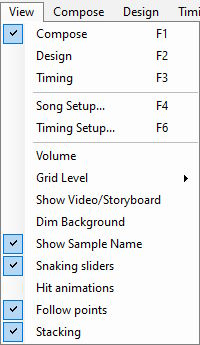
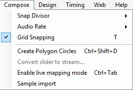
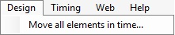
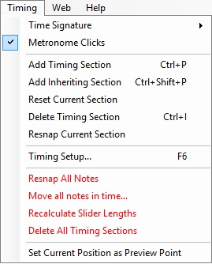
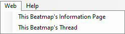
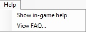

# Beatmap editor menu

## File

### File commands

| Name | Description |
| :-- | :-- |
| Clear All Notes (`Ctrl` + `N`) | Remove all hit objects of the difficulty. |
| Open Difficulty... | **For Editing:** Quickly switch between difficulties. **For Reference:** ([osu!mania](/wiki/Game_mode/osu!mania) only) Overlay the selected difficulty over the currently opened one. |
| Save (`Ctrl` + `S`) | Save current changes (both [`.osu`](/wiki/Client/File_formats/osu_(file_format)) and [`.osb`](/wiki/Client/File_formats/osb_(file_format)) |
| Create a new Difficulty... | Save the current changes as a new difficulty. The old difficulty is preserved to its last saved state when reloaded. |

### Revert commands

| Name | Description |
| :-- | :-- |
| Revert to Saved (`Ctrl` + `L`) | Return to the last saved state of the beatmap. |
| Revert to Saved (Full) (`Ctrl` + `Shift` + `L`) | Return to the last saved state of the beatmap and reload all files (sprites, sound samples). |

### Troubleshoot commands

| Name | Description |
| :-- | :-- |
| Test Beatmap (`F5``) | [Test](/wiki/Client/Beatmap_editor/Test_mode) the beatmap, offering to save changes beforehand. |
| Open AiMod (`Ctrl` + `Shift` + `A`) | Open [AiMod](/wiki/Client/Beatmap_editor/AiMod). |

### Beatmap packaging commands

| Name | Description |
| :-- | :-- |
| Upload Beatmap... (`Ctrl` + `Shift` + `U`) | [Upload](/wiki/Beatmapping/Beatmap_submission) the beatmap to the [Works In Progress](https://osu.ppy.sh/community/forums/10) forum. |
| Export Package... | Export the beatmap as an [`.osz`](/wiki/Client/File_formats/osz_(file_format)) archive for self-distribution, and open the `Exports` folder that contains it. |
| Extract Map Package | Extract an `osz2`<!-- TODO(TicClick: add a link when the article is up)--> beatmap into a temporary folder to override its files during modding. This option is disabled for regular `osz` beatmaps. |
| Import from... | **bms/bme:** Open a `.bms`/`.bme` file to be imported as osu!mania difficulty. |

### Programmer's commands

| Name | Description |
| :-- | :-- |
| Open Song Folder | Open the beatmap's folder, which contains relevant files. |
| Open `.osu` in Notepad | Open the beatmap's difficulty file in MS Notepad. |
| Open `.osb` in Notepad | Open the beatmap's [storyboard](/wiki/Storyboard) file in MS Notepad. |

### Emergency exit command

| Name | Description |
| :-- | :-- |
| Exit... (`Esc`) | Exit the beatmap editor, suggesting to save recent changes beforehand. This option sometimes *ignores* the `Design` tab changes. |

## Edit

### Redo/undo commands

| Name | Description |
| :-- | :-- |
| Undo (`Ctrl` + `Z`) | Undo the last edit. |
| Redo (`Ctrl` + `Y`) | Repeat the last edit. |

### Edit commands

| Name | Description |
| :-- | :-- |
| Cut (`Ctrl` + `X`) | Cut selected objects. |
| Copy (`Ctrl` + `C`) | Copy selected objects. |
| Paste (`Ctrl` + `V`) | Paste selected objects. |
| Delete (`Delete`) | Delete selected objects. |

### Special commands

| Name | Description |
| :-- | :-- |
| Select All (`Ctrl` + `A`) | Select all hit objects. |
| Clone (`Ctrl` + `D`) | Copy selected objects and paste them one [beat](/wiki/Music_theory/Beat) after the selection. |

### Rotation commands

| Name | Description |
| :-- | :-- |
| Reverse Selection (`Ctrl` + `G`) | **Slider:** change the direction to the opposite. **Arbitrary selection:** reorder hit objects in time, making the last one the first, and so on. |
| Flip Horizontally (`Ctrl` + `H`) | Mirror the selection across the Y axis of the playfield (from left to right, or vice versa). |
| Flip Vertically (`Ctrl` + `J`) | Mirror the selection across the X axis of the playfield (from up to down, or vice versa). |
| Rotate 90° Clockwise (`Ctrl` + `>`) | Rotate the selection 90° right around the playfield centre. |
| Rotate 90° Anticlockwise (`Ctrl` + `<`) | Rotate the selection 90° left around the playfield centre. |
| Rotate by... (`Ctrl` + `Shift` + `R`) | Rotate the selection by a custom angle around the playfield or the selection centre. |
| Scale by... (`Ctrl` + `Shift` + `S`) | Scale the selection by moving its objects further from the playfield or the selection centre, across one or more axis. |

### Reset buttons

| Name | Description |
| :-- | :-- |
| Reset selected objects' samples | Remove [hitsound additions](/wiki/Beatmapping/Hitsound) from the selection. |
| Reset all samples | Remove hitsound additions from all hit objects of the difficulty. |
| Reset combo colours | Remove all [combo colour overrides](/wiki/Beatmapping/Colourhaxing) from all hit objects of the difficulty. |
| Reset breaks | Reset custom start/end times of all [breaks](/wiki/Beatmap/Break), placing them next to surrounding hit objects. |

### Nudge commands

| Name | Description |
| :-- | :-- |
| Nudge Backward (`J`) | Move the selection one tick backward, based on the active [beat snap divisor](/wiki/Client/Beatmap_editor/Beat_snap_divisor). |
| Nudge Forward (`K`) | Move the selection one tick forward, based on the active beat snap divisor. |

## View

### Tabbing commands

| Name | Description |
| :-- | :-- |
| Compose (`F1`) | Change active tab to [`Compose`](/wiki/Client/Beatmap_editor/Compose). |
| Design (`F2`) | Change active tab to [`Design`](/wiki/Client/Beatmap_editor/Design). |
| Timing (`F3`) | Change active tab to [`Timing`](/wiki/Client/Beatmap_editor/Timing). |

### Setup commands

| Name | Description |
| :-- | :-- |
| Song Setup... (`F4`) | Open the [`Song Setup`](/wiki/Client/Beatmap_editor/Song_setup) window. |
| Timing Setup... (`F6`) | Open the [`Timing and Control Points`](/wiki/Client/Beatmap_editor/Timing) window. |

### Special commands

| Name | Description |
| :-- | :-- |
| Volume | Adjust the volume level of music or hitsounds. |
| Grid Level (`G`) | Adjust the coarseness of the playfield [grid](/wiki/Beatmapping/Grid_snapping) used for object [snapping](/wiki/Beatmapping/Snapping). |
| Show Video/Storyboard | Toggle visibility of the background video or the storyboard. |
| Dim Background | Dim the background in [test mode](/wiki/Client/Beatmap_editor/Test_mode), making hit objects more visible. |
| Show Sample Name | For osu!mania difficulties, show [keysound samples' names](/wiki/Beatmapping/Hitsound#keysound) attached to the notes. |
| Snaking sliders | Sliders gradually snake out from their starting point, as if during gameplay. |
| Hit animations | Animate hit objects as if being clicked during gameplay. |
| Follow points | Display and animate follow points as if during gameplay. |
| Stacking | Stack overlaid hit circles as if during gameplay. The stacking behaviour is controlled by the [stack leniency](/wiki/Beatmap/Stack_leniency) setting of the difficulty. |

## Compose

*Main page: [Compose](/wiki/Client/Beatmap_editor/Compose)*

### Rulers commands

| Name | Description |
| :-- | :-- |
| Snap Divisor | Change the granularity of the [beat snap divisor](/wiki/Client/Beatmap_editor/Beat_snap_divisor), displaying more or fewer ticks on the [timeline](/wiki/Client/Beatmap_editor/Timelines). |
| Audio Rate | Change the playback rate of the audio. |
| Grid Snapping (T) | Toggle [snapping](/wiki/Beatmapping/Grid_snapping) of the hit objects to the playfield grid. |

### Special commands

| Name | Description |
| :-- | :-- |
| Create Polygon Circles... (`Ctrl` + `Shift` + `D`) | Create a regular polygon consisting of several hit circles, using active beat snap divisor for circle placement. |
| Convert slider to stream... | Replace the [body](/wiki/Gameplay/Hit_object/Slider/Sliderbody) of a selected slider with a [stream](/wiki/Beatmap/Pattern/osu!/Stream) of hit circles. **By object count:** use the exact amount of hit circles. **By distance snap:** use the exact [distance snap](/wiki/Client/Beatmap_editor/Distance_snap) between hit circles. |
| Enable live mapping mode (`Ctrl` + `Tab`) | osu!/osu!catch/osu!taiko maps: use osu!taiko keys to place hit circles or fruits while playing the song in editor. The circles are placed under the cursor, and different hitsounds are applied based on the key pressed. osu!mania maps: use osu!mania keys to place notes while playing song in editor. Notes are placed in the column corresponding to the key pressed. Does not work for sliders/holds. |
| Sample import | Open the [Sample Import](/wiki/Client/Beatmap_editor/Compose#sample-import) window for osu!mania difficulties. |

## Design

*Main page: [Design](/wiki/Client/Beatmap_editor/Design)*

| Name | Description |
| :-- | :-- |
| Move all elements in time... | Move *all* storyboard [commands](/wiki/Storyboard/Scripting/Commands) by a given amount of milliseconds. |

## Timing

*Main page: [Timing](/wiki/Client/Beatmap_editor/Timing)*

### Metronome commands

| Name | Description |
| :-- | :-- |
| Time Signature | Choose the [signature](/wiki/Music_theory/Time_signature) of the current timing point. For exotic timing, use the [`Timing Setup`](/wiki/Client/Beatmap_editor/Timing) window. |
| Metronome Clicks | Toggle ticking sounds of the [metronome](/wiki/Client/Beatmap_editor/Timing#metronome) on the `Timing` tab. |

### Markers commands

| Name | Description |
| :-- | :-- |
| Add Timing Section (`Ctrl` + `P`) | Add a new [uninherited (red) timing section](/wiki/Client/Beatmap_editor/Timing#uninherited-timing-point). |
| Add Inheriting Section (`Ctrl` + `Shift` + `P`) | Add a new [inherited (green) timing section](/wiki/Client/Beatmap_editor/Timing#inherited-timing-point). |
| Reset Current Section | Reset [BPM](/wiki/Music_theory/Tempo) and [offset](/wiki/Offset) of the current uninherited timing section, allowing to [re-time](/wiki/Beatmapping/Timing) it. Saving the beatmap will delete the sections without timing settings. |
| Delete Timing Section (`Ctrl` + `I`) | Delete the current timing section (both inherited and uninherited). |
| Resnap Current Section | [Resnap](/wiki/Beatmapping/Snapping) all hit objects in the current section according to the active beat snap divisor. |

### Timing Setup

| Name | Description |
| :-- | :-- |
| Timing Setup... (`F6`) | Open the [`Timing and Control Points`](/wiki/Client/Beatmap_editor/Timing) window. |

### Special commands

| Name | Description |
| :-- | :-- |
| Resnap All Notes | Resnap all hit objects of the difficulty according to the active beat snap divisor. |
| Move all notes in time.. | Move all hit objects by a given amount of milliseconds. |
| Recalculate Slider Lengths | Resnap the [ends](/wiki/Gameplay/Hit_object/Slider/Slidertail) of all sliders to the nearest timeline tick, **potentially shortening them** (requires manual rechecking). Useful if the BPM or [slider velocity](/wiki/Gameplay/Hit_object/Slider/Slider_velocity) have been changed. |
| Delete All Timing Sections | Remove all uninherited and inherited timing sections of the difficulty. |

### Preview command

| Name | Description |
| :-- | :-- |
| Set Current Position as Preview Point | Use the current timestamp as the preview point for the [song select](/wiki/Client/Interface#song-select) screen. |

## Web

| Name | Description |
| :-- | :-- |
| This Beatmap's Information Page | Open the beatmap info page<!-- TODO(TicClick): link after https://github.com/ppy/osu-wiki/issues/3122 is completed --> on the osu! website (`https://osu.ppy.sh/beatmaps/<BeatmapID>`)|
| This Beatmap's Thread | Open the beatmap's forum thread. |

## Help

| Name | Description |
| :-- | :-- |
| Show in-game help | Show the help overlay with key bindings and short explanations. Note: doesn't work anymore. |
| View FAQ... | Open the [Beatmapping](/wiki/Beatmapping) wiki article. |
