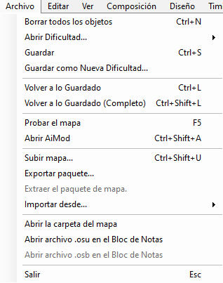
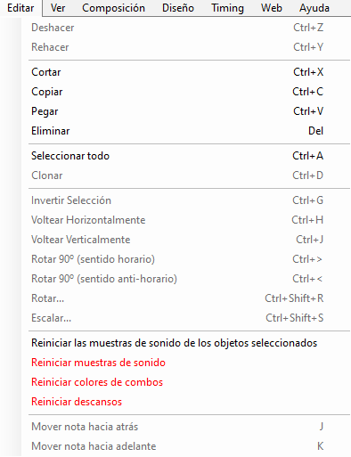
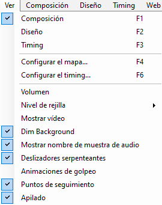
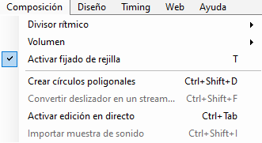
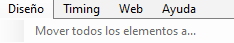
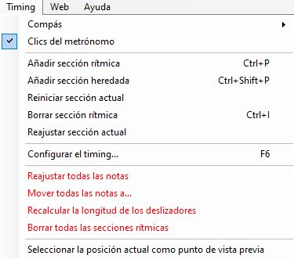
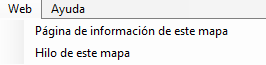

# Menú del editor de beatmaps

## Archivo

| Nombre | Descripción |
| :-- | :-- |
| Borrar todos los objetos (`Ctrl` + `N`) | Elimina todos los objetos de la dificultad. |
| Abrir dificultad... | **En la edición:** Cambia rápidamente de dificultad. **Para referencia:** (solo en [osu!mania](/wiki/Game_mode/osu!mania)) Superpone la dificultad seleccionada sobre la abierta actualmente. |
| Guardar (`Ctrl` + `S`) | Guarda los cambios actuales (tanto en un archivo [`.osu`](/wiki/Client/File_formats/osu_(file_format)) como [`.osb`](/wiki/Client/File_formats/osb_(file_format))) |
| Guardar como nueva dificultad... | Guarda los cambios actuales como una nueva dificultad. La dificultad original se mantiene en su último estado guardado cuando se vuelva a cargar. |
| Volver a lo guardado (`Ctrl` + `L`) | Regresa al último estado guardado de la dificultad y el storyboard. |
| Volver a lo guardado (completo) (`Ctrl` + `Mayús` + `L`) | Vuelve al último estado guardado de la dificultad y el storyboard, y vuelve a cargar todos los archivos (sprites, muestras de sonido, etc.). |
| Probar el mapa (`F5`) | [Prueba](/wiki/Client/Beatmap_editor/Test_mode) la dificultad, ofreciendo guardar los cambios de antemano. |
| Abrir AiMod (`Ctrl` + `Mayús` + `A`) | Abre [AiMod](/wiki/Client/Beatmap_editor/AiMod). |
| Subir mapa... (`Ctrl` + `Mayús` + `U`) | [Sube](/wiki/Beatmapping/Beatmap_submission) el beatmap al foro [Works In Progress](https://osu.ppy.sh/community/forums/10). |
| Exportar paquete... | Exporta el beatmap como un archivo [`.osz`](/wiki/Client/File_formats/osz_(file_format)) para su libre distribución, y abre la carpeta `Exports` que lo contiene. |
| Extraer el paquete de mapa | Extrae un beatmap `.osz2` a una carpeta temporal para sobrescribir sus archivos durante el modding.[^osz2-note] |
| Importar desde... | **bms/bme:** Abre un archivo `.bms`/`.bme` para importarlo como una dificultad de osu!mania. |
| Abrir la carpeta del mapa | Abre la carpeta del beatmap, que contiene archivos relevantes del juego. |
| Abrir archivo `.osu` en el Bloc de notas | Abre el archivo de la dificultad seleccionada en el Bloc de notas. |
| Abrir archivo `.osb` en el Bloc de notas | Abre el [storyboard](/wiki/Storyboard) del beatmap en el Bloc de notas. |
| Salir (`Esc`) | Sale del editor de beatmaps, sugiriendo guardar antes los cambios recientes.[^exit-note] |

## Editar

| Nombre | Descripción |
| :-- | :-- |
| Deshacer (`Ctrl` + `Z`) | Deshace la última edición. |
| Rehacer (`Ctrl` + `Y`) | Rehace la última edición. |
| Cortar (`Ctrl` + `X`) | Corta los objetos seleccionados. |
| Copiar (`Ctrl` + `C`) | Copia los objetos seleccionados. |
| Pegar (`Ctrl` + `V`) | Pega los objetos seleccionados. |
| Eliminar (`Suprimir`) | Elimina los objetos seleccionados. |
| Seleccionar todo (`Ctrl` + `A`) | Selecciona todos los objetos. |
| Clonar (`Ctrl` + `D`) | Copia los objetos seleccionados y los pega un [pulso](/wiki/Music_theory/Beat) después de la selección. |
| Invertir selección (`Ctrl` + `G`) | Invierte la dirección de los sliders y reordena los objetos en la línea de tiempo, haciendo que el último sea el primero y así sucesivamente. |
| Voltear horizontalmente (`Ctrl` + `H`) | Crea un espejo de la selección en el eje Y del campo de juego (izquierda y derecha). |
| Voltear verticalmente (`Ctrl` + `J`) | Crea un espejo de la selección en el eje X del campo de juego (arriba y abajo). |
| Rotar 90° (sentido horario) (`Ctrl` + `>`) | Rota la selección 90° a la derecha alrededor del centro del campo de juego. |
| Rotar 90° (antihorario) (`Ctrl` + `<`) | Rota la selección 90° hacia la izquierda alrededor del centro del campo de juego. |
| Rotar... (`Ctrl` + `Mayús` + `R`) | Rota la selección en un ángulo personalizado alrededor del campo de juego o del centro de la selección. |
| Escalar... (`Ctrl` + `Mayús` + `S`) | Escala la selección moviendo los objetos más lejos del campo de juego o del centro de la selección, a través de uno o más ejes. |
| Reiniciar las muestras de sonido de los objetos seleccionados | Elimina las [adiciones de hitsounds](/wiki/Beatmapping/Hitsound) de la selección. |
| Reiniciar muestras de sonido | Elimina las adiciones de hitsounds en todos los objetos de la dificultad. |
| Reiniciar colores de combo | Elimina todas las [variaciones de color del combo](/wiki/Beatmapping/Colourhaxing) de todos los objetos en la dificultad actual. |
| Reiniciar descansos | Reinicia los tiempos de inicio/finalización personalizados de todos los [descansos](/wiki/Beatmap/Break), colocándolos junto a los objetos cercanos. |
| Mover nota hacia atrás (`J`) | Mueve la selección una marca hacia atrás, según el [divisor de ritmo](/wiki/Client/Beatmap_editor/Beat_snap_divisor) activo. |
| Mover nota hacia adelante (`K`) | Mueve la selección una marca hacia adelante, según el divisor de ritmo activo. |

## Ver

| Nombre | Descripción |
| :-- | :-- |
| Composición (`F1`) | Cambia la pestaña activa a [`Compose`](/wiki/Client/Beatmap_editor/Compose). |
| Diseño (`F2`) | Cambia la pestaña activa a [`Design`](/wiki/Client/Beatmap_editor/Design). |
| Timing (`F3`) | Cambia la pestaña activa a [`Timing`](/wiki/Client/Beatmap_editor/Timing). |
| Configurar el mapa... (`F4`) | Abre la ventana [`Song Setup`](/wiki/Client/Beatmap_editor/Song_setup). |
| Configurar el timing... (`F6`) | Abre la ventana [`Timing and Control Points`](/wiki/Client/Beatmap_editor/Timing). |
| Volumen | Ajusta el nivel de volumen de la música o los hitsounds. |
| Nivel de rejilla (`G`) | Ajusta el grosor de la [rejilla](/wiki/Beatmapping/Grid_snapping) del campo de juego usada para el [ajuste](/wiki/Beatmapping/Beat_snapping) de los objetos. |
| Mostar vídeo | Activa la visibilidad del vídeo de fondo y del storyboard. |
| Dim Background | Oscurece el fondo en el [modo de prueba](/wiki/Client/Beatmap_editor/Test_mode), haciendo más visibles los objetos. |
| Mostrar nombre de muestra de audio | Para las dificultades de osu!mania, se muestran los nombres de los [keysounds](/wiki/Beatmapping/Hitsound#keysound). |
| Deslizadores serpenteantes | Los sliders serpentean gradualmente desde su punto de inicio. |
| Animaciones de golpeo | Anima los objetos como si fueran presionados mientras se juega. |
| Puntos de seguimiento | Muestra y anima los puntos de seguimiento como si estuvieras jugando. |
| Apilado | Apila los círculos superpuestos como si estuvieras jugando.[^stacking-note] |

## Composición

*Página principal: [Pestaña compose](/wiki/Client/Beatmap_editor/Compose)*

| Nombre | Descripción |
| :-- | :-- |
| Divisor rítmico | Cambia la granularidad del [divisor de ritmo](/wiki/Client/Beatmap_editor/Beat_snap_divisor), mostrando más o menos marcas en la [línea de tiempo](/wiki/Client/Beatmap_editor/Timelines). |
| Volumen | Cambia la velocidad de reproducción del audio. |
| Activar fijado de rejilla (T) | Activa el [anclaje](/wiki/Beatmapping/Grid_snapping) de los objetos a la rejilla del campo de juego. |
| Crear círculo poligonales (`Ctrl` + `Mayús` + `D`) | Crea un polígono regular formado por varios círculos, usando el divisor de ritmo activo para la colocación de los círculos. |
| Convertir deslizador en un stream... | Reemplaza el [cuerpo](/wiki/Gameplay/Hit_object/Slider/Sliderbody) de un slider seleccionado con un [stream](/wiki/Beatmap/Pattern/osu!/Stream) de círculos. **Por número de objetos:** usa una cantidad especificada de círculos. **Por ajuste de distancia:** usa el [ajuste de distancia](/wiki/Client/Beatmap_editor/Distance_snap) exacto entre los círculos. |
| Activar edición en directo (`Ctrl` + `Tabulador`) | Coloca [círculos](/wiki/Gameplay/Hit_object/Hit_circle) de osu!/osu!taiko, [frutas](/wiki/Gameplay/Hit_object/Fruit) de osu!catch, o notas de osu!mania con las teclas de juego mientras suena la canción.[^live-mapping-note] |
| Importar muestra de sonido | Abre la ventana [`Sample import`](/wiki/Client/Beatmap_editor/Compose#importación-de-muestras) para las dificultades de osu!mania. |

## Diseño

*Página principal: [Pestaña de diseño](/wiki/Client/Beatmap_editor/Design)*

| Nombre | Descripción |
| :-- | :-- |
| Mover todos los elementos a... | Mueve *todos* los [comandos](/wiki/Storyboard/Scripting/Commands) del storyboard en una cantidad determinada de milisegundos. |

## Timing

*Página principal: [Pestaña timing](/wiki/Client/Beatmap_editor/Timing)*

| Nombre | Descripción |
| :-- | :-- |
| Compás | Selecciona el [tipo de compás](/wiki/Music_theory/Time_signature) para el punto de tiempo actual, entre 4/4 (común) o 3/4 (vals). Para otros tipos de compás, usa la ventana [`Timing Setup`](/wiki/Client/Beatmap_editor/Timing). |
| Clics del metrónomo | Activa los sonidos del [metrónomo](/wiki/Client/Beatmap_editor/Timing#metrónomo) en la pestaña `Timing`. |
| Añadir sección rítmica (`Ctrl` + `P`) | Añade una nueva [sección de tiempo no heredada (roja)](/wiki/Client/Beatmap_editor/Timing#puntos-de-tiempo-no-heredados). |
| Añadir sección heredada (`Ctrl` + `Mayús` + `P`) | Añade una nueva [sección de tiempo heredada (verde)](/wiki/Client/Beatmap_editor/Timing#puntos-de-tiempo-heredados). |
| Reiniciar sección actual | Reinicia el [BPM](/wiki/Music_theory/Tempo) y la [compensación](/wiki/Offset) de la sección de tiempo actual no heredada para volver a [temporizarla](/wiki/Beatmapping/Timing). Guardar la dificultad eliminará estas secciones si no se modifican. |
| Borrar sección rítmica (`Ctrl` + `I`) | Elimina la sección de tiempo actual (tanto heredada como no heredada). |
| Reajustar sección actual | [Reajusta](/wiki/Beatmapping/Beat_snapping) todos los objetos en la sección actual según el divisor de ritmo activo. |
| Configurar el timing... (`F6`) | Abre la ventana [`Timing and Control Points`](/wiki/Client/Beatmap_editor/Timing). |
| Reajustar todas las notas | Reajusta todos los objetos de la dificultad según el divisor de ritmo activo. |
| Mover todas las notas a... | Mueve todos los objetos en una cantidad determinada de milisegundos. |
| Recalcular la longitud de los deslizadores | Vuelve a ajustar automáticamente[^recalculate-lengths-note] todos los [slider ends](/wiki/Gameplay/Hit_object/Slider/Slidertail) a la marca más cercana de la línea de tiempo, **acortándolos potencialmente** y requiriendo una nueva revisión manual. |
| Borrar todas las secciones rítmicas | Elimina todas las secciones de tiempo heredadas y no heredadas de la dificultad actual. |
| Seleccionar la posición actual como punto de vista previa | Usa la marca de tiempo actual como punto de vista previa para la página web y el [selector de canciones](/wiki/Client/Interface#selector-de-canciones). |

## Web

| Nombre | Descripción |
| :-- | :-- |
| Página de información de este mapa | Abre la página de información del beatmap en el sitio web de osu!. |
| Hilo de este mapa | Abre el hilo del foro del beatmap. |

## Ayuda

| Nombre | Descripción |
| :-- | :-- |
| Mostrar ayuda en pantalla | Muestra la ventana de ayuda con los atajos de teclado y explicaciones breves.[^help-note] |
| Leer las preguntas frecuentes... | Abre el artículo [Beatmapping](/wiki/Beatmapping) de la wiki. |

## Notas

[^osz2-note]: Esta acción está desactivada para los beatmaps `osz` normales.
[^exit-note]: Esta acción a veces *ignora* los cambios realizados en la pestaña `Design`.
[^stacking-note]: El comportamiento del apilamiento está controlado por la configuración de la [tolerancia de apilamiento](/wiki/Beatmap/Stack_leniency) de la dificultad.
[^live-mapping-note]: osu!, osu!taiko y osu!catch usan las teclas de osu!taiko.
[^recalculate-lengths-note]: Útil si se ha cambiado el BPM o la [velocidad del slider](/wiki/Gameplay/Hit_object/Slider/Slider_velocity).
[^help-note]: Esta acción ya no funciona.
