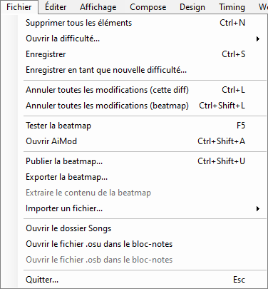
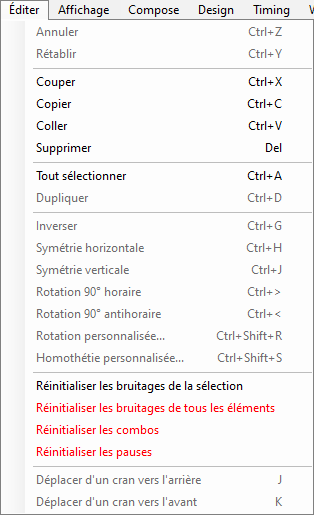
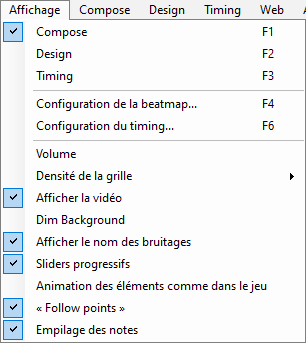
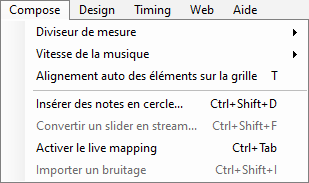
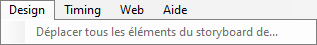
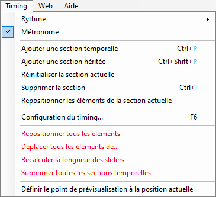
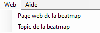
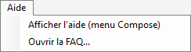

# Menu de l'éditeur de beatmap

## Fichier

| Nom | Description |
| :-- | :-- |
| Supprimer tous les éléments (`Ctrl` + `N`) | Retire tous les objets de la difficulté. |
| Ouvrir la difficulté... | **Pour l'édition :** Passe rapidement d'une difficulté à l'autre. **Pour référence :** ([osu!mania](/wiki/Game_mode/osu!mania) uniquement) Superpose les difficultés sélectionnées à la difficulté actuellement ouverte. |
| Enregistrer (`Ctrl` + `S`) | Sauvegarde les modifications en cours (à la fois [`.osu`](/wiki/Client/File_formats/osu_(file_format)) et [`.osb`](/wiki/Client/File_formats/osb_(file_format))) |
| Enregistrer en tant que nouvelle difficulté... | Sauvegarde les modifications actuelles en tant que nouvelle difficulté. L'ancienne difficulté est conservée dans son dernier état sauvegardé lorsqu'elle est de nouveau ouverte. |
| Annuler toutes les modifications (cette diff) (`Ctrl` + `L`) | Retour au dernier état sauvegardé de la difficulté et du storyboard. |
| Annuler toutes les modifications (beatmap) (`Ctrl` + `Shift` + `L`) | Retour au dernier état sauvegardé des difficultés et du storyboard, et recharge tous les fichiers (sprites, échantillons sonores, etc.). |
| Tester la beatmap (`F5`) | [Teste](/wiki/Client/Beatmap_editor/Test_mode) la difficulté, en proposant de sauvegarder les modifications au préalable. |
| Ouvrir AiMod (`Ctrl` + `Shift` + `A`) | Ouvre [AiMod](/wiki/Client/Beatmap_editor/AiMod). |
| Publier la beatmap... (`Ctrl` + `Shift` + `U`) | [Télécharge](/wiki/Beatmapping/Beatmap_submission) la beatmap sur le forum [Works In Progress](https://osu.ppy.sh/community/forums/10). |
| Exporter la beatmap... | Exporte la beatmap en tant qu'archive [`.osz`](/wiki/Client/File_formats/osz_(file_format)) pour l'auto-distribution, et ouvre le dossier `Exports`. |
| Extraire le contenu de la beatmap | Extrait une beatmap `.osz2` dans un dossier temporaire pour remplacer ses fichiers lors du modding.[^osz2-note] |
| Importer un fichier | **bms/bme :** Ouvre un fichier `.bms`/`.bme` à importer en tant que difficulté osu!mania. |
| Ouvrir le dossier Songs | Ouvre le dossier de la beatmap, qui contient les fichiers correspondants. |
| Ouvrir le fichier .osu dans le bloc-notes | Ouvre le fichier de la difficulté sélectionnée dans le bloc-notes. |
| Ouvrir le fichier .osb dans le bloc notes | Ouvre le fichier [storyboard](/wiki/Storyboard) de la beatmap dans le bloc-notes. |
| Quitter... (`Esc`) | Quitte l'éditeur de beatmap, en suggérant d'enregistrer au préalable les modifications récentes.[^quitter-note] |

## Éditer

| Nom | Description |
| :-- | :-- |
| Annuler (`Ctrl` + `Z`) | Annule la dernière modification. |
| Rétablir (`Ctrl` + `Y`) | Répète la dernière modification. |
| Couper (`Ctrl` + `X`) | Coupe les objets sélectionnés. |
| Copier (`Ctrl` + `C`) | Copie les objets sélectionnés. |
| Coller (`Ctrl` + `V`) | Colle les objets sélectionnés. |
| Supprimer (`Del`) | Supprime les objets sélectionnés. |
| Tout sélectionner (`Ctrl` + `A`) | Sélectionne tous les objets. |
| Dupliquer (`Ctrl` + `D`) | Copie les objets sélectionnés et colle un [beat](/wiki/Music_theory/Beat) après la sélection. |
| Inverser (`Ctrl` + `G`) | Inverse la direction des sliders et réorganise les objets dans le temps, en faisant du dernier le premier et ainsi de suite. |
| Symétrie horizontale (`Ctrl` + `H`) | Inverse la sélection sur l'axe Y du terrain de jeu (de gauche à droite). |
| Symétrie verticale (`Ctrl` + `J`) | Inverse la sélection sur l'axe X du terrain de jeu (de bas en haut). |
| Rotation 90° horaire (`Ctrl` + `>`) | Pivote la sélection de 90° vers la droite autour du centre du terrain de jeu. |
| Rotation 90° antihoraire (`Ctrl` + `<`) | Pivote la sélection de 90° vers la gauche autour du centre du terrain de jeu. |
| Rotation personnalisée... (`Ctrl` + `Shift` + `R`) | Pivote la sélection d'un angle personnalisé autour du terrain de jeu ou du centre de la sélection. |
| Homothétie personnalisée... (`Ctrl` + `Shift` + `S`) | Réduit la sélection en éloignant ses objets du terrain de jeu ou du centre de la sélection, sur un ou plusieurs axes. |
| Réinitialiser les bruitages de la sélection | Supprime les [hitsound additions](/wiki/Beatmapping/Hitsound) de la sélection. |
| Réinitialiser les bruitages de tous les éléments | Supprime les hitsound additions de tous les objets de la difficulté actuelle. |
| Réinitialiser les combos | Supprime toutes les [mise en couleur](/wiki/Beatmapping/Colourhaxing) de tous les objets de la difficulté actuelle. |
| Réinitialiser les pauses | Réinitialise les timing de début et de fin de toutes les [pauses] (/wiki/Beatmap/Break), en les plaçant à côté des objets environnants. |
| Déplacer d'un cran vers l'arrière (`J`) | Déplace la sélection d'un tick vers l'arrière, en fonction du [beat snap divisor](/wiki/Client/Beatmap_editor/Beat_snap_divisor) actif. |
| Déplacer d'un cran vers l'avant (`K`) | Déplace la sélection d'un tick vers l'avant, en fonction du beat snap divisor actif. |

## Affichage

| Nom | Description |
| :-- | :-- |
| Compose (`F1`) | Change l'onglet actif par l'onglet [`Compose`](/wiki/Client/Beatmap_editor/Compose). |
| Design (`F2`) | Change l'onglet actif par l'onglet [`Design`](/wiki/Client/Beatmap_editor/Design). |
| Timing (`F3`) | Change l'onglet actif par l'onglet [`Timing`](/wiki/Client/Beatmap_editor/Timing). |
| Configuration de la beatmap... (`F4`) | Ouvre la fenêtre [`Song Setup`](/wiki/Client/Beatmap_editor/Song_setup). |
| Configuration du timing... (`F6`) | Ouvre la fenêtre [`Timing and Control Points`](/wiki/Client/Beatmap_editor/Timing). |
| Volume | Règle le niveau de volume de la musique ou des hitsounds. |
| Densité de la grille (`G`) | Ajuste la taille de la [grille](/wiki/Beatmapping/Grid_snapping) du terrain de jeu utilisée pour le [snapping](/wiki/Beatmapping/Snapping) de l'objet. |
| Afficher la vidéo | Active/Désactive la vidéo d'arrière-plan et le storyboard. |
| Dim Background | Diminue l'arrière-plan en [mode test](/wiki/Client/Beatmap_editor/Test_mode), ce qui rend les objets plus visibles. |
| Afficher le nom des bruitages | Pour les difficultés osu!mania, montre les [noms des échantillons des keysounds](/wiki/Beatmapping/Hitsound#keysound) attachés aux notes. |
| Sliders progressifs | Les sliders s'éloignent progressivement de leur point de départ. |
| Animation des éléments comme dans le jeu | Anime les objets comme si vous étiez en train de jouer. |
| "Follow points" | Affiche et anime les points de suivi comme si vous étiez en train de jouer. |
| Empilage des notes | Empile les cercles superposés comme si vous étiez en train de jouer.[^empilement-note] |

## Compose

*Main page: [Compose](/wiki/Client/Beatmap_editor/Compose)*

| Nom | Description |
| :-- | :-- |
| Diviseur de mesure | Modifie la valeur du [beat snap divisor](/wiki/Client/Beatmap_editor/Beat_snap_divisor), en affichant plus ou moins de ticks sur la [ligne de temps](/wiki/Client/Beatmap_editor/Timelines). |
| Vitesse de la musique | Modifie la vitesse de lecture de l'audio. |
| Alignement auto des éléments sur la grille (`T`) | Active/Désactive le [snapping](/wiki/Beatmapping/Grid_snapping) des objets sur la grille du terrain de jeu. |
| Insérer des notes en cercle... (`Ctrl` + `Shift` + `D`) | Crée un polygone régulier composé de plusieurs cercles, en utilisant le beat snap divisor actif pour le placement des cercles. |
| Convertir un slider en stream (`Ctrl` + `Shift` + `F`) | Remplace le [body](/wiki/Gameplay/Hit_object/Slider/Sliderbody) d'un slider sélectionné par un [stream](/wiki/Beatmap/Pattern/osu!/Stream) de cercles. **Par nombre d'objets :** utilise une quantité spécifiée de cercles. **Par distance snap :** utilise la [distance snap](/wiki/Client/Beatmap_editor/Distance_snap) exacte entre les cercles. |
| Activer le live mapping (`Ctrl` + `Tab`) | Place des [cercles](/wiki/Gameplay/Hit_object/Hit_circle) osu!/osu!taiko, des [fruits](/wiki/Gameplay/Hit_object/Fruit) osu!catch, ou des notes osu!mania avec des raccourcis clavier de gameplay pendant que la musique est jouée.[^live-mapping-note] |
| Importer un bruitage | Ouvre la fenêtre [`Sample import`](/wiki/Client/Beatmap_editor/Compose#sample-import) pour les difficultés osu!mania. |

## Design

*Page principale : [Design](/wiki/Client/Beatmap_editor/Design)*

| Nom | Description |
| :-- | :-- |
| Déplacer tous les éléments du storyboard de... | Déplace *toutes* les [commandes](/wiki/Storyboard/Scripting/Commands) du storyboard d'un nombre donné de millisecondes. |

## Timing

*Page principale : [Timing](/wiki/Client/Beatmap_editor/Timing)*

| Nom | Description |
| :-- | :-- |
| Rythme | Sélectionne la [signature temporelle](/wiki/Music_theory/Time_signature) pour le point de timing actuel, entre 4/4 (commun) ou 3/4 (valse). Pour d'autres signatures temporelles, utilisez l'onglet [`Timing Setup`](/wiki/Client/Beatmap_editor/Timing). |
| Métronome | Active/Désactive le [métronome] (/wiki/Client/Beatmap_editor/Timing#métronome) dans l'onglet `Timing`. |
| Ajouter une section temporelle (`Ctrl` + `P`) | Ajoute une nouvelle section de [timing non héritée (rouge)](/wiki/Client/Beatmap_editor/Timing#point-de-timing-non-hérité). |
| Ajouter une section héritée (`Ctrl` + `Shift` + `P`) | Ajoute une nouvelle section de [timing timing hérité (vert)](/wiki/Client/Beatmap_editor/Timing#point-de-timing-hérité). |
| Réinitialiser la section actuelle | Réinitialise le [BPM](/wiki/Music_theory/Tempo) et [l'offset](/wiki/Offset) de la section de timing non héritée actuelle pour le [retiming](/wiki/Beatmapping/Timing). La sauvegarde des difficultés supprimera ces sections si elles ne sont pas modifiées. |
| Supprimer la section (`Ctrl` + `I`) | Supprime la section de timing actuelle (héritée et non héritée). |
| Repositionner les éléments de la section actuelle | [Resnap](/wiki/Beatmapping/Snapping) tous les objets dans la section courante en fonction du beat snap divisor actif. |
| Configuration du timing (`F6`) | Ouvre la fenêtre [`Timing and Control Points`](/wiki/Client/Beatmap_editor/Timing). |
| Repositionner tous les éléments | Réinitialise tous les objets de la difficulté en beat snap divisor actif. |
| Déplacer tous les éléments de... | Déplace tous les objets d'un nombre donné de millisecondes. |
| Recalculer la longueur des sliders | Recalcule automatiquement[^recalculer-les-longueurs-note] tous les [slider ends](/wiki/Gameplay/Hit_object/Slider/Slidertail) sur le tick de la ligne de temps le plus proche, **les raccourcir éventuellement** et nécessitant un nouveau contrôle manuel. |
| Supprimer toutes les sections temporelles | Supprime toutes les sections de timing non héritées et héritées des difficultés actuelles. |
| Définir le point de prévisualisation à la position actuelle | Utilise l'horodatage actuel comme point de prévisualisation pour le site Web et l'écran [sélection de musique](/wiki/Client/Interface#sélection-de-la-musique). |

## Web

| Nom | Description |
| :-- | :-- |
| Page web de la beatmap | Ouvre la page d'information sur la beatmap sur le site web d'osu!. |
| Topic de la beatmap | Ouvre le fil du forum de la beatmap. |

## Help

| Nom | Description |
| :-- | :-- |
| Afficher l'aide (menu Compose) | Affiche la fenêtre d'aide avec les raccourcis clavier et de brèves explications.[^aide-note] |
| Ouvrir la FAQ... | Ouvre l'article du wiki [Beatmapping](/wiki/Beatmapping). |

## Notes

[^osz2-note]: Cette action est désactivée pour les beatmaps `osz` ordinaires.
[^quitter-note]: Cette action peut parfois *ignorer* les changements effectués dans l'onglet `Design`.
[^empilement-note]: Le comportement de l'empilement est contrôlé par le paramètre [stack leniency](/wiki/Beatmap/Stack_leniency) de la difficulté.
[^live-mapping-note]: osu!, osu!taiko, et osu!catch utilisent les raccourcis clavier osu!taiko.
[^recalculer-les-longueurs-note]: Utile si le BPM ou la [vitesse du slider](/wiki/Gameplay/Hit_object/Slider/Slider_velocity) ont été modifiés.
[^aide-note]: Cette action ne fonctionne plus.
