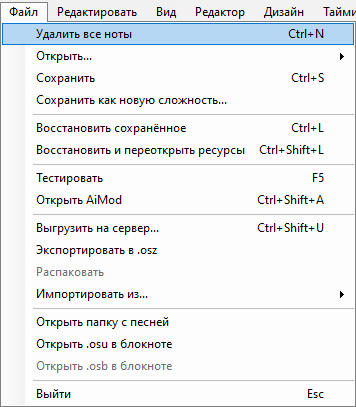
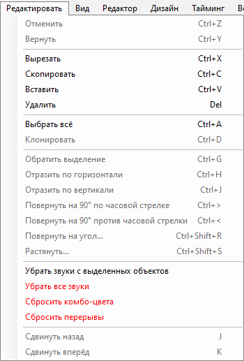
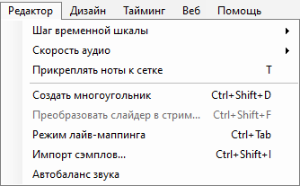
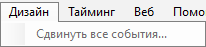
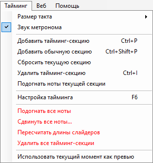
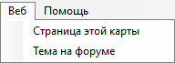
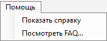

# Меню редактора карты

## Файл

| Название | Описание |
| :-- | :-- |
| Удалить все ноты (`Ctrl` + `N`) | Удалить все игровые объекты из открытой сложности. |
| Открыть... | **Для редактирования:** открыть меню для быстрого переключения между сложностями. **Для сравнения:** наложить выбранную сложность на открытую в данный момент (только для [osu!mania](/wiki/Game_mode/osu!mania)). |
| Сохранить (`Ctrl` + `S`) | Сохранить текущие изменения (как [`.osu`](/wiki/Client/File_formats/osu_(file_format)), так и [`.osb`](/wiki/Client/File_formats/osb_(file_format))). |
| Сохранить как новую сложность... | Сохранить текущие изменения как новую сложность. Сложность, на основе которой была создана новая, при этом не сохраняется. |
| Восстановить сохранённое (`Ctrl` + `L`) | Вернуть открытую сложность и сториборд к их последнему сохранённому состоянию. |
| Восстановить и переоткрыть ресурсы (`Ctrl` + `Shift` + `L`) | Вернуть сложность и сториборд к последнему сохранённому состоянию и заново прочитать с диска дополнительные файлы (спрайты, сэмплы и т.д.). |
| Тестировать (`F5`) | [Протестировать](/wiki/Client/Beatmap_editor/Test_mode) сложность (будет предложено сохранить изменения). |
| Открыть AiMod (`Ctrl` + `Shift` + `A`) | Открыть [AiMod](/wiki/Client/Beatmap_editor/AiMod). |
| Выгрузить на сервер... (`Ctrl` + `Shift` + `U`) | [Выгрузить](/wiki/Beatmapping/Beatmap_submission) карту на форум [Works In Progress](https://osu.ppy.sh/community/forums/10). |
| Экспортировать в [`.osz`](/wiki/Client/File_formats/osz_(file_format))... | Экспортировать карту в формате [`.osz`](/wiki/Client/File_formats/osz_(file_format)) для самостоятельного распространения, после чего открыть папку Exports. |
| Распаковать | Распаковать карту формата `.osz2`<!-- TODO(TicClick: add a link when the article is up)--> во временную папку, чтобы во время моддинга можно было работать с её файлами напрямую.[^osz2-note] |
| Импортировать из... | **bms/bme:** импортировать файл с расширением `.bms`/`.bme` как сложность osu!mania. |
| Открыть папку с песней | Открыть папку с картой, где хранятся все её файлы. |
| Открыть `.osu` в блокноте | Открыть файл выбранной в данный момент сложности в Блокноте. |
| Открыть `.osb` в блокноте | Открыть файл [сториборда](/wiki/Storyboard) выбранной в данный момент сложности в Блокноте. |
| Выйти (`Esc`) | Выйти из редактора карты с предварительной возможностью сохранения.[^exit-note] |

## Редактировать

| Название | Описание |
| :-- | :-- |
| Отменить (`Ctrl` + `Z`) | Отменить последнее изменение. |
| Вернуть (`Ctrl` + `Y`) | Вернуть последнее изменение. |
| Вырезать (`Ctrl` + `X`) | Вырезать выделенные объекты. |
| Скопировать (`Ctrl` + `C`) | Скопировать выделенные объекты. |
| Вставить (`Ctrl` + `V`) | Вставить выделенные объекты. |
| Удалить (`Delete`) | Удалить выделенные объекты. |
| Выбрать всё (`Ctrl` + `A`) | Выбрать все игровые объекты. |
| Клонировать (`Ctrl` + `D`) | Скопировать и вставить выделенные объекты спустя одну [долю](/wiki/Music_theory/Beat) после конца выделения. |
| Обратить выделение (`Ctrl` + `G`) | Сменить направление выделенных слайдеров на противоположное и поменять порядок игровых объектов, сделав последний из них первым, и наоборот. |
| Отразить по горизонтали (`Ctrl` + `H`) | Отразить выделенные объекты по оси Y на игровом поле (поменять лево и право). |
| Отразить по вертикали (`Ctrl` + `J`) | Отразить выделенные объекты по оси X на игровом поле (поменять верх и низ). |
| Повернуть на 90° по часовой стрелке (`Ctrl` + `>`) | Повернуть выделенные объекты вправо на 90° вокруг центра игрового поля. |
| Повернуть на 90° против часовой стрелки (`Ctrl` + `<`) | Повернуть выделенные объекты влево на 90° вокруг центра игрового поля. |
| Повернуть на угол... (`Ctrl` + `Shift` + `R`) | Повернуть выделенные объекты на произвольный угол вокруг центра выделения или игрового поля. |
| Растянуть... (`Ctrl` + `Shift` + `S`) | «Растянуть» выделенные объекты, переместив их ближе или дальше от центра игрового поля по одной или двум осям. |
| Убрать звуки с выделенных объектов | Удалить [дополнительные хитсаунды](/wiki/Beatmapping/Hitsound) с выделенных объектов. |
| Убрать все звуки | Удалить дополнительные хитсаунды со всех объектов этой сложности. |
| Сбросить комбо-цвета | Сбросить [комбо-цвета](/wiki/Beatmapping/Colourhaxing) всех объектов этой сложности. |
| Сбросить перерывы | Сбросить все [перерывы](/wiki/Beatmap/Break) с настроенными вручную началом или концом, чтобы они находились вплотную к игровым объектам. |
| Сдвинуть назад (`J`) | Сдвинуть все выделенные объекты на один тик назад, в зависимости от текущего [шага временно́й шкалы](/wiki/Client/Beatmap_editor/Beat_snap_divisor). |
| Сдвинуть вперёд (`K`) | Сдвинуть все выделенные объекты на один тик вперёд, в зависимости от текущего шага временно́й шкалы. |

## Вид

| Название | Описание |
| :-- | :-- |
| Редактор (`F1`) | Перейти на вкладку «[`Редактор`](/wiki/Client/Beatmap_editor/Compose)». |
| Дизайн (`F2`) | Перейти на вкладку «[`Дизайн`](/wiki/Client/Beatmap_editor/Design)». |
| Тайминг (`F3`) | Перейти на вкладку «[`Тайминг`](/wiki/Client/Beatmap_editor/Timing)». |
| Настройка карты (`F4`) | Открыть окно [`Song Setup`](/wiki/Client/Beatmap_editor/Song_setup). |
| Настройки тайминга (`F6`) | Открыть [окно настройки тайминга](/wiki/Client/Beatmap_editor/Timing). |
| Громкость и звук | Отрегулировать уровень громкости музыки или хитсаундов. |
| Шаг сетки (`G`) | Отрегулировать [размер сетки](/wiki/Beatmapping/Grid_snapping) игрового поля, используемой для [привязки нот](/wiki/Beatmapping/Snapping). |
| Показать видео | Показывать фоновое видео и сториборд. |
| Dim Background | Затемнить задний фон в [режиме тестирования](/wiki/Client/Beatmap_editor/Test_mode), чтобы объекты были более заметными. |
| Показывать названия сэмплов | Показывать названия [кейсаундов](/wiki/Beatmapping/Hitsound#keysound), назначенных на ноты в osu!mania. |
| Ползущие слайдеры | Включить «выползание» слайдеров из начальной точки в момент появления. |
| Анимация попадания | Включить такую же анимацию бесследного пропадания объектов, как при игре. |
| Связывающие точки | Показывать точки, соединяющие объекты одного комбо. |
| Показывать стеки | Объединять объекты, расположенные в одной точке, в стек — как при игре.[^stacking-note] |

## Редактор

*См. также: [Редактор](/wiki/Client/Beatmap_editor/Compose)*

| Название | Описание |
| :-- | :-- |
| Шаг временно́й шкалы | Сделать [шаг временно́й шкалы](/wiki/Client/Beatmap_editor/Beat_snap_divisor) более крупным или мелким, чтобы на [верхней шкале](/wiki/Client/Beatmap_editor/Timelines) отображалось больше или меньше тиков. |
| Скорость аудио | Изменить скорость воспроизведения звука. |
| Прикреплять ноты к сетке (`T`) | Прикреплять игровые объекты к [сетке](/wiki/Beatmapping/Grid_snapping) игрового поля. |
| Создать многоугольник (`Ctrl` + `Shift` + `D`) | Добавить многоугольник из нот, используя для их расстановки текущий шаг временно́й шкалы. |
| Преобразовать слайдер в стрим... | Преобразовать [тело](/wiki/Gameplay/Hit_object/Slider/Sliderbody) выбранного слайдера в [стрим](/wiki/Beatmap/Pattern/osu!/Stream) из нот. **By object count:** использовать определённое число нот. **By distance snap:** использовать определённый [множитель расстояния](/wiki/Client/Beatmap_editor/Distance_snap). |
| Режим лайв-маппинга (`Ctrl` + `Tab`) | Включить режим расстановки объектов под музыку с помощью игровых клавиш. В osu!taiko или osu!mania будут ставиться [ноты](/wiki/Gameplay/Hit_object/Hit_circle), в osu!catch — [фрукты](/wiki/Gameplay/Hit_object/Fruit).[^live-mapping-note] |
| Импорт сэмплов | Открыть окно [`Sample import`](/wiki/Client/Beatmap_editor/Compose#sample-import) для сложностей osu!mania. |

## Дизайн

*См. также: [Дизайн](/wiki/Client/Beatmap_editor/Design)*

| Название | Описание |
| :-- | :-- |
| Сдвинуть все события... | Сдвинуть *все* [команды](/wiki/Storyboard/Scripting/Commands) сториборда на заданное количество миллисекунд. |

## Тайминг

*См. также: [Тайминг](/wiki/Client/Beatmap_editor/Timing)*

| Название | Описание |
| :-- | :-- |
| Размер такта | Выбрать [размер такта](/wiki/Music_theory/Time_signature) текущей тайминг-секции (обычный — 4/4, вальс — 3/4). Для использования другого тактового размера воспользуйтесь [окном настройки тайминга](/wiki/Client/Beatmap_editor/Timing). |
| Звук метронома | Включить звук [метронома](/wiki/Client/Beatmap_editor/Timing#метроном) во вкладке тайминга. |
| Добавить тайминг-секцию (`Ctrl` + `P`) | Добавить новую [красную тайминг-секцию](/wiki/Client/Beatmap_editor/Timing#красные-тайминг-секции). |
| Добавить обычную секцию (`Ctrl` + `Shift` + `P`) | Добавить новую [зелёную тайминг-секцию](/wiki/Client/Beatmap_editor/Timing#зелёные-тайминг-секции). |
| Сбросить текущую секцию | Сбросить [BPM](/wiki/Music_theory/Tempo) и [оффсет](/wiki/Offset) текущей красной тайминг-секции для [повторного тайминга](/wiki/Beatmapping/Timing). Все сброшенные таким образом секции будут удалены при сохранении карты. |
| Удалить тайминг-секцию (`Ctrl` + `I`) | Удалить текущую красную или зелёную тайминг-секцию. |
| Подогнать ноты текущей секции | [Подогнать](/wiki/Beatmapping/Snapping) все игровые объекты текущей красной тайминг-секции под видимые тики временно́й шкалы. |
| Настройка тайминга (`F6`) | Открыть [окно настройки тайминга](/wiki/Client/Beatmap_editor/Timing). |
| Подогнать все ноты | Подогнать все игровые объекты под видимые тики временно́й шкалы. |
| Сдвинуть все ноты... | Сдвинуть все игровые объекты на заданное количество миллисекунд. |
| Пересчитать длины слайдеров | Автоматически пересчитать[^recalculate-lengths-note] все [длины слайдеров](/wiki/Gameplay/Hit_object/Slider/Slidertail), чтобы они заканчивались на ближайшем к ним тике временно́й шкалы. **Это может привести к их укорочению** и потребовать ручной перепроверки всей карты. |
| Удалить все тайминг-секции | Удалить все красные и зелёные тайминг-секции в сложности. |
| Использовать текущий момент как превью | Использовать текущий момент как превью на веб-сайте и экране [выбора песни](/wiki/Client/Interface#song-select). |

## Веб

| Название | Описание |
| :-- | :-- |
| Страница этой карты | Перейти на страницу карты<!-- TODO(TicClick): link after https://github.com/ppy/osu-wiki/issues/3122 is completed --> на веб-сайте osu!. |
| Тема на форуме | Перейти в форумную тему, связанную с картой. |

## Помощь

| Название | Описание |
| :-- | :-- |
| Показать справку | Показать внутриигровую справку со списком горячих клавиш и краткими пояснениями к интерфейсу редактора.[^help-note] |
| Посмотреть FAQ... | Перейти к статье про [маппинг](/wiki/Beatmapping) на osu! wiki. |

## Примечания

[^osz2-note]: Это действие отключено для обычных карт формата `osz`.
[^exit-note]: Это действие иногда игнорирует изменения, внесённые во вкладке «Дизайн».
[^stacking-note]: Агрессивность формирования стеков в каждой отдельной сложности определяется её параметром [stack leniency](/wiki/Beatmap/Stack_leniency).
[^live-mapping-note]: Во всех трёх режимах для расстановки объектов будут использоваться клавиши, назначенные для игры в osu!taiko.
[^recalculate-lengths-note]: Пригождается при изменении BPM или [скорости слайдера](/wiki/Gameplay/Hit_object/Slider/Slider_velocity).
[^help-note]: Это действие отключено.
