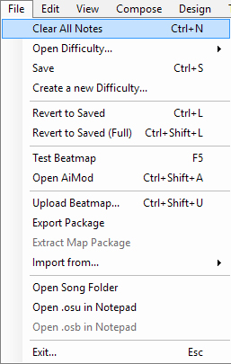
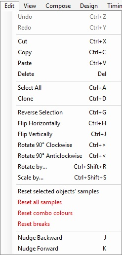
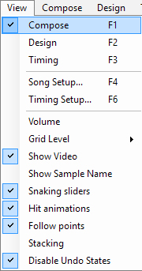
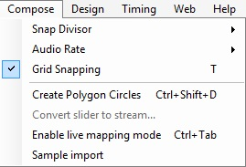
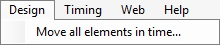
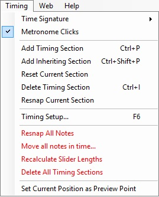
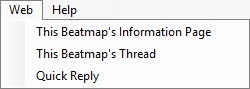
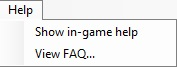

# เมนูของตัวแก้ไข Beatmap (Beatmap editor menu)

{#compose}
{#timing}

## File (ไฟล์)

| ชื่อ | คำอธิบาย |
| :-- | :-- |
| Clear All Notes (`Ctrl` + `N`) | ลบ Hit objects ทั้งหมดในระดับความยากนี้ |
| Open Difficulty... | **สำหรับแก้ไข:** สลับไปมาระหว่างระดับความยากต่างๆ อย่างรวดเร็ว **สำหรับอ้างอิง:** (เฉพาะ [osu!mania](/wiki/Game_mode/osu!mania)) แสดงระดับความยากที่เลือกซ้อนทับกับอันที่กำลังเปิดอยู่ |
| Save (`Ctrl` + `S`) | บันทึกการเปลี่ยนแปลงปัจจุบัน (ทั้งไฟล์ [`.osu`](/wiki/Client/File_formats/osu_(file_format)) และ [`.osb`](/wiki/Client/File_formats/osb_(file_format))) |
| Create a new Difficulty... | บันทึกการเปลี่ยนแปลงปัจจุบันเป็นระดับความยากใหม่ ส่วนอันเก่าจะยังคงสถานะเดิมจากการบันทึกครั้งล่าสุด |
| Revert to Saved (`Ctrl` + `L`) | ย้อนกลับไปสู่สถานะการบันทึกครั้งล่าสุดของความยากและ Storyboard |
| Revert to Saved (Full) (`Ctrl` + `Shift` + `L`) | ย้อนกลับไปสู่สถานะการบันทึกครั้งล่าสุด และโหลดไฟล์ทั้งหมดใหม่ (รูปภาพ, เสียง ฯลฯ) |
| Test Beatmap (`F5`) | [ทดสอบการเล่น](/wiki/Client/Beatmap_editor/Test_mode) โดยระบบจะให้บันทึกการเปลี่ยนแปลงก่อนเริ่ม |
| Open AiMod (`Ctrl` + `Shift` + `A`) | เปิดหน้าต่าง [AiMod](/wiki/Client/Beatmap_editor/AiMod) |
| Upload Beatmap... (`Ctrl` + `Shift` + `U`) | [อัปโหลด](/wiki/Beatmapping/Beatmap_submission) Beatmap ไปยังฟอรัม [Works In Progress](https://osu.ppy.sh/community/forums/10) |
| Export Package... | ส่งออก Beatmap เป็นไฟล์ [`.osz`](/wiki/Client/File_formats/osz_(file_format)) เพื่อนำไปแจกจ่ายเอง และเปิดโฟลเดอร์ `Exports` ที่เก็บไฟล์นั้น |
| Extract Map Package | แตกไฟล์แมพแบบ `.osz2` ลงในโฟลเดอร์ชั่วคราวเพื่อเขียนทับไฟล์ในระหว่างการ Modding[^osz2-note] |
| Import from... | **bms/bme:** เปิดไฟล์ `.bms`/`.bme` เพื่อนำเข้ามาเป็นระดับความยากของ osu!mania |
| Open Song Folder | เปิดโฟลเดอร์ของเพลง ซึ่งบรรจุไฟล์ต่างๆ ที่เกี่ยวข้องกับแมพ |
| Open `.osu` in Notepad | เปิดไฟล์ระดับความยากที่เลือกอยู่ด้วยโปรแกรม Notepad |
| Open `.osb` in Notepad | เปิดไฟล์ [Storyboard](/wiki/Storyboard) รวมของชุดแมพด้วยโปรแกรม Notepad |
| Exit... (`Esc`) | ออกจากตัวแก้ไข Beatmap โดยระบบจะให้บันทึกการเปลี่ยนแปลงก่อน[^exit-note] |

## Edit (แก้ไข)

| ชื่อ | คำอธิบาย |
| :-- | :-- |
| Undo (`Ctrl` + `Z`) | ย้อนกลับการแก้ไขล่าสุด |
| Redo (`Ctrl` + `Y`) | ทำซ้ำการแก้ไขล่าสุด |
| Cut (`Ctrl` + `X`) | ตัดวัตถุที่เลือก |
| Copy (`Ctrl` + `C`) | คัดลอกวัตถุที่เลือก |
| Paste (`Ctrl` + `V`) | วางวัตถุที่เลือก |
| Delete (`Delete`) | ลบวัตถุที่เลือก |
| Select All (`Ctrl` + `A`) | เลือก Hit objects ทั้งหมด |
| Clone (`Ctrl` + `D`) | คัดลอกและวางวัตถุที่เลือกไว้ถัดจากตำแหน่งเดิมไปหนึ่ง [จังหวะ (Beat)](/wiki/Music_theory/Beat) |
| Reverse Selection (`Ctrl` + `G`) | กลับทิศทางของ Slider และเรียงลำดับวัตถุใหม่ตามเวลา (สลับหน้าไปหลัง) |
| Flip Horizontally (`Ctrl` + `H`) | กลับด้านวัตถุที่เลือกในแนวนอน (ซ้าย-ขวา) |
| Flip Vertically (`Ctrl` + `J`) | กลับด้านวัตถุที่เลือกในแนวตั้ง (บน-ล่าง) |
| Rotate 90° Clockwise (`Ctrl` + `>`) | หมุนวัตถุที่เลือกไปทางขวา 90 องศา รอบจุดศูนย์กลางของสนามเล่น |
| Rotate 90° Anticlockwise (`Ctrl` + `<`) | หมุนวัตถุที่เลือกไปทางซ้าย 90 องศา รอบจุดศูนย์กลางของสนามเล่น |
| Rotate by... (`Ctrl` + `Shift` + `R`) | หมุนวัตถุที่เลือกตามองศาที่กำหนด รอบจุดศูนย์กลางของสนามเล่นหรือจุดศูนย์กลางของกลุ่มวัตถุ |
| Scale by... (`Ctrl` + `Shift` + `S`) | ย่อขยายขนาดของกลุ่มวัตถุที่เลือกตามแกนต่างๆ |
| Reset selected objects' samples | ลบ [Hitsound ส่วนเสริม](/wiki/Beatmapping/Hitsound) ออกจากวัตถุที่เลือก |
| Reset all samples | ลบ Hitsound ส่วนเสริมออกจากวัตถุทั้งหมดในระดับความยากนี้ |
| Reset combo colours | ลบการกำหนด [สีคอมโบพิเศษ](/wiki/Beatmapping/Colourhaxing) ออกจากวัตถุทั้งหมดในระดับความยากนี้ |
| Reset breaks | รีเซ็ตเวลาเริ่ม/จบของ [ช่วงพัก (Breaks)](/wiki/Beatmap/Break) ทั้งหมดให้กลับมาอยู่ติดกับ Hit objects รอบข้าง |
| Nudge Backward (`J`) | ขยับวัตถุที่เลือกย้อนกลับไปหนึ่งขีดจังหวะ (Tick) ตามค่า [ตัวแบ่งจังหวะ](/wiki/Client/Beatmap_editor/Beat_snap_divisor) ที่ใช้อยู่ |
| Nudge Forward (`K`) | ขยับวัตถุที่เลือกไปข้างหน้าหนึ่งขีดจังหวะ ตามค่าตัวแบ่งจังหวะที่ใช้อยู่ |

## View (มุมมอง)

| ชื่อ | คำอธิบาย |
| :-- | :-- |
| Compose (`F1`) | สลับไปยังแถบ [`Compose`](/wiki/Client/Beatmap_editor/Compose) |
| Design (`F2`) | สลับไปยังแถบ [`Design`](/wiki/Client/Beatmap_editor/Design) |
| Timing (`F3`) | สลับไปยังแถบ [`Timing`](/wiki/Client/Beatmap_editor/Timing) |
| Song Setup... (`F4`) | เปิดหน้าต่าง [`Song Setup`](/wiki/Client/Beatmap_editor/Song_setup) |
| Timing Setup... (`F6`) | เปิดหน้าต่าง [`Timing and Control Points`](/wiki/Client/Beatmap_editor/Timing) |
| Volume | ปรับระดับเสียงเพลงหรือเสียง Hitsound |
| Grid Level (`G`) | ปรับความละเอียดของ [ตาราง (Grid)](/wiki/Beatmapping/Grid_snapping) ที่ใช้สำหรับการ [Snap](/wiki/Beatmapping/Snapping) วัตถุ |
| Show Video/Storyboard | เปิด/ปิดการแสดงผลของวิดีโอพื้นหลังและ Storyboard |
| Dim Background | ลดความสว่างของพื้นหลังใน [โหมดทดสอบ](/wiki/Client/Beatmap_editor/Test_mode) เพื่อให้เห็น Hit objects ชัดขึ้น |
| Show Sample Name | สำหรับ osu!mania ให้แสดง [ชื่อไฟล์เสียง Keysound](/wiki/Beatmapping/Hitsound#keysound) ที่ผูกไว้กับโน้ต |
| Snaking sliders | แสดงแอนิเมชัน Slider ค่อยๆ เลื้อยออกมาจากจุดเริ่มต้น |
| Hit animations | แสดงแอนิเมชันของ Hit objects เหมือนตอนกดเล่นจริง |
| Follow points | แสดงและเล่นแอนิเมชันของเส้นนำสายตา (Follow points) เหมือนตอนเล่นจริง |
| Stacking | แสดงการกองซ้อนของวงกลมเหมือนตอนเล่นจริง[^stacking-note] |

## Compose (การประกอบ)

*หน้าหลัก: [Compose](/wiki/Client/Beatmap_editor/Compose)*

| ชื่อ | คำอธิบาย |
| :-- | :-- |
| Snap Divisor | เปลี่ยนความละเอียดของ [ตัวแบ่งจังหวะ](/wiki/Client/Beatmap_editor/Beat_snap_divisor) เพื่อแสดงขีดบน [ไทม์ไลน์](/wiki/Client/Beatmap_editor/Timelines) มากขึ้นหรือน้อยลง |
| Audio Rate | เปลี่ยนความเร็วในการเล่นเพลง |
| Grid Snapping (T) | เปิด/ปิดการ [Snap](/wiki/Beatmapping/Grid_snapping) วัตถุเข้ากับตารางบนสนามเล่น |
| Create Polygon Circles... (`Ctrl` + `Shift` + `D`) | สร้างรูปทรงหลายเหลี่ยมจาก Hit circles โดยวางตำแหน่งตามตัวแบ่งจังหวะที่ใช้อยู่ |
| Convert slider to stream... | แทนที่ [ตัว Slider](/wiki/Gameplay/Hit_object/Slider/Sliderbody) ที่เลือกด้วย [สตรีม (Stream)](/wiki/Beatmap/Pattern/osu!/Stream) ของวงกลม โดยเลือกได้ว่าจะอิงตามจำนวนวัตถุหรืออิงตาม [Distance snap](/wiki/Client/Beatmap_editor/Distance_snap) |
| Enable live mapping mode (`Ctrl` + `Tab`) | วางวงกลม, ผลไม้ หรือโน้ต โดยการกดปุ่มเหมือนตอนเล่นจริงในขณะที่เพลงกำลังเล่นอยู่[^live-mapping-note] |
| Sample import | เปิดหน้าต่าง [`Sample import`](/wiki/Client/Beatmap_editor/Compose#sample-import) สำหรับระดับความยากของ osu!mania |

## Design (การออกแบบ)

*หน้าหลัก: [Design](/wiki/Client/Beatmap_editor/Design)*

| ชื่อ | คำอธิบาย |
| :-- | :-- |
| Move all elements in time... | ย้าย [คำสั่ง Storyboard](/wiki/Storyboard/Scripting/Commands) *ทั้งหมด* ไปข้างหน้าหรือย้อนกลับตามจำนวนมิลลิวินาทีที่กำหนด |

## Timing (การตั้งจังหวะ)

*หน้าหลัก: [Timing](/wiki/Client/Beatmap_editor/Timing)*

| ชื่อ | คำอธิบาย |
| :-- | :-- |
| Time Signature | เลือก [เครื่องหมายกำหนดจังหวะ](/wiki/Music_theory/Time_signature) สำหรับจุดจังหวะปัจจุบัน ระหว่าง 4/4 หรือ 3/4 (หากเป็นจังหวะอื่นให้ใช้หน้าต่าง `Timing Setup`) |
| Metronome Clicks | เปิด/ปิดเสียงติ๊กของ [เครื่องให้จังหวะ (Metronome)](/wiki/Client/Beatmap_editor/Timing#metronome) ในแถบ Timing |
| Add Timing Section (`Ctrl` + `P`) | เพิ่ม [Uninherited timing section (เส้นแดง)](/wiki/Client/Beatmap_editor/Timing#uninherited-timing-point) ใหม่ |
| Add Inheriting Section (`Ctrl` + `Shift` + `P`) | เพิ่ม [Inherited timing section (เส้นเขียว)](/wiki/Client/Beatmap_editor/Timing#inherited-timing-point) ใหม่ |
| Reset Current Section | รีเซ็ตค่า [BPM](/wiki/Music_theory/Tempo) และ [Offset](/wiki/Offset) ของเส้นแดงปัจจุบันเพื่อการ [ตั้งจังหวะใหม่](/wiki/Beatmapping/Timing) หากไม่ได้แก้ไข ระบบจะลบทิ้งเมื่อมีการบันทึกไฟล์ |
| Delete Timing Section (`Ctrl` + `I`) | ลบจุดจังหวะปัจจุบัน (ทั้งเส้นเขียวและเส้นแดง) |
| Resnap Current Section | [จัดจังหวะใหม่ (Resnap)](/wiki/Beatmapping/Snapping) ให้กับวัตถุทั้งหมดในส่วนปัจจุบันตามตัวแบ่งจังหวะที่ใช้อยู่ |
| Timing Setup... (`F6`) | เปิดหน้าต่าง [`Timing and Control Points`](/wiki/Client/Beatmap_editor/Timing) |
| Resnap All Notes | จัดจังหวะใหม่ให้กับวัตถุทั้งหมดในความยากนี้ตามตัวแบ่งจังหวะที่ใช้อยู่ |
| Move all notes in time.. | ย้ายวัตถุทั้งหมดในแมพไปข้างหน้าหรือย้อนกลับตามจำนวนมิลลิวินาทีที่กำหนด |
| Recalculate Slider Lengths | จัดจังหวะ [ปลาย Slider](/wiki/Gameplay/Hit_object/Slider/Slidertail) ใหม่ให้ตรงกับขีดไทม์ไลน์ที่ใกล้ที่สุดโดยอัตโนมัติ[^recalculate-lengths-note] **ซึ่งอาจทำให้ Slider สั้นลง** และต้องตรวจสอบด้วยตนเองอีกครั้ง |
| Delete All Timing Sections | ลบจุดจังหวะทั้งหมด (ทั้งเส้นแดงและเส้นเขียว) ในระดับความยากนี้ |
| Set Current Position as Preview Point | กำหนดตำแหน่งเวลาปัจจุบันให้เป็นจุดฟังเพลงตัวอย่างสำหรับเว็บไซต์และ [หน้าเลือกเพลง](/wiki/Client/Interface#song-select) |

## Web (เว็บ)

| ชื่อ | คำอธิบาย |
| :-- | :-- |
| This Beatmap's Information Page | เปิด [หน้าข้อมูล Beatmap](/wiki/Beatmap_information) บนเว็บไซต์ osu! |
| This Beatmap's Thread | เปิดกระทู้ฟอรัมของ Beatmap นี้ |

## Help (ช่วยเหลือ)

| ชื่อ | คำอธิบาย |
| :-- | :-- |
| Show in-game help | แสดงหน้าต่างช่วยเหลือพร้อมปุ่มลัดและคำอธิบายสั้นๆ[^help-note] |
| View FAQ... | เปิดบทความวิกิเกี่ยวกับ [การสร้าง Beatmap (Beatmapping)](/wiki/Beatmapping) |

##Notes

[^osz2-note]: คำสั่งนี้ใช้ไม่ได้กับไฟล์แมพแบบ `.osz` ปกติ
[^exit-note]: คำสั่งนี้ในบางครั้งจะ *ละเลย* การเปลี่ยนแปลงที่เกิดขึ้นในแถบ `Design`
[^stacking-note]: พฤติกรรมการกองซ้อนจะถูกควบคุมโดยการตั้งค่า [Stack leniency](/wiki/Beatmap/Stack_leniency) ของแมพนั้น
[^live-mapping-note]: ในโหมด osu!, osu!taiko และ osu!catch จะใช้การตั้งค่าปุ่มของโหมด osu!taiko
[^recalculate-lengths-note]: มีประโยชน์มากเมื่อมีการเปลี่ยนค่า BPM หรือ [ความเร็ว Slider](/wiki/Gameplay/Hit_object/Slider/Slider_velocity)
[^help-note]: คำสั่งนี้ไม่สามารถใช้งานได้แล้วในปัจจุบัน
