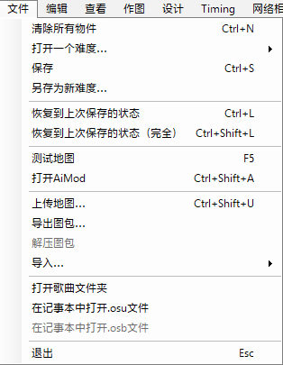
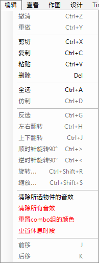
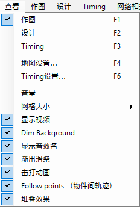
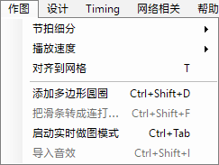
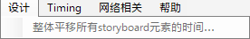
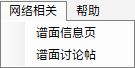
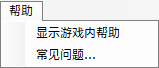

# 谱面编辑器菜单

## 文件

| 名称 | 描述 |
| :-- | :-- |
| 清除所有物件 (`Ctrl` + `N`) | 清除当前难度中的所有物件。 |
| 打开一个难度... | **用于编辑：**在难度间快速切换。**用于参考：**（仅限 [osu!mania](/wiki/Game_mode/osu!mania)）将所选难度物件覆盖在当前已打开难度的上方。 |
| 保存 (`Ctrl` + `S`) | 保存当前更改（[`.osu`](/wiki/Client/File_formats/osu_(file_format)) 与 [`.osb`](/wiki/Client/File_formats/osb_(file_format)) 均保存）。 |
| 另存为新难度... | 将当前难度的更改保存到新难度。重新加载时，旧难度会保留上次保存的状态。 |
| 恢复到上次保存的状态 (`Ctrl` + `L`) | 将难度和故事板恢复到上次保存时的状态。 |
| 恢复到上次保存的状态（完全） (`Ctrl` + `Shift` + `L`) | 将难度和故事板恢复到上次保存时的状态，并重新加载所有文件（精灵图、音效等等）。 |
| 测试地图 (`F5`) | [测试](/wiki/Client/Beatmap_editor/Test_mode)当前难度，在此之前会要求保存。 |
| 打开 AiMod (`Ctrl` + `Shift` + `A`) | 打开 [AiMod](/wiki/Client/Beatmap_editor/AiMod)。 |
| 上传地图... (`Ctrl` + `Shift` + `U`) | 将谱面[上传](/wiki/Beatmapping/Beatmap_submission)到[制作中 (WIP)](https://osu.ppy.sh/community/forums/10) 论坛。 |
| 导出图包... | 将谱面导出为 [`.osz`](/wiki/Client/File_formats/osz_(file_format)) 压缩文件以便个人分发，并打开含有此文件的`Exports` 文件夹。 |
| 解压图包 | 将 `.osz2`<!-- TODO(TicClick: add a link when the article is up)--> 谱面解压到临时文件夹，以便在摸图时修改文件。[^osz2-note] |
| 导入... | **bms/bme:** 打开 `.bms`/`.bme` 文件，并将其导入为 osu!mania 难度。 |
| 打开歌曲文件夹 | 打开当前谱面的文件夹，其中包含游戏相关的文件。 |
| 在记事本中打开 `.osu` 文件 | 在微软记事本中打开当前选中难度的文件。 |
| 在记事本中打开 `.osb` 文件 | 在微软记事本中打开谱面的[故事板](/wiki/Storyboard)文件。 |
| 退出 (`Esc`) | 退出谱面编辑器，在此之前会建议你保存最近更改。[^exit-note] |

## 编辑

| 名称 | 描述 |
| :-- | :-- |
| 撤消 (`Ctrl` + `Z`) | 撤销最后一步编辑操作。 |
| 重做 (`Ctrl` + `Y`) | 重做最后一步编辑操作。 |
| 剪切 (`Ctrl` + `X`) | 剪切所选物件。 |
| 复制 (`Ctrl` + `C`) | 复制所选物件。 |
| 粘贴 (`Ctrl` + `V`) | 粘贴复制的物件。 |
| 删除 (`Delete`) | 删除所选物件。 |
| 全选 (`Ctrl` + `A`) | 选定所有物件。 |
| 仿制 (`Ctrl` + `D`) | 复制所选物件，并将其粘贴到选区后一[拍](/wiki/Music_theory/Beat)处。 |
| 反选 (`Ctrl` + `G`) | 反转滑条方向，并按时间顺序给物件重新排序，首尾颠倒，以此类推。 |
| 左右翻转 (`Ctrl` + `H`) | 关于游玩区域的 Y 轴（左右）翻转所选物件。 |
| 上下翻转 (`Ctrl` + `J`) | 关于游玩区域的 X 轴（上下）翻转所选物件。 |
| 顺时针旋转 90° (`Ctrl` + `>`) | 将所选物件绕游玩区域中心向右旋转 90°。 |
| 逆时针旋转 90° (`Ctrl` + `<`) | 将所选物件绕游玩区域中心向左旋转 90°。 |
| 旋转... (`Ctrl` + `Shift` + `R`) | 绕游玩区域或选区中心，将所选物件旋转自定义角度。 |
| 缩放... (`Ctrl` + `Shift` + `S`) | 沿一个或多个轴移动所选物件，增大物件到游玩区域或选区中心的距离，以此缩放选区。 |
| 清除所选物件的音效 | 删除当前所选物件的[附加音效](/wiki/Beatmapping/Hitsound)。 |
| 清除所有音效 | 删除此难度所有物件的附加音效。 |
| 重置 combo 组的颜色 | 移除当前难度所有物件的[串颜色覆盖设置](/wiki/Beatmapping/Colourhaxing)。 |
| 重置休息时段 | 将所有[休息时段](/wiki/Beatmap/Break)的自定义起止时刻重新设置在邻近的物件旁。 |
| 前移 (`J`) | 基于当前[节拍细分](/wiki/Client/Beatmap_editor/Beat_snap_divisor)设置，将所选物件向后移一拍。 |
| 后移 (`K`) | 基于当前节拍细分设置，将所选物件向前移一拍。 |

## 查看

| 名称 | 描述 |
| :-- | :-- |
| 作图 (`F1`) | 将活跃标签页切换到[`作图 (Compose)`](/wiki/Client/Beatmap_editor/Compose)。 |
| 设计 (`F2`) | 将活跃标签页切换到[`设计 (Design)`](/wiki/Client/Beatmap_editor/Design)。 |
| Timing (`F3`) | 将活跃标签页切换到[`测定时间轴 (Timing)`](/wiki/Client/Beatmap_editor/Timing)。 |
| 地图设置... (`F4`) | 打开[`歌曲设置 (Song Setup)`](/wiki/Client/Beatmap_editor/Song_setup)窗口。 |
| Timing 设置... (`F6`) | 打开[`测定时间轴和控制点 (Timing and Control Points)`](/wiki/Client/Beatmap_editor/Timing) 窗口。 |
| 音量 | 调整音乐与音效的音量。 |
| 网格大小 (`G`) | 调整游玩区域的[网格](/wiki/Beatmapping/Grid_snapping)疏密，以用于[对齐物件](/wiki/Beatmapping/Snapping)。 |
| 显示视频/故事板 | 改变背景视频与故事板的可见性。 |
| 暗化背景 | 在[测试模式](/wiki/Client/Beatmap_editor/Test_mode)中暗化背景，使打击物件更容易看到。 |
| 显示音效名 | 在 osu!mania 难度中显示[键盘音的音效名称](/wiki/Beatmapping/Hitsound#keysound)。 |
| 渐出滑条 | 滑条从起点逐渐伸出。 |
| 击打动画 | 像在游玩时一样添加击打圆圈时的动画。 |
| 物件间轨迹 (Follow points) | 像在游玩时一样显示轨迹点及其动画效果。 |
| 堆叠效果 | 像在游玩时一样堆叠重合的圆圈。[^stacking-note] |

## 作图

*主页面：[作图 (Compose)](/wiki/Client/Beatmap_editor/Compose)*

| 名称 | 描述 |
| :-- | :-- |
| 节拍细分 | 改变[节拍细分](/wiki/Client/Beatmap_editor/Beat_snap_divisor)的疏密程度，以此改变[时间线](/wiki/Client/Beatmap_editor/Timelines)上显示的拍线数目。 |
| 播放速度 | 改变音频的回放速度 (Playback Rate)。 |
| 对齐到网格 (T) | 开关物件与游玩区域网格线[对齐](/wiki/Beatmapping/Grid_snapping)的功能。 |
| 添加多边形圆圈 (`Ctrl` + `Shift` + `D`) | 以当前的节拍细分设置为准放置圆圈，从而形成含有多个打击圈的正多边形。 |
| 把滑条转成连打... | 将选定滑条的[主体](/wiki/Gameplay/Hit_object/Slider/Sliderbody)换成[连打串](/wiki/Beatmap/Pattern/osu!/Stream)。**按物件数：**打击圈的总数一定。**按物件间距：**打击圈之间的[距离](/wiki/Client/Beatmap_editor/Distance_snap)一定。 |
| 启动实时做图模式 (`Ctrl` + Tab) | 在播放歌曲时，用绑定的按键放置 osu!/osu!taiko 的[打击圈](/wiki/Gameplay/Hit_object/Hit_circle)、osu!catch 的[大果](/wiki/Gameplay/Hit_object/Fruit)及 osu!mania 的音符。[^live-mapping-note] |
| 导入音效 | 打开 osu!mania 难度的[`导入自定义音效`](/wiki/Client/Beatmap_editor/Compose#音效导入)窗口。 |

## 设计

*主页面：[设计 (Design)](/wiki/Client/Beatmap_editor/Design)*

| 名称 | 描述 |
| :-- | :-- |
| 整体平移所有 storyboard 元素的时间... | 以毫秒为单位移动*所有*故事板[命令](/wiki/Storyboard/Scripting/Commands)。 |

## 测定时间轴 (Timing)

*主页面：[测定时间轴 (Timing)](/wiki/Client/Beatmap_editor/Timing)*

 菜单")

| 名称 | 描述 |
| :-- | :-- |
| 节拍类型 | 选择当前计时点对应的节拍类型：4/4 （常见）或 3/4 （华尔兹）。对于其他节拍类型，请使用 [Timing 设置窗口](/wiki/Client/Beatmap_editor/Timing)。 |
| 节拍器 | 启用/禁用 `Timing` 标签页上[节拍器](/wiki/Client/Beatmap_editor/Timing#节拍器)的滴答声。 |
| 添加 Timing 区间（即红线） (`Ctrl` + `P`) | 添加新的[非继承区间（红线）](/wiki/Client/Beatmap_editor/Timing#非继承时间点（红线）)。 |
| 添加继承区间（即绿线） (`Ctrl` + `Shift` + `P`) | 添加新的[继承区间（绿线）](/wiki/Client/Beatmap_editor/Timing#继承时间点（绿线）)。 |
| 重置当前区间 | 重置当前非继承区间的 [BPM](/wiki/Music_theory/Tempo) 与[偏移量](/wiki/Offset)设置，以便[重新测定时间轴](/wiki/Beatmapping/Timing)。如果不修改区间参数即保存谱面，则会删除这些区间。 |
| 删除 Timing 区间 (`Ctrl` + `I`) | 删除当前计时区间（红线、绿线都会删除） |
| 重新对齐当前 Timing 区间 | 以当前的测定时间轴设置为准，[重新对齐](/wiki/Beatmapping/Snapping)当前区间的所有打击物件。 |
| Timing 设置... (F6) | 打开[`测定时间轴和控制点``](/wiki/Client/Beatmap_editor/Timing)窗口。 |
| 全部重新对齐 | 以当前的测定时间轴设置为准，将所有打击物件重新对齐。 |
| 整体平移所有物件的时间... | 以毫秒为单位移动所有物件。 |
| 重新计算滑条长度 | 将所有[滑条尾](/wiki/Gameplay/Hit_object/Slider/Slidertail)与时间线上最近的节拍线自动重新对齐[^recalculate-lengths-note]，**可能会缩短滑条长度**，需要手动检查。 |
| 删除所有 Timing 区间 | 删除当前难度所有的红线和绿线。 |
| 把当前位置设为预览点 | 将当前时间戳用作网站和[选歌页面](/wiki/Client/Interface#选歌界面)的预览点。 |

## 网络相关

| 名称 | 描述 |
| :-- | :-- |
| 谱面信息页 | 打开 osu! 网站上此谱面的信息页。 |
| 谱面讨论帖 | 打开此谱面的讨论帖。 |

## 帮助

| 名称 | 描述 |
| :-- | :-- |
| 显示游戏内帮助 | 显示帮助界面，带有快捷键与简短说明。[^help-note] |
| 常见问题... | 打开[作图](/wiki/Beatmapping) wiki 页面。 |

## 备注

[^osz2-note]: 对于常规 `.osz` 谱面，会禁用这条命令。
[^exit-note]: 这条命令有时会*忽略* `Design` 标签页下作出的更改。
[^stacking-note]: 堆叠行为受难度的[堆叠严度](/wiki/Beatmap/Stack_leniency)控制。
[^live-mapping-note]: osu!、osu!taiko、osu!catch 使用的都是 osu!taiko 的按键绑定设置。
[^recalculate-lengths-note]: 在改变 BPM 或[滑条速率](/wiki/Gameplay/Hit_object/Slider/Slider_velocity)后很有用。
[^help-note]: 这条命令已经没用了。
