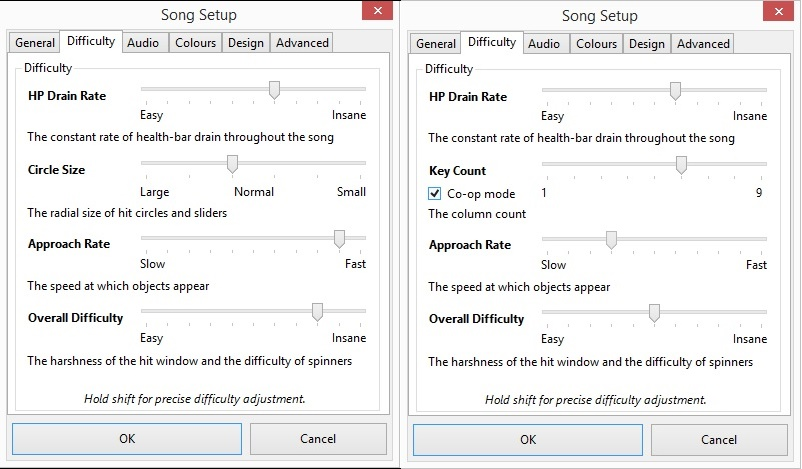
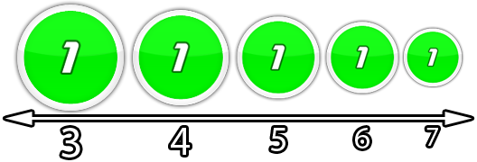
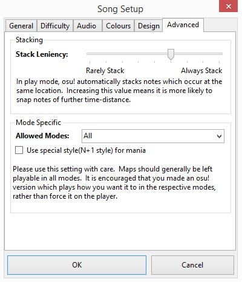
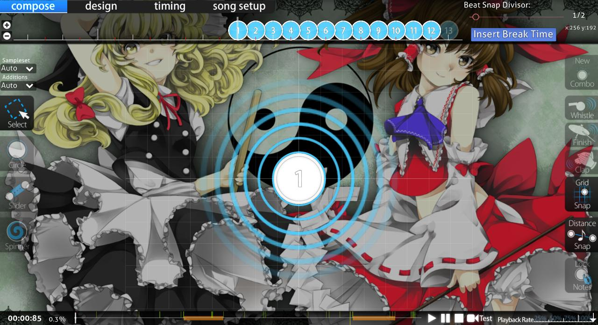

# Fenêtre Song Setup

Song Setup est la quatrième section de [l'éditeur de beatmap](/wiki/Client/Beatmap_editor). Elle contient les métadonnées et les paramètres généraux de configuration de la beatmap.

## Général

### Métadonnées des musiques et des beatmaps

*Voir également : [\[Guide\] Metadata](https://osu.ppy.sh/community/forums/topics/249288 "forums osu!")*

 dans Song Setup")

Ces champs doivent être remplis avant de créer une deuxième difficulté. Il s'agit principalement de s'assurer que les métadonnées seront cohérentes pour toutes les difficultés de la beatmap.

Les données des champs "artiste", "titre" et "source" doivent provenir de la [source primaire de métadonnées](/wiki/Beatmap/Primary_metadata_source) de la musique.

Ces champs doivent être remplis avant de créer une deuxième difficulté. Ceci est principalement pour s'assurer que les métadonnées seront cohérentes à travers toutes les difficultés de la beatmap.

#### Artiste

**Le groupe, le chanteur, le compositeur ou le groupe qui a interprété ou créé la musique**. Normalement, cette information est automatiquement extraite des métadonnées du fichier MP3, mais vérifiez l'orthographe et la ponctuation.

*Attention : Les titres d'animes ou de jeux doivent être placés dans le champ [Source](#source). Les noms de Vocaloid ou de sociétés doivent être placés dans le champ [Tags](#tags).*

Les noms étrangers/orientaux doivent être présentés dans le même ordre que celui utilisé sur Wikipédia (généralement, le prénom suivi du nom de famille ; l'ordre occidental, par souci de cohérence).

Ce champ doit préférer l'orthographe des sources officielles de sortie. L'artiste peut parfois être trouvé sur [Wikipedia](https://www.wikipedia.org) ou d'autres sources non officielles telles que [Anime News Network](https://www.animenewsnetwork.com) ou [MyAnimeList](https://myanimelist.net). Comme pour toute source non officielle, le contenu fourni doit être vérifié par rapport aux sources officielles ou, s'il fournit un lien vers la source officielle, visitez plutôt cette dernière. En cas de doute, remplissez toutes les informations connues maintenant et faites un post pour demander vérification.

##### Artiste romanisé

**Le nom romanisé de l'artiste.** Il doit être présenté dans le même ordre que celui utilisé sur Wikipédia (généralement, le prénom suivi du nom de famille ; l'ordre occidental, par souci de cohérence). Ce champ ne sera disponible que si des caractères Unicode sont utilisés dans le champ [Artiste](#artiste).

#### Titre

**Le titre de la musique** Normalement, il est automatiquement extrait des métadonnées du fichier MP3, mais vérifiez l'orthographe et la ponctuation.

##### Titre romanisé

**Le nom romanisé de la musique.** Ce champ ne sera disponible que si des caractères Unicode sont utilisés dans le champ [Titre](#titre).

#### Créateur de la beatmap

**Le nom d'utilisateur du créateur de la beatmap.** Le client du jeu devrait gérer cela automatiquement et ne vous permettra pas de modifier ce champ, c'est-à-dire si vous êtes le créateur.

*Attention : Les noms d'utilisateur des [Guest difficulty](/wiki/Beatmap/Guest_difficulty) appartiennent aux champs [Difficulté](#difficulté) et/ou [Tags](#tags).*

#### Difficulté

**Le nom de la beatmap, en d'autres termes, le nom de la difficulté.** Le menu déroulant contient les noms prédéfinis de `Easy`, `Normal`, `Hard`, et `Insane`. Le créateur peut choisir l'un des noms prédéfinis dans le menu déroulant ou en taper un. Même s'il est bon d'être créatif, essayez de rendre les noms de difficulté très clairs quant à la difficulté qu'ils représentent. Les noms de difficulté ambigus ennuient les joueurs et ne sont pas classables.

Ce champ peut également être utilisé pour indiquer qu'il s'agit d'une guest difficulty (par exemple "Larto's Hard").

#### Source

**L'origine de la musique.** En général, ce champ ne doit être utilisé que pour les musiques d'animes ou de jeux vidéo et occasionnellement pour les musiques de novels (films, télévision ou Internet).

Si la musique est tirée d'un anime, d'un jeu vidéo ou si elle est célèbre pour son utilisation dans un film ou une émission de télévision, le titre de cette source doit être ajouté dans ce champ. Dans le cas contraire, ce champ doit être laissé vide.

*Remarque : Ce champ ne doit pas être utilisé pour les titres d'album, qui doivent être placés dans le champ [Tags](#tags).*

Toutes les musiques n'ont pas besoin de quelque chose dans le champ source. La source est seulement pour les musiques qui sont tirées de quelque chose (par exemple, un jeu vidéo ou un anime). Les musiques rock et pop ordinaires peuvent laisser ce champ vide. D'autres informations pertinentes doivent être saisies dans le champ [Tags](#tags), comme le titre de l'album ou des informations sur le sous-genre.

#### Tags

**Une liste de mots-clés pour faciliter les requêtes de recherche.** En général, les tags doivent inclure des noms d'albums, des noms d'utilisateurs de créateurs invités, des noms de sociétés et d'autres termes susceptibles d'être utilisés par les utilisateurs lors de la recherche de beatmaps. Si la beatmap comporte des éléments de collaboration (tels que le storyboarding) réalisés par d'autres utilisateurs, leurs noms d'utilisateur doivent être ajoutés à ce champ.

Les tags sont séparées par des espaces. Il n'est pas nécessaire d'utiliser ce champ, car les métadonnées des autres champs sont utilisées pour faciliter l'interrogation des beatmaps ; cependant, il est très apprécié des utilisateurs qui tentent de trouver une beatmap spécifique.

## Onglet Difficulté

*Remarque : Les [Critères de classement](/wiki/Ranking_Criteria) spécifiques au mode de jeu ont des valeurs de classement qui doivent être utilisées.*

Les paramètres de difficulté de la beatmap ; chaque paramètre affecte différents aspects de la beatmap.

*Note : En maintenant la touche `Shift` enfoncée, on peut obtenir un ajustement précis de 0,1 par rapport à l'ajustement standard de 1.*

La notation courante pour représenter un paramètre de difficulté et sa valeur est l'abréviation du paramètre suivie de la valeur du paramètre. Par exemple, `CS4` et `HP4.3` seront une beatmap avec un circle size de 4 et un taux de drain de santé de 4.3 respectivement. En théorie, les paramètres de difficulté négatifs peuvent ressembler à `AR-2` pour un approach rate de -2.

### Taux de drain de santé

Le **taux de drain de santé**, communément abrégé en HP, détermine le taux de récupération des points de vie à la suite d'un bon score et de punition des points de vie à la suite d'un mauvais score. La valeur varie de 0 à 10 ; des valeurs de HP plus élevées donneront une récupération de santé plus faible avec une punition de santé plus élevée.

Dans osu! et osu!catch, cela affecte également les [HP passifs](/wiki/Client/Interface/Health_bar) (la vitesse constante à laquelle les HP diminuent, sauf pendant les [pauses](/wiki/Beatmap/Break).

*Note : Plus d'HP sont récupérés avec les scores [Geki](/wiki/Gameplay/Judgement/Geki) et [Katu](/wiki/Gameplay/Judgement/Katu), qui peuvent être donnés par le dernier objet dans un combo.*

### Circle size

*Note : Cette option est visible dans osu!taiko, mais elle n'affecte pas le gameplay.*

Le **circle size**, communément abrégée en CS, n'existe que dans osu! et osu!catch. CS détermine la taille des objets ou, plus précisément dans osu!catch, détermine la taille de l'attrapeur et du fruit. Les valeurs vont de 2 à 7 ; plus les valeurs CS sont élevées, plus les objets sont petits. En utilisant la valeur la plus élevée, les objets seront aussi grands que le curseur.

La plupart des beatmaps utilisent une valeur de 3 ou 4, tandis qu'une valeur de 5 ou 6 est parfois utilisée et une valeur de 7 n'est presque jamais utilisée. Une valeur de 7 et plus est susceptible d'être vue lors de l'utilisation du mod [Hard Rock](/wiki/Game_modifier/Hard_Rock).

Le réglage de la valeur CS à une valeur inférieure à 2 ou supérieure à 7 peut être fait en modifiant manuellement le fichier `.osu`.

#### Key Count

Key Count, également connu sous le nom de Keys, remplace la métrique [circle size](#circle-size) pour les beatmaps [osu!mania-specific](#mode-specific). Key Count est auto-explicatif ; il définit le nombre de touches utilisé. Les valeurs vont de 1 à 9 touches.

En cochant la case "Co-op mode", le montant sélectionné sera doublé (à partir de 5), ce qui donne un total de 10K (5), 12K (6), 14K (7), 16K (8) et 18K (9).

### Approach rate

*Page principale : [Approach rate](/wiki/Beatmapping/Approach_rate)*

*Remarque : cette option est visible dans osu!taiko et osu!mania, mais elle n'a aucune incidence sur la jouabilité. C'est principalement parce que les deux utilisent une vitesse de défilement, qui est basée sur le BPM (battements par minute)..*

L'**approach rate**, communément abrégée en AR, n'existe que dans osu! et osu!catch. Les valeurs vont de 0 à 10 ; plus les valeurs d'AR sont élevées, plus la hit windows des objets est courte. L'AR indique combien de temps les objets resteront à l'écran, depuis le moment où ils apparaissent jusqu'au moment où il faut les frapper/récupérer.

Un approach rate plus élevé signifie que les objets seront affichés pendant une période plus courte, ce qui laisse moins de temps de réaction pour planifier. Inversement, un approach rate plus faible signifie que les objets seront affichés à l'écran pendant plus longtemps, ce qui laisse plus de temps pour réagir, mais peut entraîner l'apparition d'un nombre excessif d'objets à l'écran en même temps si l'approach rate est trop faible.

---

La durée d'un objet qui reste visible à l'écran (sans mods) varie de 1800ms (AR0) à 450ms (AR10).

Il existe quatre mods qui modifient le timing de l'approach rate lorsqu'ils sont activés :

- [Easy](/wiki/Game_modifier/Easy) : Divise par deux la valeur AR. (par exemple, AR10→AR5)
- [Hard Rock](/wiki/Game_modifier/Hard_Rock) :  Multiplie la valeur d'AR par 1,40, jusqu'à AR10 au maximum. (par exemple, on passe de AR3 à AR4.2 ou de AR9 à AR10)
- [Double Time](/wiki/Game_modifier/Double_Time) : La valeur d'AR n'est pas affectée, mais en raison de l'augmentation de 50% de la vitesse de lecture, les cercles restent à l'écran 33% de millisecondes en moins.
- [Half Time](/wiki/Game_modifier/Half_Time) : La valeur d'AR n'est pas affectée, mais en raison de la diminution de 25 % de la vitesse de lecture, les cercles restent à l'écran 33 % de millisecondes de plus.

Alors que les mods Half Time *(HT)* et Double Time *(DT)* ne modifient pas la valeur réelle de l'AR, la différence de vitesse entraîne un changement d'AR apparent, aussi bas que AR-5 ou aussi élevé que AR11. Dans le tableau d'AR fourni, ces valeurs apparentes sont données pour permettre une comparaison facile entre les vitesses d'approche avec et sans mods. L'AR réel, cependant, est toujours un nombre compris entre 0 et 10. Notez que les niveaux d'AR s'échelonnent de 120 ms pour une valeur inférieure à l'AR5 et de 150 ms pour une valeur supérieure à l'AR5.

### Overall difficulty

*Page principale : [overall difficulty](/wiki/Beatmapping/Overall_difficulty)*

*Remarque : le tableau ci-dessus s'applique uniquement au mode de jeu osu!.*\
*Remarque : Sur la page de la beatmap, l'overall difficulty est indiquée sous le nom de Précision.*

L'overall difficulty, communément abrégée en OD, définit le degré de difficulté à atteindre une grande précision. Les valeurs vont de 0 à 10, les valeurs d'OD les plus élevées nécessitant plus de précision et d'exactitude. Étant donné que la précision est importante pour gagner des HP, l'overall difficulty influence indirectement la difficulté de passer la beatmap. Des valeurs OD plus élevées signifient des fenêtres de hit plus courtes pour clear les objets, à la fois en général et en termes d'obtention de la valeur de score la plus élevée de l'objet.

Dans osu!, le système de timing ne permet pas à un objet d'être touché tant que l'objet précédent ne l'a pas été et n'a pas reçu de jugement, ou tant qu'il n'a pas manqué après que la fenêtre de hit soit passée. Si les fenêtres de hits sont trop longues, la fenêtre de hit de l'objet peut chevaucher la fenêtre précédente. Pendant ce temps, l'objet est "verrouillé" et les coups ne comptent pas. Ce phénomène est appelé de manière informelle "notelock" dans osu!, ou "column locking" ou "cbrushing" dans osu!mania. Pour plus de détails et d'exemples, voir l'[article sur le notelock](/wiki/Gameplay/Judgement/Notelock). Pour cette raison, il est conseillé de ne pas utiliser de faibles valeurs d'OD dans les maps à fort BPM.

Effets supplémentaires de l'augmentation de l'OD dans chaque mode de jeu :

- osu! : Les spinners doivent être tournés davantage pour remplir la jauge, au point de devenir presque impossible à terminer dans les temps.
- osu!taiko : Le denden (spinner) nécessite plus de coups pour être éliminé.
- osu!mania et osu!catch ne sont pas affectés par l'OD.

Pour calculer les fenêtres de hits, voir les formules de l'[article sur l'overall difficulty](/wiki/Beatmapping/Overall_difficulty).

---

À OD 0, un joueur peut obtenir un score de 300 en étant à moins de 79,5 ms de la frappe exacte à temps. À l'autre extrémité de l'échelle, OD 10 exige d'être à moins de 19,5 ms pour obtenir le même score de 300.

Il existe quatre mods qui modifient le timing de l'overall difficulty lorsqu'ils sont activés :

- [Easy](/wiki/Game_modifier/Easy): Divise par deux la valeur de l'OD.
- [Hard Rock](/wiki/Game_modifier/Hard_Rock): Multiplie la valeur de l'OD par 1,4, jusqu'à OD10 au maximum.
- [Double Time](/wiki/Game_modifier/Double_Time): La valeur de l'OD n'est pas affectée, mais en raison de l'augmentation de 50 % de la vitesse, les fenêtres de hits sont effectivement 33 % plus courtes.
- [Half Time](/wiki/Game_modifier/Half_Time): La valeur de l'OD n'est pas affectée, mais en raison de la diminution de 25 % de la vitesse, les fenêtres de hits sont effectivement 33 % plus longues.

Alors que les mods Half Time *(HT)* et Double Time *(DT)* ne changent pas la valeur réelle de l'OD, l'effet de la vitesse sur les hit windows fera que les objets sembleront avoir une OD apparente inférieure ou supérieure, respectivement. Dans le tableau de l'OD fourni, les valeurs d'OD apparentes sont indiquées pour permettre la comparaison entre les temps avec et sans ces mods. Notez que ces valeurs d'OD apparentes ne s'appliquent qu'aux 300 sur les cercles. Les fenêtres pour les 100, les 50 et les sliders (qui utilisent la hit windows 50) sont plus sévères avec le Double Time que ne le suggère cette OD apparente et plus clémentes avec le Half Time. Encore une fois, en dehors du NoMod, Hard Rock *(HR)* et Easy *(EZ)* (sur le côté gauche), les valeurs de l'OD fournies ne servent qu'à des fins de comparaison : la valeur réelle de l'OD est toujours un nombre compris entre 0 et 10.

## Audio

### Paramètres par défaut de l'échantillon

Configuration pour les hitsounds. Cependant, en utilisant les sections [timing](/wiki/Client/Beatmap_editor/Timing) (`F6`), le créateur peut changer les deux ensembles de hitsounds ou le volume individuellement grâce à des points de timing. Les sections `Sample Set Selection` et `Sample Set Volume` seront inaccessibles si des ajustements de volume sensibles au timing sont utilisés dans la beatmap. Cliquer sur le bouton `Reset Settings` supprimera tous les ajustements de volume personnalisés.

#### Sample Set Selection

Choisissez d'utiliser globalement les jeux d'échantillons intégrés `Normal`, `Soft`, ou `Drum`. Il est possible d'[activer les surcharges personnalisées](/wiki/Guides/Custom_Sample_Overrides) pour utiliser en priorité les fichiers hitsound dans le dossier de la beatmap pour les hitsounds personnalisés.

#### Sample Set Volume

Définissez le volume de l'ensemble d'échantillons de manière globale.

#### Test Sample Set

En cliquant sur ces boutons, vous pouvez tester le son de la série d'échantillons. Quatre boutons sont proposés, à savoir : `Normal`, `Whistle`, `Finish`, et `Clap`. Ces sons sont additifs ; `Whistle` est une combinaison de `Normal` et `Whistle`.

### Misc. Toggles

La case à cocher `Samples match playback rate (for fully-hitsounded maps)` ajustera le pitch des hitsounds en fonction des modificateurs de vitesse (à la fois dans l'éditeur et dans le jeu). Si vous décochez cette case, les hitsounds seront joués à leur propre vitesse.

## Colours

Configurez les couleurs des combos et la couleur de fond du terrain de jeu.

### Hitcircle/Slider Combos

Configurez le jeu de couleurs de combo personnalisé. La coloration des combos est un aspect important de la valeur esthétique d'une beatmap.

En cliquant sur une couleur combinée ou en cliquant sur `New Combo Colour`, vous ouvrez le sélecteur de couleurs du système d'exploitation (comme le montre l'image ; le sélecteur de couleurs de Windows). Choisissez des couleurs qui complètent le fond, et non qui se camouflent dans le fond.

Au maximum, huit couleurs de combo peuvent être sélectionnées, bien que la plupart des beatmaps en utilisent généralement quatre.

La case à cocher `Enable Custom Colours` doit être cochée pour activer la couleur de combinaison personnalisée définie ci-dessus. Si vous la décochez, vous reviendrez aux paramètres de couleurs par défaut ou aux paramètres de couleurs du skin du joueur. Il est généralement recommandé de la garder cochée pour que la beatmap puisse avoir sa propre identité unique en termes de couleurs de combo. Elle peut être décochée sans risque pour les beatmaps spécifiques à osu!taiko et osu!mania.

En cliquant sur le bouton `Remove Combo Colour`, vous supprimez la dernière couleur combinée définie.

### Arrière-plan du terrain de jeu

Cliquez sur le bouton `Background Colour` pour modifier la couleur d'arrière-plan du champ de jeu vierge.

Un paramètre dont la modification est discutable, sauf pour les storyboards qui peuvent exposer l'arrière-plan du champ de jeu vierge.

## Design

### Countdown

Cochez la case `Enable countdown` pour activer l'animation du compte à rebours avant le démarrage de la beatmap.

Lorsqu'elle est activée, l'animation du compte à rebours peut être affinée à l'aide des boutons `Countdown Speed` (`Half`, `Normal`, `Double`) et du `Countdown Offset` (0 par défaut ; plus la valeur est élevée, plus le compte à rebours est rapide).

### Misc. Toggles

- `Widescreen Support` : Supprimez les [sidebars/pillarboxes](https://en.wikipedia.org/wiki/Pillarbox) des côtés gauche et droit du champ de jeu si le client utilise un rapport d'aspect supérieur à `4:3`. Cette option est généralement activée lorsque vous utilisez des éléments de storyboard, mais elle peut être désactivée.
- `Display storyboard in front of combo fire` : Un paramètre obsolète, qui peut être ignoré.
- `Display epilepsy warning (storyboard has quick strobing)` : Affiche un avertissement d'épilepsie pour les storyboards clignotants (rapides ou quelconques) dans la beatmap.
- `Letterbox during breaks` : Détermine si le beatmap doit (ou non) mettre des [letterboxes](https://fr.wikipedia.org/wiki/Letterbox) pendant les pauses dans les beatmaps. Ceci est généralement activé par défaut, mais l'utilisation de cette option dans les beatmaps spécifiques à osu!mania n'est pas autorisée.

### Skinning

La liste déroulante `Preferred Skin` est utilisée pour définir le skin préféré pour la beatmap. L'utilisation de cette option suppose que le joueur possède le skin que vous souhaitez qu'il utilise. Cependant, si le joueur n'a pas le skin, une notification apparaîtra pour le joueur, indiquant que le skin demandé est manquant, mais que le skin actuel du joueur sera utilisé à la place. Par défaut, `User's preference (No Change)` est utilisé.

Vous pouvez toutefois inclure les éléments du skin dans le dossier de la beatmap. Comme la plupart des créateurs le feront à la place, cette option est rarement utilisée, sauf si elle permet de réduire la taille du fichier ou si elle fait partie d'un projet d'une beatmap, où le skin peut être fourni sur la page du projet elle-même.

## Advanced

### Stacking

Dans osu!, les objets s'empilent automatiquement s'ils sont placés au même endroit tout en étant proches dans le temps. Ceci afin d'aider les joueurs à voir les objets qui se chevauchent.

En déplaçant le slider vers la droite, vous espacerez la "proximité" des objets dans le temps avant que l'empilement ne se produise. Il est préférable de laisser cette option telle quelle, à sa valeur par défaut de `7`.

*Remarque : Les cercles empilés dans osu! se déplaceront vers le point où l'empilement se produit.*

Les objets sont considérés comme appartenant à la même pile s'ils se trouvent à la même coordonnée et pas plus loin dans le temps que `[(Fenêtre d'approche) * (Limite de pile) / 10]`, où `Fenêtre d'approche` est la durée pendant laquelle les objets restent à l'écran (voir [la section sur l'approach rate](#approach-rate).

### Mode Specific

`Allowed Modes` est une liste déroulante pour confirmer que la beatmap ne peut être jouée que par le mode spécifié. Le paramètre par défaut est `All`, ce qui signifie que le créateur créera une beatmap du mode osu! qui pourra être converti dans les autres modes de jeu. Ce paramètre peut être modifié pour être spécifique à osu!taiko, osu!catch, ou osu!mania ; mais **gardez à l'esprit que ce changement supprimera tous les objets dans la beatmap**.

*Remarque : décidez au moment de la création et confirmez d'abord le(s) mode(s) de jeu de la beatmap avant d'ajouter des objets pour éviter de gaspiller des efforts.*\
*Note : osu!mania possède son propre éditeur de beatmap qui est différent de l'éditeur de beatmap classique.*

La case à cocher  `Use special style(N+1 style) for mania` ne fait rien, étant donné que le joueur peut définir une préférence personnelle spécifiquement dans les [Options](/wiki/Client/Options) en utilisant le bouton `osu!mania layout`.

## Le saviez-vous ?

- L'onglet `Design` était auparavant appelé "Storyboarding".
- Dans l'onglet `Difficulty`, il y avait auparavant `Approximate Difficulty Rating` qui est un résumé de tous les paramètres choisis sur cette page. Plus d'étoiles signifiait que la beatmap était plus difficile. Cependant, il ne s'agissait pas du classement final en étoiles de la beatmap, mais d'une approximation basée sur les paramètres de difficulté actuels. Il a été remplacé par un tag expliquant que le fait de maintenir la touche `Shift` permettait d'affiner les valeurs par incréments de 0,1.
