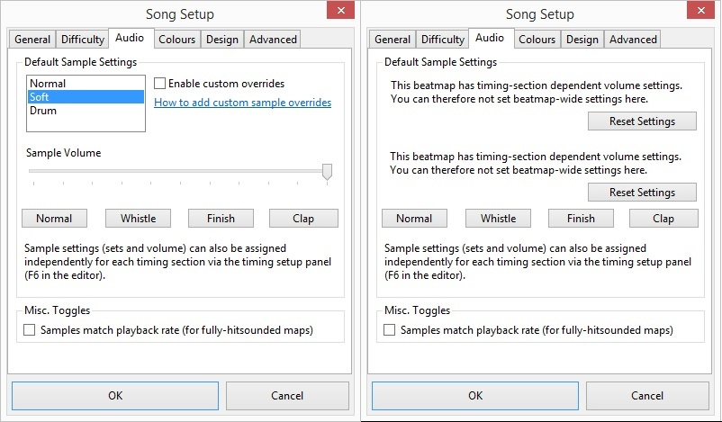

# Ventana de configuración de las canciones

La ventana de **configuración de las canciones** es la cuarta sección del [editor de beatmaps](/wiki/Client/Beatmap_editor), que incluye metadatos del beatmap, ajustes de dificultad y diseño, así como otras opciones.

## General

`General` proporciona información que ayuda a los jugadores no solo a encontrar el beatmap, sino también a saber un poco más sobre la canción en sí. Los metadatos especificados aquí deben tomarse de alguna de las [fuentes primarias de metadatos](/wiki/Beatmap/Primary_metadata_source) de la canción y, si un beatmap está pasando por el [procedimiento de clasificación](/wiki/Beatmap_ranking_procedure), seguir los [criterios de clasificación](/wiki/Ranking_criteria/Metadata).

| Campo | Significado |
| :-- | :-- |
| `Artist` | La banda, cantante, compositor o grupo que interpretó o creó la canción. |
| `Romanised Artist` | El nombre romanizado del artista. *Nota: solo se puede editar cuando `Artist` contiene caracteres Unicode.* |
| `Title` | El título de la canción. |
| `Romanised Title` | El nombre romanizado de la canción. *Nota: solo se puede editar cuando `Title` contiene caracteres Unicode.* |
| `Beatmap Creator` | Nombre de usuario del [anfitrión de beatmap](/wiki/Beatmap/Beatmap_host). Los autores de las [dificultades de invitados](/wiki/Beatmap/Guest_difficulty) deben especificarse en las etiquetas. |
| `Difficulty` | Nombre de la dificultad, que debe reflejar su contenido. Puede indicar [participación de invitados](/wiki/Beatmap/Guest_difficulty), ser [estandarizado](/wiki/Ranking_criteria/Difficulty_naming) o [personalizado](/wiki/Ranking_criteria#reglas.1). |
| `Source` | (Opcional) El medio de origen de la canción, como un videojuego o una película. |
| `Tags` | Palabras claves de búsqueda, separadas por espacios. Puede contener cualquier cosa relevante para el beatmap o la canción, como el nombre del álbum, los nombres de los mappers invitados o el género. |

## Dificultad

*Nota: Los [criterios de clasificación](/wiki/Ranking_criteria) específicos de cada modo de juego contienen configuraciones recomendadas para cada nivel de dificultad.*

`Difficulty` contiene ajustes que afectan a la dificultad y la exigencia de habilidad de un beatmap para los jugadores, donde los valores más altos aumentan la dificultad. Todos los valores enumerados aquí pueden verse afectados por ciertos [modificadores de juego](/wiki/Gameplay/Game_modifier). Estos ajustes se suelen llamar por su abreviatura seguida de su valor, como «CS 4» para un beatmap con el tamaño de círculo correspondiente.

Los valores se pueden ajustar con una precisión de 0,1x manteniendo presionado `Mayús`, a diferencia del paso estándar de 1.

### Tasa de drenaje de HP (HP drain rate)

*Artículo principal: [Tasa de drenaje de HP](/wiki/Beatmap/HP_drain_rate)*

La tasa de drenaje de HP (HP) determina la cantidad de recuperación de salud o daño de [golpes](/wiki/Gameplay/Judgement) precisos o fuera de tiempo. En osu! y osu!catch, también afecta a la tasa de [drenaje de salud pasiva](/wiki/Beatmap/HP_drain_rate). Los valores más altos proporcionan una menor recuperación de la salud con penalizaciones mayores.

### Tamaño del círculo (Circle size)

*Artículo principal: [Tamaño del círculo](/wiki/Beatmap/Circle_size)*

El tamaño del círculo (CS) determina el tamaño de los objetos en osu! y osu!catch, donde los valores más altos hacen que los objetos sean más pequeños. Aunque el editor limita el CS a un rango de 2 a 7, es posible superar el límite editando manualmente el archivo [`.osu`](/wiki/Client/File_formats/osu_(file_format)) de la dificultad. El tamaño del círculo no tiene ningún efecto en osu!taiko.

En los beatmaps [específicos de osu!mania](#modo-específico-(mode-specific)), el tamaño del círculo se sustituye por el número de teclas (indicado con K, como 4K para 4 teclas), que define el número de columnas del campo de juego. Al marcar la casilla `Co-op mode` se duplicará la cantidad seleccionada en ese momento (a partir de 5), llegando a un total de 10K (5), 12K (6), 14K (7), 16K (8) y 18K (9).

### Velocidad de aproximación (Approach rate)

*Página principal: [Velocidad de aproximación](/wiki/Beatmap/Approach_rate)*

La velocidad de aproximación (AR) indica cuánto tiempo permanecen en la pantalla los objetos de osu! y osu!catch desde el momento en que aparecen hasta el momento de golpear/atrapar. Los valores más altos significan periodos más cortos de visibilidad y menos tiempo para reaccionar.

osu!taiko y osu!mania no se ven afectados por los cambios en la velocidad de aproximación; en cambio, ambos modos usan la velocidad de desplazamiento, que se basa en el [tempo](/wiki/Music_theory/Tempo) de la canción y la [velocidad de los sliders](/wiki/Gameplay/Hit_object/Slider/Slider_velocity).

### Dificultad general (Overall difficulty)

*Página principal: [Dificultad general](/wiki/Beatmap/Overall_difficulty)*\
*Nota: En las páginas de información de los beatmaps, la dificultad general aparece como `Precisión`.*

La dificultad general (OD) es responsable del tamaño de las ventanas de tiempo, que definen qué tan difícil es lograr una alta precisión. Los valores de OD más altos significan ventanas de tiempo más cortas, lo que requiere más exactitud y precisión. Dado que la precisión es importante para ganar HP, la dificultad general influye indirectamente en lo difícil que es pasar 
un beatmap.

Los valores bajos de OD en mapas de osu! con un [tempo](/wiki/Music_theory/Tempo) alto pueden hacer que las ventanas de tiempo cercanas se superpongan y provoquen [notelock](/wiki/Gameplay/Judgement/Notelock), bloqueando los objetos hasta que pasen las ventanas de tiempo anteriores. Como resultado, fallar una sola nota desencadenará un fallo en cascada y hará que el jugador falle el beatmap.

Efectos adicionales del aumento del OD en cada modo de juego:

- osu!: los spinners deben girarse más para llenar el indicador, hasta el punto de que resulta casi imposible completarlos a tiempo.
- osu!taiko: los spinners requieren más golpes para completarse.
- osu!mania y osu!catch no se ven afectados por el OD.

## Audio

`Audio` permite configurar los [hitsounds](/wiki/Beatmapping/Hitsound) para todo el beatmap a la vez, si no tiene ninguna personalización de sonido. Con mucha más frecuencia, los mappers prefieren tener un control fino sobre el sonido; como resultado, abandonan la pestaña `Audio` para personalizar los hitsounds por cada sección del beatmap usando múltiples [secciones de tiempo](/wiki/Client/Beatmap_editor/Timing#puntos-de-tiempo-heredados). En este caso, la parte superior de la pestaña es inaccesible, y al hacer clic en el botón `Reset Settings` se eliminarán todos los ajustes de volumen de temporización personalizados.

| Control | Efecto |
| :-- | :-- |
| Conjuntos de muestras: `Normal/Soft/Drum` | Selecciona entre diferentes [conjuntos de muestras](/wiki/Beatmapping/Sampleset) integrados. |
| `Enable custom overrides` | Usa [hitsounds personalizados](/wiki/Guides/Custom_sample_overrides) en lugar de los predeterminados. |
| `Sample Volume` | Ajusta el volumen de los hitsounds en general. |
| Botones de hitsounds | Reproduce los hitounds que se van a usar. |
| `Samples match playback rate` | Modifica el tono y el tempo de los hitsounds cuando cambia la velocidad del beatmap (tanto en el editor como en el juego). |

## Colores

`Colours` permite configurar los [colores de los combos](/wiki/Beatmapping/Combo_colour). En versiones anteriores del juego, el color de fondo del campo de juego también se podía ajustar aquí, pero esta característica ya no tiene ningún propósito.

Durante el juego, los colores de los objetos cambiarán según el orden especificado por defecto, cambiando en cada [nuevo combo](/wiki/Beatmapping/New_combo). Como resultado, es importante no solo sincronizar los combos con la canción, sino también elegir colores que complementen el fondo y hagan que los objetos sean más legibles. También es posible definir manualmente el orden de los colores durante el mapping, lo que recibe el nombre de [coloración](/wiki/Beatmapping/Colourhaxing).

Los colores de los combos solo tienen efecto en osu! y osu!catch.

| Control | Acción |
| :-- | :-- |
| `Combo 1..8` | Selecciona los colores de combo especificados durante el juego. Haz clic en el botón correspondiente para cambiar su color usando el selector de color del sistema operativo. |
| `Enable Custom Colours` | Si no está marcada, se usarán los colores de combo predeterminados de la skin activa. |
| `New Combo Colour` | Añade un nuevo color al conjunto. |
| `Remove Combo Colour` | Elimina el último color del conjunto. |
| `Background Colour` | Cambia el color del campo de juego en blanco. |

## Diseño

`Design` contiene varios ajustes que afectan al aspecto general del beatmap.

| Control | Acción |
| :-- | :-- |
| `Enable countdown` | Activa la [animación de cuenta regresiva](/wiki/Beatmap/Countdown) antes de que comience el beatmap. |
| `Countdown Speed` | Personaliza la velocidad de la cuenta regresiva. `Half`: la cuenta regresiva dura 8 [pulsos completos](/wiki/Music_theory/Beat). `Normal`: 4 pulsos. `Double`: 2 pulsos. |
| `Countdown Offset` | Cuántos pulsos antes debe comenzar la cuenta regresiva. |
| `Widescreen Support` | Elimina los [pillarboxes](https://es.wikipedia.org/wiki/Pillarbox) de los laterales del campo de juego si la relación de aspecto de la pantalla es superior a `4:3`. Por lo general, esto solo se desactiva cuando el beatmap o el storyboard están diseñados con un estilo antiguo en mente. |
| `Display storyboard in front of combo fire` | Coloca el [storyboard](/wiki/Storyboard) delante del [combo fire](/wiki/Gameplay/Combo_fire). *Nota: este ajuste ha quedado obsoleto con la eliminación del combo fire.* |
| `Display epilepsy warning` | Antes del inicio del beatmap, muestra un aviso de epilepsia en caso de que aparezca un efecto de luz parpadeante de forma repentina en el vídeo o en el storyboard. |
| `Letterbox during breaks` | Oculta la parte superior e inferior del fondo detrás de [barras negras](https://es.wikipedia.org/wiki/Letterbox) durante los [descansos](/wiki/Beatmap/Break). *Nota: este ajuste no está permitido para beatmaps específicos de osu!mania.* |
| `Preferred skin` | Cambia temporalmente a la skin con este nombre cuando se inicia el beatmap. Si no se encuentra, muestra una advertencia en su lugar y se ejecuta con la skin activa del jugador. *Nota: se recomienda colocar los elementos de la skin directamente en la carpeta del beatmap.* |

## Avanzado

### Tolerancia de apilamiento (Stack leniency)

*Artículo principal: [Tolerancia de apilamiento](/wiki/Beatmap/Stack_leniency)*

La tolerancia de apilamiento es un ajuste específico de osu! que afecta al comportamiento de los objetos apilados. Normalmente, los [sliders](/wiki/Gameplay/Hit_object/Slider) y los [círculos](/wiki/Gameplay/Hit_object/Hit_circle) que estén cerca en el tiempo se [apilarán](/wiki/Beatmapping/Mapping_techniques/Stack) automáticamente y se desplazarán ligeramente si se colocan en el mismo lugar. Esto se hace para ayudar a los jugadores a ver mejor los objetos [superpuestos](/wiki/Beatmapping/Mapping_techniques/Overlap).

La tolerancia de apilamiento controla la cantidad máxima de tiempo entre objetos que puede haber hasta que dejan de estar [apilados](/wiki/Beatmapping/Mapping_techniques/Stack). Los valores más altos permiten que los objetos con espacios más largos en la línea de tiempo se apilen uno encima del otro.

### Modo específico (Mode-specific)

El menú desplegable `Allowed Modes` se usa para crear dificultades de osu!taiko, osu!catch u osu!mania: si seleccionas cualquier cosa excepto `All`, el modo de juego se limitará al especificado.

La casilla `Use special style (N+1 style) for mania` no hace nada, considerando que el jugador puede establecer una preferencia personal en las [opciones](/wiki/Client/Options) usando el botón `Disposición de osu!mania`.

## Curiosidades

- El antiguo nombre de la pestaña `Design` era `Storyboarding`.
- La pestaña `Difficulty` solía contener un resumen aproximado de los ajustes de dificultad, titulado `Approximate Difficulty Rating`, donde más estrellas implicarían un beatmap más difícil. Después fue sustituido por una etiqueta que explicaba el uso de `Mayús` para afinar los valores.
