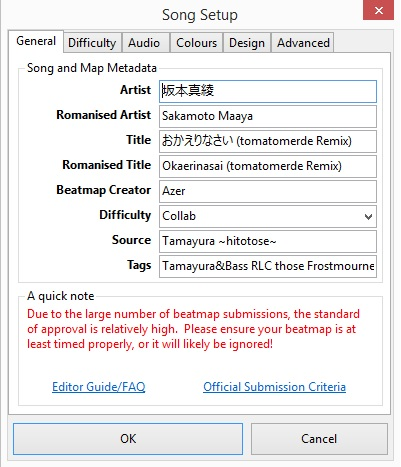

# Song Setup

**Настройки песни** — это раздел в [Эдиторе](/wiki/Client/Beatmap_editor), содержащий много важных параметров, которые необходимо знать, чтобы сделать хорошую карту.

## Основное

### Song and Map Meta Data

- **Artist** — **Оркестр, группа или певец, которые создали или исполнили эту песню.** osu! берет название исполнителя из mp3-файла, но пожалуйста, проверьте информацию на отсутствие грамматических и пунктуационных ошибок. Если песня из аниме или видеоигры, не ставьте сюда их название, поставьте имя человека, который спел или сделал эту песню. Возможно, вам придется поискать имя композитора песни из аниме или игры в [Википедии](https://www.wikipedia.org/) или других сайтах, таких как [AnimeNewsNetwork](https://www.animenewsnetwork.com/) или [MyAnimeList](https://myanimelist.net/). Иностранные имена должны быть написаны в том же порядке, в каком они написаны в этом языке в Википедии (например, сперва Фамилия потом Имя в русском языке).
- **Romanised Artist** - **Романское (английское) название исполнителя песни.** Должно быть написано в том же порядке, в каком оно написано в этом языке в Википедии (например, сперва Фамилия потом Имя в русском языке). Это поле становится активным при использовании символов Unicode в поле "Artist".
- **Title** — **Название песни.** osu! берет название песни из mp3-файла, но проверьте информацию на отсутствие грамматических и пунктуационных ошибок.
- **Romanised Title** - **Романское (английское) название песни.** Опять же, это поле становится активным при использовании символов Unicode в поле "Title".
- **Beatmap Creator** — **Это вы.** osu! заполняет это поле автоматически, и вы не можете редактировать его. Если вы включаете в карту так называемые "гостевые" сложности, сделанные другими людьми, их имена вписываются в названия уровней сложности (см. ниже).
- **Difficulty** — **Название сложности карты.** Выпадающий список содержит предустановленные названия: Easy, Normal, Hard, Insane. Вы можете выбрать одно из стандартных названий, или же придумать свое. Имена создателей "гостевых" сложностей вписываются сюда (например, "Larto's Hard").
- **Source** — **Здесь вы можете указать название аниме, игры или фильма - источника песни.** Не все песни требуют заполнения поля "Source". Например, для обычных рок, поп и других мелодий это поле можно оставить пустым. **Это поле не используется для названий альбомов.**
- **Tags** — **Ключевые слова для облегчения поиска.** Обычно включает в себя название альбома, имена создателей "гостевых" сложностей, название компании и другие слова, которые могут быть использованы людьми при поиске (например eroge или visual novel, если песня вашей карты основана на визуальной новелле жанра eroge). Если ваша карта содержит элементы, созданные другими людьми или совместно с другими людьми, то имена этих людей вписываются сюда. Теги разделяются друг от друга пробелом. Поле "Tags" не обязательно к заполнению, но оно очень помогает при Web-поиске на сайте и внутриигровом поиске в osu!.

Во избежание проблем, пожалуйста, убедитесь в том, что все поля (за исключением поля "Difficulty") заполнены одинаково на всех сложностях.

## Сложность

Эта вкладка позволит вам настроить сложность вашей мапы.

### HP Drain Rate

Скорость с которой ваши хит поинты будут уходить. Ваша жизнь теряется когда вы промахиваетесь и восстанавливается получив 300. Больше жизней восстанавливается если вы получили Geki (Конец комбо).

### Circle Size

Эта функция определяет размер кругов и слайдеров. Измеряется от 2 до 7. Очень маленькие круги делают карту сложнее. Чаще всего используются 4-6 размеры, 7 же используется очень редко. Вы также можете поставить размер от 0-10 через файл `.osu` но это сделает мапу не ранкуемой.

### Approach Rate

Это скорость с которой круг круга уменьшается по направлению к центру. AR показывает нам когда нужно ударить по кругу. Некоторые люди не любят высокую AR потому что это требует очень хорошие рефлексы чтобы ударить по кругу. Мод Изи (*Easy*) уменьшает AR, а мод Хард Рок (*Hard Rock*) увеличивает.

### Overall Difficulty

Этот параметр делает много вещей. Влияет на сложность спиннеров. Очень сильно влияет на точность, т. к. от большего значения проще выбить 100, 50 и мисс.

### Approximate Difficulty Rating

Суммарная оценка сложности в звездах. Если звезд много то значит карта сложная и наоборот. Чем больше звёзд у карты, тем больше будет общее количество очков, которое на ней можно набрать. Однако, это не точная оценка, это приблизительное значение основанное на ваших настройках.

## Аудио

- Default Sample Settings
  - Здесь вы можете настроить хитсаунды по своему вкусу. Если у вас есть [тайминг](/wiki/Client/Beatmap_editor/Timing) секции,которые изменяют настройки или звук, то вы не сможете настроить их здесь. Сначала вы должны нажать сброс настроек (*Reset settings*), чтобы удалить их. Большинство битмап используют тайминг секции для выбора настроек, которые вы можете найти здесь.
- Sample Set Selection
  - Здесь вы можете выбрать звучание сэмплов (*Normal*) или (*Soft*). Так же вы можете включить [пользовательский набор сэмплов](/wiki/Guides/Custom_sample_overrides)
- Sample Set Volume
  - Тут вы можете настроить громкость сэмплов. Это важно, если вы хотите слышать звуки хитсаундов ( это важная часть osu!), потому что они не должны заглушать песню.
- Test Sample Set
  - Здесь вы можете прослушать, как звучит сэмпл. Например, свисток представляет собой сочетание обычного удара и свистка.
- Audio Lead-In
  - Это настройка, в которой вы можете выставить задержку в секундах перед началом песни. Выставляется она автоматически, но может быть изменена через редактирование `.osu` файла. Задержка используется тогда, когда карта стартует слишком быстро для игроков.

## Основные настройки

Здесь вы можете настроить хитсаунды на ваш вкус. Также можно настроить громкость хитсаундов.

## Цвета

Здесь вы можете изменить цвета своих кругов. Эта вкладка является важной частью мапы. Может быть использовано до 8 цветов, хотя большинство карт используют 3-4. Нажатие на кнопку *Remove Combo Colour* (Удалить комбо-цвет) удалит один из цветов (кэп).

Другая часть этого окна позволяет настроить цвет игрового поля.

## Сторибординг

Эта вкладка содержит опции, позволяющие добавлять визуальные эффекты вашей карте. Первое - это добавление отсчета перед началом песни, как в официальной версии. Также вы можете изменить скорость и задержку отсчета. К тому же можно выбрать опцию *Letterbox during breaks*, которая добавляет горизонтальные полосы во время паузы (используется по умолчанию). Следующий параметр сториборда добавляет комбо-огонь, который показывается во время карты. Последняя настройка позволяет добавить предупреждение об элементах, способных вызвать эпилептические припадки. Внизу вы можете выбрать скин, который будет использоваться, если он имеется на компьютере пользователя. Если же у него нет данного скина, то он получит всплывающее уведомление, но большинство людей просто вкладывает скин, как часть карты, так что этот параметр используется редко.

## Продвинутые настройки

## Смягчения стака

Осу! автоматически стакает ноты в некоторых местах и делает их ближе.

## Режим сложности

Здесь вы можете выбрать в каком стиле делать сложность: [Тайко](/wiki/Game_mode/osu!taiko), [КтБ](/wiki/Game_mode/osu!catch), [Мания](/wiki/Game_mode/osu!mania) или Осу.
