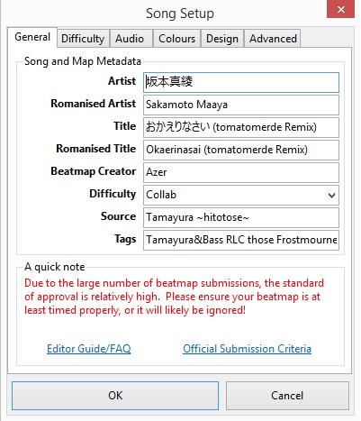
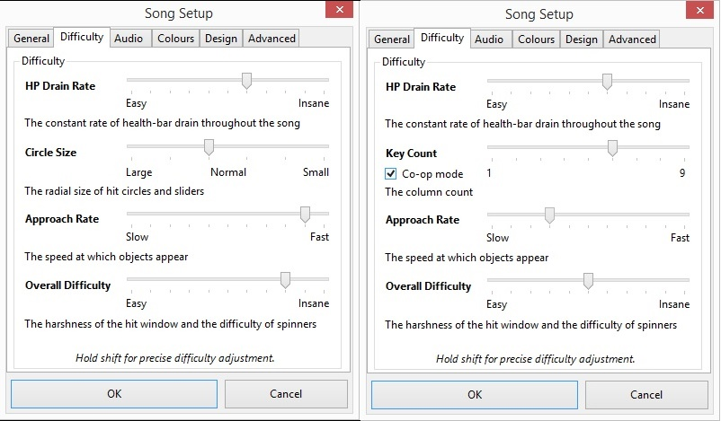
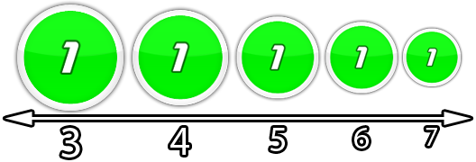
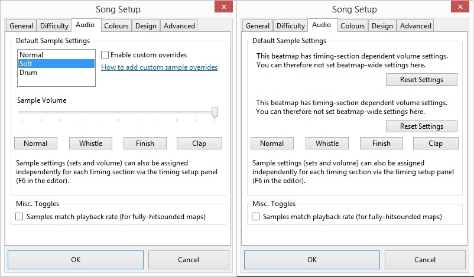
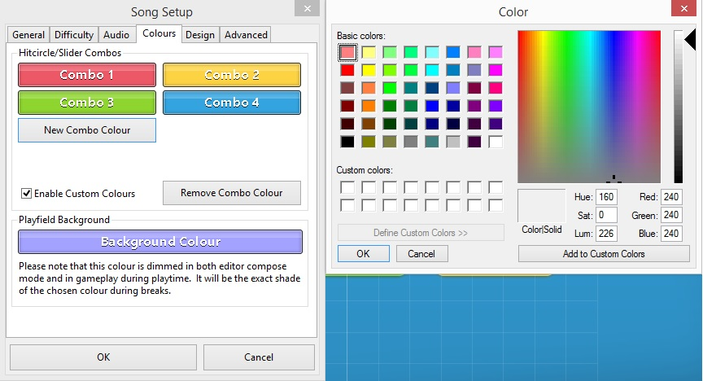
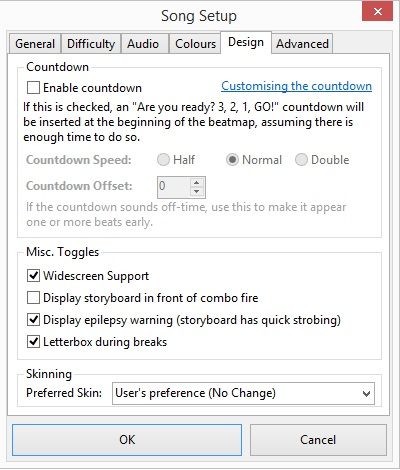
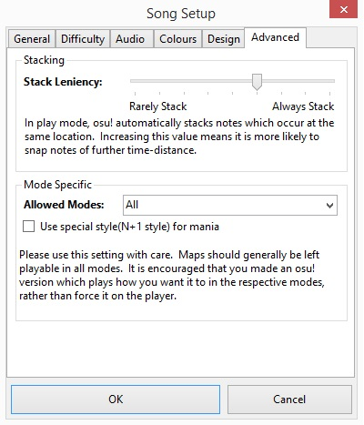

# Окно Song setup

Окно **Song setup** — четвёртый раздел [редактора карт](/wiki/Client/Beatmap_editor), в котором собраны метаданные карты, настройки сложности и оформления, а также ряд других параметров.

## General

На вкладке `General` указывается информация, которая помогает игрокам не только найти карту, но и узнать чуть больше о самой песне. Метаданные должны быть взяты из [первоисточника](/wiki/Beatmap/Primary_metadata_source), а если карта проходит [процедуру ранкинга](/wiki/Beatmap_ranking_procedure), то ещё и следовать [критериям ранкинга](/wiki/Ranking_criteria/Metadata).

| Поле | Описание |
| :-- | :-- |
| `Artist` | Группа, певец, композитор или коллектив, исполнившие или написавшие песню. |
| `Romanised Artist` | Романизированное имя исполнителя. *Примечание: поле доступно для редактирования, только если в поле `Artist` есть символы Unicode.* |
| `Title` | Название песни. |
| `Romanised Title` | Романизированное название песни. *Примечание: поле доступно для редактирования, только если в поле `Title` есть символы Unicode.* |
| `Beatmap Creator` | Ник [автора карты](/wiki/Beatmap/Beatmap_host). Авторов [гостевых сложностей](/wiki/Beatmap/Guest_difficulty) нужно указывать не здесь, а в тегах. |
| `Difficulty` | Название сложности, которое должно отражать её содержание. Оно может указывать на [участие гостевого маппера](/wiki/Beatmap/Guest_difficulty), следовать одной из [стандартных схем](/wiki/Ranking_criteria/Difficulty_naming) названий, или быть [произвольным](/wiki/Ranking_criteria#правила.1). |
| `Source` | Медиа, откуда взята песня: например, видеоигра или фильм. Заполнять не обязательно. |
| `Tags` | Ключевые слова для поиска, перечисленные через пробел. Сюда можно вписать всё, что относится к карте или песне: название альбома, имена гостевых мапперов, жанр и т.д. |

## Difficulty

::: alert-notice
**Внимание**
Для рекомендуемых настроек разных сложностей см. [критерии ранкинга](/wiki/Ranking_criteria) для каждого режима игры.
:::

На вкладке `Difficulty` собраны параметры, которые в целом определяют, насколько трудна карта и каких навыков она требует от игроков: чем выше значения, тем сложнее. На все перечисленные здесь значения могут влиять [моды](/wiki/Gameplay/Game_modifier). Обычно о параметрах говорят с использованием сокращений, например, «CS 4» — карта с соответствующим размером нот.

Значения меняются с шагом 1, но если зажать `Shift`, точность повысится до 0,1.

### HP drain rate

::: alert-note
**Основная статья:** [HP drain rate](/wiki/Beatmap/HP_drain_rate)
:::

HP drain rate (HP) определяет, сколько здоровья игрок получает за точные [попадания](/wiki/Gameplay/Judgement) и сколько теряет за неточные. В osu! и osu!catch этот параметр также отвечает за скорость [потери здоровья](/wiki/Beatmap/HP_drain_rate). Чем выше значение, тем меньше восстановление и тем сильнее потери при промахе.

### Circle size

::: alert-note
**Основная статья:** [Circle size](/wiki/Beatmap/Circle_size)
:::

Circle size (CS) задаёт размер игровых объектов в osu! и osu!catch: чем выше значение, тем меньше объекты. В редакторе CS ограничен диапазоном от 2 до 7, но это ограничение можно обойти, если поправить [файл `.osu`](/wiki/Client/File_formats/osu_(file_format)) вручную. В osu!taiko размер нот ни на что не влияет.

В картах, [предназначенных только для osu!mania](#allowed-modes), вместо размера нот настраивается число клавиш (обозначается буквой K: например, 4K — четыре клавиши), которое определяет количество колонок на игровом поле. Флажок `Co-op mode` удваивает выбранное значение (начиная с 5), что даёт 10K (5), 12K (6), 14K (7), 16K (8) и 18K (9).

### Approach rate

::: alert-note
**Основная статья:** [Approach rate](/wiki/Beatmap/Approach_rate)
:::

Approach rate (AR) определяет, как долго объекты в osu! и osu!catch находятся на экране с момента их появления и до нажатия или поимки. Чем выше значение, тем позднее появляются объекты и тем меньше времени остаётся на реакцию.

Этот параметр не влияет на osu!taiko и osu!mania — вместо него в обоих режимах используется скорость прокрутки, которая зависит от [темпа](/wiki/Music_theory/Tempo) песни и [скорости слайдеров](/wiki/Gameplay/Hit_object/Slider/Slider_velocity).

### Overall difficulty

::: alert-note
**Основная статья:** [Overall difficulty](/wiki/Beatmap/Overall_difficulty)
:::

::: alert-notice
**Примечание:** на [страницах с информацией о карте](/wiki/Beatmap_information) этот параметр называется `Точность`.
:::

Overall difficulty (OD) отвечает за интервал окна для попаданий, то есть насколько трудно набрать высокую точность. Чем выше OD, тем меньше будут окна попадания и тем точнее нужно попадать в ритм. Поскольку от точности зависит и восстановление здоровья, этот параметр косвенно влияет на то, насколько трудно пройти карту.

Если у карты в osu! низкий OD и высокий [темп](/wiki/Music_theory/Tempo), то соседние окна попадания могут пересечься и вызвать [нотлок](/wiki/Gameplay/Judgement/Notelock). В этом случае на второй объект в принципе нельзя будет нажать, пока не закончится окно первого объекта. Из-за этого одна ошибка может привести к цепочке промахов, а игрок может провалить прохождение карты.

Повышение OD в разных режимах игры также влияет на следующее:

- osu!: спиннеры нужно крутить быстрее, вплоть до того, что иногда почти невозможно успеть их пройти.
- osu!taiko: денден (спиннер) нужно нажимать больше раз.
- osu!mania и osu!catch: OD ни на что не влияет.

## Audio

На вкладке `Audio` можно настроить [хитсаунды](/wiki/Beatmapping/Hitsound) сразу для всей карты, если в ней ещё нет настроек звука через тайминг. Большинство мапперов почти никогда не пользуются этой вкладкой, а настраивают хитсаунды для отдельных участков карты с помощью [зелёных тайминг-секций](/wiki/Client/Beatmap_editor/Timing#зелёные-тайминг-секции), поскольку они позволяют добиться большей гибкости. В этом случае верхняя часть вкладки становится недоступной, а кнопка `Reset Settings` сбросит все имеющиеся настройки громкости у тайминг-секций.

| Название | Описание |
| :-- | :-- |
| Наборы хитсаундов: `Normal/Soft/Drum` | Выбрать один из встроенных [наборов хитсаундов](/wiki/Beatmapping/Sampleset). |
| `Enable custom overrides` | Использовать [нестандартные хитсаунды](/wiki/Guides/Custom_sample_overrides) вместо обычных. |
| `Sample Volume` | Настроить громкость хитсаундов во всей карте сразу. |
| Кнопки хитсаундов | Прослушать выбранные хитсаунды. |
| `Samples match playback rate` | Менять высоту и темп хитсаундов при изменении скорости карты (как в редакторе, так и во время игры). |

## Colours

На вкладке `Colours` настраиваются [комбо-цвета](/wiki/Beatmapping/Combo_colour). В прошлых версиях игры здесь также можно было поменять цвет фона игрового поля, но сейчас эта функциональность уже не используется.

Во время игры каждое [новое комбо](/wiki/Beatmapping/New_combo) меняет цвета объектов, по умолчанию — в заданном в редакторе порядке. По этой причине важно не только расставлять комбо в соответствии с песней, но и подбирать комбо-цвета, которые сочетаются с фоном и не мешают разглядеть объекты. Порядок цветов можно задать и вручную; этот приём называется [цветовым хаком](/wiki/Beatmapping/Colourhaxing).

Комбо-цвета работают только в osu! и osu!catch.

| Название | Описание |
| :-- | :-- |
| `Combo 1..8` | Комбо-цвета, которые по очереди сменяют друг друга во время игры. Нажмите на нужную кнопку, чтобы выбрать цвет в системном диалоге. |
| `Enable Custom Colours` | Если флажок снят, будут использованы стандартные комбо-цвета активного скина. |
| `New Combo Colour` | Добавить в набор ещё один цвет. |
| `Remove Combo Colour` | Убрать из набора последний цвет. |
| `Background Colour` | Изменить цвет игрового поля, у которого не задан фон. |

## Design

На вкладке `Design` собраны настройки, которые влияют на визуальное оформление карты.

| Название | Описание |
| :-- | :-- |
| `Enable countdown` | Включить [обратный отсчёт](/wiki/Beatmap/Countdown) перед началом карты. |
| `Countdown Speed` | Скорость обратного отсчёта. `Half` — отсчёт занимает 8 [долей](/wiki/Music_theory/Beat), `Normal` — 4 доли, `Double` — 2 доли. |
| `Countdown Offset` | На сколько долей раньше должен начаться отсчёт. |
| `Widescreen Support` | Убрать [чёрные полосы](https://en.wikipedia.org/wiki/Pillarbox) по бокам игрового поля, если соотношение сторон экрана больше `4:3`. Эту настройку обычно выключают, только если карта или сториборд сделаны под 4:3. |
| `Display storyboard in front of combo fire` | Показывать [сториборд](/wiki/Storyboard) поверх [комбо-пламени](/wiki/Gameplay/Combo_fire). *Примечание: настройка устарела, поскольку комбо-пламя убрали из игры.* |
| `Display epilepsy warning` | Показывать перед началом карты предупреждение об эпилепсии, если в видео или сториборде есть быстро мигающие эффекты. |
| `Letterbox during breaks` | Закрывать [чёрными полосами](https://ru.wikipedia.org/wiki/Леттербоксинг) верхнюю и нижнюю части фона во время [перерывов](/wiki/Beatmap/Break). *Примечание: эта настройка запрещена в картах, предназначенных только для osu!mania.* |
| `Preferred skin` | Автоматически переключаться на указанный скин при запуске карты. Если он у игрока не установлен, то будет показано предупреждение, а карта запустится с текущим активным скином. *Примечание: вместо этого лучше положить нужные элементы скина прямо в папку с картой.* |

## Advanced

### Stack leniency

::: alert-note
**Основная статья:** [Stack leniency](/wiki/Beatmap/Stack_leniency)
:::

Stack leniency — параметр исключительно для режима osu!, который влияет на поведение объектов в стеке. Обычно [слайдеры](/wiki/Gameplay/Hit_object/Slider) и [ноты](/wiki/Gameplay/Hit_object/Hit_circle), расположенные близко друг к другу во времени, автоматически собираются в [стек](/wiki/Beatmapping/Mapping_techniques/Stack) и немного сдвигаются, если поставлены в одну и ту же точку. Это сделано для того, чтобы игрокам было проще разглядеть [накладывающиеся](/wiki/Beatmapping/Mapping_techniques/Overlap) друг на друга объекты.

Значение stack leniency задаёт максимальное время между объектами, при котором они ещё собираются в [стек](/wiki/Beatmapping/Mapping_techniques/Stack). Чем оно выше, тем дальше во времени друг от друга могут находиться объекты, которые будут сложены в стек.

### Allowed Modes

Список `Allowed Modes` нужен для создания сложностей osu!taiko, osu!catch или osu!mania. Любое значение, кроме `All`, ограничит игру одним указанным режимом.

Флажок `Use special style (N+1 style) for mania` ни на что не влияет, поскольку игрок может выбрать привычный ему стиль игры в [настройках](/wiki/Client/Options) с помощью кнопки `osu!mania layout`.

## Факты

- Раньше вкладка `Design` называлась `Storyboarding`.
- На вкладке `Difficulty` когда-то была приблизительная оценка сложности, называвшаяся `Approximate Difficulty Rating`, где большее число звёзд означало более трудную карту. Позже её заменили на подпись о том, что параметры сложности можно более тонко настраивать с помощью `Shift`.
