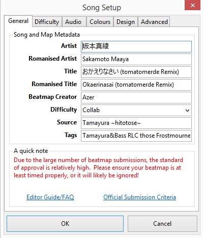
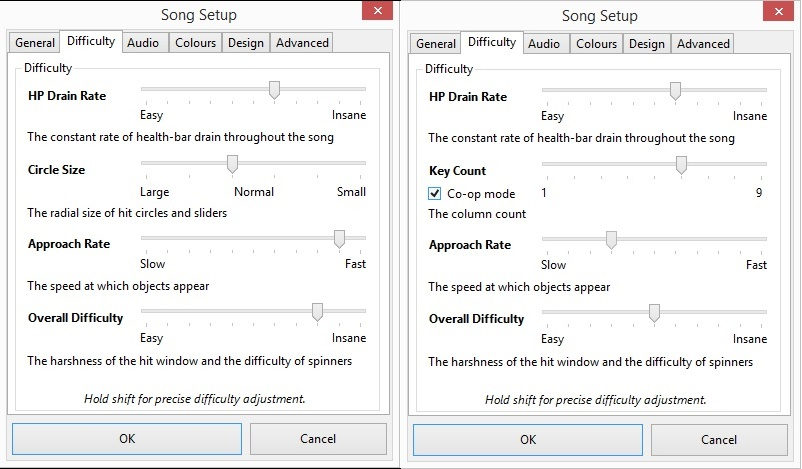
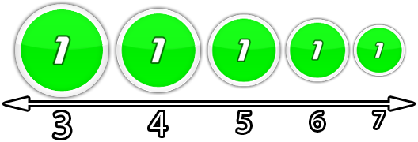
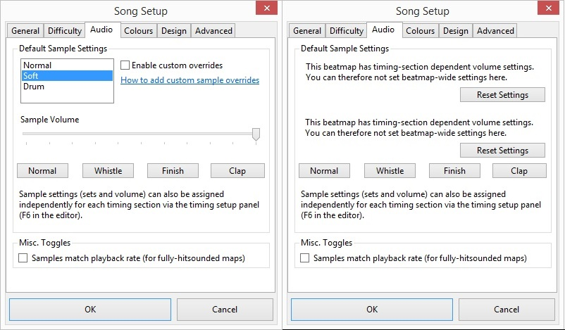
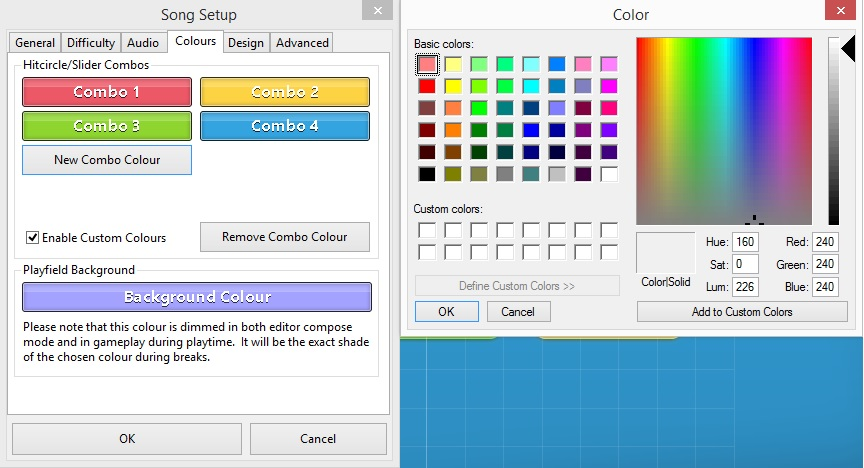
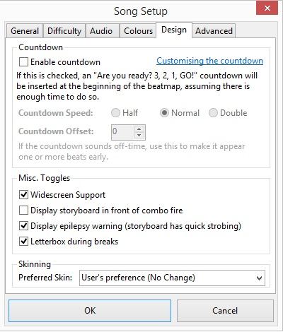
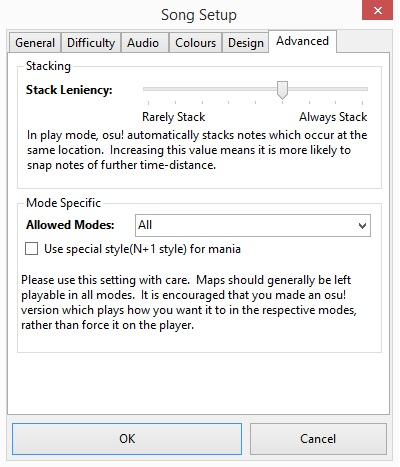

# หน้าต่างการตั้งค่าเพลง (Song setup window)

{#advanced}
{#difficulty}
{#general}
{#mode-specific}

หน้าต่าง **Song setup** (การตั้งค่าเพลง) เป็นส่วนที่สี่ของ [ตัวแก้ไข Beatmap (Beatmap editor)](/wiki/Client/Beatmap_editor) ซึ่งประกอบด้วยข้อมูล Metadata ของ Beatmap, การตั้งค่าความยากและการออกแบบ รวมถึงตัวเลือกอื่นๆ ที่เกี่ยวข้อง

## General (ทั่วไป)

แถบ `General` ให้ข้อมูลที่ช่วยให้ผู้เล่นไม่เพียงแต่ค้นหา Beatmap เจอเท่านั้น แต่ยังช่วยให้รู้จักเพลงนั้นมากขึ้นด้วย Metadata ที่ระบุที่นี่ต้องนำมาจาก [แหล่งข้อมูล Metadata หลัก](/wiki/Beatmap/Primary_metadata_source) ของเพลงนั้น และหากเป็น Beatmap ที่ต้องการจะจัดอันดับ จะต้องปฏิบัติตาม [เกณฑ์การพิจารณา Metadata](/wiki/Ranking_criteria/Metadata)

| ช่องข้อมูล | ความหมาย |
| :-- | :-- |
| `Artist` | วงดนตรี, นักร้อง, ผู้ประพันธ์ หรือกลุ่มที่แสดงหรือสร้างสรรค์เพลงนี้ |
| `Romanised Artist` | ชื่อศิลปินในรูปแบบตัวอักษรโรมัน *หมายเหตุ: แก้ไขได้เฉพาะเมื่อช่อง Artist มีตัวอักษร Unicode เท่านั้น* |
| `Title` | ชื่อเพลง |
| `Romanised Title` | ชื่อเพลงในรูปแบบตัวอักษรโรมัน *หมายเหตุ: แก้ไขได้เฉพาะเมื่อช่อง Title มีตัวอักษร Unicode เท่านั้น* |
| `Beatmap Creator` | ชื่อผู้ใช้ของ [โฮสต์ของ Beatmap (Beatmap host)](/wiki/Beatmap/Beatmap_host) สำหรับชื่อของเกสต์แมปเปอร์ควรระบุในแท็กแทน |
| `Difficulty` | ชื่อของระดับความยาก ซึ่งควรสะท้อนถึงเนื้อหาภายใน อาจระบุ [ชื่อเกสต์แมปเปอร์](/wiki/Beatmap/Guest_difficulty), ใช้ [ชื่อมาตรฐาน](/wiki/Ranking_criteria/Difficulty_naming) หรือ [ชื่อที่ตั้งเอง](/wiki/Ranking_criteria#rules.1) |
| `Source` | (ระบุหรือไม่ก็ได้) สื่อต้นฉบับของเพลง เช่น ชื่อวิดีโอเกมหรือภาพยนตร์ |
| `Tags` | คำสำคัญสำหรับการค้นหา แยกจากกันด้วยการเว้นวรรค อาจประกอบด้วยสิ่งที่เกี่ยวข้องกับแมพหรือเพลง เช่น ชื่ออัลบั้ม, ชื่อเกสต์แมปเปอร์ หรือแนวเพลง |

## Difficulty (ความยาก)

*หมายเหตุ: [เกณฑ์การพิจารณา (Ranking criteria)](/wiki/Ranking_criteria) ของแต่ละโหมดเกมจะมีค่าแนะนำสำหรับทุกระดับความยากระบุไว้*

แถบ `Difficulty` ประกอบด้วยการตั้งค่าที่ส่งผลต่อความยากและทักษะที่จำเป็นในการเล่น ยิ่งค่าสูงความยากก็จะยิ่งเพิ่มขึ้น ค่าทั้งหมดนี้อาจได้รับผลกระทบจาก [Mod ต่างๆ (Game modifiers)](/wiki/Gameplay/Game_modifier) การเรียกชื่อการตั้งค่าเหล่านี้นิยมใช้ชื่อย่อตามด้วยค่าที่ตั้งไว้ เช่น "CS 4"

คุณสามารถปรับค่าได้อย่างละเอียดครั้งละ 0.1 โดยการกดปุ่ม `Shift` ค้างไว้ในขณะที่ปรับ แทนการปรับทีละ 1 ตามปกติ

### HP drain rate

*บทความหลัก: [HP drain rate](/wiki/Beatmap/HP_drain_rate)*

HP drain rate (HP) กำหนดปริมาณพลังชีวิตที่จะได้รับคืนหรือความเสียหายจากการกด [โน้ต](/wiki/Gameplay/Judgement) ทั้งที่กดได้แม่นยำหรือกดพลาด ในโหมด osu! และ osu!catch ค่านี้ยังส่งผลต่อ [อัตราการลดของพลังชีวิตตามธรรมชาติ](/wiki/Beatmap/HP_drain_rate) อีกด้วย ยิ่งค่าสูงจะยิ่งได้รับพลังชีวิตคืนน้อยลงและมีการลงโทษที่หนักขึ้นเมื่อกดพลาด

### Circle size

*บทความหลัก: [Circle size](/wiki/Beatmap/Circle_size)*

Circle size (CS) กำหนดขนาดของ Hit objects ในโหมด osu! และ osu!catch โดยยิ่งค่าสูงวัตถุก็จะยิ่งมีขนาดเล็กลง แม้ว่าตัวแก้ไขจะจำกัดค่าไว้ที่ 2 ถึง 7 แต่คุณสามารถก้าวข้ามขีดจำกัดนี้ได้โดยการแก้ไขไฟล์ [`.osu`](/wiki/Client/File_formats/osu_(file_format)) ด้วยตนเอง ค่า CS ไม่มีผลในโหมด osu!taiko

สำหรับแมพเฉพาะโหมด [osu!mania](#mode-specific) ค่า Circle size จะถูกแทนที่ด้วยจำนวนปุ่ม (Key count) (แทนด้วย K เช่น 4K คือ 4 ปุ่ม) ซึ่งจะเป็นตัวกำหนดจำนวนแถวในสนามเล่น หากติ๊กช่อง `Co-op mode` จำนวนปุ่มที่เลือกอยู่จะเพิ่มเป็นสองเท่า (ตั้งแต่ 5 ปุ่มขึ้นไป) กลายเป็น 10K (5), 12K (6), 14K (7), 16K (8) และ 18K (9)

### Approach rate

*บทความหลัก: [Approach rate](/wiki/Beatmap/Approach_rate)*

Approach rate (AR) ระบุว่าวัตถุในโหมด osu! และ osu!catch จะปรากฏบนหน้าจอนานแค่ไหนนับตั้งแต่เริ่มปรากฏจนถึงเวลาที่ต้องกดหรือเก็บ ยิ่งค่าสูงระยะเวลาในการมองเห็นจะยิ่งสั้นลงและมีเวลาตอบสนองน้อยลง

โหมด osu!taiko และ osu!mania จะไม่ได้รับผลกระทบจากค่า AR โดยทั้งสองโหมดจะใช้ความเร็วในการเลื่อน (Scroll speed) ซึ่งขึ้นอยู่กับค่า [BPM](/wiki/Music_theory/Tempo) และ [Slider velocity](/wiki/Gameplay/Hit_object/Slider/Slider_velocity) ของเพลงแทน

### Overall difficulty

*บทความหลัก: [Overall difficulty](/wiki/Beatmap/Overall_difficulty)*\
*หมายเหตุ: ใน [หน้าข้อมูล Beatmap](/wiki/Beatmap_information) ค่า Overall difficulty จะถูกระบุว่า `Accuracy`*

Overall difficulty (OD) ควบคุมขนาดของช่วงเวลาการกด (Hit windows) ซึ่งกำหนดว่าการจะทำความแม่นยำสูงๆ นั้นยากเพียงใด ยิ่งค่า OD สูง ช่วงเวลาในการกดจะยิ่งสั้นลง ทำให้ต้องใช้ความแม่นยำและความเป๊ะมากขึ้น เนื่องจากความแม่นยำมีผลต่อการเพิ่ม HP ค่า OD จึงส่งผลทางอ้อมต่อการเล่นให้ผ่านแมพด้วย

การตั้งค่า OD ต่ำในแมพ osu! ที่มีค่า [BPM](/wiki/Music_theory/Tempo) สูง อาจทำให้ช่วงเวลาการกดของโน้ตที่อยู่ติดกันซ้อนทับกันและเกิดระบบ [Notelock](/wiki/Gameplay/Judgement/Notelock) ซึ่งจะทำให้วัตถุชิ้นถัดไปกดไม่ติดจนกว่าช่วงเวลาของชิ้นก่อนหน้าจะผ่านไป ส่งผลให้การกดพลาดเพียงโน้ตเดียวอาจทำให้พลาดต่อเนื่องและเล่นไม่ผ่านแมพได้

ผลกระทบเพิ่มเติมจากการเพิ่มค่า OD ในแต่ละโหมด:

- osu!: ต้องหมุน Spinner ให้รวดเร็วขึ้นเพื่อให้เกจเต็ม จนถึงระดับที่แทบจะเป็นไปไม่ได้ที่จะหมุนทันเวลา
- osu!taiko: ตัว Denden (Spinner ของ Taiko) จะต้องการจำนวนการตีที่มากขึ้น
- osu!mania และ osu!catch จะไม่ได้รับผลกระทบจากค่า OD

## Audio (เสียง)

แถบ `Audio` ช่วยให้คุณสามารถตั้งค่า [Hitsounds](/wiki/Beatmapping/Hitsound) สำหรับทั้งแมพได้ในครั้งเดียว หากแมพนั้นไม่มีการปรับแต่งเสียงแยกย่อย แต่โดยส่วนใหญ่ Mapper มักจะชอบควบคุมเสียงอย่างละเอียดในแต่ละส่วน ดังนั้นพวกเขาจึงมักข้ามแถบนี้ไปและไปตั้งค่าผ่าน [จุดจังหวะ (Timing sections)](/wiki/Client/Beatmap_editor/Timing#inherited-timing-point) หลายๆ จุดแทน ในกรณีนี้ ส่วนบนของแถบจะใช้งานไม่ได้ และการคลิกปุ่ม `Reset Settings` จะเป็นการลบการปรับแต่งระดับความดังทั้งหมดที่ตั้งไว้ในจุดจังหวะออก

| แผงควบคุม | ผลลัพธ์ |
| :-- | :-- |
| Samplesets: `Normal/Soft/Drum` | เลือกชุดตัวอย่างเสียง [Sampleset](/wiki/Beatmapping/Sampleset) พื้นฐานที่มีมาให้ |
| `Enable custom overrides` | ใช้ [Hitsound ที่กำหนดเอง](/wiki/Guides/Custom_sample_overrides) แทนชุดเสียงพื้นฐาน |
| `Sample Volume` | ปรับระดับความดังของ Hitsound ทั้งหมดในภาพรวม |
| ปุ่ม Hitsound | ทดลองฟังเสียง Hitsound ที่จะนำมาใช้งาน |
| `Samples match playback rate` | ปรับระดับเสียง (Pitch) และความเร็วของ Hitsound ตามความเร็วการเล่นของแมพ (ทั้งในตัวแก้ไขและในเกม) |

## Colours (สีสัน)

แถบ `Colours` ใช้สำหรับตั้งค่า [สีคอมโบ (Combo colours)](/wiki/Beatmapping/Combo_colour) ในตัวเกมเวอร์ชันเก่า สีพื้นหลังของสนามเล่นสามารถปรับแต่งได้ที่นี่เช่นกัน แต่ปัจจุบันฟีเจอร์นี้ไม่มีผลใดๆ แล้ว

ในระหว่างการเล่น สีของ Hit objects จะวนไปตามลำดับที่กำหนดไว้ โดยจะเปลี่ยนสีเมื่อเริ่ม [คอมโบใหม่ (New combo)](/wiki/Beatmapping/New_combo) ดังนั้นสิ่งสำคัญคือไม่เพียงแต่ต้องวางคอมโบให้ตรงตามเพลง แต่ต้องเลือกสีคอมโบที่เข้ากับภาพพื้นหลังและช่วยให้มองเห็นโน้ตได้ชัดเจน คุณสามารถกำหนดลำดับสีด้วยตนเองในขณะทำแมพได้ ซึ่งเรียกว่า [Colourhaxing](/wiki/Beatmapping/Colourhaxing)

สีคอมโบจะมีผลเฉพาะในโหมด osu! และ osu!catch เท่านั้น

| แผงควบคุม | การทำงาน |
| :-- | :-- |
| `Combo 1..8` | วนรอบตามสีคอมโบที่กำหนดในระหว่างการเล่น คลิกที่ปุ่มสีเพื่อเลือกสีใหม่จากหน้าต่างเลือกสีของระบบปฏิบัติการ |
| `Enable Custom Colours` | หากไม่ติ๊กเลือก จะเป็นการใช้สีคอมโบเริ่มต้นจาก Skin ที่ใช้งานอยู่แทน |
| `New Combo Colour` | เพิ่มสีใหม่เข้าไปในชุด |
| `Remove Combo Colour` | ลบสีสุดท้ายออกจากชุด |
| `Background Colour` | เปลี่ยนสีของสนามเล่นในส่วนที่ว่างเปล่า |

## Design (การออกแบบ)

แถบ `Design` ประกอบด้วยการตั้งค่าต่างๆ ที่ส่งผลต่อรูปลักษณ์และความรู้สึกโดยรวมของ Beatmap

| แผงควบคุม | การทำงาน |
| :-- | :-- |
| `Enable countdown` | เปิดใช้งาน [แอนิเมชันนับถอยหลัง](/wiki/Beatmap/Countdown) ก่อนเริ่มเล่นแมพ |
| `Countdown Speed` | ปรับความเร็วการนับถอยหลัง `Half`: ใช้เวลา 8 [จังหวะเต็ม](/wiki/Music_theory/Beat), `Normal`: 4 จังหวะ, `Double`: 2 จังหวะ |
| `Countdown Offset` | กำหนดให้การนับถอยหลังเริ่มเร็วขึ้นกี่จังหวะ |
| `Widescreen Support` | นำแถบดำด้านข้างออกหากหน้าจอมีสัดส่วนกว้างกว่า `4:3` โดยปกติจะปิดไว้เฉพาะเมื่อแมพหรือ Storyboard นั้นถูกออกแบบมาสำหรับสไตล์จอแบบเก่า |
| `Display storyboard in front of combo fire` | แสดง [Storyboard](/wiki/Storyboard) บังทับหน้า [เอฟเฟกต์ไฟคอมโบ](/wiki/Gameplay/Combo_fire) *หมายเหตุ: การตั้งค่านี้ล้าสมัยแล้วเนื่องจากมีการนำไฟคอมโบออกจากเกม* |
| `Display epilepsy warning` | แสดงคำเตือนโรคลมชักก่อนเริ่มแมพ ในกรณีที่มีแสงกระพริบถี่ๆ ในวิดีโอหรือ Storyboard |
| `Letterbox during breaks` | แสดงแถบดำที่ขอบบนและล่างของพื้นหลังในช่วง [เวลาพัก (Breaks)](/wiki/Beatmap/Break) *หมายเหตุ: ไม่อนุญาตให้ใช้ในแมพเฉพาะโหมด osu!mania* |
| `Preferred skin` | สลับไปใช้ Skin ตามชื่อที่ระบุชั่วคราวเมื่อเริ่มแมพ หากไม่มีจะแสดงคำเตือนและใช้ Skin ปกติของผู้เล่นแทน *หมายเหตุ: แนะนำให้นำไฟล์ Skin ใส่ลงในโฟลเดอร์แมพโดยตรงแทน* |

### Advanced

### Stack leniency

*บทความหลัก: [Stack leniency](/wiki/Beatmap/Stack_leniency)*

Stack leniency คือการตั้งค่าเฉพาะของโหมด osu! ซึ่งส่งผลต่อพฤติกรรมการกองซ้อนของวัตถุ โดยปกติ [Slider](/wiki/Gameplay/Hit_object/Slider) และ [วงกลม](/wiki/Gameplay/Hit_object/Hit_circle) ที่วางห่างกันในเชิงเวลาไม่มากจะทำการ [กองซ้อน (Stack)](/wiki/Beatmapping/Mapping_techniques/Stack) และขยับเยื้องออกไปเล็กน้อยหากวางที่ตำแหน่งเดียวกัน เพื่อให้ผู้เล่นมองเห็นวัตถุที่ [วางซ้อนกัน (Overlapping)](/wiki/Beatmapping/Mapping_techniques/Overlap) ได้ชัดเจนขึ้น

ค่า Stack leniency ควบคุมระยะเวลาสูงสุดระหว่างวัตถุที่จะยังคงถูกพิจารณาให้กองซ้อนกัน ยิ่งค่าสูงวัตถุที่มีช่วงเวลาห่างกันมากขึ้นก็จะยังคงวางกองซ้อนกันอยู่

### Mode-specific (เฉพาะโหมด)

เมนู `Allowed Modes` ใช้สำหรับสร้างระดับความยากของโหมด osu!taiko, osu!catch หรือ osu!mania โดยการเลือกโหมดใดๆ ยกเว้น `All` จะเป็นการจำกัดให้แมพนั้นเล่นได้เฉพาะในโหมดที่ระบุเท่านั้น

ช่องติ๊ก `Use special style (N+1 style) for mania` ปัจจุบันไม่มีผลใดๆ เนื่องจากผู้เล่นสามารถตั้งค่าความชอบส่วนตัวได้ในเมนู [ตัวเลือกและการตั้งค่า (Options)](/wiki/Client/Options) ผ่านปุ่ม `osu!mania layout`

## Trivia

- แถบ `Design` เคยมีชื่อเดิมว่า `Storyboarding`
- แถบ `Difficulty` เคยมีส่วนสรุปค่าความยากโดยประมาณที่เรียกว่า `Approximate Difficulty Rating` ซึ่งยิ่งมีดาวมากจะสื่อว่าแมพนั้นยากขึ้น ภายหลังถูกแทนที่ด้วยข้อความอธิบายการใช้ปุ่ม `Shift` เพื่อปรับค่าอย่างละเอียดแทน
