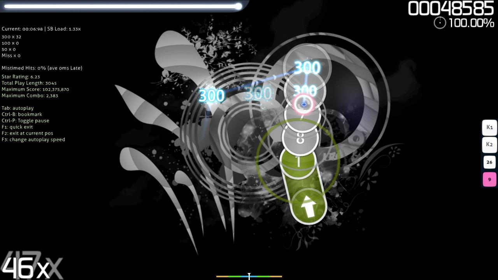

---
tags:
  - editor
  - beatmapping
  - mapping
---

# Modo de prueba

El **modo de prueba** es una función del [editor de beatmaps](/wiki/Client/Beatmap_editor) que permite a los creadores jugar sus propios [beatmaps](/wiki/Beatmap) desde el editor de beatmaps con fines de prueba. Se puede acceder al modo a través del botón `Test` en la parte inferior derecha del editor.

*Nota: Se sabe que jugar un beatmap en el modo de prueba causa cierto retraso o caídas notables en la velocidad de los fotogramas para algunos usuarios.*

Jugar a un beatmap en modo de prueba difiere de jugarlo normalmente, ya que no enviará ninguna puntuación, no mostrará ninguna tabla de clasificación, no permitirá a los usuarios fallar el beatmap y siempre mostrará la siguiente información en la parte izquierda de la pantalla:

- La [marca de tiempo](/wiki/Modding/Timestamp) actual del beatmap.
- La [carga SB](/wiki/Client/Beatmap_editor/SB_load).
- La cantidad total de 300s, 100s, 50s y fallos conseguidos.
- El porcentaje de golpes que son fuera de tiempo.
- El retraso promedio (en milisegundos) con el que se demoran los golpes fuera de tiempo.
- La [calificación por estrellas](/wiki/Beatmap/Star_rating) del beatmap.
- La duración total de juego del beatmap (en segundos).
- El máximo combo posible que un jugador puede conseguir en el beatmap.
- Varios atajos de teclado.

El modo de prueba también difiere del juego estándar de un beatmap, ya que requiere que los usuarios guarden su beatmap antes de jugar, y permite a los usuarios ver el beatmap en «juego automático», que juega el beatmap igual que lo haría el mod [Auto](/wiki/Gameplay/Game_modifier/Auto).
