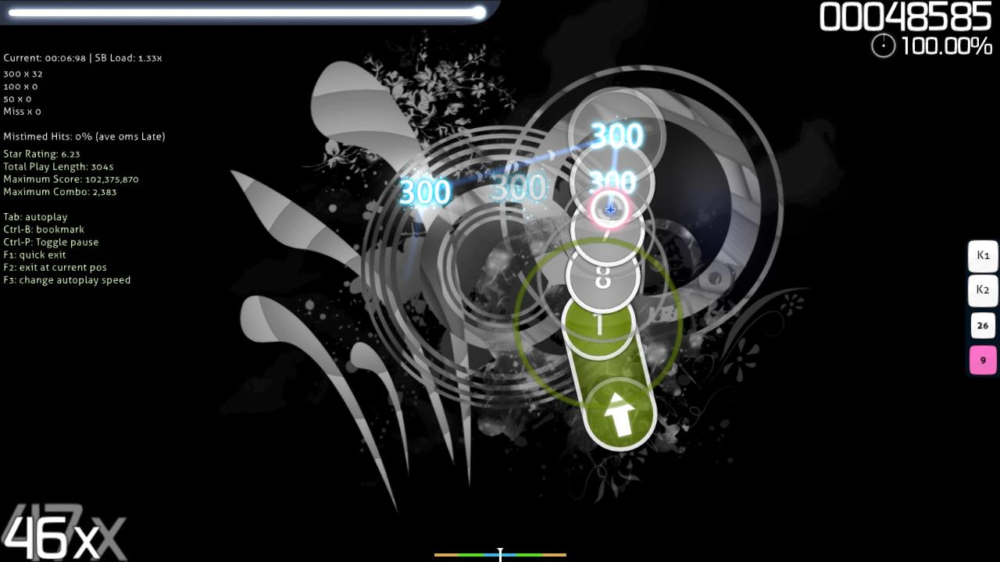

---
tags:
  - editor
  - beatmapping
  - mapping
---

# โหมดทดสอบ (Test mode)

**โหมดทดสอบ (Test mode)** คือคุณสมบัติของ [ตัวแก้ไข Beatmap (Beatmap editor)](/wiki/Client/Beatmap_editor) ที่ช่วยให้ผู้สร้างสามารถลองเล่น [Beatmap](/wiki/Beatmap) ของตนเองผ่านตัวแก้ไขเพื่อวัตถุประสงค์ในการทดสอบ คุณสามารถเข้าสู่โหมดนี้ได้โดยคลิกปุ่ม `Test` ที่มุมขวาล่างของตัวแก้ไข

*หมายเหตุ: การเล่น Beatmap ในโหมดทดสอบอาจทำให้เกิดอาการกระตุกหรือเฟรมเรตตกลงอย่างเห็นได้ชัดสำหรับผู้ใช้บางราย*

การเล่น Beatmap ในโหมดทดสอบจะแตกต่างจากการเล่นตามปกติ คือ จะไม่มีการส่งคะแนนขึ้นระบบออนไลน์, ไม่มีการแสดงตารางคะแนน, ผู้เล่นจะไม่เล่นพลาดจนจบเกม (No fail) และจะมีการแสดงข้อมูลต่อไปนี้ทางด้านซ้ายของหน้าจอเสมอ:

- ตำแหน่งเวลาปัจจุบัน ([Timestamp](/wiki/Modding/Timestamp)) ของ Beatmap
- ค่า [SB load](/wiki/Client/Beatmap_editor/SB_load)
- จำนวนรวมของคะแนน 300, 100, 50 และ Miss ที่ทำได้
- เปอร์เซ็นต์ของการกดที่ผิดจังหวะ
- ค่าเฉลี่ยของความล่าช้า (หน่วยมิลลิวินาที) ของการกดที่ผิดจังหวะ
- [ระดับดาว (Star rating)](/wiki/Beatmap/Star_rating) ของ Beatmap
- เวลาเล่นรวมของ Beatmap (หน่วยวินาที)
- จำนวนคอมโบสูงสุดที่ทำได้ในแมพนี้
- ปุ่มลัดควบคุมต่างๆ

นอกจากนี้ โหมดทดสอบยังกำหนดให้ผู้ใช้ต้องบันทึก Beatmap ก่อนเริ่มเล่น และอนุญาตให้ผู้ใช้รับชม Beatmap ในโหมด "Autoplay" ซึ่งตัวเกมจะเล่นให้โดยอัตโนมัติเหมือนกับการใช้ Mod [Auto](/wiki/Gameplay/Game_modifier/Auto)
