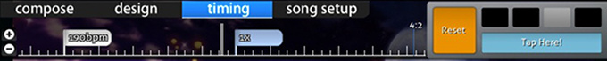

# Beatmap editor timelines

In the [beatmap editor](/wiki/Client/Beatmap_editor), there are three different timelines that a mapper may encounter. This article will explain how each of them function.

## Shortcuts

*For a list of keyboard shortcuts for the timeline, see: [Shortcut key reference](/wiki/Client/Keyboard_shortcuts)*

## Song Player

The song player is visible in any part of the beatmap editor.

On the left, there is the timestamp in milliseconds and the song duration percentage. The percentage may display `intro` or `outro` if there is storyboarding before or after the song.

In the centre, it shows the timeline with markings and the compulsory music player buttons. The `Test` button will save your beatmap then will start play-testing it starting from the current timestamp.

The timeline itself uses a few tick marks that have various meanings.

| Colour | Description |
| :-- | :-- |
| White (long) | Current timestamp |
| Yellow (long tick) | Preview point |
| Yellow (up tick) | Start of drain time |
| Green (up tick) | Inherited points (See [Timing](/wiki/Client/Beatmap_editor/Timing)) |
| Red (up tick) | Timing points (See [Timing](/wiki/Client/Beatmap_editor/Timing)) |
| Blue (down tick) | Bookmarks |
| Grey (highlight) | Break time |
| Orange (highlight) | Kiai time |

On the right, you can adjust the playback rate from `100%`, to `75%`, `50%`, or `25%`.

## Hit Objects

There are two different kinds of hit objects timelines depending on which game mode the mapper is using.

### osu!, osu!taiko, and osu!catch

In [compose](/wiki/Client/Beatmap_editor/Compose) mode, this timeline is underneath the `Compose` tab for any game mode except for [osu!mania](/wiki/Game_mode/osu!mania).

| Name | Description |
| :-- | :-- |
| `+`/`-` buttons | Increase/Decrease timeline zoom. |
| Double white vertical lines | This shows the current timestamp with respect to the hit object timeline. |

Left clicking on a hit object will select it and dragging will move the selected hit object against timeline.

Right clicking will remove the selected hit objects.

### osu!mania

In compose mode, this timeline is in the centre of the playfield for osu!mania mode.

The box on the left is a horizontal bar chart that displays the note intensity. This acts like a timeline.

In the centre is the actual playfield. The playfield is made up of two parts: lines and notes.

| Line Colour | Description |
| :-- | :-- |
| Thick White | Full measure |
| White | Common Time |
| Green | Current timestamp/[Judgement](/wiki/Gameplay/Judgement) line |

| Note Colour | Description |
| :-- | :-- |
| Blue | Selected note(s) |
| White/Pink/Yellow | Unselected note colours |

## Design

The [design](/wiki/Client/Beatmap_editor/Design) timeline is located underneath the `Design` tab.

### Timeline

| Name | Description |
| :-- | :-- |
| `+`/`-` buttons on left | Increase/Decrease timeline zoom. |
| `Up`/`Down` arrows on bottom-left | Scroll up/down the transformation timeline (this is to reveal `Colour` or `Movement` on the timeline). |

The centre of the design timeline shows the "keyframes" of the selected sprite.

### Keyframe Control

The keyframe control adds or removes anchor points. These anchor points set the start and end times for how a sprite should be storyboarded.

| Name | Description |
| :-- | :-- |
| `+`/`-` | Add/Delete anchor points for the selected transformation. |
| `Left`/`Right` arrows | Skip backwards/forwards to the nearest anchor point of the selected transformation. |

If there is a transformation, that transformation is lighted with it's colour. In addition to this, it will have two separated half-lines that determines the duration. Full white line determines the transformation switching points (e.g. from "going up" to "going down").

## Timing

The timing timeline is located underneath the [`Timing`](/wiki/Client/Beatmap_editor/Timing) tab.

### Timing Timeline

| Name | Description |
| :-- | :-- |
| `+`/`-` buttons on left | Increase/Decrease timeline zoom. |

In the centre is the timing timeline itself. It uses white and blue flags to describe what type of timing point they are; described in the [flag colours](#flag-colours) section.

On the right, it shows the time signature script (known as a "meter") and metronome set. In the image above, the meter is at `4:2`. This means that the current timestamp is at the second beat of the fourth measure of the song.

The metronome set plays a constant tick sound at the given BPM. This doubles as a helper to estimate the BPM value of the song.

### Flag Colours

| Colour | Description |
| :-- | :-- |
| White | Timing Points. Use new BPM value. (Red on Song Timeline) |
| Blue | Inherited Points. Slider speed adjuster based on Timing Points' BPM. (Green on Song Timeline) |
