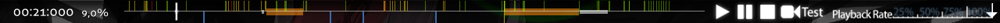
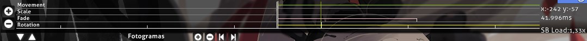
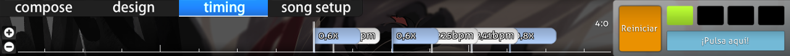

# Líneas de tiempo del editor de beatmaps

En el [editor de beatmaps](/wiki/Client/Beatmap_editor), hay tres líneas de tiempo diferentes que un mapper puede encontrar. Este artículo explicará cómo funciona cada una de ellas.

## Atajos

*Para obtener una lista de atajos de teclado para la línea de tiempo, véase: [Referencia de las teclas de acceso rápido](/wiki/Client/Keyboard_shortcuts)*

## Reproductor de canciones

El reproductor de canciones es visible en cualquier parte del editor de beatmaps.

A la izquierda, está la marca de tiempo en milisegundos y el porcentaje de duración de la canción. El porcentaje puede mostrar `intro` u `outro` si hay un storyboard antes o después de la canción.

En el centro, se muestra la línea de tiempo con las marcas y los botones necesarios para el reproductor de música. El botón `Test` guardará tu beatmap y luego comenzará a probarlo a partir de la marca de tiempo actual.

La línea de tiempo en sí usa algunas marcas que tienen varios significados.

| Color | Descripción |
| :-- | :-- |
| Blanca (larga) | Marca de tiempo actual |
| Amarilla (marca larga) | Punto de vista previa |
| Amarilla (marca en la parte superior) | Inicio del tiempo de drenaje |
| Verde (marca en la parte superior) | Puntos heredados (véase [Pestaña timing](/wiki/Client/Beatmap_editor/Timing)) |
| Roja (marca en la parte superior) | Puntos de tiempo (véase [Pestaña timing](/wiki/Client/Beatmap_editor/Timing)) |
| Azul (marca en la parte inferior) | Marcadores |
| Gris (resaltado) | Descanso |
| Naranja (resaltado) | Kiai time |

A la derecha, puedes ajustar la velocidad de reproducción entre `100%`, `75%`, `50%` o `25%`.

## Objetos

Hay dos tipos diferentes de líneas de tiempo para los objetos dependiendo del modo de juego que esté usando el mapper.

### osu!, osu!taiko y osu!catch

En el modo de [composición](/wiki/Client/Beatmap_editor/Compose), esta línea de tiempo está debajo de la pestaña `Compose` para cualquier modo de juego excepto para [osu!mania](/wiki/Game_mode/osu!mania).

| Nombre | Descripción |
| :-- | :-- |
| Botones `+`/`-` | Aumenta/disminuye el zoom de la línea de tiempo. |
| Líneas verticales blancas dobles | Esto muestra la marca de tiempo actual con respecto a la línea de tiempo del objeto. |

Al hacer clic con el botón izquierdo en un objeto, se seleccionará y al arrastrarlo se moverá el objeto seleccionado contra la línea de tiempo.

Al hacer clic con el botón derecho, se eliminarán los objetos seleccionados.

### osu!mania

En el modo de composición, esta línea de tiempo está en el centro del campo de juego de osu!mania.

El cuadro de la izquierda es un gráfico de barras horizontales que muestra la intensidad de la nota. Este actúa como una línea de tiempo.

En el centro está el campo de juego real. El campo de juego se compone de dos partes: líneas y notas.

| Color de la línea | Descripción |
| :-- | :-- |
| Blanca gruesa | Compás completo |
| Blanca | Tiempo común |
| Verde | Marca de tiempo actual/línea de [juicio](/wiki/Gameplay/Judgement) |

| Color de la nota | Descripción |
| :-- | :-- |
| Azul | Notas seleccionadas |
| Blanca/Rosa/Amarilla | Colores de las notas no seleccionadas |

## Diseño

La línea de tiempo de [diseño](/wiki/Client/Beatmap_editor/Design) se encuentra debajo de la pestaña `Design`.

### Línea de tiempo

| Nombre | Descripción |
| :-- | :-- |
| Botones `+`/`-` a la izquierda | Aumenta/disminuye el zoom de la línea de tiempo. |
| Flechas `Arriba`/`Abajo` en la parte inferior izquierda | Desplaza hacia arriba/abajo la línea de tiempo de la transformación (esto es para mostrar `Color` o `Movimiento` en la línea de tiempo). |

El centro de la línea de tiempo de diseño muestra los «fotogramas» del objeto seleccionado.

### Control de fotogramas

El control de fotogramas añade o elimina puntos de anclaje. Estos puntos de anclaje establecen los tiempos de inicio y finalización de cómo se debe crear el storyboard de un objeto.

| Nombre | Descripción |
| :-- | :-- |
| `+`/`-` | Añade/elimina puntos de anclaje para la transformación seleccionada. |
| Flechas `Izquierda`/`Derecha` | Salta hacia atrás/adelante hasta el punto de anclaje más cercano de la transformación seleccionada. |

Si hay una transformación, esa transformación se ilumina con su color. Además de esto, tendrá dos semilíneas separadas que determinarán la duración. La línea blanca completa determina los puntos de cambio de la transformación (por ejemplo, de «ir hacia arriba» a «ir hacia abajo»).

## Temporización

La línea de tiempo de la temporización se encuentra debajo de la pestaña [`Timing`](/wiki/Client/Beatmap_editor/Timing).

### Línea de tiempo de la temporización

| Nombre | Descripción |
| :-- | :-- |
| Botones `+`/`-` a la izquierda | Aumenta/disminuye el zoom de la línea de tiempo. |

En el centro se encuentra la línea de tiempo. Usa banderas blancas y azules para describir qué tipo de punto de tiempo son; se describen en la sección [colores de las banderas](#colores-de-las-banderas).

A la derecha, muestra el compás (conocido como «medidor») y el metrónomo establecido. En la imagen de arriba, el medidor está en `4:0`. Esto significa que la marca de tiempo actual está en el primer pulso del cuarto compás de la canción.

El metrónomo reproduce un sonido de tictac constante al BPM especificado. Esto también sirve de ayuda para estimar el valor del BPM de la canción.

### Colores de las banderas

| Color | Descripción |
| :-- | :-- |
| Blanca | Puntos de tiempo. Usa un nuevo valor para el BPM. (Líneas rojas en la línea de tiempo de la canción) |
| Azul | Puntos heredados. Velocidad de los sliders ajustada en función del BPM de los puntos de tiempo. (Líneas verdes en la línea de tiempo de la canción) |
