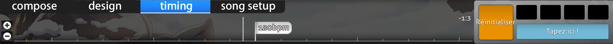

# Timeline de l'éditeur de beatmap

Dans l'[éditeur de beatmap](/wiki/Client/Beatmap_editor), il existe trois timelines différentes qu'un mappeur peut rencontrer. Cet article explique le fonctionnement de chacune d'entre elles.

## Raccourcis

*Pour une liste de raccourcis clavier pour la timeline, voir : [Référence des raccourcis clavier](/wiki/Client/Keyboard_shortcuts)*

## Lecteur de morceaux

Le lecteur de morceaux est visible dans n'importe quelle partie de l'éditeur de beatmap.

A gauche, il y a l'horodatage en millisecondes et le pourcentage de la durée du morceau. Le pourcentage peut afficher `intro` ou `outro` s'il y a du storyboarding avant ou après la musique.

Au centre, il montre la timeline avec les signets et les boutons obligatoires du lecteur de morceaux. Le bouton `Test` sauvegardera votre beatmap puis commencera à la tester à partir du timestamp actuel.

La timeline elle-même utilise quelques coches qui ont diverses significations.

| Couleur | Description |
| :-- | :-- |
| Blanc (long) | Horodatage actuel |
| Jaune (tick long) | Point d'aperçu |
| Jaune (tick haut) | Début du temps de drain |
| Vert (tick haut) | Points hérités (Voir [Timing](/wiki/Client/Beatmap_editor/Timing)) |
| Rouge (tick haut) | Points de timing (Voir [Timing](/wiki/Client/Beatmap_editor/Timing)) |
| Bleu (tick bas) | Signets |
| Gris (en surbrillance) | Temps de pause |
| Orange (en surbrillance) | Kiai time |

Sur la droite, vous pouvez régler la vitesse de lecture de `100 %` à `75 %`, `50 %` ou `25 %`.

## Objets

Il existe deux types différents de timeline des objets, selon le mode de jeu utilisé par le mappeur.

### osu!, osu!taiko, et osu!catch

En mode [compose](/wiki/Client/Beatmap_editor/Compose), cette timeline se trouve sous l'onglet `Compose` pour tous les modes de jeu, sauf pour [osu!mania](/wiki/Game_mode/osu!mania).

| Nom | Description |
| :-- | :-- |
| Boutons `+`/`-` | Augmente/diminue le zoom de la timeline. |
| Double lignes verticales blanches | Cela montre l'horodatage actuel par rapport à la timeline des objets. |

Un clic gauche sur un objet le sélectionne et un glissement déplace l'objet sélectionné sur la timeline.

Un clic droit permet de supprimer les objets sélectionnés.

### osu!mania

En mode compose, cette timeline se trouve au centre du terrain de jeu pour le mode osu!mania.

La case de gauche est un graphique à barres horizontales qui affiche l'intensité de la note. Cela agit comme une timeline.

Au centre se trouve le terrain de jeu proprement dit. Le terrain de jeu est composé de deux parties : les lignes et les notes.

| Couleur de la ligne | Description |
| :-- | :-- |
| Blanc épais | Mesure complète |
| Blanc | Temps commun |
| Vert | Horodatage actuel/Ligne de [jugement](/wiki/Gameplay/Judgement) |

| Couleur de la note | Description |
| :-- | :-- |
| Bleu | Note(s) sélectionnée(s) |
| Blanc/Rose/Jaune | Couleurs de notes non sélectionnées |

## Design

La timeline [design](/wiki/Client/Beatmap_editor/Design) est située sous l'onglet `Design`.

### Timeline

| Nom | Description |
| :-- | :-- |
| Boutons `+`/`-` à gauche | Augmente/diminue le zoom de la timeline. |
| Flèches `Haut`/`Bas` en bas à gauche | Fait défiler vers le haut/bas la timeline de transformation (ceci pour révéler `Colour` ou `Movement` sur la timeline). |

Le centre de la timeline de design montre les "keyframes" du sprite sélectionné.

### Contrôle des keyframes

Le contrôle des keyframes ajoute ou supprime des points d'ancrage. Ces points d'ancrage définissent les heures de début et de fin pour la façon dont un sprite doit être storyboardé.

| Nom | Description |
| :-- | :-- |
| `+`/`-` | Ajoute/supprime des points d'ancrage pour la transformation sélectionnée. |
| Flèches `Gauche`/`Droite` | Saute en arrière/en avant vers le point d'ancrage le plus proche de la transformation sélectionnée. |

S'il y a une transformation, celle-ci est éclairée par sa couleur. De plus, elle aura deux demi-lignes séparées qui déterminent sa durée. La ligne blanche complète détermine les points de commutation de la transformation (par exemple, de "monter" à "descendre").

## Timing

La timeline du [timing](/wiki/Client/Beatmap_editor/Timing) est située sous l'onglet `Timing`.

### Timeline du Timing

| Nom | Description |
| :-- | :-- |
| Boutons `+`/`-` à gauche | Augmente/diminue le zoom de la timeline |

Au centre se trouve la timeline elle-même. Elle utilise des drapeaux blancs et bleus pour décrire le type de point temporel qu'ils représentent, comme décrit dans la section [couleurs des drapeaux](#couleurs-des-drapeaux).

Sur la droite, elle montre l'écriture de la signature temporelle (connue sous le nom de "mètre") et le réglage du métronome. Dans l'image ci-dessus, le compteur est à `4:2`. Cela signifie que la signature temporelle actuelle se trouve au deuxième temps de la quatrième mesure de la musique.

Le jeu de métronome joue un tic-tac constant au BPM donné. Il sert également d'aide pour estimer la valeur du BPM de la musique.

### Couleurs des drapeaux

| Couleur | Description |
| :-- | :-- |
| Blanc | Points de timing. Utilisez la nouvelle valeur de BPM. (Rouge sur la timeline du morceau) |
| Bleu | Points hérités. Ajusteur de vitesse du sliderbasé sur le BPM des points de timing. (Vert sur la timeline du morceau) |
