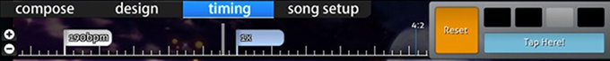

# Таймлайны редактора карт

В [редакторе карт](/wiki/Client/Beatmap_editor) есть три разные временны́е шкалы, с которыми приходится работать мапперу. В этой статье описано, как устроена каждая из них.

## Горячие клавиши

::: alert-note
**Примечание:** для списка горячих клавиш для работы со шкалами см. [Горячие клавиши](/wiki/Client/Keyboard_shortcuts)
:::

## Шкала песни

Шкала песни показывается на всех вкладках редактора карт.

Слева от шкалы указано текущее время в миллисекундах и уже прошедшее время песни в процентах. Вместо процентов может быть написано `intro` или `outro`, если до начала или после конца песни в карте ещё действует сториборд.

По центру расположена сама шкала с пометками и кнопками для управления музыкой. Кнопка `Test` сохраняет карту, а затем запускает её тестирование с текущего момента.

На шкале можно увидеть полоски разных цветов, каждый из которых имеет своё значение.

| Цвет | Описание |
| :-- | :-- |
| Белый (длинная полоска) | Текущая позиция |
| Жёлтый (длинная полоска) | Аудиопревью |
| Жёлтый (полоска вверх) | Начало игрового времени |
| Зелёный (полоска вверх) | Секции без смены тайминга (см. [Тайминг](/wiki/Client/Beatmap_editor/Timing)) |
| Красный (полоска вверх) | Секции со сменой тайминга (см. [Тайминг](/wiki/Client/Beatmap_editor/Timing)) |
| Голубой (полоска вниз) | Закладки |
| Серый (участок) | Перерыв |
| Оранжевый (участок) | Киаи |

Справа от шкалы можно настроить скорость воспроизведения музыки, выбрав `100%`, `75%`, `50%` или `25%`.

## Игровые объекты

Шкала с объектами бывает двух видов, в зависимости от того, в каком игровом режиме работает маппер.

### osu!, osu!taiko и osu!catch

На вкладке [Compose](/wiki/Client/Beatmap_editor/Compose) эта шкала расположена сразу под её названием (во всех режимах, кроме [osu!mania](/wiki/Game_mode/osu!mania)).

| Название | Описание |
| :-- | :-- |
| Кнопки `+`/`-` | Приблизить или отдалить шкалу. |
| Двойная белая полоса | Текущая позиция относительно шкалы с объектами. |

Чтобы выделить или переместить объект по шкале, кликните по нему левой кнопкой мыши или перетащите, удерживая её.

Удалить выделенные объекты можно, кликнув по ним правой кнопкой мыши.

### osu!mania

В режиме osu!mania эта шкала расположена по центру игрового поля на вкладке Compose.

Слева находится горизонтальная диаграмма, которая показывает плотность нот и одновременно работает как временная шкала.

По центру расположено само игровое поле, состоящее из двух частей: полосок и нот.

| Цвет полоски | Описание |
| :-- | :-- |
| Белая (толстая) | Начало музыкального такта |
| Белая | Музыкальная доля |
| Зелёная | Текущая позиция / линия [джаджмента](/wiki/Gameplay/Judgement) |

| Цвет ноты | Описание |
| :-- | :-- |
| Синяя | Выделенные ноты |
| Белая/розовая/жёлтая | Все остальные ноты |

## Design

Шкала вкладки [Design](/wiki/Client/Beatmap_editor/Design) расположена сразу под её названием.

### Временная шкала

| Название | Описание |
| :-- | :-- |
| Кнопки `+`/`-` слева | Приблизить или отдалить шкалу. |
| Стрелки `вверх`/`вниз` в левом нижнем углу | Прокрутить шкалу с трансформациями вверх или вниз, чтобы показать на ней `Colour` или `Movement`. |

По центру шкалы показаны ключевые кадры выбранного спрайта.

### Управление ключевыми кадрами

С помощью этих кнопок добавляются и удаляются опорные точки, определяющие, когда трансформация спрайта начинается и когда заканчивается.

| Название | Описание |
| :-- | :-- |
| `+`/`-` | Добавить или удалить опорную точку трансформации. |
| Стрелки `влево`/`вправо` | Перейти к прошлой или следующей опорной точке трансформации. |

Трансформации подсвечиваются своими цветами. Кроме того, у них появляются две отдельные полоски, обозначающие длительность. Сплошная белая полоска показывает момент, когда трансформация меняет направление (например, с движения вверх на движение вниз).

## Timing

Шкала тайминга расположена под вкладкой [`Timing`](/wiki/Client/Beatmap_editor/Timing).

### Шкала тайминга

| Название | Описание |
| :-- | :-- |
| Кнопки `+`/`-` слева | Приблизить или отдалить шкалу. |

По центру находится сама шкала тайминга. Тип тайминг-секции обозначается на ней белыми и голубыми флажками (см. раздел [Цвета флажков](#цвета-флажков)).

Справа расположен счётчик тактов и долей (его называют метром), а также метроном. На скриншоте выше метр показывает `4:2`, т.е. текущая позиция — вторая доля четвёртого такта песни.

Метроном равномерно тикает в заданном темпе и помогает подобрать темп песни на слух.

### Цвета флажков

| Цвет | Описание |
| :-- | :-- |
| Белый | Секции со сменой тайминга, которые задают новое значение BPM (на шкале песни отмечены красным). |
| Голубой | Секции без смены тайминга. Меняют скорость слайдеров относительно BPM ближайшей секции со сменой тайминга (на шкале песни отмечены зелёным). |
