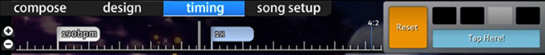

# ไทม์ไลน์ในตัวแก้ไข Beatmap (Beatmap editor timelines)

ใน [ตัวแก้ไข Beatmap (Beatmap editor)](/wiki/Client/Beatmap_editor) มีไทม์ไลน์ 3 ประเภทหลักๆ ที่ Mapper จะได้พบเจอ บทความนี้จะอธิบายการทำงานของแต่ละประเภท

## ปุ่มลัด (Shortcuts)

*สำหรับรายการปุ่มลัดคีย์บอร์ดที่ใช้กับไทม์ไลน์ ดูที่: [ปุ่มลัด (Shortcut key reference)](/wiki/Client/Keyboard_shortcuts)*

## แถบควบคุมเพลง (Song Player)

แถบควบคุมเพลงจะปรากฏให้เห็นในทุกๆ ส่วนของตัวแก้ไข Beatmap

ทางด้านซ้าย จะแสดงตำแหน่งเวลาปัจจุบันในหน่วยมิลลิวินาทีและเปอร์เซ็นต์ความคืบหน้าของเพลง โดยเปอร์เซ็นต์อาจแสดงคำว่า `intro` หรือ `outro` หากมี Storyboard ก่อนหรือหลังจบเพลง

ส่วนกลาง จะแสดงไทม์ไลน์พร้อมขีดสัญลักษณ์และปุ่มควบคุมเพลงพื้นฐาน ปุ่ม `Test` จะทำการบันทึกแมพและเริ่มโหมดทดสอบการเล่นจากตำแหน่งเวลาปัจจุบัน

ตัวไทม์ไลน์เองจะใช้ขีดสัญลักษณ์สีต่างๆ ซึ่งมีความหมายดังนี้:

| สี | คำอธิบาย |
| :-- | :-- |
| ขาว (เส้นยาว) | ตำแหน่งเวลาปัจจุบัน |
| เหลือง (เส้นยาว) | จุดฟังเพลงตัวอย่าง (Preview point) |
| เหลือง (ขีดบน) | จุดเริ่มต้นของเวลาที่ต้องเล่นจริง (Drain time) |
| เขียว (ขีดบน) | Inherited points (ดู [การตั้งจังหวะ (Timing)](/wiki/Client/Beatmap_editor/Timing)) |
| แดง (ขีดบน) | Timing points (ดู [การตั้งจังหวะ (Timing)](/wiki/Client/Beatmap_editor/Timing)) |
| ฟ้า (ขีดล่าง) | Bookmark (จุดคั่นหน้า) |
| เทา (แถบสี) | ช่วงพัก (Break time) |
| ส้ม (แถบสี) | Kiai time |

ทางด้านขวา คุณสามารถปรับความเร็วในการเล่นเพลงได้ที่ `100%`, `75%`, `50%` หรือ `25%`

## ไทม์ไลน์ของวัตถุ (Hit Objects) {#hit-objects}

มีไทม์ไลน์ของ Hit objects 2 รูปแบบ ขึ้นอยู่กับโหมดเกมที่ Mapper กำลังสร้าง

### osu!, osu!taiko และ osu!catch

ในโหมด [Compose (การประกอบ)](/wiki/Client/Beatmap_editor/Compose) ไทม์ไลน์นี้จะอยู่ใต้แถบเมนูสำหรับทุกโหมดเกมยกเว้น [osu!mania](/wiki/Game_mode/osu!mania)

| ชื่อ | คำอธิบาย |
| :-- | :-- |
| ปุ่ม `+`/`-` | ขยาย/ย่อ ไทม์ไลน์ |
| เส้นแนวตั้งสีขาวคู่ | แสดงตำแหน่งเวลาปัจจุบันเมื่อเทียบกับไทม์ไลน์ของวัตถุ |

การคลิกซ้ายที่วัตถุจะเป็นการเลือกวัตถุนั้น และการลากเมาส์จะช่วยย้ายตำแหน่งวัตถุไปตามไทม์ไลน์

การคลิกขวาจะลบวัตถุที่เลือกออกไป

### osu!mania

ในโหมด Compose ไทม์ไลน์นี้จะอยู่ตรงกลางสนามเล่นสำหรับโหมด osu!mania

กล่องทางด้านซ้ายคือแผนภูมิแท่งแนวนอนที่แสดงความหนาแน่นของโน้ต ซึ่งทำหน้าที่เหมือนไทม์ไลน์ภาพรวม

ส่วนกลางคือสนามเล่นจริง ซึ่งประกอบด้วยสองส่วนหลักคือ เส้น (Lines) และโน้ต (Notes)

| สีของเส้น | คำอธิบาย |
| :-- | :-- |
| ขาวหนา | เส้นเริ่มต้นห้องดนตรี |
| ขาวปกติ | จังหวะดนตรีทั่วไป |
| เขียว | ตำแหน่งเวลาปัจจุบัน / เส้นตัดสิน (Judgement line) |

| สีของโน้ต | คำอธิบาย |
| :-- | :-- |
| ฟ้า | โน้ตที่ถูกเลือกอยู่ |
| ขาว/ชมพู/เหลือง | สีของโน้ตปกติที่ไม่ได้ถูกเลือก |

## การออกแบบ (Design)

ไทม์ไลน์ [Design (การออกแบบ)](/wiki/Client/Beatmap_editor/Design) จะอยู่ภายใต้แถบ Design

### Timeline

| ชื่อ | คำอธิบาย |
| :-- | :-- |
| ปุ่ม `+`/`-` ทางซ้าย | ขยาย/ย่อ ไทม์ไลน์ |
| ปุ่มลูกศร `ขึ้น`/`ลง` | เลื่อนดูไทม์ไลน์การเปลี่ยนแปลงส่วนอื่นๆ (เช่น เพื่อสลับดูแถบ Colour หรือ Movement) |

ส่วนกลางของไทม์ไลน์ Design จะแสดง "Keyframes" ของภาพ (Sprite) ที่เลือกอยู่

### Keyframe Control

เครื่องมือควบคุม Keyframe ใช้สำหรับเพิ่มหรือลบจุดยึด (Anchor points) ซึ่งจะเป็นตัวกำหนดเวลาเริ่มและเวลาจบสำหรับการทำ Storyboard

| ชื่อ | คำอธิบาย |
| :-- | :-- |
| ปุ่ม `+`/`-` | เพิ่ม/ลบ จุดยึดสำหรับการเปลี่ยนแปลงที่เลือกอยู่ |
| ปุ่มลูกศร `ซ้าย`/`ขวา` | ข้ามไปยังจุดยึดก่อนหน้าหรือถัดไปของการเปลี่ยนแปลงนั้น |

หากมีการตั้งค่าการเปลี่ยนแปลง แถบนั้นจะสว่างขึ้นตามสีของคำสั่ง และมีเส้นครึ่งบรรทัดระบุระยะเวลา เส้นสีขาวเต็มจะบอกจุดที่มีการสลับค่าการเปลี่ยนแปลง (เช่น จาก "ย้ายขึ้น" เป็น "ย้ายลง")

## การตั้งจังหวะ (Timing) {#timing}

ไทม์ไลน์การตั้งจังหวะจะอยู่ภายใต้แถบ [`Timing`](/wiki/Client/Beatmap_editor/Timing)

### Timing Timeline

| ชื่อ | คำอธิบาย |
| :-- | :-- |
| ปุ่ม `+`/`-` ทางซ้าย | ขยาย/ย่อ ไทม์ไลน์ |

ส่วนกลางคือตัวไทม์ไลน์การตั้งจังหวะ ซึ่งจะใช้ธงสีขาวและสีน้ำเงินเพื่อระบุประเภทของจุดจังหวะ (ตามรายละเอียดในหัวข้อ [สีของธง](#flag-colours))

ทางด้านขวา จะแสดงเลขห้องดนตรีและจังหวะ (Meter) พร้อมกับตัวตั้งค่าเครื่องให้จังหวะ จากรูปด้านบน เลขจังหวะอยู่ที่ `4:2` หมายความว่าตำแหน่งเวลาปัจจุบันอยู่ที่จังหวะที่ 2 ของห้องดนตรีที่ 4 ของเพลง

เครื่องให้จังหวะ (Metronome) จะส่งเสียงติ๊กอย่างสม่ำเสมอตาทค่า BPM ที่กำหนด ซึ่งช่วยในการกะระดับค่า BPM ของเพลงได้ดีขึ้น

### สีของธง (Flag Colours) {#flag-colours}

| สี | คำอธิบาย |
| :-- | :-- |
| ขาว | Timing Points (เส้นแดง) ใช้กำหนดค่า BPM ใหม่ |
| น้ำเงิน | Inherited Points (เส้นเขียว) ใช้ปรับความเร็ว Slider โดยอิงตามค่า BPM ของ Timing Point ก่อนหน้า |
