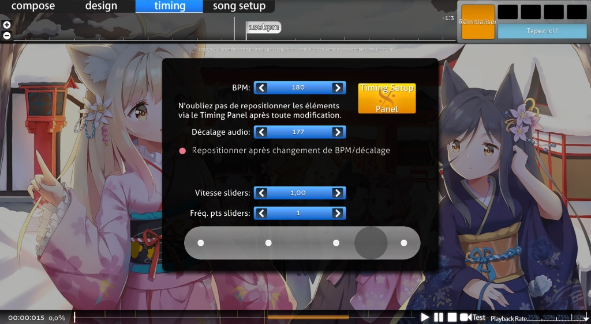

# Onglet Timing 

*Voir aussi : [Comment synchroniser les musiques](/wiki/Guides/How_to_Time_Songs)*

L'onglet **timing** de l'[éditeur de beatmap](/wiki/Client/Beatmap_editor) permet aux mappeurs de modifier les paramètres de timing d'une [beatmap](/wiki/Beatmap). La synchronisation est généralement la première étape de la création d'une nouvelle beatmap.

Le timing est constitué du [décalage](/wiki/Offset), des [battements par minute (BPM)](/wiki/Music_theory/Tempo) et du [mètre](https://fr.wikipedia.org/wiki/Pulsation_(musique)) d'une musique. Un timing correct sur les beatmaps est nécessaire pour que les joueurs puissent maintenir la [précision](/wiki/Gameplay/Accuracy) pendant qu'ils jouent. Les beatmaps mal timés ne peuvent pas passer par la [procédure de classement des beatmaps](/wiki/Beatmap_ranking_procedure).

## Fenêtre Timing et Control Points

Les points de timing peuvent être ajoutés à partir de la fenêtre `Timing and Control Points` de l'éditeur (raccourci par défaut `F6`). Les points de timing divisent un morceau en sections de synchronisation pour refléter précisément les changements de timing d'un morceau.

### Points de timing non hérités

Un point de timing non hérité, affiché sous la forme d'une ligne rouge, est la base du BPM, de l'offset et du compteur d'une section de timing. Chaque beatmap doit comporter au moins une ligne rouge, mais certains morceaux en nécessitent plusieurs en raison d'une composition plus complexe ou d'imprécisions de timing dues à la performance en direct.

### Points de timing hérités

Un point de timing hérité, affiché sous la forme d'une ligne verte, hérite des paramètres de BPM, d'offset et de compteur de la ligne rouge précédente. Les lignes vertes sont utilisées pour ajuster les paramètres de [slider velocity](/wiki/Gameplay/Hit_object/Slider/Slider_velocity) et des [hitsounds](/wiki/Beatmapping/Hitsound).

Un point de timing hérité ne peut pas être placé avant un point non hérité, car il n'hériterait d'aucun paramètre.
