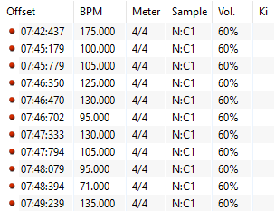
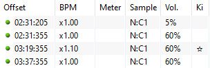

---
tags:
  - red line
  - red offset
  - red timing point
  - uninherited offset
  - green line
  - green offset
  - green timing point
  - inherited offset
  - timing setup
  - copy timing
  - paste timing
---

# แถบ Timing (การตั้งจังหวะ) {#timing}

*สำหรับคู่มือการตั้งจังหวะ ดูที่: [วิธีตั้งจังหวะเพลง](/wiki/Guides/How_to_time_songs)*\
*ดูเพิ่มเติม: [การสร้าง Beatmap/การตั้งจังหวะ](/wiki/Beatmapping/Timing)*

**Timing** คือแถบใน [ตัวแก้ไข Beatmap (Beatmap editor)](/wiki/Client/Beatmap_editor) สำหรับการปรับเปลี่ยนและตั้งค่าจังหวะของ [Beatmap](/wiki/Beatmap) ซึ่งเป็นสิ่งสำคัญอย่างยิ่งเพื่อให้แมพนั้นตรงกับดนตรี ภายในแถบนี้จะประกอบด้วยการตั้งค่าและเครื่องมือที่เกี่ยวกับจังหวะ รวมถึง [หน้าต่างการตั้งค่าจังหวะ](#timing-setup-panel) สำหรับการทำงานกับ [จุดจังหวะ (Timing points)](#timing-points) หลายๆ จุดพร้อมกัน เพื่อกำหนดโครงสร้างทางดนตรีและลูกเล่นในการออกแบบแมพ

## จุดจังหวะ (Timing points) {#timing-points}

*ดูเพิ่มเติม: [Offset](/wiki/Offset)*

ใน [การทำแมพ (Mapping)](/wiki/Beatmapping) *จุดจังหวะ (Timing point)* หรือที่เรียกกันติดปากว่า *ออฟเซ็ต (Offset)* คือวิธีการกำหนดค่าส่วนกลาง เช่น [จังหวะ (Timing)](/wiki/Beatmapping/Timing), ตัวคูณ [ความเร็ว Slider (Slider velocity)](/wiki/Gameplay/Hit_object/Slider/Slider_velocity), หรือ [Hitsounds](/wiki/Beatmapping/Hitsound) และระดับความดังของเสียงในแต่ละช่วงของแมพ ใน osu! มีจุดจังหวะอยู่ 2 ประเภท ดังนี้:

### Uninherited timing point (เส้นแดง) {#uninherited-timing-point}

::: Infobox

:::

จุดจังหวะแบบ **Uninherited** จะมีการตั้งค่าจังหวะเป็นของตัวเอง จุดเหล่านี้มักใช้เพื่อระบุการเปลี่ยนแปลงจังหวะในเพลง เช่น [ความเร็วเพลง (Tempo/BPM)](/wiki/Music_theory/Tempo), จังหวะที่คลาดเคลื่อน หรือการเปลี่ยน [เครื่องหมายกำหนดจังหวะ (Time signature)](/wiki/Music_theory/Time_signature) การเพิ่มจุดจังหวะประเภทนี้ใหม่จะเป็นการรีเซ็ตเครื่องให้จังหวะ (Metronome) โดยเริ่มนับจังหวะใหม่จากค่าออฟเซ็ตที่กำหนด (หน่วยมิลลิวินาที)

นอกจากนี้ จุดจังหวะแบบ Uninherited ยังสามารถใช้เพื่อซ่อนเส้นแบ่งห้องดนตรี (Bar lines) ในโหมด [osu!taiko](/wiki/Game_mode/osu!taiko) หรือ [osu!mania](/wiki/Game_mode/osu!mania) ได้อีกด้วย

จุดจังหวะแบบ Uninherited จะมี **สีแดง** บนไทม์ไลน์ด้านล่างและใน [หน้าต่างการตั้งค่าจังหวะ](#timing-setup-panel) ด้วยเหตุนี้จึงมักถูกเรียกว่า "ออฟเซ็ตแดง" หรือ "เส้นแดง" (Red lines)

### Inherited timing point (เส้นเขียว) {#inherited-timing-point}

::: Infobox

:::

จุดจังหวะแบบ **Inherited** จะใช้ค่าจังหวะพื้นฐานจากจุดจังหวะก่อนหน้า โดยเป็นการ *สืบทอด (Inheriting)* ค่าเหล่านั้นมา จุดจังหวะประเภทนี้มีไว้เพื่อวัตถุประสงค์ดังต่อไปนี้:

- เปลี่ยน [ความเร็ว Slider (Slider velocity)](/wiki/Gameplay/Hit_object/Slider/Slider_velocity)
- ควบคุมระดับความดังของ [Hitsounds](/wiki/Beatmapping/Hitsound)
- สลับชุดตัวอย่างเสียง [Samplesets](/wiki/Beatmapping/Sampleset) ของ Hitsound
- เปิดหรือปิด [Kiai time](/wiki/Gameplay/Kiai_time)

จุดจังหวะแบบ Inherited จะมี **สีเขียว** บนไทม์ไลน์ด้านล่างและใน [หน้าต่างการตั้งค่าจังหวะ](#timing-setup-panel) ด้วยเหตุนี้จึงมักถูกเรียกว่า "ออฟเซ็ตเขียว" หรือ "เส้นเขียว" (Green lines)

## มุมมองหลัก (Main view) {#main-view}

คุณสามารถเปิดแถบ Timing ได้โดยการกดปุ่ม `F3` ซึ่งจะให้คุณเข้าถึงการตั้งค่าต่อไปนี้ได้อย่างรวดเร็ว:

| ชื่อ | ความหมาย |
| :-- | :-- |
| `BPM` | [ความเร็ว (Tempo)](/wiki/Music_theory/Tempo) ของจุดจังหวะปัจจุบัน วัดเป็นจำนวนจังหวะต่อนาที (BPM) |
| `Offset` | [ออฟเซ็ต (Offset)](/wiki/Offset#mapping) ของจุดจังหวะปัจจุบัน วัดเป็นหน่วยมิลลิวินาที |
| `Move already placed notes when changing the offset/BPM` | ให้วัตถุที่วางไว้แล้วขยับตามขีดไทม์ไลน์เมื่อมีการเปลี่ยนออฟเซ็ตหรือ BPM |
| `Slider Velocity` | ค่าความเร็ว Slider พื้นฐานของทั้งแมพ |
| `Slider Tick Rate` | จำนวนของ [Slider ticks](/wiki/Gameplay/Hit_object/Slider/Slider_tick) (หยดน้ำ) ที่จะมีในหนึ่งจังหวะดนตรี |

หากต้องการปรับค่าเพิ่มหรือลดอย่างรวดเร็ว สามารถใช้ปุ่มควบคุมร่วมดังนี้:

| | Tempo (BPM) | Offset | Slider velocity |
| :-- | :--: | :--: | :--: |
| `Ctrl` + คลิก | 0.25 BPM | 1 ms | 1 [osu! pixel](/wiki/Client/Beatmap_editor/osu!_pixel) |
| คลิกปกติ | 1 BPM | 2 ms | 10 osu! pixels |
| `Shift` + คลิก | 5 BPM | 10 ms | - |

### เครื่องให้จังหวะ (Metronome) {#metronome}

เครื่องให้จังหวะที่มุมขวาบนช่วยในการกะค่าจังหวะโดยประมาณ คุณสามารถหาค่า BPM และ Offset เริ่มต้นของเพลงได้โดยการกดปุ่ม `T` ซ้ำๆ หรือคลิกปุ่ม `Tap Here!` ตามจังหวะของเพลง

ส่วนแสดงผลของเครื่องให้จังหวะถูกออกแบบมาสำหรับ [เครื่องหมายกำหนดจังหวะ](/wiki/Music_theory/Time_signature) 4/4 ซึ่งเป็นค่าที่พบบ่อยที่สุด ส่วนแรกจะแสดงจังหวะตก ([Downbeat](/wiki/Music_theory/Downbeat)) และกระพริบเป็นสีเขียว ส่วนที่เหลือจะกระพริบเป็นสีขาวตามแต่ละจังหวะในหนึ่ง [ห้องดนตรี (Measure)](/wiki/Music_theory/Measure) หากใช้จังหวะที่ไม่ปกติ เช่น 7/4 จะมีการกระพริบเพิ่มเติม แต่ขนาดของเครื่องให้จังหวะจะยังคงเท่าเดิม

## หน้าต่างการตั้งค่าจังหวะ (Timing setup panel) {#timing-setup-panel}

หน้าต่างการตั้งค่าจังหวะ หรือที่เรียกว่า `Timing and Control Points` คือหน้าต่างป๊อปอัปที่เปิดได้โดยการกด `F6` ภายในจะประกอบด้วยแถบเมนูหลายแถบสำหรับการตั้งค่าที่ละเอียดขึ้นของแต่ละจุดจังหวะ เช่น การตั้งจังหวะ, Hitsounds, ระดับความดัง, ชุดตัวอย่างเสียง หรือเอฟเฟกต์พิเศษอื่นๆ

### การเลือกและการใช้งานร่วมกัน {#selection-and-cooperation}

การเปลี่ยนแปลงใดๆ ในหน้าต่างนี้จะมีผลเฉพาะกับจุดจังหวะที่ถูกเลือกอยู่เท่านั้น

- หากต้องการเลือกหลายจุดที่ไม่อยู่ติดกัน ให้กด `Ctrl` ค้างไว้ขณะคลิกเลือก
- หากต้องการเลือกหลายจุดที่วางเรียงต่อกัน ให้คลิกจุดแรกแล้วกด `Shift` ค้างไว้ขณะคลิกจุดสุดท้าย
- คุณสามารถ **คัดลอกหรือวางจุดจังหวะ** ได้โดยใช้ปุ่มลัดมาตรฐานของระบบปฏิบัติการ เช่น `Ctrl` + `C` และ `Ctrl` + `V`