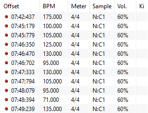
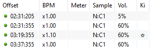
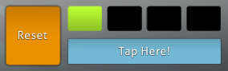

---
tags:
  - red line
  - red offset
  - red timing point
  - uninherited offset
  - green line
  - green offset
  - green timing point
  - inherited offset
  - thiết lập timing
  - sao chép timing
  - dán timing
---

# Tab Timing

*Để xem hướng dẫn thiết lập căn nhịp, xem: [Cách căn nhịp bài hát](/wiki/Guides/How_to_time_songs)*\
*Xem thêm: [Beatmapping/Timing](/wiki/Beatmapping/Timing)*

**Timing** là tab trong [beatmap editor](/wiki/Client/Beatmap_editor) dùng để thay đổi và thiết lập căn nhịp của một [beatmap](/wiki/Beatmap), điều này là thiết yếu để thể hiện bài hát một cách chính xác. Tab này chứa các cài đặt và công cụ liên quan đến căn nhịp, đồng thời có một [cửa sổ riêng](#bảng-thiết-lập-căn-nhịp) để làm việc với nhiều [điểm căn nhịp](#điểm-căn-nhịp), phục vụ cả mục đích thể hiện cấu trúc âm nhạc lẫn thiết kế beatmap.

## Điểm căn nhịp

*Xem thêm: [Offset](/wiki/Offset)*

Trong [mapping](/wiki/Beatmapping), một *điểm căn nhịp*, thường được gọi là *offset*, là một cách để áp dụng các thiết lập chung như [căn nhịp](/wiki/Beatmapping/Timing), hệ số [tốc độ nốt dài](/wiki/Gameplay/Hit_object/Slider/Slider_velocity), hoặc [hitsound](/wiki/Beatmapping/Hitsound) và âm lượng tương ứng của chúng, cho một đoạn cụ thể trong beatmap. Trong osu!, có hai loại điểm căn nhịp.

### Điểm căn nhịp không kế thừa

::: Infobox

:::

Một điểm căn nhịp **không kế thừa** có các thiết lập căn nhịp riêng của nó. Nhiều điểm căn nhịp kiểu này được dùng để thể hiện các thay đổi căn nhịp trong bài hát, chẳng hạn như [nhịp độ](/wiki/Music_theory/Tempo), nhịp không đều, hoặc các [số chỉ nhịp](/wiki/Music_theory/Time_signature) khác nhau. Việc thêm một điểm căn nhịp không kế thừa mới sẽ đặt lại bộ đếm nhịp, khiến nó đếm nhịp từ offset của điểm căn nhịp đó, được xác định bằng mili giây.

Ngoài ra, điểm căn nhịp không kế thừa còn có thể được dùng để bỏ các vạch ô nhịp trong [osu!taiko](/wiki/Game_mode/osu!taiko) hoặc [osu!mania](/wiki/Game_mode/osu!mania).

Điểm căn nhịp không kế thừa có màu đỏ trên khoảng thời gian phía dưới và trong [bảng thiết lập căn nhịp](#bảng-thiết-lập-căn-nhịp). Vì vậy, chúng thường được gọi là "offset đỏ" hoặc "line đỏ".

### Điểm căn nhịp kế thừa

::: Infobox

:::

Một điểm căn nhịp **kế thừa** sử dụng các thiết lập căn nhịp đang hoạt động, *kế thừa* chúng từ điểm căn nhịp trước đó. Điểm căn nhịp kế thừa được dùng cho các mục đích sau:

- Thay đổi [tốc độ nốt dài](/wiki/Gameplay/Hit_object/Slider/Slider_velocity)
- Điều chỉnh âm lượng của [hitsound](/wiki/Beatmapping/Hitsound)
- Chuyển đổi [mẫu âm thanh](/wiki/Beatmapping/Sampleset) của hitsound đang hoạt động
- Bật hoặc tắt [thời gian kiai](/wiki/Gameplay/Kiai_time)

Điểm căn nhịp kế thừa có màu xanh lá trên khoảng thời gian phía dưới và trong [bảng thiết lập căn nhịp](#bảng-thiết-lập-căn-nhịp). Vì vậy, chúng thường được gọi là "offset xanh" hoặc "line xanh".

## Giao diện chính

Tab timing có thể được mở bằng cách nhấn `F3` và cung cấp truy cập nhanh tới các thiết lập sau:

| Tên | Ý nghĩa |
| :-- | :-- |
| `BPM` | [Nhịp](/wiki/Music_theory/Tempo) của điểm căn nhịp hiện tại, được đo bằng số nhịp trên phút (BPM - Beats per minute). |
| `Độ trễ` | [Cân chỉnh thời gian](/wiki/Offset#mapping) của điểm căn nhịp hiện tại, được đo bằng mili giây. |
| `Chuyển các note đã được đặt khi chỉnh độ trễ/BPM` | Giữ các nốt bấm gắn với các vạch trên [khoảng thời gian](/wiki/Client/Beatmap_editor/Timelines) khi thay đổi căn nhịp |
| `Tốc độ nốt dài` | [Tốc độ nốt dài](/wiki/Gameplay/Hit_object/Slider/Slider_velocity) cơ bản của toàn bộ beatmap |
| `Nhịp của nốt dài` | Số lượng [chấm nằm trên nốt dài](/wiki/Gameplay/Hit_object/Slider/Slider_tick) trong một [nhịp](/wiki/Music_theory/Beat) nhạc |

Để thay đổi nhanh hơn với mức lớn hoặc nhỏ, sử dụng các sửa đổi bên dưới:

|  | Tempo | Offset | Tốc độ nốt dài |
| :-- | :-: | :-: | :-: |
| `Ctrl` + click | 0.25 BPM | 1 ms | 1 [osu! pixel](/wiki/Client/Beatmap_editor/osu!_pixel) |
| Mặc định | 1 BPM | 2 ms | 10 osu! pixel |
| `Shift` + click | 5 BPM | 10 ms | - |

### Bộ đếm nhịp

Bộ đếm nhịp nằm ở góc trên bên phải của tab timing, giúp nhanh chóng tìm ra các thiết lập căn nhịp gần đúng. Giá trị BPM và offset ban đầu của bài hát có thể được xác định bằng cách nhấn `T` liên tục hoặc nhấp vào nút `Gõ vào đây!` theo nhịp của bài hát.

Phần hiển thị trực quan của bộ đếm nhịp được thiết kế theo [số chỉ nhịp](/wiki/Music_theory/Time_signature) phổ biến nhất là 4/4. Phách đầu tiên biểu thị [phách mạnh](/wiki/Music_theory/Downbeat) và sẽ nhấp nháy màu xanh lá, trong khi các phách còn lại sẽ nhấp nháy màu trắng theo từng phách trong [ô nhịp](/wiki/Music_theory/Measure) của bài hát. Các số chỉ nhịp không phổ biến, như nhịp 7/4, thì sẽ thêm các lần nhấp nháy nhưng tổng số phách của bộ đếm nhịp không thay đổi.

## Bảng thiết lập căn nhịp

Bảng thiết lập căn nhịp, còn được gọi là `Timing and Control Points`, là một cửa sổ bật lên có thể mở bằng cách nhấn `F6`. Bảng thiết lập chứa nhiều tab để làm việc với các tuỳ chọn khác nhau của điểm căn nhịp, như căn nhịp, [hitsound](/wiki/Beatmapping/Hitsound), âm lượng, [mẫu âm thanh](/wiki/Beatmapping/Sampleset), hoặc các hiệu ứng đặc biệt.

### Chọn và chia sẻ

Mọi thay đổi trong bảng căn nhịp chỉ được áp dụng cho các điểm căn nhịp đã được chọn.

- Để chọn nhiều điểm căn nhịp bất kỳ, giữ `Ctrl` khi ấn vào chúng
- Để chọn nhiều điểm căn nhịp liên tiếp, nhấn vào điểm căn nhịp đầu tiên, sau đó giữ `Shift` và ấn điểm căn nhịp cuối cùng
- Để **sao chép hoặc dán điểm căn nhịp từ và vào bảng timing**, sử dụng các phím tắt mặc định của hệ điều hành, ví dụ như `Ctrl` + `C` và `Ctrl` + `V`
