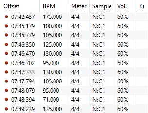
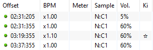

---
tags:
  - red line
  - red offset
  - red timing point
  - uninherited offset
  - green line
  - green offset
  - green timing point
  - inherited offset
  - timing setup
  - copy timing
  - paste timing
  - 红线
  - 绿线
  - 计时
  - 时间轴
---

# 测定时间轴标签页

*想要了解测定时间轴设定指南，参见：[如何测定歌曲时间轴](/wiki/Guides/How_to_time_songs)*
*参见：[作图/测定时间轴](/wiki/Beatmapping/Timing)*

**测定时间轴 (Timing)** ，或称为计时，是[谱面编辑器](/wiki/Client/Beatmap_editor)的一个标签页，可供更改设定[谱面](/wiki/Beatmap)时间轴的各项参数。它对于正确地表现歌曲非常重要。这个界面包含与测定相关的工具和专用于处理多个[计时点](#计时点)的[窗口](#时间轴设定窗口)，他们都可以用来表示音乐结构、辅助设计谱面。

## 计时点

*参见：[偏移值 (Offset)](/wiki/Offset)*

在[作图](/wiki/Beatmapping)中，一根时间点，通俗地说是*控制线*，它的功能是将常见设置（比如[时间轴](/wiki/Beatmapping/Timing)、[滑条速度 (SV)](/wiki/Gameplay/Hit_object/Slider/Slider_velocity) 因数、[音效](/wiki/Beatmapping/Hitsound)和音效音量）应用在谱面特定部分。在 osu! 中，有两种计时点：

### 非继承时间点（红线）

::: Infobox

:::

**非继承** 时间点（红线）有独立的时间轴设置参数。部分红线可以表示歌曲中的时间轴变化，例如变[曲速](/wiki/Music_theory/Tempo)、变成非常规节拍或变[拍号](/wiki/Music_theory/Time_signature)。添加一根新红线会重置节拍器，并从红线所处的偏移值（单位是毫秒）开始计算节拍。

除此之外，红线还能设置为在 [osu!taiko](/wiki/Game_mode/osu!taiko) 和 [osu!mania](/wiki/Game_mode/osu!mania) 内不显示第一条小节线。

之所以称呼它们为“红线”，是因为它们在底部的时间线和[时间轴设定窗口](#时间轴设定窗口)内，显示为红色。

### 继承时间点（绿线）

::: Infobox

:::

**继承** 时间点（绿线）使用之前已经应用过的时间轴设定参数，从之前的时间点*继承*。绿线可以用于：

- 改变[滑条速度 (SV)](/wiki/Gameplay/Hit_object/Slider/Slider_velocity)
- 控制[音效](/wiki/Beatmapping/Hitsound)的音量
- 在已启用的[音效组](/wiki/Beatmapping/Sampleset)之间切换
- 启用或禁用 [Kiai 时间](/wiki/Gameplay/Kiai_time)

之所以称呼它们为“绿线”，是因为它们在底部的时间线和[时间轴设定窗口](#时间轴设定窗口)内，显示为绿色。

## 全览

按下 `F3`，可打开测定时间轴标签页，并快速访问以下设置：

| 名称 | 含义 |
| :-- | :-- |
| `BPM` | 当前时间轴上的[曲速](/wiki/Music_theory/Tempo)，单位是每分钟节拍数 (BPM)。 |
| `偏移值 (Offset)` | 当前时间轴上的[偏移值 (Offset)](/wiki/Offset#作图)，单位是毫秒 |
| `更改 offset/BPM 时，自动把已经放好的物件对齐时间轴刻度` | 当时间轴设定变动时，把物件对齐在[时间轴](/wiki/Client/Beatmap_editor/Timelines)刻度上。 |
| `滑条速度 (SV)` | 整张谱面的基础[滑条速度 (SV)](/wiki/Gameplay/Hit_object/Slider/Slider_velocity) |
| `滑条点倍率（每拍滑条点个数）` | 在乐理上的一[拍](/wiki/Music_theory/Beat)内，会出现有多少个[滑条点](/wiki/Gameplay/Hit_object/Slider/Slider_tick) |

想要快速做出较大或较精细的更改，请使用下列快捷键：

|  | 曲速 | 偏移值 | 滑条速度 (SV) |
| :-- | :-: | :-: | :-: |
| `Ctrl` + 点击 | 0.25 BPM | 1 毫秒 | 1 [osu! 像素](/wiki/Client/Beatmap_editor/osu!_pixel) |
| 默认 | 1 BPM | 2 毫秒 | 10 osu! 像素 |
| `Shift` + 点击 | 5 BPM | 10 毫秒 | - |

### 节拍器

节拍器位于测定时间轴标签页的右上角，可帮助谱师快速确定大概的时间轴。谱师可以按着歌曲节拍，反复点击 `T` 或者 `戳这里！` 来测定歌曲的初始 BPM 和偏移值 (offset)。

节拍器含有一个为常见的 4/4 拍量身定制的可视窗口。第一个窗口表示[下拍](/wiki/Music_theory/Downbeat)，并闪绿光。其余窗口会跟着[小节](/wiki/Music_theory/Measure)内的其余节拍闪白光。如果谱面含有例如 7/4 拍这类不常见的[拍子记号](/wiki/Music_theory/Time_signature)，其余窗口会有额外的闪光，但可视窗口的尺寸不会因此改变。

## 时间轴设定窗口

时间轴设定窗口，或者叫做 `时间轴和控制点 (Timing and Control Points)`，是可以按 `F6` 打开的弹窗。它包含几个标签页，用于处理时间点的不同选项，如测定时间轴、[音效](/wiki/Beatmapping/Hitsound)、音量、[音效组](/wiki/Beatmapping/Sampleset)、特效等。

### 选定并复制

设定窗口内的所有更改仅应用于已选定的时间点。

- 想要任选多个时间点，按住 `Ctrl`，再点击它们
- 想要选择一列时间点，点击第一个，按住 `Shift`，再点击最后一个即可
- 想要**在时间轴设定窗口内复制粘贴时间点**，请使用你的操作系统的默认快捷键，例如 `Ctrl` + `C` 和 `Ctrl` + `V`
