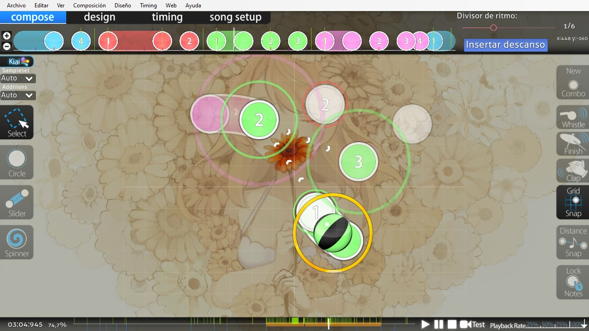

# Editor de beatmaps

*Para atajos de teclado del editor de beatmaps, véase: [Referencia de atajos de teclado § Editor de beatmaps](/wiki/Client/Keyboard_shortcuts#editor-de-beatmaps)*

El **editor de beatmaps** es la interfaz gráfica del juego de osu! para crear [beatmaps](/wiki/Beatmap). [Beatmapping](/wiki/Beatmapping) es el acto de crear beatmaps para osu!.

El editor de beatmaps está dividido en cuatro secciones principales que se pueden ver en la esquina superior izquierda del editor:

- Compose
- Design
- Timing
- Song setup

## Compose

[Compose](/wiki/Client/Beatmap_editor/Compose) es donde se crean todos los [objetos](/wiki/Gameplay/Hit_object) y otros elementos relacionados con el juego. La mayoría de los mappers pasan más tiempo en esta pestaña que en todas las demás debido a esto.

## Design

[Design](/wiki/Client/Beatmap_editor/Design) ofrece una forma de hacer [storyboards](/wiki/Storyboard), los efectos visuales que acompañan a los beatmaps. Debido a que los storyboards a menudo tienen efectos complejos que justifican el uso de muchos comandos de storyboards, los mappers también usan [secuencias de comandos](/wiki/Storyboard/Scripting) directamente sin ingresar a la pestaña design.

## Timing

[Timing](/wiki/Client/Beatmap_editor/Timing) administra las secciones de tiempo de una canción y controla los hitsounds de un beatmap. Esto es esencial ya que un beatmap necesita una temporización correcta y el feedback adecuado para hacer coincidir la experiencia de juego con el ritmo de una canción.

## Song setup

[Song setup](/wiki/Client/Beatmap_editor/Song_setup) completa los [metadatos](/wiki/Client/Beatmap_editor/Song_setup#general) de un beatmap y otras cosas universales para un [beatmap](/wiki/Beatmap). Esto incluye el título de una canción, el artista, el nombre de la dificultad, los colores de combo, etc.

## Otros

Otros componentes del editor de beatmaps incluyen:

- [AiMod](AiMod): Un sistema automatizado que informa problemas en un beatmap
- [Divisor de ritmo](Beat_snap_divisor): Determina cómo los objetos se ajustan a la línea de tiempo
- [Distance snap](Distance_snap): El multiplicador que afecta qué tan cerca o lejos se colocan los objetos entre sí
- [Kiai time](/wiki/Gameplay/Kiai_time): Secciones de tiempo especiales que ayudan a enfatizar una parte de un beatmap
- [Menú](Menu): Te ayuda a navegar por el editor de beatmaps
- [Carga del SB](SB_load): Un número que se usa para indicar qué tan exigente es un storyboard
- [Líneas de tiempo](Timelines): Muestra objetos colocados, descansos y más
