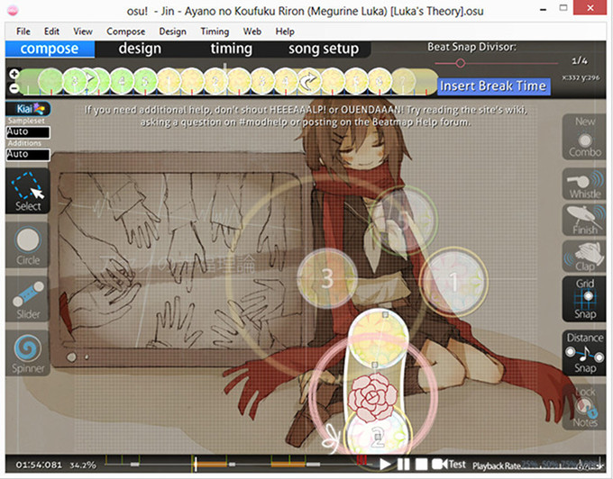

# Edytor Beatmap

**Edytor beatmap** to miejsce w osu! w którym tworzy się [mapy](/wiki/Beatmap). Jest podzielony na cztery sekcje:

- [Kompozycja](Compose): Jest to miejsce gdzie są wstawiane i edytowane [obiekty](/wiki/Gameplay/Hit_object). Większość czasu jest spędzana tutaj.
- [Design](Design): Jest to miejsce gdzie tworzone jest tło. Większość osób używa tylko przycisku "Background Image/Video".
- [Rytmika](Timing): Jest to miejsce gdzie ustawione jest opóźnienie i BPM. Można tutaj także edytować dźwięki, jeżeli nie są stałe w mapie.
- [Ustawienia mapy](Song_Setup): Jest to miejsce gdzie można zmienić różne opcje mapy (od kolorów combo do ustawień poziomów trudności.

## Powiązane artykuły

- [Mapowanie](/wiki/Beatmapping) (podstawy mapowania)
- [Podziałka czasowa](Beat_Snap_Divisor)
- [Odległość pomiędzy obiektami](Distance_snap)
- [Własne paczki dźwięków](/wiki/Guides/Custom_sample_overrides)
- [Czas Kiai](/wiki/Gameplay/Kiai_time)
