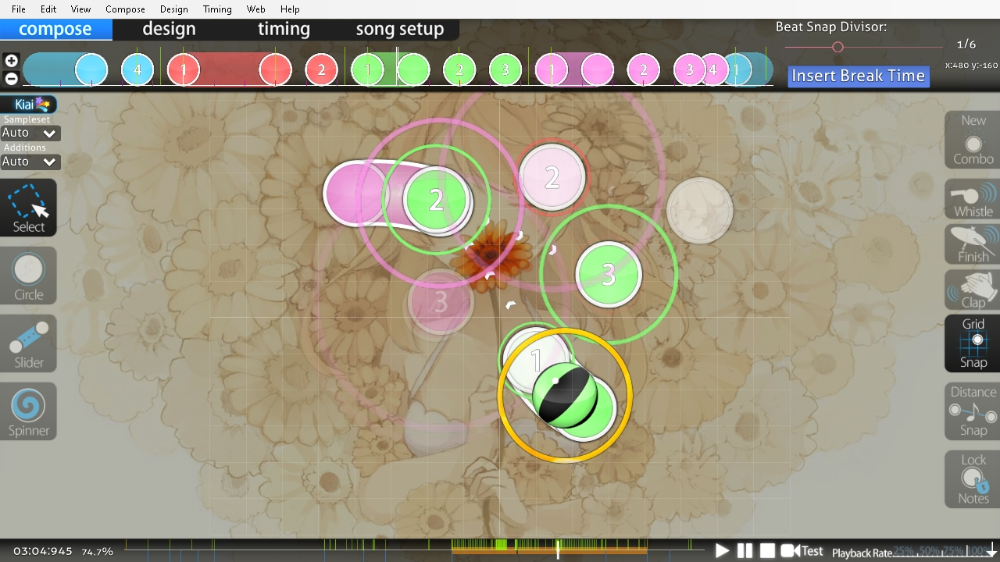

# Edytor beatmap

::: alert-note
Skróty klawiszowe edytora można znaleźć w artykule [Skróty klawiszowe § Edytor beatmap](/wiki/Client/Keyboard_shortcuts#edytor-beatmap)
:::

**Edytor beatmap** to graficzny interfejs przeznaczony do tworzenia [beatmap](/wiki/Beatmap). Proces ten nazywa się też czasem [beatmappingiem lub beatmapowaniem](/wiki/Beatmapping).

Edytor beatmap jest podzielony na cztery główne sekcje, widoczne w lewym górnym rogu edytora:

- Tryb kompozycji (`Compose`)
- Edytor storyboardów (`Design`)
- Tryb timingu (`Timing`)
- Ustawienia beatmapy (`Song setup`)

## Tryb kompozycji

[Tryb kompozycji](/wiki/Client/Beatmap_editor/Compose) (`Compose`) to sekcja, w której umieszcza się wszystkie [obiekty](/wiki/Gameplay/Hit_object) beatmapy. Z tego powodu większość twórców beatmap spędza w tej sekcji więcej czasu niż w pozostałych.

## Edytor storyboardów

[Edytor storyboardów](/wiki/Client/Beatmap_editor/Design) (`Design`) umożliwia tworzenie [storyboardów](/wiki/Storyboard), czyli efektów wizualnych mających na celu podkreślenie beatmapy. Storyboardy często zawierają skomplikowane efekty tworzone przy użyciu wielu komend, dlatego twórcy beatmap korzystają również ze [skryptów](/wiki/Storyboard/Scripting), bez potrzeby otwierania edytora storyboardów.

## Timing

[Tryb timingu](/wiki/Client/Beatmap_editor/Timing) (`Timing`) służy do zarządzania sekcjami czasowymi beatmapy oraz kontrolowania hitsoundów. Jest to niezbędne, gdyż obiekty beatmapy muszą być umiejscowione zgodnie z utworem, a gracz musi wiedzieć, czy trafia je w rytm muzyki.

## Ustawienia beatmapy

[Ustawienia beatmapy](/wiki/Client/Beatmap_editor/Song_setup) (`Song setup`) służą do uzupełniania [metadanych](/wiki/Client/Beatmap_editor/Song_setup#general) oraz innych rzeczy związanych z [beatmapą](/wiki/Beatmap), takich jak tytuł utworu, artysta, nazwa poziomu trudności czy kolory combo.

## Pozostałe

Do pozostałych elementów edytora należą między innymi:

- [AiMod](AiMod): Program, który automatycznie wykrywa problemy w beatmapie
- [Czas kiai](/wiki/Gameplay/Kiai_time): Specjalne sekcje czasowe służące do podkreślenia części beatmapy
- [Menu](Menu): Pomaga w nawigacji po edytorze
- [Odległość pomiędzy obiektami](Distance_snap): Mnożnik określający, jak blisko lub jak daleko od siebie są położone obiekty
- [Osie czasu](Timelines): Wyświetlają położone obiekty, przerwy oraz różne inne informacje
- [Podzielnik beatu](Beat_snap_divisor): Określa, jak obiekty są ułożone na osi czasu
- [SB load](SB_load): Liczba określająca, jak bardzo wymagający sprzętowo jest storyboard
