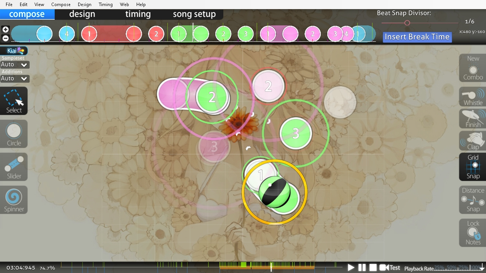

# ตัวแก้ไข Beatmap (Beatmap editor)

<!-- TODO: needs to be revisited when the articles under Beatmap editor no longer match what's written here -->

*สำหรับปุ่มลัดในตัวแก้ไข Beatmap ดูที่: [ปุ่มลัด (Shortcut key reference) § ตัวแก้ไข Beatmap](/wiki/Client/Keyboard_shortcuts#beatmap-editor)*

**ตัวแก้ไข Beatmap (Beatmap editor)** คืออินเทอร์เฟซแบบกราฟิกภายในเกม osu! สำหรับการสร้าง [Beatmap](/wiki/Beatmap) การ [สร้างแมพ (Beatmapping)](/wiki/Beatmapping) คือกิจกรรมการสร้างด่านต่างๆ ให้กับเกม osu!

ตัวแก้ไข Beatmap แบ่งออกเป็น 4 ส่วนหลัก ซึ่งสามารถดูได้ที่มุมซ้ายบนของหน้าจอ:

- Compose (การประกอบ)
- Design (การออกแบบ)
- Timing (การตั้งจังหวะ)
- Song setup (การตั้งค่าเพลง)

## Compose (การประกอบ)

[Compose](/wiki/Client/Beatmap_editor/Compose) คือส่วนที่ใช้สร้าง [Hit objects](/wiki/Gameplay/Hit_object) และองค์ประกอบอื่นๆ ที่เกี่ยวข้องกับเกมเพลย์ทั้งหมด Mapper ส่วนใหญ่มักใช้เวลาในแถบนี้มากกว่าแถบอื่นๆ

## Design (การออกแบบ)

[Design](/wiki/Client/Beatmap_editor/Design) คือส่วนที่ใช้สร้าง [Storyboard](/wiki/Storyboard) ซึ่งเป็นเอฟเฟกต์ทางสายตาที่มาพร้อมกับ Beatmap เนื่องจาก Storyboard มักจะมีเอฟเฟกต์ที่ซับซ้อนและต้องใช้คำสั่งจำนวนมาก Mapper บางคนจึงเลือกใช้ [การเขียนสคริปต์ Storyboard (Storyboard scripting)](/wiki/Storyboard/Scripting) โดยตรงแทนการใช้แถบ Design

## Timing (การตั้งจังหวะ)

[Timing](/wiki/Client/Beatmap_editor/Timing) ใช้สำหรับจัดการส่วนของจังหวะในเพลงและควบคุม [Hitsounds](/wiki/Beatmapping/Hitsound) ของ Beatmap ซึ่งเป็นส่วนที่สำคัญที่สุดเนื่องจาก Beatmap จำเป็นต้องมีจังหวะที่ถูกต้องและเสียงตอบสนองที่เหมาะสมเพื่อให้เข้ากับท่วงทำนองของเพลง

## Song setup (การตั้งค่าเพลง)

[Song setup](/wiki/Client/Beatmap_editor/Song_setup) ใช้สำหรับกรอกข้อมูล [Metadata](/wiki/Client/Beatmap_editor/Song_setup#general) ของ Beatmap และค่ากำหนดอื่นๆ ที่ใช้ร่วมกันทั้งแมพ เช่น ชื่อเพลง, ศิลปิน, ชื่อระดับความยาก, สีคอมโบ และอื่นๆ

## ส่วนประกอบอื่นๆ

ส่วนประกอบอื่นๆ ของตัวแก้ไข Beatmap ได้แก่:

- [AiMod](AiMod): ระบบอัตโนมัติที่ช่วยรายงานปัญหาที่พบภายใน Beatmap
- [Beat snap divisor](Beat_snap_divisor): กำหนดว่าวัตถุจะถูก Snap เข้ากับไทม์ไลน์อย่างไร
- [Distance snap](Distance_snap): ตัวคูณที่ส่งผลต่อระยะห่างระหว่าง Hit objects แต่ละชิ้น
- [Kiai time](/wiki/Gameplay/Kiai_time): ส่วนของจังหวะพิเศษที่ช่วยเน้นย้ำความเข้มข้นของแมพ
- [Menu](Menu): เมนูคำสั่งต่างๆ สำหรับการใช้งานตัวแก้ไข
- [SB load](SB_load): ตัวเลขที่บอกว่า Storyboard นั้นใช้ทรัพยากรเครื่องมากเพียงใด
- [Timelines](Timelines): แสดงตำแหน่งของ Hit objects, ช่วงพัก (Breaks) และข้อมูลอื่นๆ บนไทม์ไลน์
