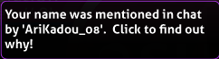

---
tags:
  - mention
  - hilight
  - HL
  - ping
---

# Highlight

A **highlight** (commonly abbreviated as **HL**, sometimes called a **mention** or **ping**) is a way to draw someone's attention to the chat if they are online. By default, a highlight is triggered when a player's username is written out in the chat. The list of what words get highlighted may be customised in osu!'s [in-game chat options](/wiki/Client/Options#in-game-chat).

It is possible to ignore highlights from specific users by adding their usernames to the [ignore list](/wiki/Client/Options/Ignore_list) with `@h` appended to them.

## Appearance

::: Infobox

:::

When a chat message triggers highlight, the sender's username on that line becomes green, and the message is added to a `#highlight` chat tab. Additionally, if the osu! window is inactive, its icon will flash on the taskbar.
