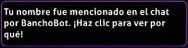

---
tags:
  - mention
  - hilight
  - HL
  - ping
---

# Resaltado

Un **resaltado** (comúnmente abreviado como **HL**, a veces llamado **mención** o **ping**) es una forma de llamar la atención de alguien sobre el chat si está en línea. De forma predeterminada, se activa un resaltado cuando se escribe el nombre de usuario de un jugador en el chat. La lista de las palabras que se resaltan se pueden personalizar en las [opciones de chat en el juego](/wiki/Client/Options#chat-en-juego) de osu!.

Es posible ignorar los resaltados de usuarios específicos agregando sus nombres de usuario a la [lista de ignorados](/wiki/Client/Options/Ignore_list) con `@h` adjunto.

## Apariencia

::: Infobox

:::

Cuando un mensaje de chat activa el resaltado, el nombre de usuario del remitente en esa línea se vuelve verde y el mensaje se agrega a una pestaña de chat `#highlight`. Además, si la ventana de osu! está inactiva, su icono parpadeará en la barra de tareas.
