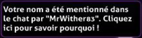

---
tags:
  - mention
  - hilight
  - HL
  - ping
  - notification
---

# Highlight

Un **highlight** (communément abrégé en **HL**, parfois appelé une **mention** ou un **ping**) est un moyen d'attirer l'attention de quelqu'un sur le tchat s'il est en ligne. Par défaut, un highlight fonctionne lorsque le nom d'utilisateur d'un joueur est écrit dans le tchat. La liste des mots à mention peut être modifiée dans les [options du tchat en jeu](/wiki/Client/Options#chat) d'osu!.

Il est possible d'ignorer les highlights d'utilisateurs spécifiques en ajoutant leurs noms d'utilisateur à la [liste d'utilisateurs à ignorer](/wiki/Client/Options/Ignore_list) avec un `@h` attaché.

## Apparence

::: Infobox

:::

Lorsqu'un message du tchat déclenche un highlight, le nom de l'utilisateur ayant envoyé le message devient vert, et le message est ajouté à un onglet du tchat appelé `#highlight`. De plus, si la fenêtre d'osu! est inactive, son icône brillera sur la barre des tâches.
