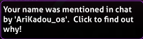

---
tags:
  - mention
  - hilight
  - HL
  - ping
---

# Highlight (การไฮไลต์)

**Highlight** (มักเรียกย่อว่า **HL**, หรือบางครั้งเรียกว่า **Mention** หรือ **Ping**) คือวิธีการดึงดูดความสนใจของผู้ใช้ในแชทในขณะที่พวกเขาออนไลน์อยู่ โดยค่าเริ่มต้น ระบบจะทำการไฮไลต์เมื่อมีคนพิมพ์ชื่อผู้ใช้ของคุณในแชท คุณสามารถปรับแต่งรายการคำที่จะให้เกิดการไฮไลต์ได้ใน [เมนูการตั้งค่าแชทภายในเกม](/wiki/Client/Options#in-game-chat)

คุณสามารถเลือกเพิกเฉยต่อการไฮไลต์จากผู้ใช้บางคนได้ โดยการเพิ่มชื่อผู้ใช้นั้นลงใน [รายการเพิกเฉย (Ignore list)](/wiki/Client/Options/Ignore_list) และต่อท้ายด้วย `@h`

## รูปลักษณ์ (Appearance)

::: Infobox

:::

เมื่อมีข้อความแชทที่ทำให้เกิดการไฮไลต์ ชื่อของผู้ส่งในบรรทัดนั้นจะเปลี่ยนเป็น **สีเขียว** และข้อความนั้นจะถูกคัดลอกไปไว้ในแชนแนล `#Taskbar จะกระพริบเพื่อแจ้งให้ทราบ
