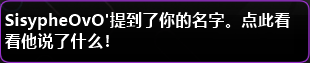

---
tags:
  - mention
  - hilight
  - HL
  - ping
  - 提及
  - 高亮
  - 艾特
  - 戳
---

# 高亮

**高亮**（highlight，简称 **HL**，一般也称为“提及”）是一种在玩家在线时将其注意力吸引过去的聊天功能。默认情况下，当聊天中提及玩家的用户名时，就会触发高亮。玩家可以在 osu! 的[“游戏内聊天”设置项](/wiki/Client/Options#in-game-chat)（聊天高亮词汇）中自定义哪些词将会被高亮。

通过将指定用户的用户名添加到[忽略列表](/wiki/Client/Options/Ignore_list)并附加 `@h` 后缀，可以忽略来自该用户的高亮提醒。

## 显示效果

::: Infobox

:::

当一条聊天消息触发高亮时，该消息发送者的用户名会变为绿色，同时这条消息会被收录到 `#highlight` 聊天标签页中。此外，如果 osu! 窗口处于非活动状态，其任务栏图标将会闪烁。
