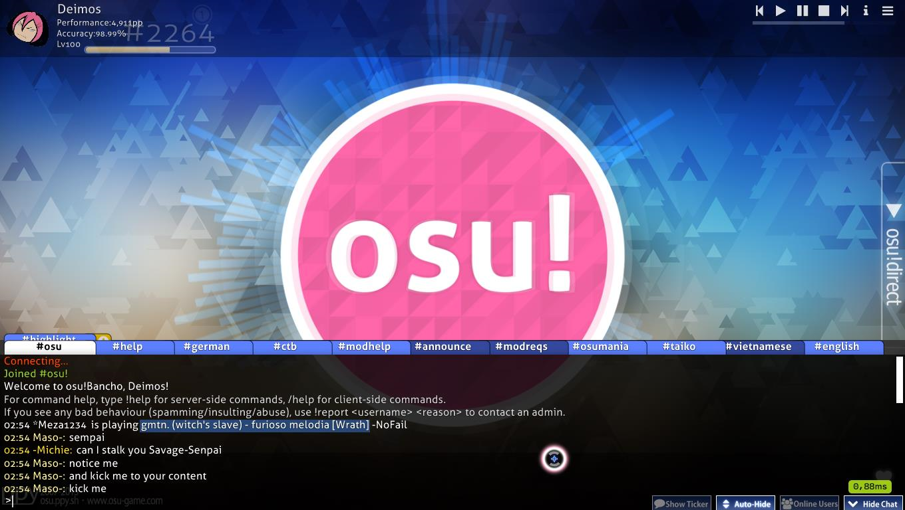
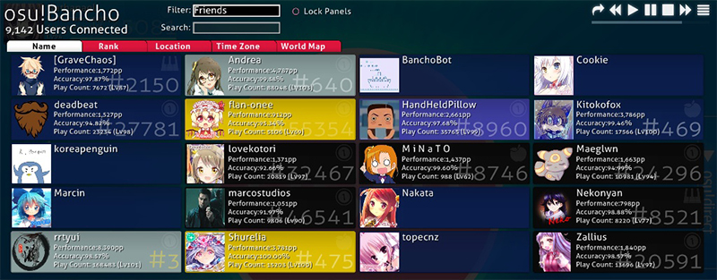
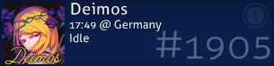
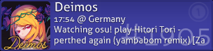
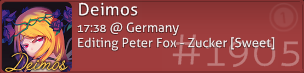
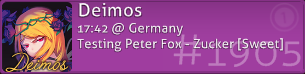
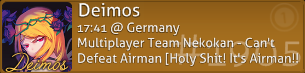
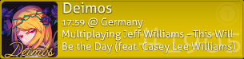

# La console de tchat

Vous pouvez afficher la console de tchat d'osu! sur la plupart des écrans en appuyant sur `F8` ou sur `Show Chat` en bas à droite de l'écran.

- Les onglets répertorient les canaux actuellement disponibles. Il suffit de cliquer sur un onglet pour accéder à ce canal. Cliquez sur le bouton "+" jaune pour afficher une liste de nouveaux canaux à rejoindre.
- Les couleurs des noms d'utilisateur ont des significations différentes.

| Couleur | Qui ? |
| :-- | :-- |
| **Blanc** | Vous |
| **Jaune pâle** | Les autres utilisateurs |
| **Jaune** | [osu!supporter](/wiki/osu!supporter) |
| **Rouge** | Un membre de la [Global Moderation Team](/wiki/People/Global_Moderation_Team) ou de la [Nomination Assessment Team](/wiki/People/The_Team/Nomination_Assessment_Team ) |
| **Vert** | La ligne contient votre nom ou certains mots-clés que vous avez ajoutés pour déclencher une [mise en évidence](Highlight). Une copie du message apparaîtra également dans un canal dédié, `#highlight`, qui contient toutes ces lignes. |
| **Bleu** | Un message privé |
| **Cyan** | [peppy](https://osu.ppy.sh/users/2), le créateur d'osu! |
| **Rose** | [BanchoBot](/wiki/BanchoBot) |

- Cliquez sur la case `Show Ticker` pour afficher le dernier message lorsque la console de tchat n'est pas ouverte.
- Cliquez sur la case `Auto-Hide` pour cacher automatiquement la console de tchat pendant le gameplay (Sauf pendant l'intro, l'outro et les pauses).
- Cliquez sur la case `Hide Chat` ou de nouveau sur `F8` pour cacher la console de tchat.

## La console de tchat étendue

*L'[osu!academy](/wiki/Community/Video_series/osu!academy) à déjà abordé ce sujet ici : [Episode 6 (6:52)](https://www.youtube.com/watch?v=cyYRl-a5xII) ainsi que le [multijoueur](/wiki/Client/Interface/Multiplayer) (en anglais).*

Sur la plupart des écrans, vous pouvez appuyer sur `F9` ou cliquer sur `Online Users` pour afficher la console de tchat étendue. En plus de la console de tchat, le tchat étendu superpose une liste de panneaux dans les deux tiers restants de l'écran, affichant des informations sur les utilisateurs actuellement connectés à osu!.

Chaque utilisateur connecté a un panneau qui lui est dédié. Par défaut, il affiche des informations générales (nom, score total, rang, précision, nombre de parties et photo de profil de l'utilisateur, le cas échéant). Lorsque le curseur de la souris est placé dessus, il affiche un ensemble différent d'informations (nom, rang, photo de profil le cas échéant, heure locale, fuseau horaire, localisation par pays et, si l'utilisateur l'autorise, par ville, et ce qu'il fait).

- La case "Friends only" limite l'affichage à vos amis.
- La case "Lock Panels" empêche les panneaux de se déplacer, y compris pour les nouveaux utilisateurs.
- Cliquez sur un onglet pour trier les panneaux d'utilisateurs en fonction de cet attribut.
- Cliquez sur la carte du monde pour afficher une carte qui montre où se trouve tout le monde.
- Vous pouvez cliquer et glisser sur la boîte blanche pour faire défiler, vous pouvez également utiliser la molette de la souris.
- Les utilisateurs qui n'ont pas de statistiques dans leur panneau sont connectés au tchat en utilisant leur client IRC.

La couleur du panneau correspond à un des dix statuts:

| Couleur du panneau | Description |
| :-- | :-- |
|  | Bleu foncé - Le joueur est actuellement inactif ou ne fait rien ou ne fait que chatter. |
|  | Gris - joue une beatmap en solo. |
|  | Bleu clair - Regarde un replay ou observe quelqu'un. |
|  | Rouge - Édite sa propre beatmap |
|  | Violet - Test d'une beatmap, qu'il s'agisse de sa beatmap ou non. |
|  | Turquoise - Soumet (soit en téléchargeant, soit en mettant à jour) une beatmap qu'ils ont réalisé. |
|  | Vert - Mod ou édite une beatmap de quelqu'un d'autre. |
|  | Marron - L'utilisateur est en mode multijoueur, mais ne joue pas. |
|  | Jaune - Joue actuellement en mode multijoueur. |
|  | Noir - Inactif (away from keyboard) (afk). |
|  | Bleu foncé sans contenu - Le joueur n'a pas le jeu ouvert, mais s'est connecté à un client IRC ou les statistiques ne sont pas disponibles. |

En cliquant sur n'importe quel panneau utilisateur, un écran d'options apparaît.

Appuyez sur le numéro ou cliquez sur la barre pour l'activer :

1. `Observer le joueur` : Si l'utilisateur joue une beatmap et que vous l'avez, vous pouvez l'observer pendant qu'il joue. Votre nom figurera dans sa liste de spectateurs.
2. `Consulter le profil` : Ouvre la page web du profil du joueur dans votre navigateur.
3. `Discuter` : Ouvre un onglet de tchat privé avec l'utilisateur.
4. `Inviter à rejoindre la salle` : (Si vous êtes dans une salle multijoueur) Demande à l'utilisateur de venir dans votre salle.
5. `Ajouter (retirer) de la liste d'amis` : Ajoute (supprime) l'utilisateur à votre liste d'amis.
6. `Signaler l'utilisateur` : Signaler l'utilisateur pour un mauvais comportement. Ne doit jamais être utilisé, sauf indication contraire. Vous pouvez signaler un utilisateur dans le jeu pour un certain nombre de choses, mais aussi sur le web, comme les forums.
7. `Ignorer l'utilisateur` : Toute entrée de tchat par l'utilisateur n'apparaîtra pas dans votre console de tchat.
8. `Fermer` : Ferme le panneau.

## Liste des commandes

### /help

| Commande | Effet | Exemple | Réponse de BanchoBot |
| :-- | :-- | :-- | :-- |
| `/addfriend [user]` | Ajoute ou supprime `[user]` de votre liste d'amis. | `/addfriend Amigo` | You are now friends with Amigo. |
| `/delfriend [user]` | Supprime `[user]` de votre liste d'amis. | `/delfriend Amigo` | You are no longer friends with Amigo. |
| `/away [message]` | Défini un message d'absence à envoyer aux utilisateurs vous envoyant un message privé. Laissez le champ vide pour annuler. | `/away Je suis John Smith.` | You have been marked as being away: I am John Smith. Quand Amigo /msg John Où es-tu~ ? BanchoBot : Je suis John Smith. |
| `/bb` | Envoie un message à Bancho pour qu'il exécute une commande telle que `!stats [user]` | `/bb !stats Uan` | \[15/11/12\] Stats for [Uan](https://osu.ppy.sh/users/147623): Score: 47,323,299,680 (#1) Plays: 176293 (lv102) Accuracy: 98.95% |
| `/chat [user]`, `/msg [user]` ou `/query [user]` | Ouvre un nouvel onglet de tchat avec l'utilisateur spécifié. | `/tchat Amigo` | (L'onglet Amigo est ouvert) |
| `/clear` | Efface le contenu du tchat actuel. | `/clear` | (Efface pratiquement tout ce qui se trouve dans l'onglet actuel) |
| `/ignore [user][@chp]` | Ignore tous les messages de l'utilisateur spécifié pour cette session. En ajoutant un @ suivi des lettres, c, h, et/ou p, vous pouvez les ignorer respectivement dans le tchat, les [highlights](Highlight), ou les PMs. | `/ignore Amigo@chp` | BanchoBot: You will no longer hear Amigo {chat} {highlights} {PM} (Votre console de tchat est réglée sur : ignore any text written by Amigo \[c\], any possible text highlighting you by Amigo \[h\] any Private Message sent to you by Amigo \[p\]) |
| `/j [channel]` ou `/join [channel]` | Rejoint le salon spécifié | `/join #lobby` | (L'onglet #lobby est ouvert) |
| `/p` ou `/part` | Quitte le salon actuel. | `/part` | n/a |
| `/unignore [user]` | Arrête d'ignorer cet utilisateur pour cette session. | `/unignore Amigo` | You may now hear Amigo. (Votre console de tchat permettra d'accéder à tout commentaire fait par Amigo.) |
| `/me [action]` | Effectue une action à la troisième personne. | `/me est à la maison` | *John est à la maison |
| `/np` | Imprime dans le tchat la musique en cours d'écoute ou en cours de jeu. | `/np` | (Si vous jouez) * John is playing [Peter Lambert - osu! tutorial \[Gameplay Basics\]](https://osu.ppy.sh/beatmapsets/3756#osu/22538) |
| `/reply` ou `/r` | Répondre au dernier message privé reçu. | `/r Connais tu un bon médecin ?` | (Dans l'onglet d'Amigo) \[Commentaires précédents\] John: Je suis malade à la maison. Amigo: Vraiment ? John: Connais tu un bon médecin ? |
| `/savelog` | Enregistre l'onglet de tchat actuel dans un fichier texte. | `/savelog` | (Un dossier appelé "Chat" sera créé dans le répertoire d'osu! qui contiendra toutes les sauvegardes des futurs onglets de tchat.) |
| `/watch [user]` | Commence à observer `[user]`. | `/watch Amigo` | * Started spectating Amigo. (Quand Amigo joue une beatmap que vous possédez, vous observez son jeu. \[après une mise en mémoire tampon\] avec votre nom sur la gauche de l'écran d'Amigo) |
| `/nopm` | Active/Désactive pour autoriser les messages privés de tout le monde ou des amis seulement. | `/nopm` | (A une bannière pop-up apparaîtra au centre, indiquant que vous autorisez les messages privés à tout le monde/aux amis uniquement.) |
| `/invite [user]` | Invite `[user]` à la salle multijoueur avec le lien. | `/invite Nathanael` | * Nathanael has been invited to the game |

### /keys

| Touches du clavier | Effect |
| :-- | :-- |
| `Page Up` / `Page Down` | Faire défiler la conversation. Vous pouvez aussi utiliser la molette de la souris. |
| `Tab` | Compléter automatiquement le nom d'utilisateur en cours de saisie. |
| `F8` | Agrandit/Réduit la console de tchat. |
| `F9` | Agrandit/Réduit la console de tchat étendue. |
| `Ctrl` + `C` / `V` | Copier/coller |
| `Alt` + `0` - `9` | Basculer vers l'onglet respectif. |
