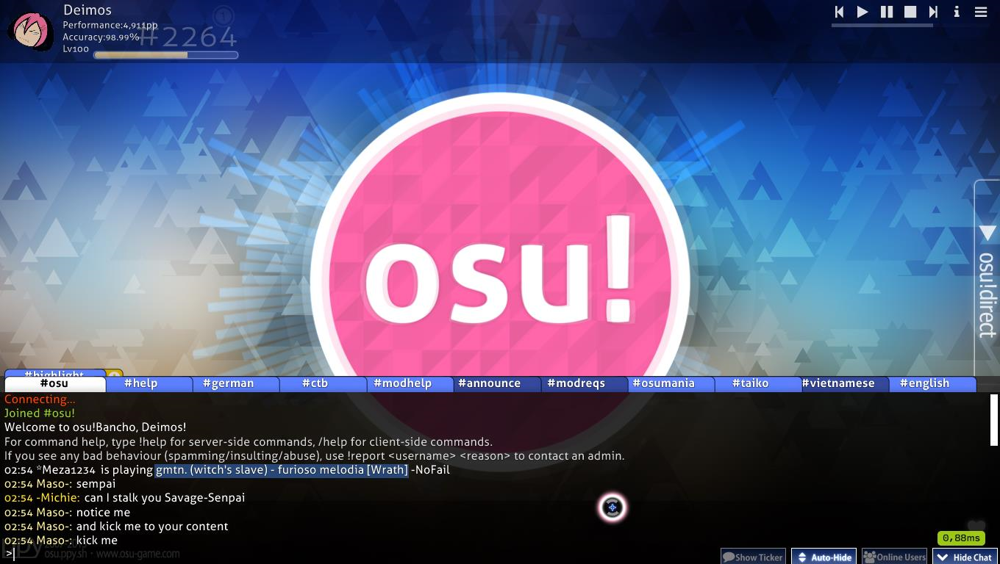
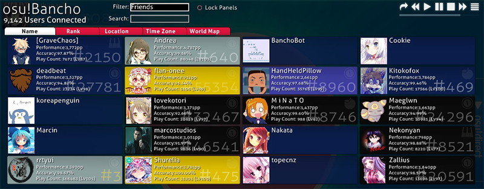
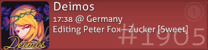
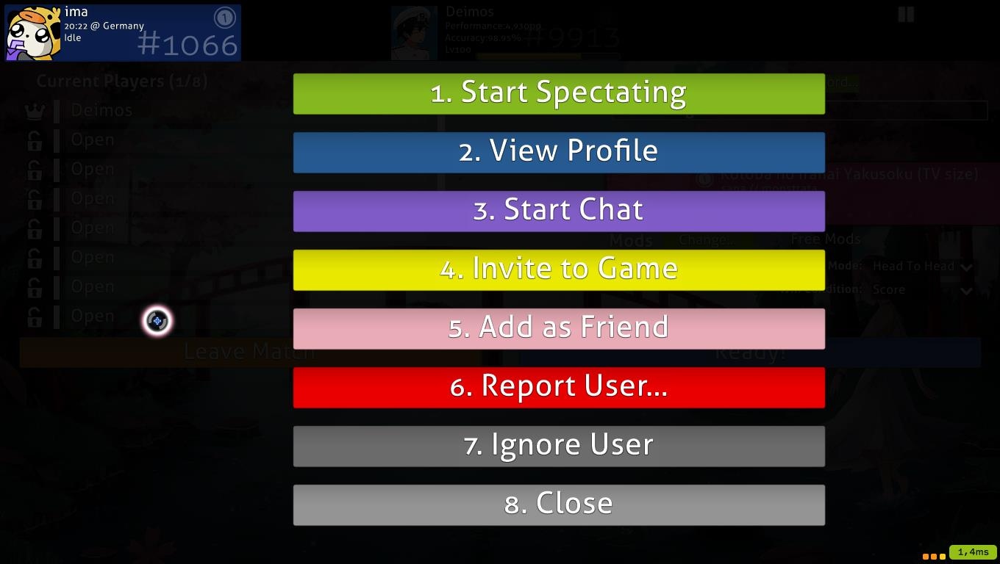

# Czat

Okno czatu można otworzyć z większości ekranów klienta poprzez naciśnięcie `F8` lub kliknięcie przycisku `Show Chat` w prawym dolnym rogu. Czat pojawi się wówczas w dolnej części ekranu.

- Wszystkie zakładki tworzą listę obecnie otwartych kanałów. Aby przejść do danego kanału, kliknij odpowiadającą mu zakładkę. Kliknij żółty przycisk `+`, by otworzyć listę wszystkich istniejących kanałów.
- Kolory nazw użytkowników mają różne znaczenia.

| Kolor | Kto posiada dany kolor |
| :-- | :-- |
| **Biały** | Ty |
| **Jasnożółty** | Zwykli użytkownicy |
| **Żółty** | Użytkownicy posiadający [status donatora osu!](/wiki/osu!supporter) |
| **Czerwony** | [Moderatorzy globalni](/wiki/People/Global_Moderation_Team) lub członkowie [zespołu NAT](/wiki/People/The_Team/Nomination_Assessment_Team) |
| **Zielony** | Wiadomość zawierająca twoją nazwę użytkownika lub słowo, które dodałeś do listy wywołujących [podświetlenie](Highlight) na czacie. Kopia tej wiadomości pojawi się także na kanale `#highlight` zawierającym wszystkie tego typu wiadomości. |
| **Niebieski** | Wiadomość prywatna |
| **Turkusowy** | [peppy](https://osu.ppy.sh/users/2), twórca osu! |
| **Różowy** | [BanchoBot](/wiki/BanchoBot) |

- Kliknij przycisk `Show Ticker`, aby nowe wiadomości były wyświetlane na dole ekranu, nawet gdy okno czatu jest ukryte.
- Kliknij przycisk `Auto-Hide`, aby automatycznie ukrywać czat podczas rozgrywki (nie licząc wstępu, zakończenia i przerw w beatmapie).
- Naciśnij `F8` lub kliknij przycisk `Hide Chat`, aby ukryć okno czatu.

## Rozszerzone okno czatu

*[Akademia osu!](/wiki/Community/Video_series/osu!academy) podjęła temat ten temat w [odcinku 6 (6:52)](https://www.youtube.com/watch?v=cyYRl-a5xII) wraz z tematem [trybu wieloosobowego](/wiki/Client/Interface/Multiplayer).*

Rozszerzone okno czatu można otworzyć z większości miejsc w osu! poprzez naciśnięcie `F9` lub kliknięcie przycisku `Online Users` w prawym dolnym rogu ekranu. Oprócz klasycznego okna czatu w pozostałej części ekranu zostaną wyświetlone panele użytkowników, którzy są aktualnie online.

Każdy zalogowany użytkownik posiada swój własny panel w rozszerzonym oknie czatu. Domyślnie wyświetlane są ogólne informacje (nazwa użytkownika, łączny rankingowy wynik, pozycja w rankingu, celność, liczba zagrań oraz awatar, jeśli go posiada). Po najechaniu kursorem na panel zostanie wyświetlony inny zestaw informacji (nazwa użytkownika, pozycja w rankingu, awatar (jeśli go posiada), czas lokalny, strefa czasowa, państwo, miasto (jeżeli użytkownik zezwolił na podanie tej wiadomości) oraz co aktualnie robi).

- Filtr `Znajomi` ogranicza widok do paneli znajomych.
- Kliknięcie przycisku `Zablokuj profile` spowoduje zaprzestanie przemieszczania się paneli, włącznie z panelami dopiero zalogowanych użytkowników.
- Kliknięcie dowolnej zakładki posortuje panele względem ustawionego atrybutu.
- Wybranie zakładki `Mapa świata` wyświetli mapę pokazującą lokalizację obecnie zalogowanych użytkowników.
- Użyj kółka myszy lub kliknij i przeciągnij, aby przewinąć listę paneli użytkowników.
- Użytkownicy, w których panelach nie są wyświetlane żadne statystyki, są połączeni za pomocą klientów IRC.

| Kolor panelu | Opis |
| :-- | :-- |
|  | Ciemnoniebieski - użytkownik jest bezczynny lub pisze na czacie. |
|  | Szary - użytkownik gra beatmapę w trybie jednoosobowym. |
|  | Jasnoniebieski - użytkownik ogląda powtórkę lub grę innego gracza. |
|  | Czerwony - użytkownik edytuje swoją beatmapę. |
|  | Fioletowy - użytkownik testuje beatmapę w edytorze. |
|  | Turkusowy - użytkownik przesyła lub aktualizuje swoją beatmapę. |
|  | Zielony - użytkownik moduje lub edytuje czyjąś beatmapę. |
|  | Brązowy - użytkownik znajduje się w trybie wieloosobowym, ale nie gra. |
|  | Żółty - użytkownik gra beatmapę w trybie wieloosobowym. |
|  | Czarny - użytkownik nie wykonał żadnego działania przez dłuzszy czas. |
|  | Ciemnoniebieski, bez żadnej zawartości - użytkownik jest połączony przez klienta IRC albo jego statystyki nie są dostępne. |

Kliknięcie na panel użytkownika przywoła listę dostępnych opcji.

Aby wybrać opcję, kliknij ją lub naciśnij odpowiedni numer na klawiaturze:

1. `Oglądaj`: Jeżeli użytkownik gra beatmapę, którą posiadasz, możesz obejrzeć jego grę. Twoja nazwa użytkownika zostanie wyświetlona na liście oglądających.
2. `Zobacz profil`: Otwiera profil użytkownika w przeglądarce.
3. `Rozpocznij rozmowę`: Rozpoczyna prywatną rozmowę z użytkownikiem.
4. `Zaproś do gry`: Zaprasza użytkownika do twojego pokoju (dostępne tylko w trybie wieloosobowym).
5. `Dodaj do/Usuń ze znajomych`: Dodaje lub usuwa użytkownika z twojej listy znajomych.
6. `Zgłoś użytkownika`: Umożliwia zgłoszenie użytkownika za niewłaściwe zachowanie. Bezpodstawne używanie tej opcji jest zabronione. Możesz zgłosić użytkownika w grze lub na stronie osu!.
7. `Ignoruj użytkownika`: Ukrywa wszystkie wiadomości użytkownika na czacie.
8. `Zamknij`: Zamyka listę opcji.

## Komendy

### /help

| Komenda | Efekt | Przykład | Odpowiedź BanchoBota |
| :-- | :-- | :-- | :-- |
| `/addfriend [użytkownik]` | Dodaje `[użytkownika]` do znajomych. | `/addfriend Amigo` | You are now friends with Amigo. |
| `/delfriend [użytkownik]` | Usuwa `[użytkownika]` ze znajomych. | `/delfriend Amigo` | You are no longer friends with Amigo. |
| `/away [wiadomość]` | Ustawia automatyczną wiadomość wysyłaną przy braku aktywności do osób piszących do ciebie w prywatnej wiadomości. Pozostaw puste, aby usunąć. | `/away Nazywam się John Smith.` | You have been marked as being away: Nazywam się John Smith. Kiedy Amigo napisze /msg John Gdzie jesteś~? BanchoBot: Nazywam się John Smith. |
| `/bb` | Wysyła wiadomość do Bancho, aby użyć wybranej komendy, jak na przykład `!stats [user]` | `/bb !stats Uan` | \[15/11/12\] Stats for [Uan](https://osu.ppy.sh/users/147623): Score: 47,323,299,680 (#1) Plays: 176293 (lv102) Accuracy: 98.95% |
| `/chat [użytkownik]` lub `/msg [użytkownik]` lub `/query [użytkownik]` | Otwiera czat z danym użytkownikiem. | `/chat Amigo` | (czat z Amigo zostanie otwarty) |
| `/clear` | Czyści wszystkie wiadomości z czatu. | `/clear` | (czyści praktycznie wszystko, co znajduje się w obecnie wybranej zakładce) |
| `/ignore [użytkownik][@chp]` | Ignoruje wszystkie wiadomości danego użytkownika podczas tej sesji. Jeżeli po nazwie użytkownika wprowadzisz litery `c`, `h` czy `p` poprzedzone znakiem `@`, możesz ignorować użytkownika odpowiednio na czacie, we [wzmiankach](Highlight) lub w prywatnej wiadomości. | `/ignore Amigo@chp` | BanchoBot: You will no longer hear Amigo {chat} {highlights} {PM} (Twój czat od teraz będzie ignorować: wszystkie wiadomości od użytkownika Amigo \[c\], wszystkie wiadomości wywołujące podświetlenie od użytkownika Amigo \[h\], wszystkie wiadomości prywatne od użytkownika Amigo \[p\]) |
| `/j [channel]` lub `/join [channel]` | Dołącza do danego kanału. | `/join #lobby` | (zakładka z kanałem #lobby zostanie otwarta) |
| `/p` lub `/part` | Wychodzi z obecnie otwartego kanału. | `/part` | - |
| `/unignore [użytkownik]` | Przestaje ignorować danego użytkownika podczas tej sesji. | `/unignore Amigo` | You may now hear Amigo. (Będziesz już widzieć wszystkie wiadomości od użytkownika Amigo) |
| `/me [action]` | Mówienie o sobie w trzeciej osobie. | `/me jest w domu` | * John jest w domu |
| `/np` | Wysyła na czat wiadomość z obecnie odtwarzaną lub graną piosenką. | `/np` | (Jeśli jesteś w trakcie rozgrywki) * John is playing [Peter Lambert - osu! tutorial \[Gameplay Basics\]](https://osu.ppy.sh/beatmapsets/3756#osu/22538) |
| `/reply` or `/r` | Odpowiada na ostatnią prywatną wiadomość. | `/r Znasz może jakiegoś dobrego lekarza?` | (Na czacie z Amigo) \[Poprzednie wiadomości\] John: Zachorowałem. Amigo: Naprawdę? John: Znasz może jakiegoś dobrego lekarza? |
| `/savelog` | Zapisuje wiadomości z obecnie wybranego kanału w pliku tekstowym. | `/savelog` | (W katalogu z osu! zostanie utworzony folder `Chat`, w którym będą znajdować się wszystkie zapisy wiadomości z czatu) |
| `/watch [użytkownik]` | Rozpoczyna oglądanie `[użytkownika]`. | `/watch Amigo` | * Started spectating Amigo. (Jeśli Amigo zagra beatmapę, którą posiadasz, zaczniesz oglądać jego rozgrywkę \[po chwili opóźnienia\], a twoja nazwa pojawi się po lewej stronie ekranu Amigo) |
| `/nopm` | Włącza lub wyłącza opcję otrzymywania wiadomości prywatnych od osób spoza listy znajomych. | `/nopm` | (Po wpisaniu komendy zostanie wyświetlony napis informujący o wybranej opcji) |
| `/invite [użytkownik]` | Zaprasza `[użytkownika]` do pokoju w trybie wieloosobowym. | `/invite Nathanael` | * Nathanael został zaproszony do gry |

### /keys

| Klawisze | Efekt |
| :-- | :-- |
| `Page Up` / `Page Down` | Przesuwa okno czatu. Możesz również użyć kółka myszki. |
| `Tab` | Automatycznie dokańcza wpisywaną nazwę użytkownika. |
| `F8` | Przełącza okno czatu. |
| `F9` | Przełącza rozszerzone okno czatu. |
| `Ctrl` + `C` / `V` | Kopiuj/Wklej. |
| `Alt` + `0` - `9` | Przełącza do wybranej zakładki. |
