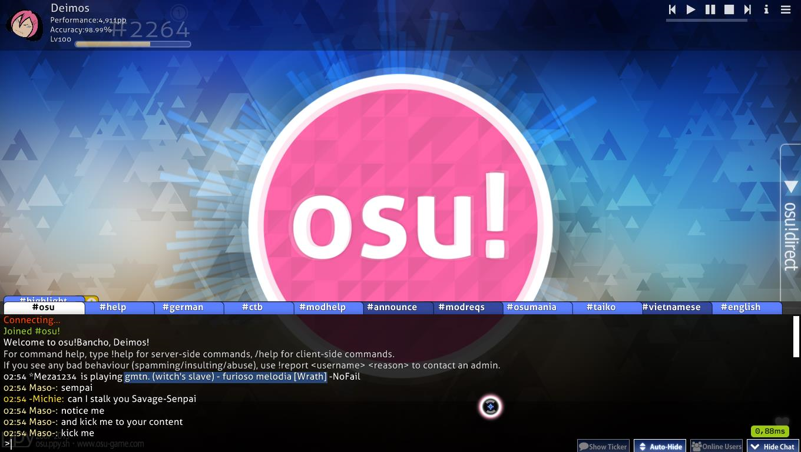
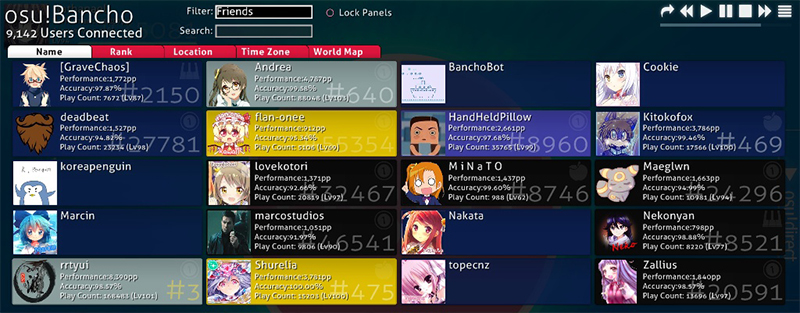
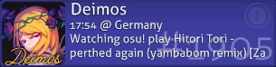
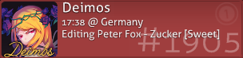
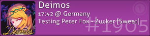
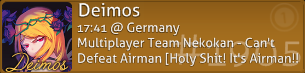
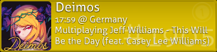
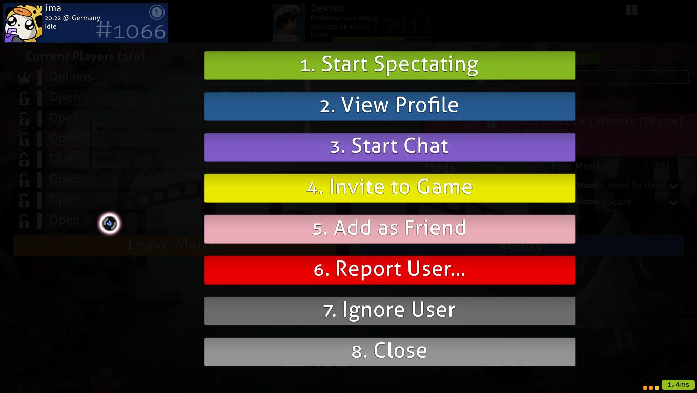

<!-- TODO: dated images and links, formatting problems, writing could be done better instead of all these lists. I removed the `needs_cleanup` tag because this still details the Chat Console pretty well. -->

# หน้าต่างแชท (Chat console)

จากเกือบทุกหน้าจอใน osu! คุณสามารถกดปุ่ม `F8` หรือคลิกปุ่ม `Show Chat` ที่มุมขวาล่างเพื่อเปิดหน้าต่างแชท (Chat Console) ขึ้นมาทับที่บริเวณส่วนล่างของหน้าจอ

- แถบ (Tabs) จะแสดงรายการแชนแนลที่ใช้งานอยู่ในปัจจุบัน เพียงคลิกที่แถบเพื่อสลับไปยังแชนแนลนั้น คลิกปุ่มเครื่องหมายบวกสีเหลืองเพื่อแสดงรายการแชนแนลใหม่ๆ ที่คุณสามารถเข้าร่วมได้
- สีของชื่อผู้ใช้มีความหมายแตกต่างกันดังนี้:

| สี | คนนั้นเป็นใคร |
| :-- | :-- |
| **ขาว** | ตัวคุณเอง |
| **ขาวซีด** | ผู้เล่นทั่วไป |
| **เหลือง** | [osu!supporter](/wiki/osu!supporter) |
| **แดง** | สมาชิกทีม [Global Moderation Team](/wiki/People/Global_Moderation_Team) หรือ [Nomination Assessment Team](/wiki/People/The_Team/Nomination_Assessment_Team) |
| **เขียว** | ข้อความที่มีชื่อของคุณหรือคำสำคัญที่คุณตั้งไว้เพื่อให้ [Highlight](Highlight) (ไฮไลต์) สำเนาของข้อความนี้จะไปปรากฏในแชนแนล `#highlight` เพื่อให้คุณตรวจสอบย้อนหลังได้ง่าย |
| **น้ำเงิน** | ข้อความส่วนตัว (Private Message) |
| **ฟ้า (Cyan)** | [peppy](https://osu.ppy.sh/users/2) ผู้สร้าง osu! |
| **ชมพู** | [BanchoBot](/wiki/BanchoBot) |

- คลิกที่ปุ่ม `Show Ticker` เพื่อให้ระบบแสดงข้อความแชทล่าสุดที่ด้านล่างของหน้าจอในขณะที่ปิดหน้าต่างแชทอยู่
- คลิกที่ปุ่ม `Auto-Hide` เพื่อย่อหน้าต่างแชทโดยอัตโนมัติในระหว่างการเล่น (ยกเว้นช่วงนำเข้าแมพ, ช่วงจบ และช่วงพัก)
- คลิกที่ปุ่ม `Hide Chat` หรือกด `F8` อีกครั้งเพื่อปิดหน้าต่างแชท

## หน้าต่างแชทแบบขยาย (Extended Chat Console) {#extended-chat-console}

*บทความซีรีส์ [osu!academy](/wiki/Community/Video_series/osu!academy) ได้อธิบายหน้านี้ไว้ใน [ตอนที่ 6 (นาทีที่ 6:52)](https://www.youtube.com/watch?v=cyYRl-a5xII) ร่วมกับ [Multiplayer](/wiki/Client/Interface/Multiplayer)*

จากเกือบทุกหน้าจอใน osu! คุณสามารถกดปุ่ม `F9` หรือคลิกปุ่ม `Online Users` ที่มุมขวาล่างของเมนูหลักเพื่อเปิดหน้าต่างแชทแบบขยาย ซึ่งจะแสดงรายการผู้เล่นที่กำลังออนไลน์อยู่ในขณะนั้นทับบนพื้นที่ที่เหลือของหน้าจอ

ผู้เล่นแต่ละคนที่ออนไลน์อยู่จะมีแผงข้อมูลผู้ใช้ (User panel) แสดงในหน้าต่างนี้ โดยปกติจะแสดงข้อมูลทั่วไป (ชื่อ, คะแนนรวม, อันดับ, ความแม่นยำ, จำนวนครั้งการเล่น และรูปโปรไฟล์) เมื่อวางเมาส์เหนือแผงข้อมูล ระบบจะแสดงข้อมูลเพิ่มเติม (ชื่อ, อันดับ, เวลาท้องถิ่น, เขตเวลา, ประเทศ หรือเมือง (หากผู้ใช้เปิดเผยไว้) และสิ่งที่พวกเขากำลังทำอยู่)

- **Friends only:** จำกัดการแสดงผลเฉพาะเพื่อนของคุณ
- **Lock Panels:** ล็อกตำแหน่งแผงข้อมูลไม่ให้ขยับไปมาเมื่อมีผู้เล่นใหม่ล็อกอินเข้ามา
- **ตัวเลือกแถบเมนู:** คลิกเพื่อเรียงลำดับผู้เล่นตามคุณลักษณะต่างๆ
- **แผนที่โลก:** คลิกเพื่อดูตำแหน่งที่ตั้งของผู้เล่นทั่วโลก
- **แถบเลื่อน:** คลิกและลากบนแถบสีขาวเพื่อเลื่อนรายการ หรือใช้ล้อเมาส์ก็ได้
- **แผงที่ไม่มีข้อมูลสถิติ:** คือผู้เล่นที่เชื่อมต่อแชทผ่านระบบ IRC

| สีของแผงข้อมูล | ความหมาย |
| :-- | :-- |
|  | น้ำเงินเข้ม - ผู้เล่นกำลังว่าง หรือไม่ได้ทำอะไรเป็นพิเศษนอกจากคุยแชท |
|  | เทา - กำลังเล่น Beatmap ในโหมด Solo |
|  | ฟ้าอ่อน - กำลังรับชมการเล่นของผู้อื่นหรือดู Replay |
|  | แดง - กำลังแก้ไข Beatmap ของตนเอง |
|  | ม่วง - กำลังทดสอบการเล่นแมพในตัวแก้ไข |
|  | เขียวอมฟ้า - กำลังอัปโหลดหรืออัปเดต Beatmap ของตนเอง |
|  | เขียว - กำลัง Mod หรือแก้ไข Beatmap ของผู้อื่น |
|  | น้ำตาล - อยู่ในห้องมัลติเพลเยอร์ แต่ไม่ได้กำลังเล่นอยู่ |
|  | เหลือง - กำลังแข่งขันอยู่ในห้องมัลติเพลเยอร์ |
|  | ดำ - ไม่อยู่หน้าจอ (Afk) |
|  | น้ำเงินเข้ม (ไม่มีเนื้อหา) - ผู้เล่นล็อกอินผ่านระบบ IRC หรือไม่สามารถดูสถิติได้ |

การคลิกที่แผงข้อมูลผู้ใช้จะแสดงเมนูตัวเลือกดังนี้:

กดตัวเลขหรือคลิกที่แถบคำสั่งเพื่อเริ่มใช้งาน:

1. **Start Spectating:** เริ่มรับชมการเล่นของผู้ใช้คนนั้น (หากคุณมี Beatmap เดียวกับเขา) ชื่อของคุณจะไปปรากฏในรายการผู้เข้าชมของเขา
2. **View Profile:** เปิดหน้าโปรไฟล์ของผู้เล่นบนเบราว์เซอร์
3. **Start Chat:** เปิดแท็บแชทส่วนตัวกับผู้เล่นคนนั้น
4. **Invite to game:** (หากคุณอยู่ในห้องมัลติ) เชิญผู้เล่นให้เข้ามาในห้องของคุณ
5. **Add (Remove) as Friend:** เพิ่มหรือลบออกจากรายชื่อเพื่อน
6. **Report User:** รายงานพฤติกรรมที่ไม่เหมาะสม (โปรดใช้ตามความเหมาะสมเท่านั้น)
7. **Ignore User:** เพิกเฉยต่อข้อความแชทของผู้เล่นคนนั้น
8. **Close:** ปิดหน้าต่างตัวเลือก

## รายการคำสั่ง (Commands list) {#commands-list}

### /help (ช่วยเหลือ)

| คำสั่ง | ผลลัพธ์ | ตัวอย่าง | การตอบกลับของ BanchoBot |
| :-- | :-- | :-- | :-- |
| `/addfriend [ชื่อ]` | เพิ่มผู้ใช้เข้ารายชื่อเพื่อน | `/addfriend Amigo` | You are now friends with Amigo. |
| `/delfriend [ชื่อ]` | ลบผู้ใช้ออกจากรายชื่อเพื่อน | `/delfriend Amigo` | You are no longer friends with Amigo. |
| `/away [ข้อความ]` | ตั้งข้อความตอบกลับอัตโนมัติเมื่อไม่อยู่หน้าจอ (เว้นว่างไว้เพื่อยกเลิก) | `/away กำลังพักกินข้าว` | You have been marked as being away: กำลังพักกินข้าว |
| `/bb` | ส่งคำสั่งให้ BanchoBot (เช่น `!stats [ชื่อ]`) | `/bb !stats Uan` | สถิติของผู้เล่น Uan จะถูกแสดงผลกลับมา |
| `/chat [ชื่อ]`, `/msg [ชื่อ]`, หรือ `/query [ชื่อ]` | เปิดแท็บแชทส่วนตัวกับผู้ใช้ที่ระบุ | `/chat Amigo` | (แท็บคุยกับ Amigo จะถูกเปิดขึ้น) |
| `/clear` | ล้างข้อความทั้งหมดในแชนแนลปัจจุบัน | `/clear` | (ข้อความในแถบปัจจุบันจะหายไปทั้งหมด) |
| `/ignore [ชื่อ][@chp]` | เพิกเฉยต่อผู้ใช้รายนั้นในการเล่นรอบนี้ โดยใส่ `@` ตามด้วย `c` (แชท), `h` (ไฮไลต์) และ/หรือ `p` (ข้อความส่วนตัว) | `/ignore Amigo@chp` | BanchoBot: You will no longer hear Amigo {chat} {highlights} {PM} |
| `/j [ชื่อแชนแนล]` หรือ `/join [ชื่อแชนแนล]` | เข้าร่วมแชนแนลที่ระบุ | `/join #lobby` | (แถบ #lobby จะถูกเปิดขึ้น) |
| `/p` หรือ `/part` | ออกจากแชนแนลปัจจุบัน | `/part` | - |
| `/unignore [ชื่อ]` | ยกเลิกการเพิกเฉยต่อผู้ใช้ที่ระบุในการเล่นรอบนี้ | `/unignore Amigo` | You may now hear Amigo. |
| `/me [การกระทำ]` | ส่งข้อความแบบบอกการกระทำ (บุรุษที่ 3) | `/me กำลังฟังเพลง` | * ชื่อของคุณ กำลังฟังเพลง |
| `/np` | แสดงชื่อเพลงที่กำลังเล่นหรือฟังอยู่ในปัจจุบัน | `/np` | * ชื่อของคุณ is playing [ชื่อเพลง] |
| `/reply` หรือ `/r` | ตอบกลับข้อความส่วนตัวล่าสุดที่ได้รับมา | `/r สบายดีไหม?` | (พิมพ์ตอบกลับในแท็บแชทล่าสุดโดยอัตโนมัติ) |
| `/savelog` | บันทึกข้อความแชทในแถบปัจจุบันลงในไฟล์ข้อความ | `/savelog` | (โฟลเดอร์ "Chat" จะถูกสร้างขึ้นในโฟลเดอร์ osu! เพื่อเก็บไฟล์บันทึก) |
| `/watch [ชื่อ]` | เริ่มรับชมการเล่นของบุคคลนั้น | `/watch Amigo` | * Started spectating Amigo. |
| `/nopm` | เปิดหรือปิดการรับข้อความส่วนตัวจากคนที่ไม่ใช่เพื่อน | `/nopm` | (จะมีการแจ้งเตือนสถานะที่กลางหน้าจอ) |
| `/invite [ชื่อ]` | เชิญผู้เล่นเข้าสู่ห้องมัลติเพลเยอร์พร้อมลิงก์เข้าห้อง | `/invite Nathanael` | * Nathanael has been invited to the game |

### /keys (ปุ่มกด)

| ปุ่มคีย์บอร์ด | ผลลัพธ์ |
| :-- | :-- |
| `Page Up` / `Page Down` | เลื่อนดูข้อความในหน้าต่างแชท (หรือใช้ล้อเมาส์) |
| `Tab` | เติมชื่อผู้ใช้ให้อัตโนมัติ (Auto-complete) |
| `F8` | เปิด/ปิด หน้าต่างแชท |
| `F9` | เปิด/ปิด หน้าต่างแชทแบบขยาย |
| `Ctrl` + `C` / `V` | คัดลอก / วาง |
| `Alt` + `0` ถึง `9` | สลับไปยังแถบแชทตามลำดับ |
