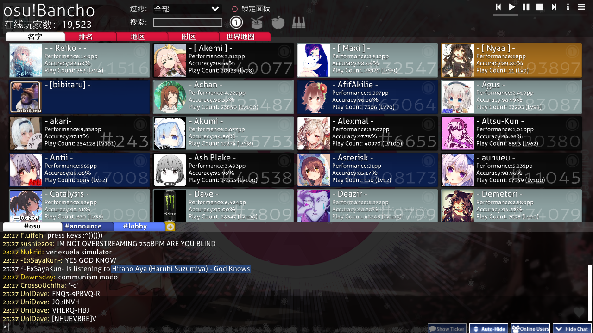
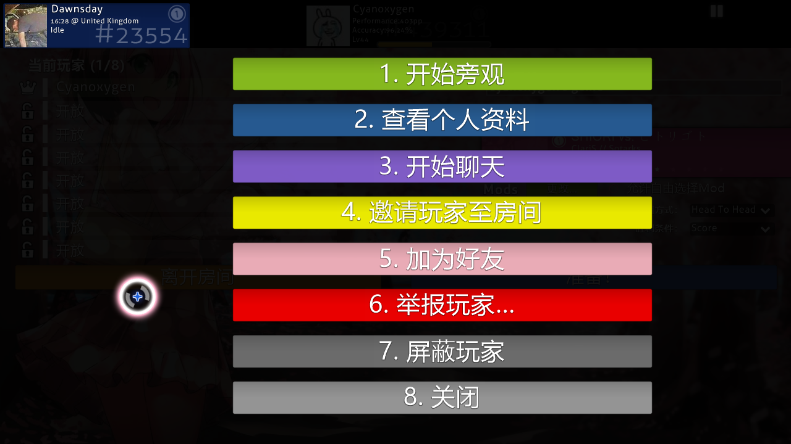

# 聊天面板

在 osu! 的绝大多数界面中，你都可以按下 `F8` 或者点击屏幕右下角的 `Show Chat` 按钮来把聊天面板叠加在屏幕的下方。

- 所有当前加入的频道均会在这一排选项卡中显示。仅需在某个选项卡上点一下，就能切换到你想聊天的那个频道。点击黄色的加号按钮会显示可加入频道的列表。
- 不同颜色的用户名代表不同的含义，详情见表：

| 颜色 | 用户类型 |
| :-- | :-- |
| **白色** | 你自己 |
| **淡黄色** | 非 osu! 支持者用户 |
| **黄色** | [osu! 支持者](/wiki/osu!supporter)用户 |
| **红色** | [全局管理团队 (GMT)](/wiki/People/Global_Moderation_Team) 或[审核评估团队 (NAT)](/wiki/People/Quality_Assurance_Team) 的成员 |
| **绿色** | 含有你的用户名或某个你添加的可触发[高亮标记](Highlight)的关键词的消息。高亮消息的副本也会出现在单独的 `#highlight` 频道中。 |
| **蓝色** | 私信消息 |
| **蓝绿色** | osu! 的创造者 [peppy](https://osu.ppy.sh/users/2) |
| **粉色** | [BanchoBot](/wiki/BanchoBot) 机器人 |

- 点击 `Show Ticker` 按钮将在聊天面板不可见的情况下，在屏幕最底部一行显示当前频道里最新的消息。
- 点击 `Auto-Hide` 按钮将在游戏时自动隐藏聊天面板 （除谱面前奏、结尾和休息时段外）。
- 点击 `Hide Chat` 按钮或者按下 `F8` 可以隐藏聊天面板。

## 扩展聊天面板

*[osu! 学院](/wiki/Community/Video_series/osu!academy)[第 6 集 (6:52)](https://www.youtube.com/watch?v=cyYRl-a5xII) 介绍了该节和[多人游戏](/wiki/Client/Interface/Multiplayer)的内容。*

你可以在 osu! 的绝大多数界面中按下 `F9` 或者在主屏幕按下屏幕右下角的 `Online users` 以打开扩展聊天面板。与聊天面板不同的是，在线用户面板占用了屏幕的三分之二，会显示 osu! 目前在线用户的信息。

每个已登录 osu! 的用户都会在扩展聊天面板中以小卡片的形式出现。它默认会展示该用户的基本信息（用户名、排名总分、排名、准确度、游玩次数以及该用户的头像（如果有））。当鼠标指针位于卡片上时，它就会显示另外一些信息（用户名、排名、头像（如果有）、当地时间、时区、所在国家。如果用户允许，还会显示具体位置以及用户正在做什么）。

- “好友”分类下仅会显示你的在线好友。
- 锁定面板可以防止面板上的用户们跳来跳去，也可以阻止显示新登录的用户。
- 点击某个标签页可以将所有登录的用户按相应顺序排列。
- 点击“世界地图”会展示一幅标示用户登录位置的地图。
- 你可以拖拽右侧的滚动条，也可以使用鼠标滚轮来滚动屏幕。
- 如果某个用户的方格里没有显示任何信息，那么该用户就是在 IRC 客户端上登录聊天。

| 卡片颜色 | 注释 |
| :-- | :-- |
|  | 深蓝色 - 正在空闲中或者只是在聊天。 |
|  | 灰色 - 正在单人游戏中。 |
|  | 靛蓝色 - 正在观看回放或正在旁观他人。 |
|  | 红色 - 正在编辑本地谱面。 |
|  | 紫色 - 正在测试自己的谱面。 |
|  | 蓝绿色 - 正在提交（上传或更新）所制作的谱面。 |
|  | 绿色 - 正在摸图或编辑他人的谱面。 |
|  | 棕色 - 玩家在多人游戏房间中，但未开始游戏。 |
|  | 黄色 - 正在进行多人游戏。 |
|  | 黑色 - 目前不活跃或者离开了电脑 (afk)。 |
|  | 深蓝色，没有任何内容 - 玩家并未登录游戏但登录了 IRC 客户端聊天，或者该玩家的状态目前不可用。 |

点击一个用户，屏幕将显示一些选项，如图所示。

按下对应的数字按键或者点击即可激活该功能：

1. `开始旁观`：当该用户正在游戏，并且你有其所玩的谱面时，你可以在用户游戏时旁观。你的名字将出现在该用户的旁观者列表中。
2. `查看个人资料`：在浏览器中打开该用户的个人资料页面。
3. `开始聊天`：打开一个和该用户私聊的选项卡。
4. `邀请用户至房间`：（仅在多人游戏房间中可用）将该用户邀请到你的房间。
5. `添加/删除好友`：添加该好友到你的好友列表，或者将其从中删除。
6. `举报用户`：举报用户的不当行为。除非另有说明，否则不得使用。你可以在游戏内出于一些原因举报用户，也可以在网页中（如论坛中）进行举报。
7. `屏蔽用户`：该用户的所有聊天消息都不会显示在你的聊天窗口中。
8. `关闭`：关闭当前屏幕。

## 命令列表

### 帮助 (/help)

| 命令 | 作用 | 示例 | BanchoBot 的回复 |
| :-- | :-- | :-- | :-- |
| `/addfriend [用户]` | 将`[用户]`添加到好友列表。 | `/addfriend Amigo` | 你和 Amigo 现在是好友了。 (You are now friends with Amigo.) |
| `/delfriend [用户]` | 将`[用户]`从好友列表中移除。 | `/delfriend Amigo` | 你和 Amigo 已不再是好友。 (You are no longer friends with Amigo.) |
| `/away [消息]` | 设置离开消息（将回复至私信你的用户）。将消息留空以取消离开状态。 | `/away 我是 John Smith.` | 你已被标为离开：我是 John Smith. (You have been marked as being away: 我是 John Smith.) 当 Amigo 在私信 John 问他在哪儿时，BanchoBot 将回答： `我是 John Smith`. |
| `/bb` | 给 Bancho 发送消息以执行命令（比如 `!stats [用户]`）。如： rank `[number]` | `/bb !stats Uan` | \[15/11/12\] Stats for [Uan](https://osu.ppy.sh/users/147623): Score: 47,323,299,680 (#1) Plays: 176293 (lv102) Accuracy: 98.95% |
| `/chat [用户]` 或 `/msg [用户]` 或 `/query [用户]` | 打开指定用户的聊天标签页。 | `/chat Amigo` | （会打开 Amigo 标签页） |
| `/clear` | 清除当前聊天标签页的全部内容。 | `/clear` | （ 基本上，当前标签页下的所有内容均会被清除 ） |
| `/ignore [用户][@chp]` | 在本次登录中忽略特定用户的所有消息。在后面加上 @ 和/或 c、 h、 p 字母，可以分别从聊天、[提及你的消息](Highlight)和私信中屏蔽该用户。 | `/ignore Amigo@chp` | BanchoBot: 你不会再收到 Amigo 的{聊天消息}{提及你的消息}{私信}。 (You will no longer hear Amigo {chat} {highlights} {PM}) （你的聊天面板被设为：\[c\] 屏蔽 Amigo 发送的任何消息，\[h\] 屏蔽 Amigo 发送的任何提及你名字的消息，\[p\] 屏蔽 Amigo 给你发送的任何私信） |
| `/j [频道]` 或 `/join [频道]` | 加入指定的频道。 | `/join #lobby` | （会打开 #lobby 标签页） |
| `/p` 或 `/part` | 离开当前加入的频道。 | `/part` | 未知 |
| `/unignore [用户]` | 取消屏蔽在此次登录时所屏蔽的用户。 | `/unignore Amigo` | 你现在能收到 Amigo 的消息了。 (You may now hear Amigo.) （你的聊天窗口将重新显示 Amigo 所发的消息 ） |
| `/me [动作]` | 以第三人称发送消息。 | `/me 在家` | * John 在家 |
| `/np` | 发送你当前正在听或游玩的歌曲。 | `/np` | （当游玩时） \* John is playing [Peter Lambert - osu! tutorial\[Gameplay Basics\]](https://osu.ppy.sh/beatmapsets/3756#osu/22538) |
| `/reply` 或 `/r` | 回复最近一条收到的私信。 | `/r 你知道什么好医生吗？` | （在 Amigo 标签页下） \[历史消息\] John: 我生病在家。 Amigo: 真的？ John: 你知道什么好医生吗？ |
| `/savelog` | 将当前标签页中的聊天记录存储为文件。 | `/savelog` | （在 osu! 目录下将创建一个名为 “Chat” 的文件夹，包含在该标签页下的所有聊天记录） |
| `/watch [用户]` | 开始旁观`[用户]`。 | `/watch Amigo` | \* 已开始旁观 Amigo。 (Started spectating Amigo.) （当 Amigo 玩你也拥有的谱面时，\[经过一段时间的缓冲之后\]你将可以旁观，Amigo 的屏幕左边也会出现你的名字。） |
| `/nopm` | 设置允许所有人的私信，或仅允许好友的私信。 | `/nopm` | （屏幕中央会弹出一个横幅，显示你允许来自所有人的还是仅好友的私信） |
| `/invite [用户]` | 给`[用户]`发送一个链接以将其邀请到你所在的房间。 | `/invite Nathanael` | \* Nathanael 已被邀请至你所在的房间 (Nathanael has been invited to the game) |

### 按键功能 (/keys)

| 键盘按键 | 作用 |
| :-- | :-- |
| `Page Up` / `Page Down` | 滚动聊天窗口。你也可以使用鼠标滚轮来滚动。 |
| `Tab` | 自动补全你要输入的用户名。 |
| `F8` | 打开或关闭聊天面板。 |
| `F9` | 打开或关闭在线用户面板。 |
| `Ctrl` + `C` / `V` | 复制/粘贴。 |
| `Alt` + `0` - `9` | 切换到对应数字的标签。 |
