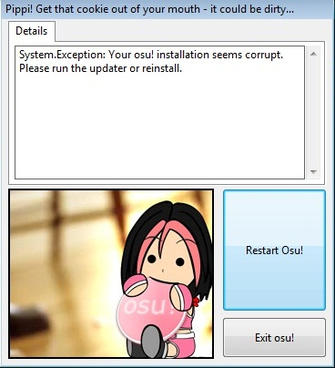

# Galleta

*Véase también: [Directrices de identidad de marca](/wiki/Brand_identity_guidelines)*

**Galleta** es otra palabra para el logo de osu! y se refiere a su forma. La galleta aparece muchas veces en el cliente del juego. Se puede ver en la pantalla de inicio, el menú principal, el modo solo y anteriormente en los informes de fallos, como se ve a continuación.

## Historia

### osu!(stable)

La siguiente tabla muestra todas las galletas usadas a lo largo de la historia de osu! con fines de archivo.

| Galleta | Año | Notas |
| :-: | :-: | :-- |
|  | 2007 | Usa la fuente *Verdana*. |
|  | 2008 | Usa la fuente *Verdana*. |
|  | 2009 | Usa la fuente *Verdana*. |
|  | 2011 | Usa la fuente *Verdana*. |
|  | 2011 | Usa la fuente *Verdana*. |
|  | 2014 | Usa la fuente *Aller*. |
|  | 2016 - presente | Usa la fuente *Aller* |

### osu!(lazer)

La siguiente tabla muestra todas las galletas usadas a lo largo de la historia de osu!(lazer) con fines de archivo.

| Galleta | Año | Notas |
| :-: | :-: | :-- |
|  | 2019 | Usa la fuente *Aller*, solo se usó como icono temporal de la aplicación para distinguir osu!(lazer) de osu!(stable). |
|  | Enero de 2024 - mayo de 2024 | Usa la fuente *Torus*, solo se usó durante un breve periodo de tiempo debido a las críticas. |
|  | Mayo de 2024 - presente | Usa la fuente *Torus*. |
