<!-- TODO: needs further rewrite, see https://github.com/ppy/osu-wiki/issues/7165 -->

# Multiplayer

**Multiplayer** (sometimes shortened to *Multi*) is a mode in which up to 16 players can compete against each other individually or in teams, or play together co-operatively, on maps decided by the host.

The [osu!academy](/wiki/Community/Video_series/osu!academy) covers this part of the client in video format in [Episode 6](https://www.youtube.com/watch?v=QPTLyG7O8ak), along with the [online users panel](/wiki/Client/Interface/Chat_console#extended-chat-console).

## How to play

*Notice: Multiplayer requires an [osu! account](/wiki/Registration) and is not available for [silenced](/wiki/Silence) players.*

From the main menu, the main multiplayer lobby can be accessed with the following steps:

1. Click the `Play` button or press `P`.
2. Click the `Multi` button or press `M`.

## Main lobby

*Notice: An active [osu!supporter](/wiki/osu!supporter) tag is required to enter the lobby while using the `Cutting Edge` build.*

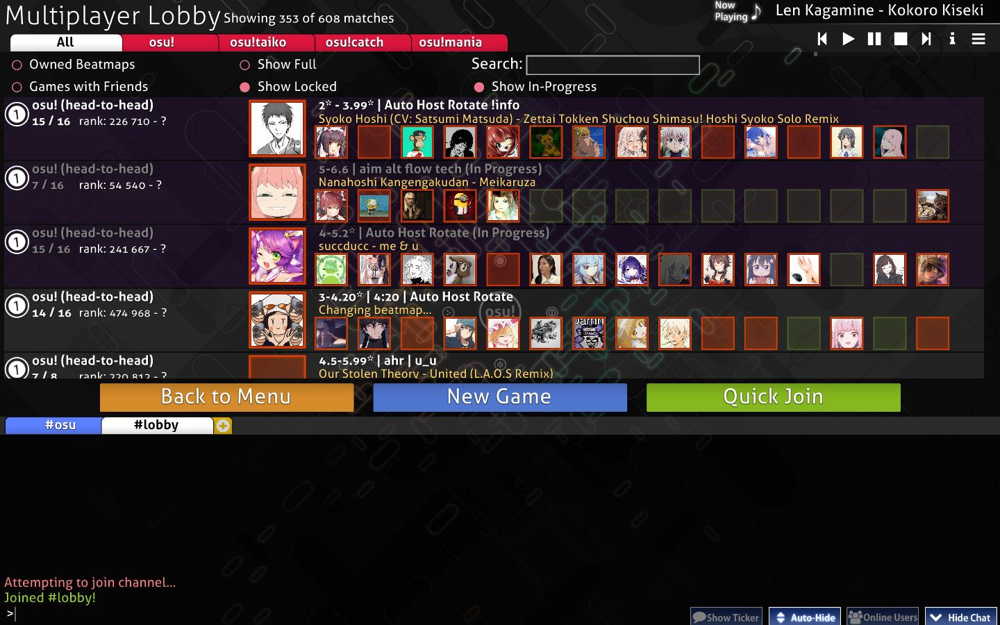

On entering, the player is presented with all currently available matches.

### Filter options

The listed match lobbies can be filtered using the options at the top left.

| Title | Description |
| :-: | :-- |
| `All` / `osu!` / `osu!taiko` / `osu!catch` / `osu!mania` | Only show matches either with the currently selected [game mode](/wiki/Game_mode) or from all game modes. |
| `Owned Beatmaps` | Only show matches if the player owns the [beatmap](/wiki/Beatmap) currently being played. |
| `Show Full` | Show matches even if they have no empty slots available. |
| `Search` | Search for a specific beatmap being played or the host's name using the search bar. When searching, all filters will temporarily be ignored except `Show In-progress`. |
| `Games with Friends` | Only show matches the player's friends are playing in. This filter option will override all other filters when enabled. |
| `Show Locked` | Show matches that require a password to enter. |
| `Show In-progress` | Show matches that are currently being played. These can still be entered if there are empty slots available. They are indicated with a grey match title and with `(In progress)` appended to it until the match ends. |

### Matches

Covering the middle of the screen is a list of available matches.

Most matches have light white backgrounds, indicating that they were [created normally through the game UI](#creating-a-new-game). There are also ones with purple backgrounds, which are *tournament matches* created and managed using [lobby management chat commands](/wiki/osu!_tournament_client/osu!tourney/Tournament_management_commands) such as `!mp make` or `!mp makeprivate`.

A variety of information is displayed about each lobby. For example, the player slots to the right can have three different colours:

| Colour | Description |
| :-: | :-- |
| Red | The slot is taken by a player. |
| Green | The slot is available. |
| No colour | The slot is locked. |

To enter a match, click on any one of them.

### General options

The three buttons above the [chat console](/wiki/Client/Interface/Chat_console) provide the main navigation options of this screen:

| Title | Description |
| :-: | :-- |
| `Back to Menu` | Leave the lobby and return to the main menu. |
| `New Game` | Create a new game. See below for more details. |
| `Quick Join` | Join an available match *randomly* based on the player's current [performance points ranking](/wiki/Ranking#performance-points-ranking). |

## Creating a new game

::: Infobox
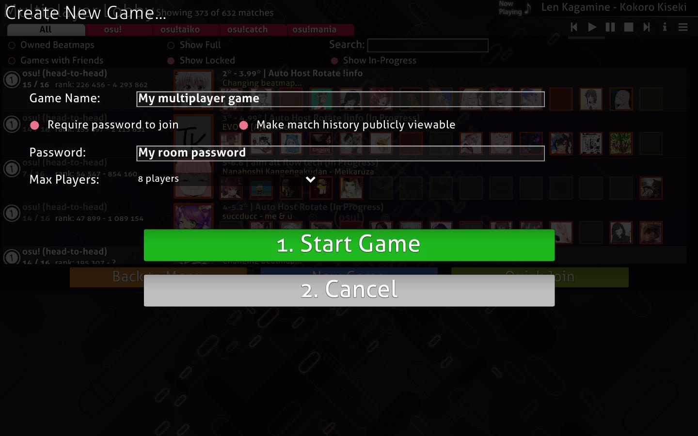
:::

| Title | Description |
| :-: | :-- |
| `Game Name` | The name of the match. The default value is `{account name}'s game`. |
| `Require password to join` | Make the match private. |
| `Password` | Set a password for the match. Only appears if the `Require password to join` button is enabled. |
| `Make match history publicly viewable` | Allow players other than match participants to view the match history via direct link. Only appears if the `Require password to join` button is enabled. |
| `Max Players` | The total number of players (including the host) allowed to join the match. A range from 2 to 16 can be selected, with a default of 8. This can be adjusted later by locking/unlocking player slots. |

Pressing the `1. Start Game` button will create the match with the currently playing song as the beatmap. The `2. Cancel` button brings the player back to the lobby.

## Match setup

::: Infobox
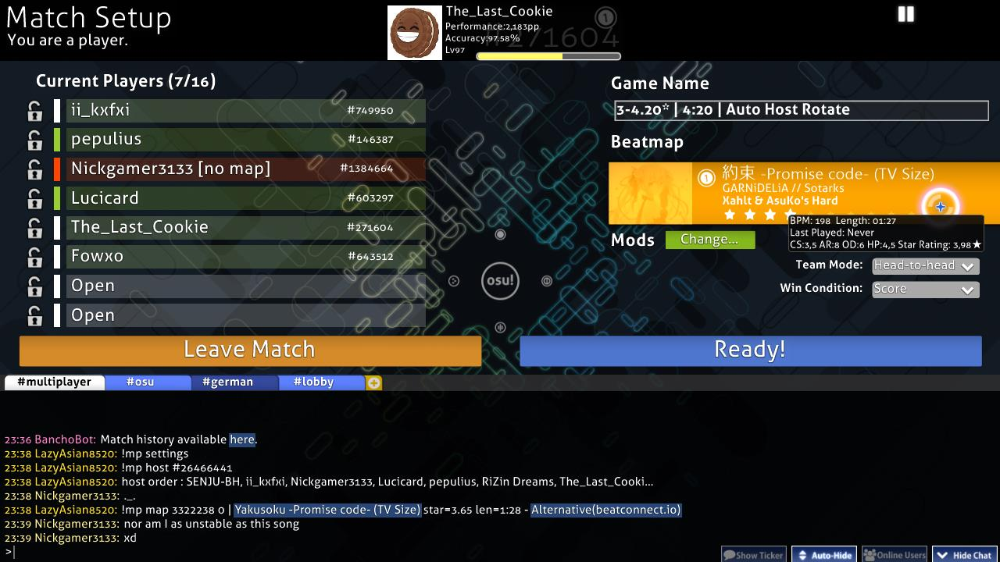
:::

After going into or creating a match, the match setup will be displayed. The following sections will focus on the different parts of the screen starting from top to bottom and going left to right.

While there is no direct button for it, the [options menu](/wiki/Client/Options) can still be accessed by pressing `Ctrl` + `O` while in a match lobby.

### Header section

The top-left text indicates whether the player is the match host or a normal player. In the middle, there is a player box with information about [performance points](/wiki/Performance_points/Total_performance_points), [overall accuracy](/wiki/Gameplay/Accuracy), [level](/wiki/Gameplay/Score/Total_score#level), [rank](/wiki/Ranking#performance-points-ranking) and the selected [game mode](/wiki/Game_mode). To the right is a button for pausing the currently playing song.

### Current players list

::: Infobox

:::

The player list shows all slots for a match. The numbers in parentheses to the right of `Current Players` show the number of players in the match over the amount of unlocked player slots.

Available slots can be moved between by clicking on them, but slots indicated with a closed lock are not accessible. The host is able to lock and unlock slots through the icons on the left, as well as kick players. Host privileges can be transferred to another player by right-clicking and pressing `Transfer host privileges`. The team colour can be changed between blue and red when playing Team VS.

Hovering above any player on the list will show the level, country and [overall accuracy](/wiki/Gameplay/Accuracy) of the player in question.

A player can have four different colours in this list, which also mean different things:

| Colour | Description |
| :-: | :-- |
| **Red (no map)** | The player does not have the beatmap, indicated by a `[no map]` notice until they have downloaded the beatmap. |
| **White (not ready)** | The player has the beatmap but is not ready yet. [Game modifiers](/wiki/Gameplay/Game_modifier) can be changed in this state. |
| **Green (ready)** | The player is ready. Game modifiers cannot be changed in this state. The host will be able to start the game after readying, and any ready players will begin the match. |
| **Light Blue (playing)** | The player is playing, indicated by a `[playing]` notice until the match ends. |

### Match settings

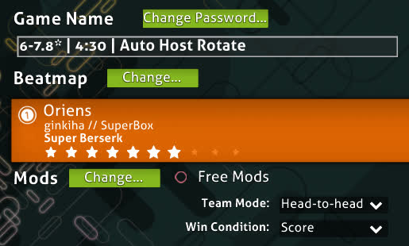

#### Game name and password

The `Game Name` is the name of the lobby that is visible in match listings in-game and on the website. Having a password is useful for restricting the lobby to friends or tournament players, and can be changed using the `Change Password` button above the game name.

#### Beatmap

::: Infobox
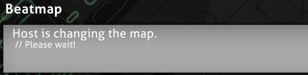
:::

::: Infobox
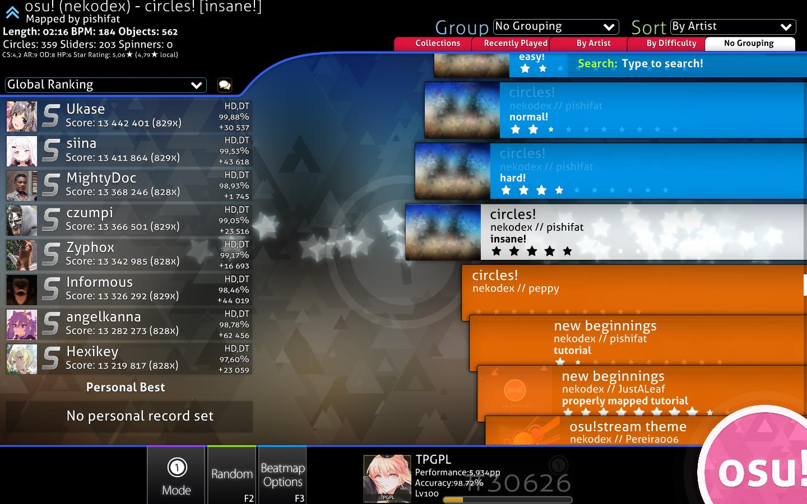
:::

The beatmap section shows the beatmap to be played in the match. Changing the beatmap using the button above it opens the song selection screen.

The beatmap card will show the background image, game mode icon, title and artist of the song, creator of the beatmap, the selected [difficulty](/wiki/Beatmap/Difficulty), and the [star rating](/wiki/Beatmap/Star_rating) for the selected beatmap.

::: Infobox

:::

When hovering over the beatmap, there is a popup that displays information about the beatmap. These are as follows:

| Value | Description |
| :-: | :-- |
| `BPM` | Beats per minute |
| `Length` | Length of the beatmap |
| `Last Played` | When the beatmap was last played |
| `CS` | Circle size |
| `AR` | Approach rate |
| `OD` | Overall difficulty |
| `HP` | HP drain rate |
| `Stars` | Star rating |

If the player does not have the beatmap, one of these statuses will be shown:

| Beatmap status | Description |
| :-: | :-- |
| `Ranked` / `Approved` / `Pending` / `Graveyard` | The [beatmap category](/wiki/Beatmap/Category). Clicking on the beatmap card will open the beatmap page on the website, where it can be [downloaded](/wiki/Beatmap#downloading-beatmaps). |
| `Not uploaded or not up-to-date` | The beatmap is not available for download. The host should find the link (in the [beatmap listing](https://osu.ppy.sh/beatmapsets)) for the player if the issue persists. |
| `Cannot update the beatmap` | The host is playing a modified version of the beatmap. |

#### Mods

::: Infobox

:::

This section will show the [game mods](/wiki/Gameplay/Game_modifier) used for this match.

The host can enable `Free Mods` to allow players to freely choose any mod combination, except ones that change gameplay speed ([Double Time (DT)](/wiki/Gameplay/Game_modifier/Double_Time), [Nightcore (NC)](/wiki/Gameplay/Game_modifier/Nightcore) and [Half Time (HT)](/wiki/Gameplay/Game_modifier/Half_Time)).

#### Team mode {id=team-mode-match-setup}

*For more information about team modes, see the [gameplay section on team modes](#team-mode-gameplay).*

There are four different ways a match can be played:

| Team mode | Description |
| :-- | :-- |
| `Head-to-head` | Compete against each other to reach the top spot of the match leaderboard. |
| `Team VS` | Compete against each other in teams (Red and Blue) for match supremacy. |
| `Tag co-op` (osu! mode only, unranked) | Team up to complete the beatmap, one combo at a time together. |
| `Tag-team VS` (osu! mode only, unranked) | The same as `Tag co-op`, but with two teams competing against each other. |

##### Tag Colour

::: Infobox

:::

If the team mode was set to `Tag co-op` or `Tag-team VS`, a `Tag Colour: (combo colour)` section will be shown which allows choosing a custom colour for each player. Setting this to `Default` will use the beatmap's original combo colours.

#### Win condition

There are four different ways the winner of a match can be decided:

| Title | Description |
| :-: | :-- |
| `Score` | The player with the highest score wins. |
| `Accuracy` | The player with the highest accuracy wins. If there are two players with 100.00%, the player with the highest score (from spinners) wins. Otherwise, it is a tie. |
| `Combo` | The player with the highest combo count *at the end of the beatmap* wins. If the combo count is the same, the player with the highest score wins. The maximum combo is not counted in this case. |
| `Score v2` | The player with the highest (standardised) score wins. |

### Match setup buttons

There are two large wide orange and blue buttons above the [chat console](/wiki/Client/Interface/Chat_console).

The orange `Leave Match` button on the left is self-explanatory. If the match host leave the match, the host will be automatically transferred to the remaining player in slot order. If there is no one in the match, it will automatically close, except for ones made by [`!mp` commands](/wiki/osu!_tournament_client/osu!tourney/Tournament_management_commands), which will instead close after 30 minutes.

The blue button is used to control the player ready state and to start the match.

| Title | Description |
| :-: | :-- |
| `Ready!` | Marks the player as ready (green on the player list). The button will change to `Not Ready`. For the match host, it will change to either `Start Game!` or `Force Start Game!` if there are players in the lobby. |
| `Not Ready` | Marks the player as not ready (white on the player list). The button will change to `Ready!` |
| `Start Game!` | Starts the match. This button only appears for the match host when all players are ready. |
| `Force Start Game! ({ready}/{total})` | Starts the match even if not all players are ready. This button only appears for the match host when some players are ready. The amount of ready players compared to the total amount of players is shown in parentheses. |

### Match history

::: Infobox
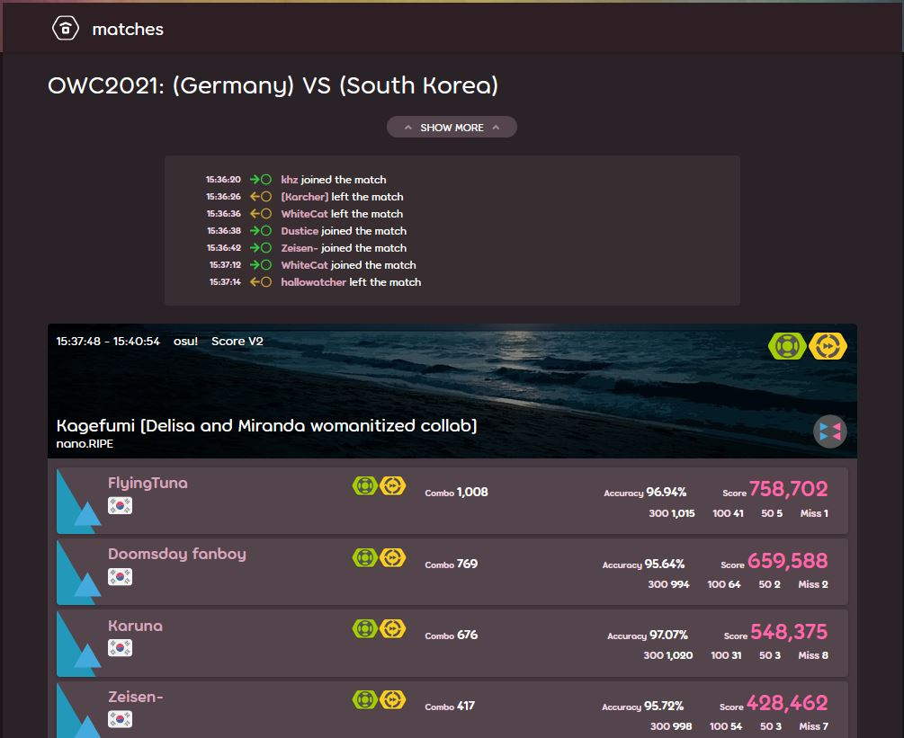
:::

The bottom section of the screen is the [chat console](/wiki/Client/Interface/Chat_console). Every match has its own channel in a tab called `#multiplayer`, with [BanchoBot](/wiki/BanchoBot) providing a link to the match history on the first line.

For Head-to-head matches, the result will be displayed privately in another tab called `#userlog` upon conclusion, where BanchoBot says `You placed #{placement} of {total} players in multiplayer on {beatmap} [difficulty] <game mode>.`

## While playing

### General

#### Quitting the match

There is no way to pause a multiplayer match. Pressing `Esc` will give a warning in the lower-right corner, and pressing it again will quit the match.

#### Visual settings

While the match is starting, moving the cursor to the bottom of the screen will open the visual settings panel. See the [Visual settings](/wiki/Client/Interface/Visual_settings) page for more information.

#### Health

When a player's health bar has been depleted completely, they can still continue playing, but the score will be considered as failed and will not appear on leaderboards. The player can be revived if they reach full health again, unless they use [Sudden Death (SD)](/wiki/Gameplay/Game_modifier/Sudden_Death).

In Team VS matches, being in the failed state at the end of the match will make the score not contribute to the team score. If all players of a team have failed, the match immediately ends and the opposite team wins by default.

#### Results

Despite there being no [extended results screen](/wiki/Client/Interface#extended-results-screen) below the results screen like when playing solo, scores set during multiplayer matches (with the exception of `Tag co-op` and `Tag-team VS` matches) will still appear on online leaderboards if they are good enough. The result will not be shown on the local leaderboard.

#### Saving the replay

The replay of the score can be exported by pressing `F2`, except in `Tag co-op` and `Tag-team VS`.

#### Multiplayer leaderboard

The leaderboard to the side of the screen shows different live statistics for each player based on the match settings.

For `Head-to-head` and `Team VS` matches:

| Win condition | Statistics displayed |
| :-- | :-- |
| `Score` / `Score v2` | Individual score, combo multiplier, judgements |
| `Accuracy` | Accuracy, individual score, combo multiplier, judgements |
| `Combo` | Current combo counts |

For `Tag co-op` and `Tag-team VS`:

| Win condition | Statistics displayed |
| :-- | :-- |
| `Score` / `Score v2` | Team score, individual score, judgements |
| `Accuracy` | Team average accuracy, individual score, judgements |
| `Combo` | Current combo count, individual score, judgements |

If a player fails during a Tag co-op match, the match ends and the players return to the match lobby. In Tag-team VS, the opposing team receives a win by default instead. Failed players do not contribute towards the team unless they have been revived by the end of the match.

If a player quits while being in a match, the game will perfectly play their part for them, but not contribute anything to the team. If all players of a team quit, the opposing team will win by default.

Players who have failed or quit will be placed at the bottom of the leaderboard with their scores sorted separately from other players.

The colour of each player on the leaderboard while playing indicates the status of the player during the match.

| Example image | Status | Description |
| :-: | :-: | :-- |
|  | Normal | The player has more than half of their health. The colour will become a brighter blue or bleed to red depending on the player's health. |
| 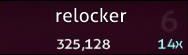 | Danger | The player has less than half of their health. The colour will become a brighter red or change to blue depending on the player's health. |
|  | Failed | The player has reached 0 HP and is in the [failed state](#health). |
|  | Tag | In `Tag co-op` and `Tag-team VS`, the player box will always be green. A green arrow points at the current player with a subtle white glow. |
| 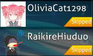 | Skipped | A request from the player to skip the intro of a beatmap if there is one. The intro will be skipped once all players have requested to skip. |
|  | Quit | The player has quit the match, either by pressing `Esc` twice or by disconnecting from [Bancho](/wiki/Bancho_(server)). The text colour will be changed from white to red, with `[Quit]` appended at the end. The box colour signifies the status before quitting the game. |

### Team mode {id=team-mode-gameplay}

#### Head-to-head

##### Interface

::: Infobox
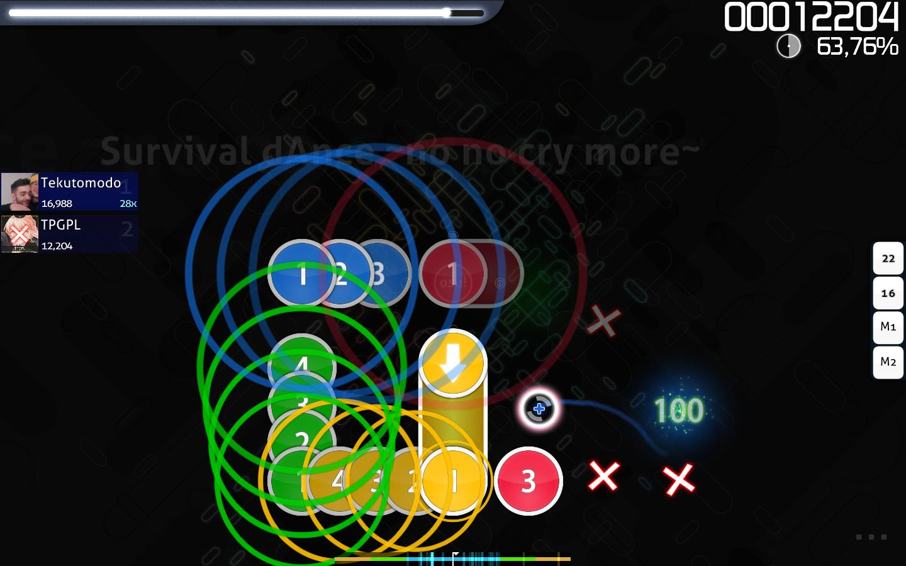
:::

Head-to-head is a team mode where players duke it all out in a free-for-all match for the top spot on the leaderboard. This is the default team mode and does not have any special characteristics in gameplay, other than going for the top spot.

##### Results

::: Infobox

:::

At the end of the match, the winner's avatar is shown in a big winner's box, along with the match leaderboard to the right

The [grade](/wiki/Gameplay/Grade) for the play is placed behind the result like a watermark. Other players' results can be checked by clicking on their panel on the leaderboard.

Each player will receive their match result as a private message in the `#userlog` tab in [chat](/wiki/Client/Interface/Chat_console).

#### Team VS

##### Interface

::: Infobox

:::

Team VS pits two teams, Blue and Red, against each other.

Blue is on the left and Red is on the right. A crown at the centre moves left and right to show which team is currently winning.

Changing teams can be done while in the lobby. There is no handicap for teams with fewer members, and it is entirely possible to start a match with only one team.

##### Results {id=team-vs-results-screen}

::: Infobox
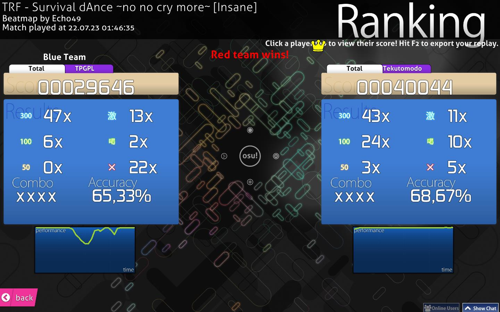
:::

The winning team is announced at the top of the results screen.

Only players who are alive by the end of the match count towards their teams' totals.<!-- TODO: clarify which statistics this is about -->

The panels to the sides show results for each player in different tabs. The `Total` tab shows the total count of [judgements](/wiki/Gameplay/Judgement) for both teams and their average accuracy.

#### Tag co-op / Tag-team VS

##### Interface

*Note: This team mode is unranked and only available in osu! mode.*

::: Infobox
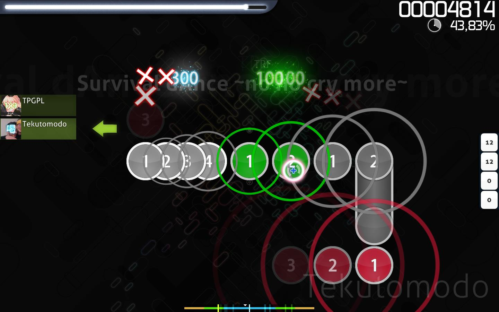
:::

::: Infobox
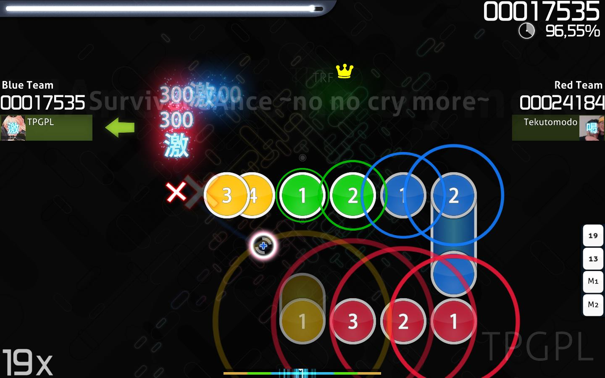
:::

Tag co-op makes all players in the match work together to pass the beatmap, one combo at a time. `Tag-team VS` is just `Tag co-op` but with two teams playing against each other.

In this mode, the players' slot placement in the lobby determines the order they play in.

A green arrow will show the player who is currently playing, and their name will be shown at the lower right. Warning arrows indicate when it is about to be the player's turn and the hit objects will be coloured. The player can set a fixed combo colour at the match setup the [Tag Colour](#tag-colour) section in the match lobby.

All players must spin the spinner, or the combo will break.

If a player quits during the match, the game will play their part for them.

All players share the same health bar. If it depletes completely, the match ends. In Tag-team VS, each team has their own health bars, and losing all health will cause that team to lose.

Players using the [Sudden Death (SD)](/wiki/Gameplay/Game_modifier/Sudden_Death) game modifier will cause the whole match to end if they fail due to it, even in Tag-team VS. If [Easy (EZ)](/wiki/Gameplay/Game_modifier/Easy) is used, players can still get two extra lives. However, in Tag-team VS, when a team's health drops to zero, even though the [health bar](/wiki/Client/Interface/Health_bar) will be refilled, the match will judge them as *failed* and end immediately.

##### Results

::: Infobox
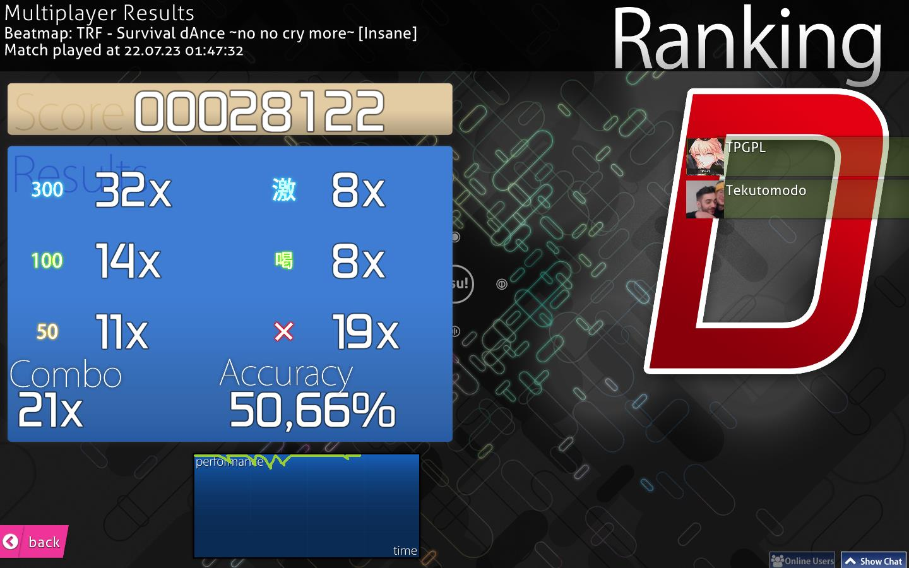
:::

::: Infobox
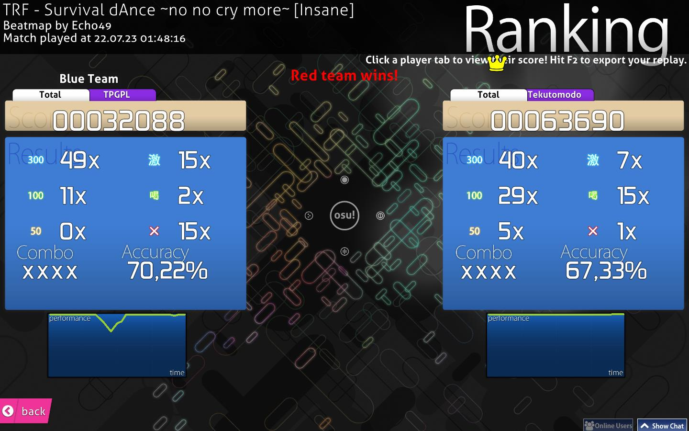
:::

No ranked score or performance points are awarded for `Tag co-op` or `Tag-team VS` matches.

For `Tag co-op`, the result shown is the total score, the [judgements](/wiki/Gameplay/Judgement) and accuracy of the team. Individual results are not shown, and can only be seen in the match history. The result screen only appears if the beatmap was cleared successfully, unlike other multiplayer modes.

The `Tag-team VS` results screen is identical to the [`Team VS`'s results screen](#team-vs-results-screen), except that individual results can be seen under different tabs for each team.

## Trivia

### History

::: Infobox
, but not yet playable in multiplayer")
:::

- The initial multiplayer version was implemented on June 3, 2008 in osu! Public Release b335.
- Match setup used to allow only up to a total of 8 players.
- osu!mania was shown as a "3" in the lobby for players that had not yet updated their client to the latest release patch (which enabled osu!mania with no ranking support).
- No Video used to be the *only* game modifier allowed for players to use, but it was removed in favour of its placement in the [visual settings](/wiki/Client/Interface/Visual_settings).
