# Multiplayer

::: alert-note
**Note:** For how multiplayer works, see [Multiplayer](/wiki/Gameplay/Multiplayer)
:::

::: alert-note
**See also:** [Quick play](/wiki/Gameplay/Quick_play) and [Daily challenge](/wiki/Gameplay/Daily_challenge)
:::

This article covers the parts of the game client used for [multiplayer](/wiki/Gameplay/Multiplayer): the lobby, match setup, and the gameplay methanics.

The [osu!academy](/wiki/Community/Video_series/osu!academy) covers this part of the client in video format in [Episode 6](https://www.youtube.com/watch?v=QPTLyG7O8ak), along with the [online users panel](/wiki/Client/Interface/Chat_console#extended-chat-console).

## Main lobby

::: alert-notice
**Notice**
An active [osu!supporter](/wiki/osu!supporter) tag is required to enter the lobby while using the `Cutting Edge (Experimental)` build.
:::

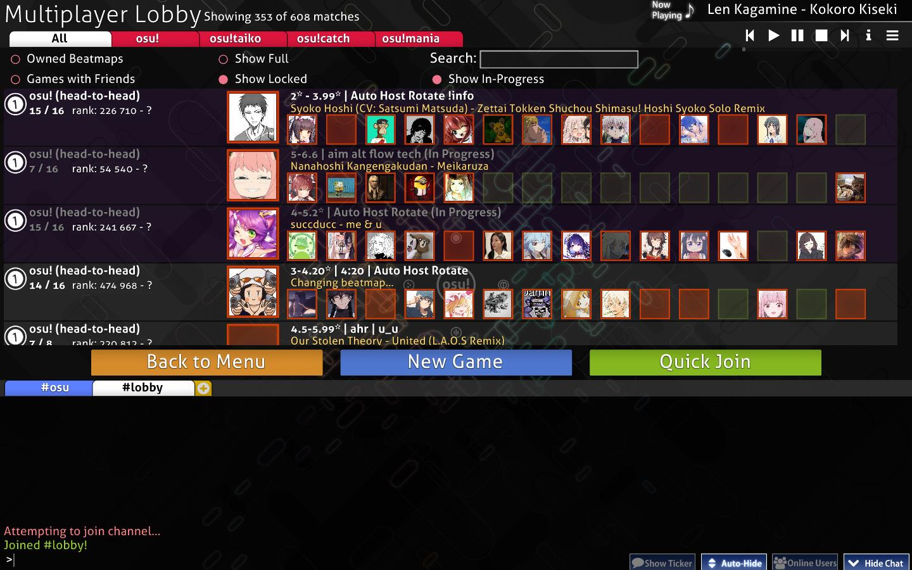

The lobby is opened from the main menu by clicking the `Play` button (or pressing `P`), and then the `Multi` button (or pressing `M`). On entering, the player is presented with all currently available matches.

### Filter options

The listed match lobbies can be filtered using the options at the top left.

| Title | Description |
| :-: | :-- |
| `All` / `osu!` / `osu!taiko` / `osu!catch` / `osu!mania` | Only show matches either with the currently selected [game mode](/wiki/Game_mode) or from all game modes. |
| `Owned Beatmaps` | Only show matches if the player owns the [beatmap](/wiki/Beatmap) currently being played. |
| `Show Full` | Show matches even if they have no empty slots available. |
| `Search` | Search for a specific beatmap being played or the host's name using the search bar. When searching, all filters will temporarily be ignored except `Show In-progress`. |
| `Games with Friends` | Only show matches the player's friends are playing in. This filter option will override all other filters when enabled. |
| `Show Locked` | Show matches that require a password to enter. |
| `Show In-Progress` | Show matches that are currently being played. These can still be entered if there are empty slots available. They are indicated with a grey match title and with `(In Progress)` appended to it until the match ends. |

### Matches

Covering the middle of the screen is a list of available matches.

Most matches have white backgrounds, indicating that they were [created normally through the game UI](#creating-a-new-game). Matches with purple backgrounds are [tournament matches](/wiki/Gameplay/Multiplayer#matches), created and managed using [lobby management chat commands](/wiki/osu!_tournament_client/osu!tourney/Tournament_management_commands) such as `!mp make` or `!mp makeprivate`.

A variety of information is displayed about each lobby. For example, the player slots to the right can have three different colours:

| Colour | Description |
| :-: | :-- |
| Red | The slot is taken by a player. |
| Green | The slot is available. |
| No colour | The slot is locked. |

To enter a match, click on any one of them.

### General options

The three buttons above the [chat console](/wiki/Client/Interface/Chat_console) provide the main navigation options of this screen:

| Title | Description |
| :-: | :-- |
| `Back to Menu` | Leave the lobby and return to the main menu. |
| `New Game` | Create a new game. See below for more details. |
| `Quick Join` | Join an available match *randomly* based on the player's current [performance points ranking](/wiki/Ranking#performance-points-ranking). |

## Creating a new game

::: Infobox
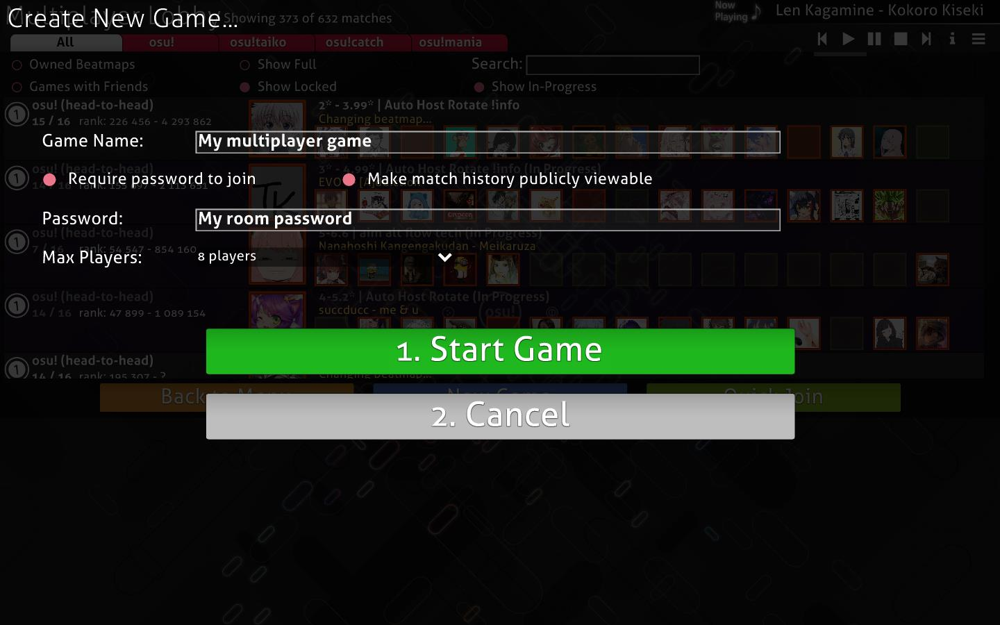
:::

| Title | Description |
| :-: | :-- |
| `Game Name` | The name of the match. The default value is `{account name}'s game`. |
| `Require password to join` | Make the match private. |
| `Password` | Set a password for the match. Only appears if the `Require password to join` button is enabled. |
| `Make match history publicly viewable` | Allow players other than match participants to view the [match history](/wiki/Gameplay/Multiplayer#match-history) via direct link. Only appears if the `Require password to join` button is enabled. |
| `Max Players` | The total number of players (including the host) allowed to join the match. A range from 2 to 16 can be selected, with a default of 8. This can be adjusted later by locking/unlocking player slots. |

Pressing the `1. Start Game` button will create the match with the currently playing song as the beatmap. The `2. Cancel` button brings the player back to the lobby.

## Match setup

::: Infobox
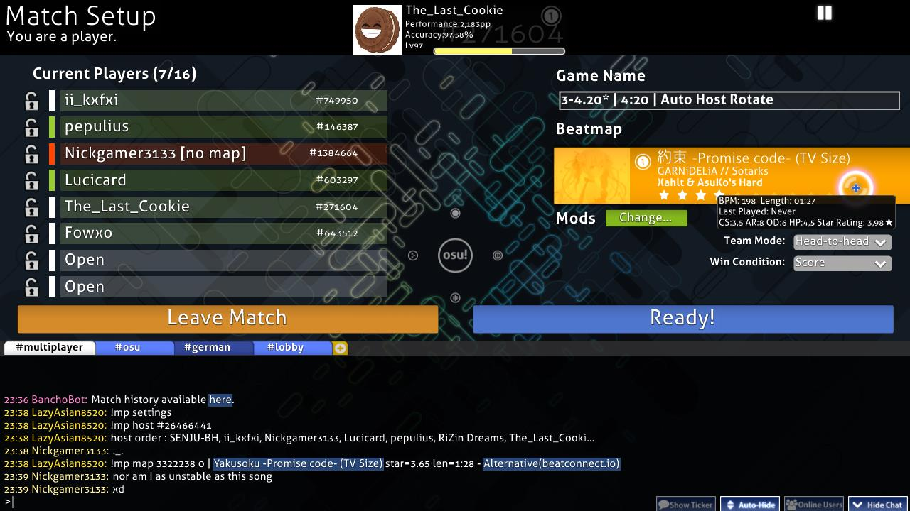
:::

After joining or creating a match, the match setup will be displayed. The following sections will focus on the different parts of the screen starting from top to bottom and going left to right.

While there is no direct button for it, the [options menu](/wiki/Client/Options) can still be accessed by pressing `Ctrl` + `O` while in a match lobby.

### Header section

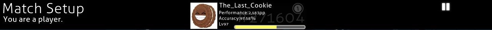

The top-left text indicates whether the player is the match host or a normal player. In the middle, there is a player box with information about [performance points](/wiki/Performance_points/Total_performance_points), [overall accuracy](/wiki/Gameplay/Accuracy), [level](/wiki/Gameplay/Score/Total_score#level), [rank](/wiki/Ranking#performance-points-ranking) and the selected [game mode](/wiki/Game_mode). To the right is a button for pausing the currently playing song.

### Current players list

::: Infobox
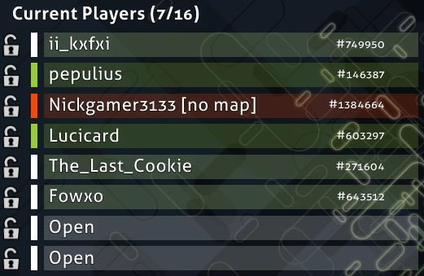
:::

The player list shows all slots for a match. The numbers in parentheses to the right of `Current Players` show how many players are in the match out of the total number of unlocked slots.

Clicking on an available slot moves the player to it, while slots indicated with a closed lock are not accessible. The [host](/wiki/Gameplay/Multiplayer#host) is able to lock and unlock slots through the icons on the left, as well as kick players. Host privileges can be transferred to another player by right-clicking and pressing `Transfer host privileges`. The team colour can be changed between blue and red when playing Team VS.

Hovering above any player on the list will show the level, country and [overall accuracy](/wiki/Gameplay/Accuracy) of the player in question.

Players in this list are highlighted with one of four colours, depending on their state:

| Colour | Description |
| :-: | :-- |
| **Red (no map)** | The player does not have the beatmap, indicated by a `[no map]` notice until they have downloaded the beatmap. |
| **White (not ready)** | The player has the beatmap but is not ready yet. [Game modifiers](/wiki/Gameplay/Game_modifier) can be changed in this state. |
| **Green (ready)** | The player is ready. Game modifiers cannot be changed in this state. The host will be able to start the game after readying, and any ready players will begin the match. |
| **Light Blue (playing)** | The player is playing, indicated by a `[playing]` notice until the match ends. |

### Match settings

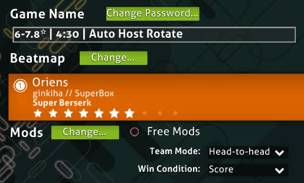

These settings can only be changed by the host, but are visible to everyone.

#### Game name and password

The `Game Name` is the name of the lobby that is visible in match listings in-game and on the website. Having a password is useful for restricting the lobby to friends or tournament players, and can be changed using the `Change Password` button above the game name.

#### Beatmap

::: Infobox
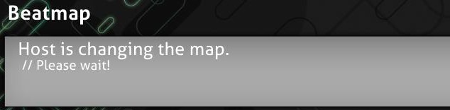
:::

::: Infobox
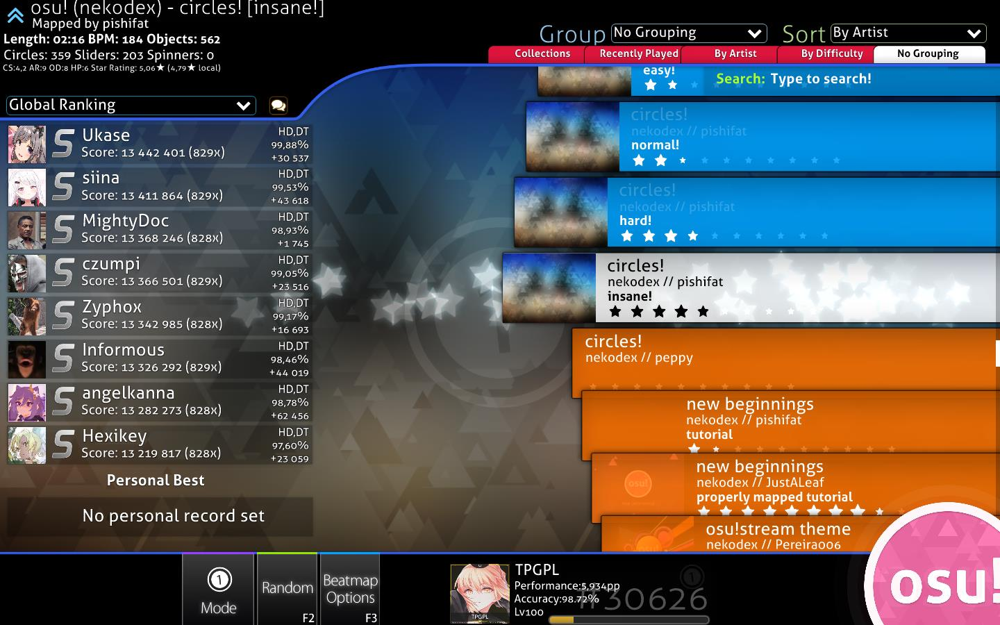
:::

The beatmap section shows the beatmap to be played in the match. Changing the beatmap using the button above it opens the song selection screen.

The beatmap card will show the background image, game mode icon, title and artist of the song, creator of the beatmap, the selected [difficulty](/wiki/Beatmap/Difficulty), and the [star rating](/wiki/Beatmap/Star_rating) for the selected beatmap.

::: Infobox
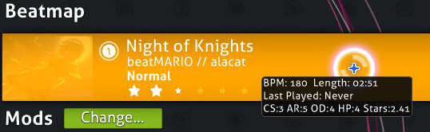
:::

When hovering over the beatmap, there is a popup that displays information about the beatmap. These are as follows:

| Value | Description |
| :-: | :-- |
| `BPM` | Beats per minute |
| `Length` | Length of the beatmap |
| `Last Played` | When the beatmap was last played |
| `CS` | Circle size |
| `AR` | Approach rate |
| `OD` | Overall difficulty |
| `HP` | HP drain rate |
| `Star Rating` | Star rating |

If the player does not have the beatmap, one of these statuses will be shown:

| Beatmap status | Description |
| :-: | :-- |
| `Ranked` / `Approved` / `Pending` / `Graveyard` | The [beatmap category](/wiki/Beatmap/Category). Clicking on the beatmap card will open the beatmap page on the website, where it can be [downloaded](/wiki/Beatmap#downloading-beatmaps). If the player has an active [osu!supporter](/wiki/osu!supporter) tag, the beatmap will be downloaded through [osu!direct](/wiki/osu!supporter#osu!direct) instead. |
| `Not uploaded or not up-to-date` | The beatmap is not available for download. The host should find the link (in the [beatmap listing](https://osu.ppy.sh/beatmapsets)) for the player if the issue persists. |
| `Cannot update the beatmap` | The host is playing a modified version of the beatmap. |

#### Mods

::: Infobox
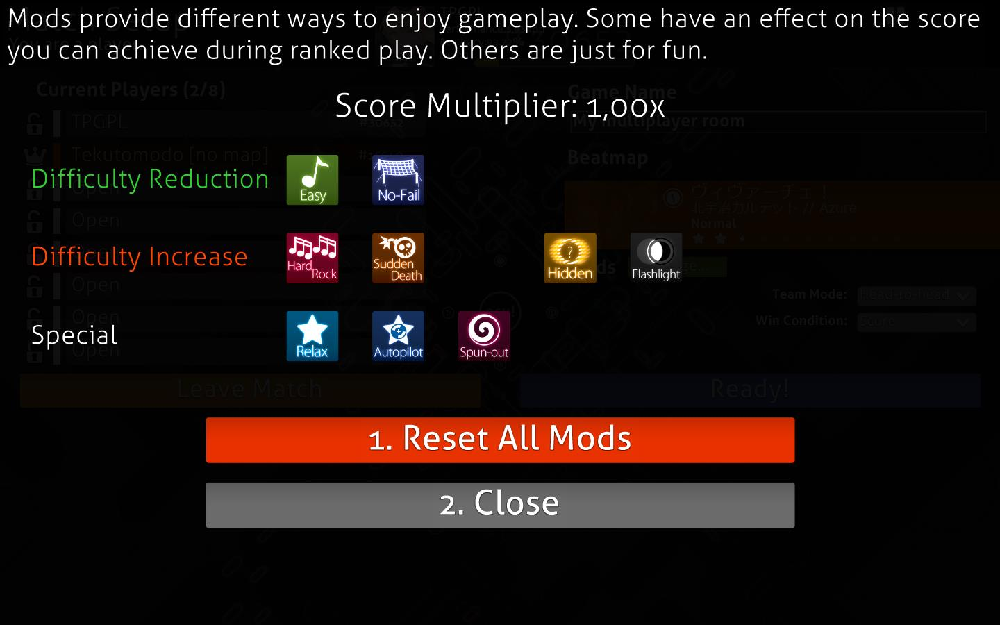
:::

This section shows the [mods](/wiki/Gameplay/Multiplayer#mods) used for this match. The host picks them on the mod selection screen, which also holds the `Free Mods` button that lets everyone else choose mods on their own.

#### Team mode and win condition

The two selectors at the bottom set the [team mode](/wiki/Gameplay/Multiplayer#team-modes) of the match and the [win condition](/wiki/Gameplay/Multiplayer#win-conditions) by which its winner is decided.

##### Tag Colour

::: Infobox
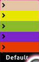
:::

If the team mode was set to `Tag co-op` or `Tag-team VS`, a `Tag Colour: (combo colour)` section will be shown which allows choosing a custom colour for each player. Setting this to `Default` will use the beatmap's original combo colours.

### Match setup buttons

There are two large wide orange and blue buttons above the [chat console](/wiki/Client/Interface/Chat_console).

The orange `Leave Match` button on the left is self-explanatory. See [Host](/wiki/Gameplay/Multiplayer#host) for what happens to the match afterwards.

The blue button is used to control the player ready state and to start the match.

| Title | Description |
| :-: | :-- |
| `Ready!` | Marks the player as ready (green on the player list). The button will change to `Not Ready`. For the match host, it will change to either `Start Game!` or `Force Start Game!` if there are players in the lobby. |
| `Not Ready` | Marks the player as not ready (white on the player list). The button will change to `Ready!`. |
| `Start Game!` | Starts the match. This button only appears for the match host when all players are ready. |
| `Force Start Game! ({ready}/{total})` | Starts the match even if not all players are ready. This button only appears for the match host when some players are ready. The amount of ready players compared to the total amount of players is shown in parentheses. |

### Chat console

The bottom section of the screen is the [chat console](/wiki/Client/Interface/Chat_console). Every match has its own channel in a tab called `#multiplayer`, with [BanchoBot](/wiki/BanchoBot) providing a link to the [match history](/wiki/Gameplay/Multiplayer#match-history) on the first line.

## While playing

The gameplay screen itself is the same as in solo play, with the multiplayer leaderboard and a few team mode specific parts on top of it.

While the match is starting, moving the cursor to the bottom of the screen will open the visual settings panel. See the [Visual settings](/wiki/Client/Interface/Visual_settings) page for more information.

### Multiplayer leaderboard

The leaderboard to the side of the screen shows different live statistics for each player based on the match settings.

For `Head-to-head` and `Team VS` matches:

| Win condition | Statistics displayed |
| :-- | :-- |
| `Score` / `Score v2` | Individual score, combo multiplier, judgements |
| `Accuracy` | Accuracy, individual score, combo multiplier, judgements |
| `Combo` | Current combo counts |

For `Tag co-op` and `Tag-team VS`:

| Win condition | Statistics displayed |
| :-- | :-- |
| `Score` / `Score v2` | Team score, individual score, judgements |
| `Accuracy` | Team average accuracy, individual score, judgements |
| `Combo` | Current combo count, individual score, judgements |

Players who have failed or quit will be placed at the bottom of the leaderboard with their scores sorted separately from other players.

The colour of each player on the leaderboard while playing indicates the status of the player during the match.

| Example image | Status | Description |
| :-: | :-: | :-- |
| 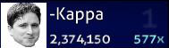 | Normal | The player has more than half of their health. The colour will become a brighter blue or bleed to red depending on the player's health. |
| 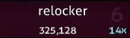 | Danger | The player has less than half of their health. The colour will become a brighter red or change to blue depending on the player's health. |
| 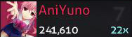 | Failed | The player has reached 0 HP and is in the [failed state](/wiki/Gameplay/Multiplayer#health-and-failing). |
| 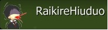 | Tag | In `Tag co-op` and `Tag-team VS`, the player box will always be green. A green arrow points at the current player with a subtle white glow. |
| 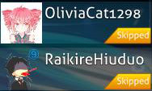 | Skipped | A request from the player to skip the intro of a beatmap if there is one. The intro will be skipped once all players have requested to skip. |
| 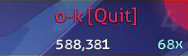 | Quit | The player has quit the match, either by pressing `Esc` twice or by disconnecting from [Bancho](/wiki/Bancho_(server)). The text colour will be changed from white to red, with `[Quit]` appended at the end. The box colour signifies the status before quitting the game. |

### Team mode interfaces

The rest of the screen depends on the [team mode](/wiki/Gameplay/Multiplayer#team-modes) the match is played in.

::: Infobox
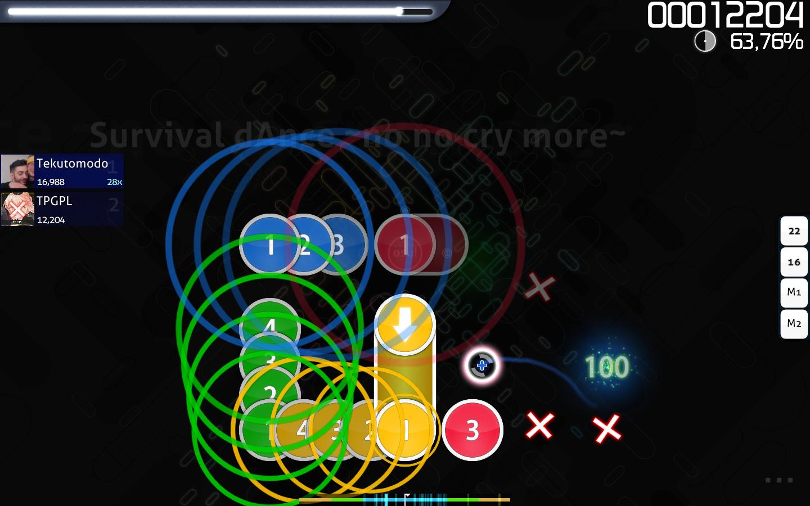
:::

In `Head-to-head`, nothing is added to the screen apart from the leaderboard.

::: Infobox
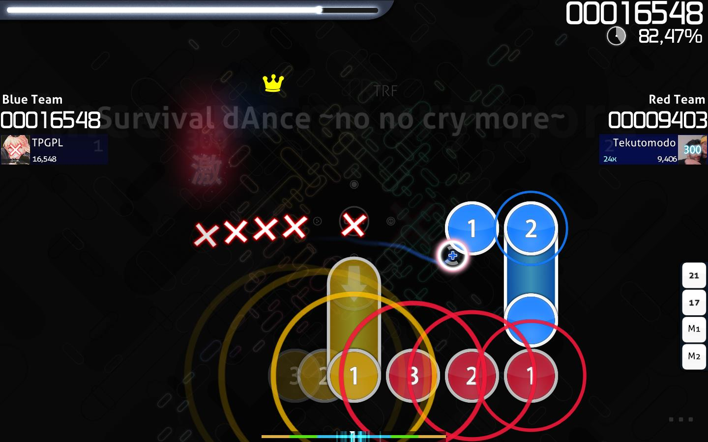
:::

In `Team VS`, Blue is on the left and Red is on the right. A crown at the centre moves left and right to show which team is currently in the lead.

::: Infobox
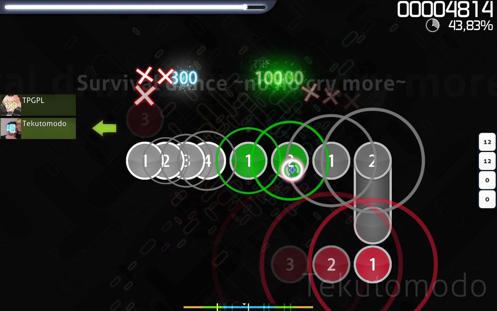
:::

::: Infobox
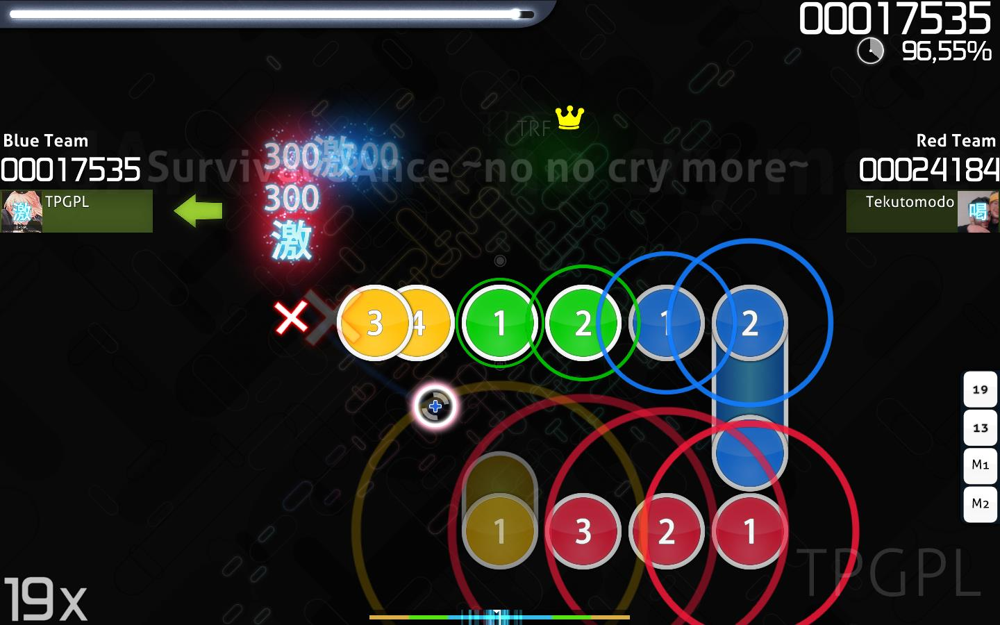
:::

In `Tag co-op` and `Tag-team VS`, a green arrow shows the player who is currently playing, and their name is shown at the lower right. Warning arrows indicate when it is about to be the player's turn, and the hit objects are coloured with the [Tag Colour](#tag-colour) of the player they belong to.

## Results screens

Unlike solo play, multiplayer has no [extended results screen](/wiki/Client/Interface#extended-results-screen) below the results screen. The replay of the score can be exported by pressing `F2`, except in `Tag co-op` and `Tag-team VS`.

::: Infobox
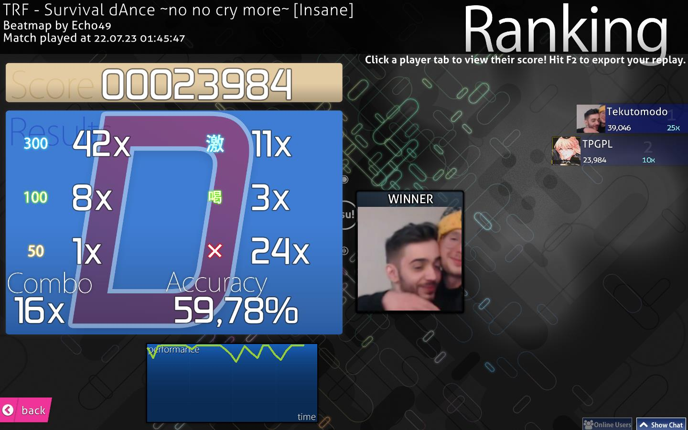
:::

At the end of a `Head-to-head` match, the winner's avatar is shown in a large box, along with the match leaderboard to the right. The [grade](/wiki/Gameplay/Grade) for the play is placed behind the result like a watermark. Other players' results can be checked by clicking on their panel on the leaderboard.

::: Infobox
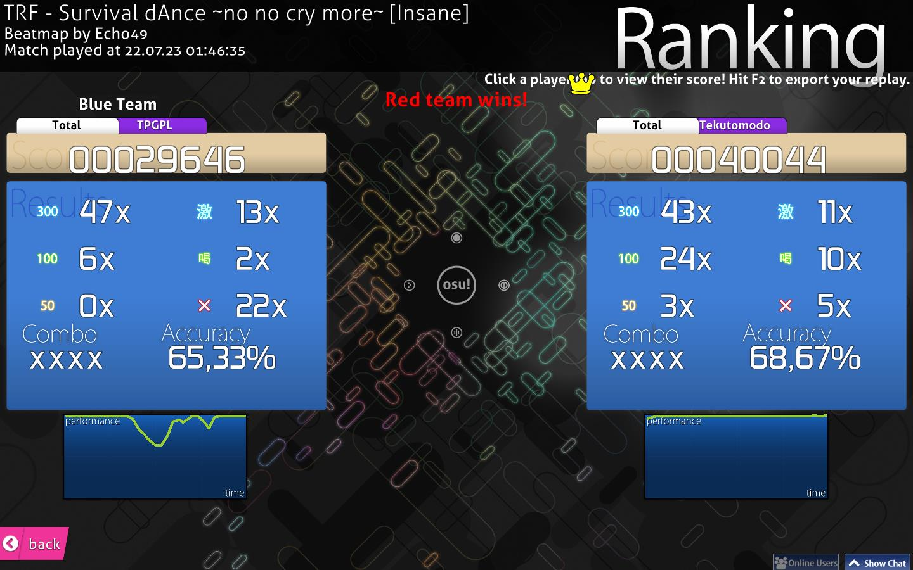
:::

In `Team VS`, the winning team is announced at the top of the results screen. The panels to the sides show results for each player in different tabs, and the `Total` tab shows the total count of [judgements](/wiki/Gameplay/Judgement) for both teams and their average accuracy.

::: Infobox
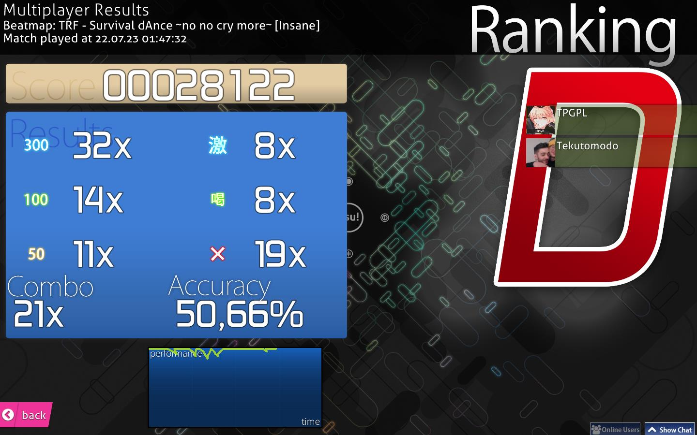
:::

::: Infobox
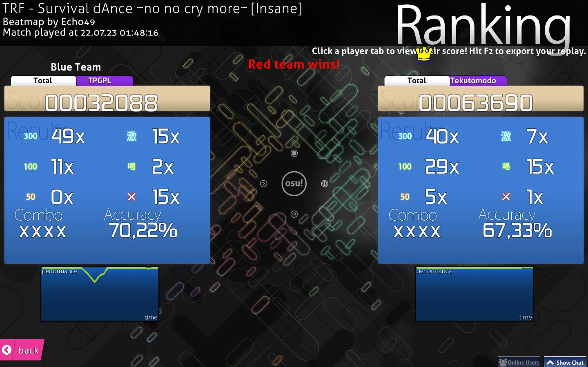
:::

The `Tag co-op` results screen shows the total score, the [judgements](/wiki/Gameplay/Judgement) and the accuracy of the team. Individual results are not shown, and can only be seen in the [match history](/wiki/Gameplay/Multiplayer#match-history). Unlike the other team modes, this screen only appears if the beatmap was cleared successfully. The `Tag-team VS` results screen is identical to the `Team VS` one, except that individual results can be seen under different tabs for each team.
