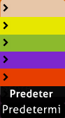

# Multijugador

**Multijugador** (a veces abreviado como *Multi*) es un modo en el que hasta 16 jugadores pueden competir entre sí individualmente o en equipos, o jugar juntos de forma cooperativa, en mapas decididos por el anfitrión.

[osu!academy](/wiki/Community/Video_series/osu!academy) cubre esta parte del cliente en formato de vídeo en el [episodio 6](https://www.youtube.com/watch?v=QPTLyG7O8ak), junto con el [panel de usuarios en línea](/wiki/Client/Interface/Chat_console#consola-de-chat-ampliada).

## Cómo jugar

*Aviso: El modo multijugador requiere una [cuenta de osu!](/wiki/Registration) y no está disponible para jugadores [silenciados](/wiki/Silence).*

Desde el menú principal, se puede acceder a la sala principal de multijugador con los siguientes pasos:

1. Haz clic en el botón `Play` o pulsa `P`.
2. Haz clic en el botón `Multi` o pulsa `M`.

## Sala principal

*Aviso: Se requiere una etiqueta activa de [osu!supporter](/wiki/osu!supporter) para entrar a la sala mientras se usa la versión `Cutting Edge`.*

Al entrar, se le presentan al jugador todas las partidas disponibles en ese momento.

### Opciones de filtrado

La lista de partidas puede filtrarse usando las opciones de la parte superior izquierda.

| Título | Descripción |
| :-: | :-- |
| `Todos` / `osu!` / `osu!taiko` / `osu!catch` / `osu!mania` | Solo muestra las partidas en el [modo de juego](/wiki/Game_mode) actualmente seleccionado o de todos los modos de juego. |
| `Mapas instalados` | Solo muestra las partidas en las que el jugador tenga el [beatmap](/wiki/Beatmap) que se está jugando en ese momento. |
| `Mostrar llenas` | Muestra las partidas aunque no tengan espacios vacíos disponibles. |
| `Buscar` | Busca un beatmap concreto que se esté jugando o el nombre del anfitrión mediante la barra de búsqueda. Al buscar, se ignorarán temporalmente todos los filtros excepto `Mostrar partidas en curso`. |
| `Juegos con amigos` | Solo muestra las partidas en las que están jugando los amigos del jugador. Esta opción de filtrado anulará todos los demás filtros cuando esté activada. |
| `Mostrar privadas` | Muestra las partidas que requieren una contraseña para entrar. |
| `Mostrar partidas en curso` | Muestra las partidas que se están jugando en ese momento. Es posible entrar a la partida si aún quedan espacios disponibles. Se indican con un título en gris y con el texto `(En progreso)` añadido hasta que finaliza la partida. |

### Partidas

En el centro de la pantalla aparece una lista de partidas disponibles.

La mayoría de las partidas tienen un fondo blanco claro, lo que indica que fueron [creadas normalmente a través de la IU del juego](#cómo-crear-una-nueva-partida). También las hay con fondo morado, que son *partidas de torneos* creadas y gestionadas usando los [comandos de chat para la gestión de las salas](/wiki/osu!_tournament_client/osu!tourney/Tournament_management_commands) como `!mp make` o `!mp makeprivate`.

Se muestra información variada sobre cada sala. Por ejemplo, los espacios para jugadores de la derecha pueden tener tres colores diferentes:

| Color | Descripción |
| :-: | :-- |
| Rojo | El espacio lo ocupa un jugador. |
| Verde | El espacio está disponible. |
| Sin color | El espacio está bloqueado. |

Para entrar en una partida, haz clic en cualquiera de ellas.

### Opciones generales

Los tres botones encima de la [consola del chat](/wiki/Client/Interface/Chat_console) proporcionan las principales opciones de navegación de esta pantalla:

| Título | Descripción |
| :-: | :-- |
| `Volver al menú` | Abandona la sala y vuelve al menú principal. |
| `Nueva partida` | Crea una nueva partida. Más información a continuación. |
| `Partida aleatoria` | Se une a una partida disponible *aleatoriamente* basándose en la [clasificación por puntos de rendimiento](/wiki/Ranking#clasificación-por-puntos-de-rendimiento) actual del jugador. |

## Cómo crear una nueva partida

::: Infobox

:::

| Título | Descripción |
| :-: | :-- |
| `Game Name` | El nombre de la partida. El valor predeterminado es `{nombre de la cuenta}'s game`. |
| `Require password to join` | Haz que la partida sea privada. |
| `Password` | Establece una contraseña para la partida. Solo aparece si el botón `Require password to join` está activado. |
| `Make match history publicly viewable` | Permite que otros jugadores, además de los participantes en la partida, vean el historial de la partida a través de un enlace directo. Solo aparece si el botón `Require password to join` está activado. |
| `Max Players` | El número total de jugadores (incluido el anfitrión) que pueden unirse a la partida. Se puede seleccionar un rango de 2 a 16, con un valor predeterminado de 8. Esto se puede ajustar después, bloqueando/desbloqueando los espacios de los jugadores. |

Al pulsar el botón `1. Start Game` creará la partida con la canción que se esté reproduciendo en ese momento como beatmap. El botón `2. Cancel` devuelve al jugador a la sala principal.

## Opciones de la partida

::: Infobox

:::

Después de entrar o crear una partida, se mostrarán las opciones de la partida. Las siguientes secciones se centrarán en las diferentes partes de la pantalla, comenzando de arriba a abajo y de izquierda a derecha.

Aunque no hay un botón directo para ello, se puede acceder al [menú de opciones](/wiki/Client/Options) presionando `Ctrl` + `O` en la sala de una partida.

### Encabezado

El texto superior izquierdo indica si el jugador es el anfitrión de la partida o un jugador normal. En el centro, hay una casilla con información del jugador sobre sus [puntos de rendimiento](/wiki/Performance_points/Total_performance_points), [precisión general](/wiki/Gameplay/Accuracy), [nivel](/wiki/Gameplay/Score/Total_score#nivel), [clasificación](/wiki/Ranking#clasificación-por-puntos-de-rendimiento) y el [modo de juego](/wiki/Game_mode) seleccionado. A la derecha, hay un botón para pausar la canción que se está reproduciendo.

### Lista de jugadores actuales

::: Infobox

:::

La lista de jugadores muestra todos los espacios de una partida. Los números entre paréntesis a la derecha de `Número de jugadores` muestran el número de jugadores en la partida sobre la cantidad de espacios desbloqueados para los jugadores.

Se puede cambiar entre los espacios disponibles haciendo clic en ellos, pero no se puede cambiar entre los espacios que aparecen con un candado cerrado. El anfitrión puede bloquear y desbloquear espacios a través de los iconos de la izquierda, así como expulsar jugadores. Los privilegios del anfitrión se pueden transferir a otro jugador haciendo clic con el botón derecho del ratón y pulsando `Convertirlo en anfitrión de la partida`. El color del equipo se puede cambiar entre azul y rojo cuando se juega en Team VS.

Al pasar el cursor por encima de cualquier jugador de la lista, se mostrará el nivel, el país y la [precisión general](/wiki/Gameplay/Accuracy) del jugador en cuestión.

Un jugador puede tener cuatro colores diferentes en esta lista, que también significan cosas diferentes:

| Color | Descripción |
| :-: | :-- |
| **Rojo (sin el mapa)** | El jugador no tiene el beatmap, indicado por un aviso `[sin mapa]` hasta que haya descargado el beatmap. |
| **Blanco (no listo)** | El jugador tiene el beatmap pero aún no está listo. Los [modificadores de juego](/wiki/Gameplay/Game_modifier) ​​se pueden cambiar en este estado. |
| **Verde (listo)** | El jugador está listo. Los modificadores de juego no se pueden cambiar en este estado. El anfitrión podrá iniciar la partida después de estar listo, y los jugadores que estén listos comenzarán la partida. |
| **Azul claro (jugando)** | El jugador está jugando, indicado por un aviso `[jugando]` hasta que la partida termine. |

### Ajustes de la partida

#### Nombre de la partida y contraseña

El `Nombre de la partida` es el nombre de la sala que aparece en la lista de partidas del juego y en el sitio web. Tener una contraseña es útil para restringir la sala a solo tus amigos o a los participantes de un torneo, y se puede cambiar con el botón `Cambiar contraseña` situado encima del nombre de la partida.

#### Mapa

::: Infobox

:::

::: Infobox

:::

La sección de mapas muestra el beatmap que se jugará en la partida. Al cambiar el beatmap con el botón situado encima, se abre el selector de canciones.

La tarjeta del beatmap mostrará la imagen de fondo, el icono del modo de juego, el título y el artista de la canción, el creador del beatmap, la [dificultad](/wiki/Beatmap/Difficulty) seleccionada y la [calificación por estrellas](/wiki/Beatmap/Star_rating) para el beatmap seleccionado.

::: Infobox

:::

Al pasar el cursor sobre el beatmap, aparece una ventana emergente que muestra información sobre el beatmap. Esta información es la siguiente:

| Valor | Descripción |
| :-: | :-- |
| `BPM` | Pulsaciones por minuto |
| `Tiempo` | Duración del beatmap |
| `Última vez jugado` | La última vez que se jugó el beatmap |
| `CS` | Tamaño del círculo |
| `AR` | Velocidad de aproximación |
| `OD` | Dificultad general |
| `HP` | Tasa de drenaje de HP |
| `Star Rating` | Clasificación por estrellas |

Si el jugador no tiene el beatmap, se mostrará uno de estos estados:

| Estado del beatmap | Descripción |
| :-: | :-- |
| `Ranked` / `Approved` / `Pending` / `Graveyard` | La [categoría del beatmap](/wiki/Beatmap/Category). Al hacer clic en la tarjeta del beatmap, se abrirá la página del beatmap en el sitio web, donde se puede [descargar](/wiki/Beatmap#descargar-beatmaps). |
| `Not uploaded or not up-to-date` | El beatmap no está disponible para descargar. El anfitrión deberá buscar el enlace (en el [listado de beatmaps](https://osu.ppy.sh/beatmapsets)) para el jugador si el problema persiste. |
| `Cannot update the beatmap` | El anfitrión está jugando una versión modificada del beatmap. |

#### Mods

::: Infobox

:::

Esta sección mostrará los [mods de juego](/wiki/Gameplay/Game_modifier) usados para esta partida.

El anfitrión puede activar `Mods libres` para permitir a los jugadores elegir libremente cualquier combinación de mods, excepto los que cambian la velocidad de juego: ([Double Time (DT)](/wiki/Gameplay/Game_modifier/Double_Time), [Nightcore (NC)](/wiki/Gameplay/Game_modifier/Nightcore) y [Half Time (HT)](/wiki/Gameplay/Game_modifier/Half_Time)).

#### Modo por equipos {id=team-mode-match-setup}

*Para obtener más información sobre el modo por equipos, consulta la [sección sobre el modo de juego por equipos](#modos-de-juego-en-multijugador).*

Hay cuatro formas diferentes de jugar una partida:

| Modo | Descripción |
| :-- | :-- |
| `Head-to-head` | Compite contra los demás para alcanzar el primer puesto en la tabla de clasificación de la partida. |
| `Team VS` | Compite por equipos (rojo y azul) por la supremacía de la partida. |
| `Tag co-op` (solo en el modo osu!, no clasificado) | Forma un equipo para completar el beatmap, un combo a la vez juntos. |
| `Tag-team VS` (solo en el modo osu!, no clasificado) | Lo mismo que `Tag co-op`, pero con dos equipos compitiendo entre sí. |

##### Color del combo

::: Infobox

:::

Si el modo por equipos se estableció en `Tag co-op` o `Tag-team VS`, se mostrará una sección `Color del combo: (color)` que permite elegir un color personalizado para cada jugador. Si se establece en `Predeterminado` se usarán los colores originales del beatmap.

#### Condición de victoria

Hay cuatro formas diferentes de decidir el ganador de una partida:

| Título | Descripción |
| :-: | :-- |
| `Score` | El jugador con la puntuación más alta gana. |
| `Accuracy` | El jugador con la mayor precisión gana. Si hay dos jugadores con 100,00 %, gana el jugador con la puntuación más alta (de los spinners). De lo contrario, es un empate. |
| `Combo` | El jugador con el mayor número de combo *al final del beatmap* gana. Si el número del combo es el mismo, gana el jugador con la puntuación más alta. El combo máximo no se cuenta en este caso. |
| `Score v2` | El jugador con la puntuación (estandarizada) más alta gana. |

### Botones de preparación de la partida

Hay dos grandes botones anchos de color naranja y azul encima de la [consola del chat](/wiki/Client/Interface/Chat_console).

El botón naranja `Abandonar la partida` de la izquierda se explica por sí mismo. Si el anfitrión de la partida abandona la sala, el anfitrión será transferido automáticamente al jugador que quede en el orden de las casillas. Si no hay nadie en la partida, se cerrará automáticamente, excepto para las partidas creadas por comandos [`!mp`](/wiki/osu!_tournament_client/osu!tourney/Tournament_management_commands), que se cerrarán después de 30 minutos.

El botón azul se usa para controlar el estado de preparación del jugador y para iniciar la partida.

| Título | Descripción |
| :-: | :-- |
| `¡Listo!` | Marca al jugador como listo (verde en la lista de jugadores). El botón cambiará a `No estoy listo`. Para el anfitrión de la partida, cambiará a `¡Empezar!` o `Forzar inicio de la partida` si hay jugadores en la sala. |
| `No estoy listo` | Marca al jugador como no listo (blanco en la lista de jugadores). El botón cambiará a `¡Listo!` |
| `¡Empezar!` | Empieza la partida. Este botón solo le aparecerá al anfitrión de la partida cuando todos los jugadores estén listos. |
| `Forzar inicio de la partida ({jugadores listos}/{total de jugadores})` | Inicia la partida, incluso si todos los jugadores no están listos. Este botón solo le aparecerá al anfitrión de la partida cuando algunos jugadores estén listos. Entre paréntesis se indica la cantidad de jugadores listos en comparación con la cantidad total de jugadores. |

### Historial de las partidas

::: Infobox

:::

La sección inferior de la pantalla es la [consola del chat](/wiki/Client/Interface/Chat_console). Cada partida tiene su propio canal en una pestaña llamada `#multiplayer`, con [BanchoBot](/wiki/BanchoBot) proporcionando un enlace al historial de la partida en la primera línea.

En las partidas de todos contra todos, el resultado se mostrará de forma privada en otra pestaña llamada `#userlog` al finalizar, donde BanchoBot dice `Te has clasificado #{puesto} entre {total} jugadores en multijugador {beatmap} [dificultad] <modo de juego>.`.

## Mientras juegas

### General

#### Abandonar la partida

No hay forma de pausar una partida multijugador. Al presionar `Escape` aparecerá un aviso en la esquina inferior derecha, y si lo vuelves a presionar, saldrás de la partida.

#### Configuraciones visuales

Mientras se inicia la partida, al mover el cursor a la parte inferior de la pantalla se abrirá el panel de la configuración visual. Véase la página de [configuración visual](/wiki/Client/Interface/Visual_settings) para más información.

#### Salud

Cuando la barra de salud de un jugador se haya agotado por completo, podrá seguir jugando, pero la puntuación se considerará fallida y no aparecerá en las tablas de clasificación. El jugador puede revivir si vuelve a alcanzar la salud completa, a menos que use [Sudden Death (SD)](/wiki/Gameplay/Game_modifier/Sudden_Death).

En partidas de Team VS, estar en estado fallido al final de la partida hará que la puntuación no contribuya a la puntuación del equipo. Si todos los jugadores de un equipo han fallado, el partido termina inmediatamente y el equipo contrario gana por defecto.

#### Resultados

A pesar de que no hay [pantalla de resultados extendida](/wiki/Client/Interface#pantalla-de-resultados-extendida) debajo de la pantalla de resultados como cuando juegas en solitario, las puntuaciones conseguidas durante las partidas multijugador (con la excepción de las partidas `Tag co-op` y `Tag-team VS`) seguirán apareciendo en las tablas de clasificación en línea si son lo suficientemente buenas. El resultado no se mostrará en la tabla de clasificación local.

#### Guardar la repetición

La repetición de la puntuación se puede exportar presionando `F2`, excepto en `Tag co-op` y `Tag-team VS`.

#### Tabla de clasificación en multijugador

La tabla de clasificación a un lado de la pantalla muestra diferentes estadísticas en tiempo real para cada jugador según los ajustes de la partida.

Para las partidas `Head-to-head` y `Team VS`:

| Condición de victoria | Estadísticas mostradas |
| :-- | :-- |
| `Score` / `Score v2` | Puntuación individual, multiplicador del combo, juicios |
| `Accuracy` | Precisión, puntuación individual, multiplicador del combo, juicios |
| `Combo` | Número actual del combo |

Para `Tag co-op` y `Tag-team VS`:

| Condición de victoria | Estadísticas mostradas |
| :-- | :-- |
| `Score` / `Score v2` | Puntuación del equipo, puntuación individual, juicios |
| `Accuracy` | Precisión media del equipo, puntuación individual, juicios |
| `Combo` | Número actual del combo, puntuación individual, juicios |

Si un jugador muere durante una partida de Tag co-op, la partida termina y los jugadores vuelven a la sala de la partida. En Tag-team VS, el equipo contrario recibe una victoria por defecto. Los jugadores que mueran no contribuirán al equipo, a menos que hayan revivido al final de la partida.

Si un jugador abandona la partida mientras está en ella, el juego jugará perfectamente su parte por él, pero no aportará nada al equipo. Si todos los jugadores de un equipo abandonan la partida, el equipo contrario ganará por defecto.

Los jugadores que hayan fallado el beatmap o abandonado la partida se colocarán en la parte inferior de la tabla de clasificación, con sus puntuaciones separadas de los demás jugadores.

El color de cada jugador en la tabla de clasificación mientras juega indica el estado del jugador durante la partida.

| Imagen de ejemplo | Estado | Descripción |
| :-: | :-: | :-- |
|  | Normal | El jugador tiene más de la mitad de su salud. El color se volverá azul más brillante o se volverá rojo dependiendo de la salud del jugador. |
|  | En peligro | El jugador tiene menos de la mitad de su salud. El color se volverá rojo más brillante o cambiará a azul dependiendo de la salud del jugador. |
|  | Fallido | El jugador ha llegado a 0 HP y está en el [estado fallido](#salud). |
|  | Tag | En `Tag co-op` y `Tag-team VS`, el cuadro del jugador siempre será verde. Una flecha verde apunta al jugador actual con un sutil brillo blanco. |
|  | Saltar introducción | Una petición del jugador para saltarse la introducción de un beatmap, si la hay. La introducción se saltará una vez que todos los jugadores hayan solicitado saltarla. |
|  | Abandonó la partida | El jugador abandonó la partida, ya sea presionando `Escape` dos veces o desconectándose de [Bancho](/wiki/Bancho_(server)). El color del texto cambiará de blanco a rojo, con `[Quit]` añadido al final. El color del cuadro indica el estado antes de salir de la partida. |

### Modos de juego en multijugador

#### Head-to-head

##### Interfaz

::: Infobox

:::

Head-to-head es un modo de juego en el que los jugadores se enfrentan entre sí por el primer puesto en la tabla de clasificación. Este es el modo de juego predeterminado y no tiene ninguna característica especial en cuanto a la jugabilidad, aparte de luchar por el primer puesto.

##### Resultados

::: Infobox

:::

Al final de la partida, el avatar del ganador se muestra en un gran recuadro, junto con la tabla de clasificación de la partida a la derecha.

El [grado](/wiki/Gameplay/Grade) de la jugada se coloca detrás del resultado como una marca de agua. Los resultados de otros jugadores pueden verse haciendo clic en su panel en la tabla de clasificación.

Cada jugador recibirá el resultado de su partida como un mensaje privado en la pestaña `#userlog` del [chat](/wiki/Client/Interface/Chat_console).

#### Team VS

##### Interfaz

::: Infobox

:::

En Team VS se enfrentan dos equipos, azul y rojo.

El azul está a la izquierda y el rojo a la derecha. Una corona en el centro se mueve de izquierda a derecha para indicar qué equipo va ganando.

Se puede cambiar de equipo en la sala de la partida. No hay ninguna desventaja para los equipos con menos jugadores, y es perfectamente posible empezar una partida con un solo equipo.

##### Resultados {id=pantalla-de-resultados-de-Team-VS}

::: Infobox

:::

El equipo ganador se anuncia en la parte superior de la pantalla de resultados.

Solo los jugadores que sigan vivos al final de la partida cuentan para la puntuación total de sus equipos.

Los paneles a los lados muestran los resultados de cada jugador en diferentes pestañas. La pestaña `Total` muestra el número total de [juicios](/wiki/Gameplay/Judgement) de ambos equipos y su precisión media.

#### Tag co-op / Tag-team VS

##### Interfaz

*Nota: Este modo de juego no está clasificado y solo está disponible en el modo osu!.*

::: Infobox

:::

::: Infobox

:::

Tag co-op hace que todos los jugadores de la partida trabajen juntos para pasar el beatmap, un combo a la vez. `Tag-team VS` es igual que `Tag co-op`, pero con dos equipos enfrentándose entre sí.

En este modo, el orden en el que juegan los jugadores depende de la posición que ocupen en la sala de la partida.

Una flecha verde señalará al jugador que está jugando en ese momento, y su nombre aparecerá en la parte inferior derecha. Las flechas de advertencia te indicarán cuando esté a punto de ser tu turno y los objetos se colorearán. Puedes seleccionar un color para el combo en la sección [color del combo](#color-del-combo) en la sala de la partida.

Todos los jugadores deben hacer girar el spinner, o el combo se romperá.

Si un jugador abandona la partida, el juego jugará su parte por él.

Todos los jugadores comparten la misma barra de salud. Si se agota por completo, la partida termina. En Tag-team VS, cada equipo tiene sus propias barras de salud, y perder toda la salud hará que ese equipo pierda.

Los jugadores que usen [Sudden Death (SD)](/wiki/Gameplay/Game_modifier/Sudden_Death) harán que toda la partida termine si fallan debido a ello, incluso en Tag-team VS. Si se usa [Easy (EZ)](/wiki/Gameplay/Game_modifier/Easy), los jugadores aún tendrán dos vidas extra. Sin embargo, en Tag-team VS, cuando la salud de un equipo cae a cero, aunque la [barra de salud](/wiki/Client/Interface/Health_bar) se rellene, la partida los considerará como *muertos* y finalizará inmediatamente.

##### Resultados

::: Infobox

:::

::: Infobox

:::

No se otorgará puntuación clasificada ni puntos de rendimiento por partidas de `Tag co-op` o `Tag-team VS`.

Para `Tag co-op`, el resultado mostrado es la puntuación total, los [juicios](/wiki/Gameplay/Judgement) y la precisión del equipo. Los resultados individuales no se muestran, y solo pueden verse en el historial de la partida. La pantalla de resultados solo aparece si el beatmap se ha pasado correctamente, a diferencia de los otros modos de multijugador.

La pantalla de resultados de `Tag-team VS` es idéntica a la [pantalla de resultados de Team VS](#pantalla-de-resultados-de-Team-VS), excepto en que los resultados individuales se pueden ver en diferentes pestañas para cada equipo.

## Curiosidades

### Historia

::: Infobox
, pero aún no se podía jugar en multijugador")
:::

- La versión multijugador inicial se implementó el 3 de junio de 2008 en la versión pública b335 de osu!.
- Las opciones de la partida solo permitían hasta un total de 8 jugadores.
- osu!mania aparecía como un «3» en la sala principal para los jugadores que aún no habían actualizado su cliente al último parche de lanzamiento (que habilitaba a osu!mania sin soporte de clasificación).
- No Video solía ser el *único* modificador de juego que se permitía usar a los jugadores, pero se eliminó en favor de su ubicación en la [configuración visual](/wiki/Client/Interface/Visual_settings).
