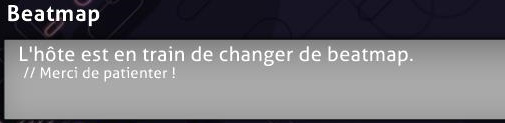
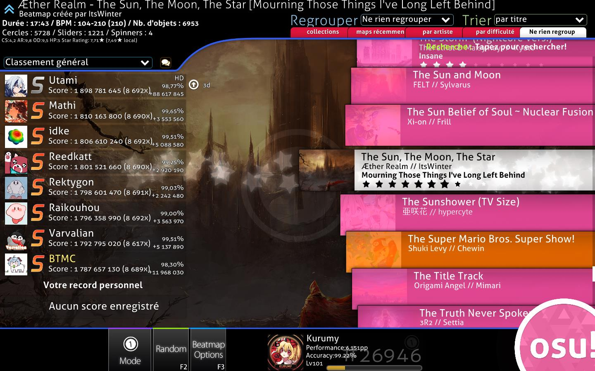

# Multijoueur

Le **multijoueur** (souvent abrégé en *Multi*) est un mode de jeu dans lequel jusqu'à 16 joueurs peuvent s'affronter entre eux ou en équipe sur une beatmap choisie par l'hôte.

La [osu!academy](/wiki/Community/Video_series/osu!academy) couvre cette partie du client dans un format vidéo dans [l'épisode 6](https://www.youtube.com/watch?v=QPTLyG7O8ak), ainsi que [panel utilisateur en ligne](/wiki/Client/Interface/Chat_console#extended-chat-console).

## Comment jouer

*Remarque : Le multijoueur requiert un [compte osu!](/wiki/Registration) et n'est pas disponible pour les joueurs sous [silence](/wiki/Silence).*

Depuis le menu principal, le lobby multijoueur principal peut être accédé avec les étapes suivantes :

1. Cliquez sur le button `Play` ou appuyez sur `P`.
2. Cliquez ensuite sur le bouton `Multi` ou appuyez sur `M`.

## Lobby principal

*Remarque : un tag actif [osu!supporter](/wiki/osu!supporter) est requis pour entrer dans le lobby en utilisant la version `Cutting Edge`.*

En entrant, toutes les salles disponibles sont présentées au joueur.

### Options de filtrage

les lobbies de salle peuvent être filtrées en utilisant les options en haut à gauche.

| Titre | Description |
| :-: | :-- |
| `Tous`/`osu!`/`osu!taiko`/`osu!catch`/ `osu!mania` | Montre uniquement les salle avec le [mode de jeu](/wiki/Game_mode) sélectionné pour tous les mode de jeu. |
| `Salles dont je poss. les maps uniq.` | Montre uniquement les salles si le joueur possède la [beatmap](/wiki/Beatmap) actuellement jouée. |
| `Afficher salles remplies` | Montre les salles même si elles n'ont pas de places disponibles. |
| `Recherche` | Recherche une beatmap spécifique étant jouée ou le nom du hôte en utilisant la barre de recherche. En recherchant, tous les filtres seront temporairement ignorés excepté `Afficher salles occupées`. |
| `Salles avec amis uniquement` | Montre uniquement les salles où des amis du joueur sont en train de jouer. Cette option de filtre va remplacer les autres options de filtre quand elle est activée. |
| `Afficher salles verrouillées` | Montre les salles qui requièrent un mot de passe pour rejoindre. |
| `Afficher salles occupées` | Montre les salles qui sont actuellement en jeu. Il est encore possible de les rejoindre s'il reste des places disponibles. Il y a un indicateur avec un titre grisé avec `(en cours)` ajouté, jusqu'à ce que la salle termine la partie. | 

### Salles

Situé au milieu de l'écran se trouve la liste des salles disponibles.

Une multitude d'informations sont affichés sur chaque lobby. Par exemple, les places de joueurs sur la droite peuvent avoir trois différentes couleurs :

| Couleur | Description |
| :-: | :-- |
| Rouge | La place est prise par un joueur. |
| Vert | La place est disponible. |
| Pas de couleur | La place est verrouillée. |

Pour rentrer dans une salle, cliquez sur l'une d'entre elles.

### Options Générales

Les trois boutons au dessus la [console de tchat](/wiki/Client/Interface/Chat_console) fournissent les principales options de navigation de cet écran : 

| Titre | Description |
| :-: | :-- |
| `Retour au menu` | Quitte le lobby et retourne au menu principal. |
| `Créer une salle` | Créer une nouvelle salle. Voir plus bas pour plus de détails. |
| `Salle au hasard` | Rejoins une salle disponible de manière *aléatoire* basé sur le [classement des points de performance](/wiki/Ranking#performance-points-ranking) actuel du joueur. |

## Créer une salle

::: Infobox

:::

| Titre | Description |
| :-: | :-- |
| `Game Name` | Le nom de la salle. La valeur par défaut est `{account name}'s game`. |
| `Require password to join` | Rend la salle privée. |
| `Password` | Défini un mot de passe pour la salle. Apparaît uniquement si le bouton `Require password to join` est activé. |
| `Max Players` | Le nombre total de joueurs (incluant l'hôte) autorisés à rejoindre la salle. Une plage de 2 à 16 joueurs peut être sélectionné, avec une valeur par défaut de 8. Ceci peut être ajusté plus tard en verrouillant/déverrouillant des emplacements de joueur. |

Appuyer sur le bouton `1. Start Game` va créer la salle avec la musique se jouant actuellement en temps que beatmap. Le bouton `2. Cancel` ramènera le joueur vers le lobby.

## Configuration d'une salle

::: Infobox

:::

Après être rentré, ou avoir créé une salle, la configuration sera affichée. La section suivant va mettre en avant les différentes parties de l'écran commençant du haut vers le bas et allant de la gauche vers la droite.

Tant qu'il n'y a pas de bouton permettant d'y accéder directement, le [menu des options](/wiki/Client/Options) peut être accédé en appuyant sur `Ctrl` + `O` en étant dans le lobby de la salle. 

### Section supérieure

::: Infobox

:::

La partie en haut à gauche indique si le joueur est un hôte de la partie ou un joueur normal. Au milieu, il y a une boite de joueur contenant des information sur les [points de performance](/wiki/Performance_points/Total_performance_points), la [précision générale](/wiki/Gameplay/Accuracy), le [niveau](/wiki/Gameplay/Score/Total_score#level), le [rang](/wiki/Ranking#performance-points-ranking) ainsi que le [mode de jeu](/wiki/Game_mode).Sur la droite, il y a un bouton pour mettre en pause la musique actuellement sélectionnée.

### La liste des joueurs courants

::: Infobox

:::

La liste de joueurs montre toutes les places pour une salle. Le nombre entre parenthèses sur la droite de `Joueurs présents` montre le nombre de joueurs dans la salle sur le nombre de places de joueurs déverrouillées.

Les places disponibles peuvent être déplacées en cliquant dessus, mais les places indiquées par un cadenas verrouillé ne sont pas disponibles. L'hôte est capable de verrouiller/déverrouiller des emplacements au travers des icônes sur la gauche, et peut également y expulser les joueurs. Les privilèges d'hôte peuvent être transférés à un autre joueur en faisant un click droit et en appuyant sur `Lui donner le contrôle de la salle`. La couleur d'équipe peut être changée entre bleu et rouge en jouant en Team VS.

Survoler le pseudo d'un joueur dans la liste affichera son niveau, son pays ainsi que sa [précision générale](/wiki/Gameplay/Accuracy).

Un joueur peut avoir quatres couleurs différentes dans cette liste, qui ont différents sens :

| Couleur | Description |
| :-: | :-- |
| **Rouge (n'a pas la map)** | Le joueur n'a pas la beatmap, indiqué par un indicateur `[n'a pas la map]` jusqu'à ce qu'il ait téléchargé la beatmap. |
| **Blanc (pas prêt)** | Le joueur a la beatmap mais n'est pas encore prêt. Les [modificateurs de jeu](/wiki/Game_modifier) peuvent être modifiés dans cet état. |
| **Vert (prêt)** | Le joueur est prêt. Les modificateurs de jeu ne peuvent pas être modifiés dans cet état. L'hôte sera capable de démarrer le jeu après avoir cliqué sur "prêt", et tous les joueurs vont démarrer la partie. |
| **Bleu clair (en jeu)** | Le joueur est en train de jouer, l'indicateur `[en jeu]` est affiché jusqu'à la fin de la partie. |

### Paramètres de la salle

#### Nom de la partie et mot de passe

Le `Nom` est le nom du lobby qui est visible depuis la liste des parties en jeu ainsi que sur le site web. Avoir un mot de passe est utile pour restreindre l'accès au lobby aux amis ou aux joueurs de tournois, et peut être changé en utilisant le bouton `Changer le mot de passe...` au dessus du nom de la partie.

#### Beatmap

::: Infobox

:::

::: Infobox

:::

La section de beatmap montre la beatmap allant être jouée dans la partie. Changer la beatmap en utilisant le bouton au dessus ouvre l'écran de sélection de musique.

La carte de beatmap affichera l'image de fond, l'icône du mode de jeu, le titre et l'artiste de la musique, le créateur de la beatmap, la [difficulté](/wiki/Beatmap/Difficulty) sélectionnée, et le [star rating](/wiki/Beatmap/Star_rating) de la beatmap sélectionnée.

::: Infobox

:::

En survolant la beatmap, il y a une popup affichant des informations sur la beatmap. On y retrouve les informations suivantes :

| Valeur | Description |
| :-: | :-- |
| `BPM` | Battements par minute |
| `Durée` | Durée de la beatmap |
| `Jouée pour la dernière fois le` | La dernière fois que la beatmap a été jouée |
| `CS` | Circle size |
| `AR` | Approach rate |
| `OD` | Overall difficulty |
| `HP` | HP drain rate (ou drain de vie) |
| `Star rating` | Le star rating |

Si le joueur ne possède pas la beatmap, un de des status suivant sera affiché :

| Status de la beatmap | Description |
| :-: | :-- |
| `Ranked` / `Approved` / `Pending` / `Graveyard` | La [catégorie de beatmap](/wiki/Beatmap/Category). Cliquer sur la carte de beatmap ouvrira la page de la beatmap depuis le site web où elle pourra être [téléchargée](/wiki/Beatmap#downloading-beatmaps). |
| `Pas uploadé ou pas à jour` | La beatmap n'est pas disponible en téléchargement. L'hôte devra trouver le lien (dans la [liste des beatmaps](https://osu.ppy.sh/beatmapsets)) pour les joueurs si les problèmes persistes. |
| `Ne peut pas mettre à jour la beatmap` | L'hôte est en train de jouer une version modifiée de la beatmap. |

#### Mods

::: Infobox

:::

Cette section affichera les [modes de jeu](/wiki/Game_modifier) utilisés pour cette partie.

L'hôte peut activer `Mods Libres` pour permettre aux joueurs de choisir librement toute combinaisont de mod, excepté ceux qui changent la vitesse de gameplay tel que ([Double Time (DT)](/wiki/Game_modifier/Double_Time), [Nightcore (NC)](/wiki/Game_modifier/Nightcore) et [Half Time (HT)](/wiki/Game_modifier/Half_Time)).

#### Mode par équipe {#team-mode-match-setup}

*Pour plus d'information sur le mode par équipe, voir la [section gameplay sur le mode par équipe](#team-mode-gameplay).*

Il y a 4 façons différents de jouer une partie :

| Type de partie | Description |
| :-- | :-- |
| `Head-to-head` | s'affronter les uns contre les autres dans le but d'atteindre le première place du classement de la partie. |
| `Team VS` | s'affronter les un contre les autres en équipe (Rouge et Bleu) pour remporter la partie. |
| `Tag co-op` | (mode osu! uniquement, non classé) | Faites équipe dans le but de compléter la beatmap un combo un la fois, tous ensemble. |
| `Tag-team VS` | (mode osu! uniquement, non classé) |La même chose que `Tag co-op`, mais avec deux équipes s'affrontant l'une contre l'autre. |

##### Couleur de tag

::: Infobox

:::

Si le type de partie a été défini sur `Tag co-op` ou `Tag-team VS`, une section `Couleur : (combo de couleur)` apparaitra, ce qui va permettre de choisir une couleur personnalisée pour chaque joueur. Paramétrer cela par `Par défaut` utilisera le combo de couleurs de base de la beatmap.

#### Condition de victoire

Il y a 4 façons différentes de décider du gagnant de la partie :

| Titre | Description |
| :-: | :-- |
| `Score` | Le joueur avec le plus de score gagne. |
| `Accuracy` | Le joueur avec la plus grande précision gagne. S'il y a deux joueurs avec 100.00%, le joueur avec le plus de score (depuis les spinners) l'emporte. Autrement, c'est un match nul.  |
| `Combo` | Le joueur avec le plus grand compte de combo *à la fin de la beatmap* gagne. Si le compte de combo est le même, le joueur avec le plus de score l'emporte. Le combo maximum n'est pas compté dans ce cas. |
| `Score v2` | Le joueur avec le plus grand score (standardisé) gagne. |

### Boutons de configuration de la salle

Il y a deux grands boutons larges orange et bleu au dessus de la [console de tchat](/wiki/Client/Interface/Chat_console). Le bouton orange `Quitter la salle` sur la gauche est auto-explicatif.

Le bouton bleu est utilisé pour controller l'état de disponibilité du joueur et pour commencer la partie. 

| Titre | Description |
| :-: | :-- |
| `Je suis prêt !` | Marque le joueur comme étant prêt (vert dans la liste de joueur). Le bouton changera pour `Je ne suis pas prêt`. Pour l'hôte de la salle, il changera pour `Start Game!` et `Force Start Game!` | s'il y a des joueurs dans le lobby. |
| `Je ne suis pas prêt` | Marque le joueur comme n'étant pas prêt (blanc dans la liste de joueur). Le bouton changera en `Je suis prêt !`. |
| `Start Game!` | Commence la partie. Ce bouton apparaît uniquement pour l'hôte du match quand tous les joueurs sont prêt. |
| `Force Start Game! ({ready}/{total})` | Démarre la partie même si tous les joueurs ne sont pas prêt. Ce bouton apparaît uniquement pour l'hôte de la partie quand quelques joueurs sont prêts. Le nombre de joueurs prêt comparé à celui du nombre total de joueurs est montré entre parenthèses. |

### Historique de le salle

::: Infobox

:::

La partie inférieure de l'écran est la [console de tchat](/wiki/Client/Interface/Chat_console). Toutes les salles ont leur propre salon dans un onglet appelé `#multiplayer`, avec [BanchoBot](/wiki/BanchoBot) fournissant un lien vers l'historique du match à la première ligne.

Pour les parties en Head-to-head (tête à tête), le résultat sera affiché en privé dans un onglet appelé `#userlog`  après chaque partie, où BanchoBot dit `Vous avez obtenu la #{placement} place sur {total} en multi sur {beatmap} [difficulté] <mode de jeu>.`

## En jeu

### Général

#### Quitter la salle

Il n'y a aucune façon de mettre en pause une partie multijoueur. Appuyer sur `Esc` donnera une alerte dans le coin en bas à droite, appuyer dessus à nouveau quittera la partie.

#### Paramètres visuels

Pendant que la partie est en train de démarrer, déplacer le curseur vers le bas de l'écran ouvrira le menu de paramètres visuels. Voir la page du [menu de paramètres visuels](/wiki/Client/Interface/Visual_settings) pour plus d'informations. 

#### Santé

Quand la barre de santé d'un joueur s'est entièrement vidée, il peut continuer de jouer, mais le score sera considéré comme loupé et n’apparaîtra pas sur les leaderboards. Le joueur peut revivre s'il remplie à nouveau entièrement la barre de vie, à moins qu'il n'utilise [Sudden Death (SD)](/wiki/Game_modifier/Sudden_Death) ou [Perfect (PF)](/wiki/Game_modifier/Perfect).

En partie de Team VS, avoir échoué à la fin du match fera en sorte que le score ne contribuera pas dans le score de l'équipe.

#### Résultats

Malgré le fait qu'il n'y ait pas d'[écran de résultats étendu](/wiki/Client/Interface#extended-results-screen) sous l'écran de résultats comme en jouant en solo, les scores réalisés en partie multijoueur (avec l'exception de parties en `Tag co-op` et `Tag-team VS`) vont quand même apparaître sur les leaderboards en ligne s'ils sont suffisamment bon. Le résultat n'apparaîtra pas sur le leaderboard local.

#### Sauvegarder le replay

Le replay du score peut être exporté en pressant `F2`, excepté en `Tag co-op` et en `Tag-team VS`.

#### Classements multijoueur

Le leaderboard sur le côté de l'écran montre différents statistiques en direct pour chaque joueur basé sur les paramètres de la partie.

Pour des parties en `Head-to-head` et en `Team VS` :

| condition de victoire | Statistiques affichées |
| :-- | :-- |
| `Score` / `Score v2` | Score individuel, multiplicateur de combo, jugements |
| `Péécision` | Précision, score individuel, multiplicateur de combo, jugements |
| `Combo` | Compteur de combo courant |

Pour `Tag co-op` et `Tag-team VS`:

| `Score` / `Score v2` | Score d'équipe, score individuel, jugements |
| `Accuracy` | Moyenne de précision d'équipe, score individuel, jugements |
| `Combo` | compte de combo curant, score individuel, jugements |

Si un joueur échoue pendant une partie de Tag co-op, la partie se termine et les joueurs retournent au lobby de la partie. En Tag-team VS, l'équipe opposée reçoit la victoire par défaut à la place. Les joueurs ayant échoué ne contribuent pas pour l'équipe à moins qu'ils ne revivent avant la fin de la partie.

Si un joueur quite en étant en jeu, la partie va parfaitement jouer sa partie pour lui, mais ne contribuera pas à l'équipe. Si tous les joueurs d'une équipe quittent, l'équipe opposée gagne par défaut.

Les joueurs ayant échoué ou quitté seront placés en bas du leaderboard avec leur score trié séparément des autres joueurs.

La couleur de chaque joueur sur le leaderboard en jeu indique le status du joueur durant la partie.

| Image d'exemple | Status | Description |
| :-: | :-: | :-- |
|  | Normal | Le joueur a plus de la moitié de sa vie. La couleur deviendra bleu clair ou rouge sang dépendant de la vie du joueur. |
|  | Danger | Le joueur a moins de la moitié de sa vie. La couleur deviendra rouge clair ou bleu dépendant de la vie du joueur. |
|  | Échoué | Le joueur a atteint 0 PV et a [échoué](#health). |
|  | Tag | En `Tag co-op` et `Tag-team VS`, la boite du joueur sera toujours verte. Une flèche verte pointe vers le joueur actuel avec une légère lueur blanche. |
|  | Skipped | La requête d'un joueur de passer l'introduction d'une beatmap s'il y en a une. L'introduction sera passée une fois que tous les joueurs on souhaité la passer. |
|  | Quit | Le joueur a quitté la partie, soit en pressant `Esc` deux fois, soit en étant déconnecté par [Bancho](/wiki/Bancho_(server)). La couleur du text sera modifiée de blanc vers rouge avec `[Quit]` rajouté à la fin. La couleur de la boite indique le status avant de quitter la partie. |

### Type de partie {#team-mode-gameplay}

#### Head-to-head

##### Interface

::: Infobox

:::

Le type de partie "Head-to-head" (ou tête à tête) est un mode dans lequel les joueurs s'affrontent dans un match de type "free-for-all" pour une première place dans le leaderboard. C'est le type de partie par défaut et n'a pas de caractéristiques spéciaux dans le gameplay, autre que celui d'obtenir la première place.

##### Résultats

::: Infobox

:::

À la fin d'une partie, l'avatar du gagnant est montré dans une grande boite de vainqueur, ainsi que le leaderboard de la partie sur la droite.

Le [grade](/wiki/Gameplay/Grade) du jeu est placé derrière le résultat, comme un filigrane. Les résultats des autres joueurs peuvent être montrés en cliquant sur leur panneau du leaderboard.

Chaque joueur va recevoir ses résultats de la partie par message privé dans l'onglet `#userlog` de la [console de tchat](/wiki/Client/Interface/Chat_console).

#### Team VS

##### Interface

::: Infobox

:::

Team VS oppose deux équipes, Bleu et Rouge, l'une contre l'autre.

La Bleu est sur la gauche, et la rouge est sur la droite. Une couronne au centre se déplace de gauche à droite  pour montrer quelle équipe est actuellement en train de gagner.

On peut changer d'équipe tant que l'on est dans le lobby. Il n'y a pas d'handicap pour une équipe avec moins de membres, et il est possible de commencer une partie avec uniquement une seule équipe.

##### Résultats {#team-vs-results-screen}

::: Infobox

:::

L'équipe gagnante est annoncée en haut de l'écran des résultats.

Seul les joueurs étant encore en vie à la fin de la partie  comptent dans le total de leur équipe.

Les panneaux sur les côtés montrent les résultats pour chaque joueur dans différents onglets. L'onglet `Total` montre le montant total des différents [jugements](/wiki/Gameplay/Judgement) pour les deux équipes ainsi que leur précision générale.

#### Tag co-op / Tag-team VS

##### Interface

*Remarque : Ce type de partie n'est pas classé et n'est accessible uniquement que pour le mode osu!.*

::: Infobox

:::

::: Infobox

:::

Le tag co-op fait que tous les joueurs de la partie travaillent ensemble pour compléter la beatmap, un combo à la fois. `Tag-team VS` est juste `Tag co-op` mais avec deux équipes s'affrontant l'une contre l'autre.

Dans ce mode, l'emplacement des joueurs dans le lobby détermine l'ordre dans lequel ils vont jouer.

Une flèche verte indiquera quel joueur est actuellement en train de jouer, et leur pseudo sera indiqué en bas à droite. Des flèches d'avertissement indiquent quand c'est au tour du joueur et les prochains hit objects seront colorés. Le joueur peut définir une couleur de combo qui lui sera dédiée dans la partie [Couleur](#tag-colour) de la section de configuration de la salle au sein du lobby de la partie.

Tous les joueurs doivent spin durant les spinners, sinon le combo sera rompus.

Si un joueur quitte pendant le match, le jeu se chargera de sa partie pour lui.

Tous les joueurs partagent la même barre de vie. Si elle se vide entièrement, la partie se termine. En Tag-team VS, chaque équipe possède sa propre barre de vie, et perdre toute sa vie entraînera la défaite de cette équipe.

Les joueurs utilisant les modificateurs de jeu [Sudden Death (SD)](/wiki/Game_modifier/Sudden_Death) ou [Perfect (PF)](/wiki/Game_modifier/Perfect) causeront la défaite de l'équipe entière s'ils échouent dû à ces modificateurs.

##### Résultats

::: Infobox

:::

::: Infobox

:::

Aucun score classé ou point de performance ne sera attribué pour des parties en `Tag co-op` ou en `Tag-team VS`.

Pour `Tag co-op`, le résultat affiché est le score total, les [jugements](/wiki/Gameplay/Judgement) ainsi que la précision de l'équipe. Les résultats individuels ne sont pas montrés, et peuvent être vu uniquement depuis l'historique de la partie. L'écran de résultat n'apparaît uniquement que si la beatmap est complétée avec succès, contrairement aux autres modes de jeu multijoueurs.

L'écran des résultats de `Tag-team VS` est identique à celui de [`Team VS`](#team-vs-results-screen).

The `Tag-team VS` results screen is identical to the [`Team VS`'s results screen](#team-vs-results-screen).

## Le saviez-vous ?

### Historique

::: Infobox
, mais n'était pas encore jouable en multijoueur")
:::

- La version multijoueur initiale a fu implémentée le 3 Juin 2008 dans la Release publique d'osu! b335
- La configuration de la salle permettait uniquement un total de 8 joueurs.
- osu!mania a été affiché en "3" dans les lobby pour les joueurs n'ayant pas encore mis à jour leur client avec le dernier patch sorti (qui a activé osu!mania avec aucun support de classement).
- "Pas de vidéo" était le *seul* modificateur de jeu autorisé en multijoueur, mais a été retiré afin de la placer dans les [paramètres visuels](/wiki/Client/Interface/Visual_settings).
