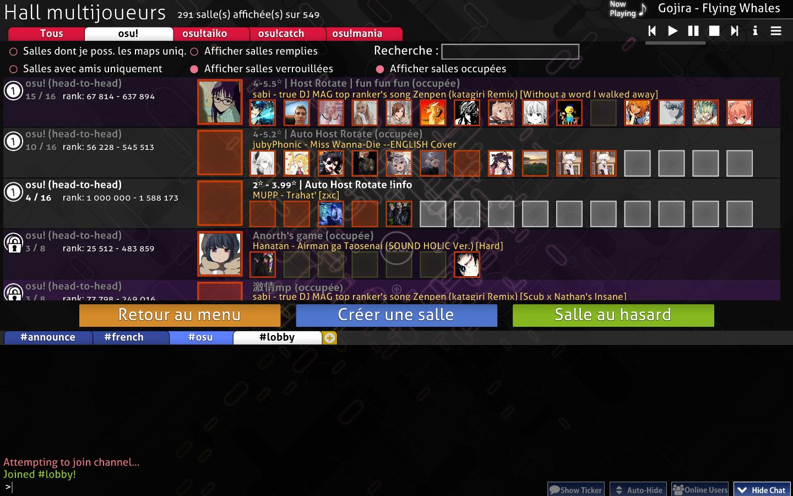
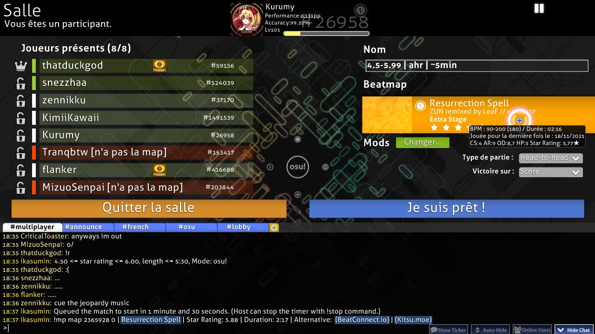
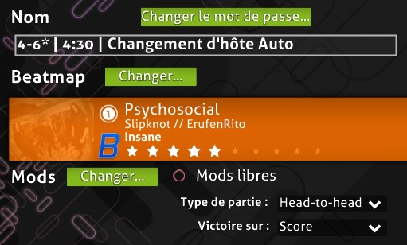
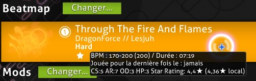
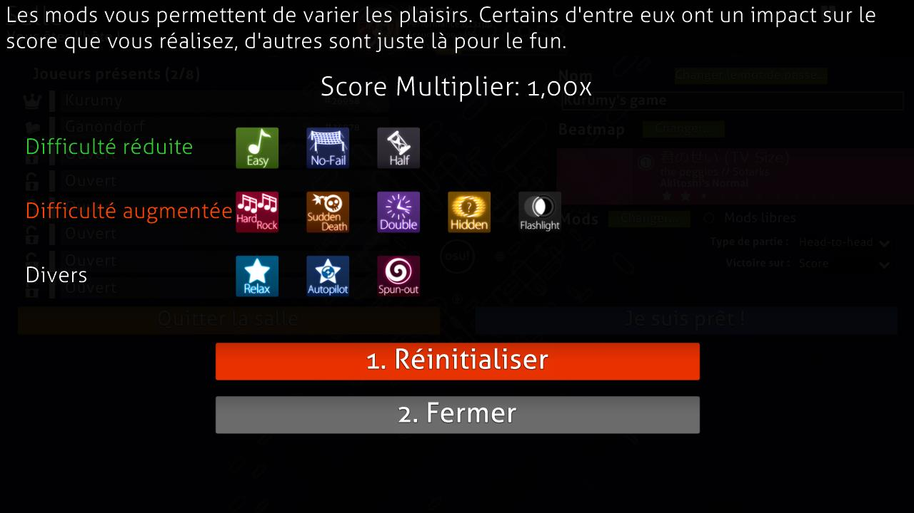
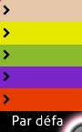

<!-- TODO: needs further rewrite, see https://github.com/ppy/osu-wiki/issues/7165 -->

# Multijoueur

**Le multijoueur** (parfois abrégé en *Multi*) est un mode dans lequel jusqu'à 16 joueurs peuvent s'affronter individuellement ou en équipe, ou jouer ensemble en coopération, sur des maps décidées par l'hôte.

[L'osu!academy](/wiki/Community/Video_series/osu!academy) couvre cette partie du client en format vidéo dans [L'Episode 6](https://www.youtube.com/watch?v=QPTLyG7O8ak), ainsi que le [panneau des utilisateurs en ligne](/wiki/Client/Interface/Chat_console#la-console-de-tchat-étendue).

## Comment jouer

*Remarque : Le mode multijoueur nécessite un [compte osu!](/wiki/Registration) et n'est pas disponible pour les joueurs [réduits au silence](/wiki/Silence).*

Le menu principal permet d'accéder au lobby multijoueur principal en suivant les étapes suivantes :

1. Cliquez sur le bouton `Play` ou appuyez sur `P`.
2. Cliquez sur le bouton `Multi` ou appuyez sur `M`.

## Lobby principal

*Remarque : Un tag [osu!supporter](/wiki/osu!supporter) actif est nécessaire pour entrer dans le lobby en utilisant le build `Cutting Edge (expérimental)`.*

En entrant, le joueur voit s'afficher tous les matchs actuellement disponibles.

### Options de filtrage

Les lobbys de match listés peuvent être filtrés à l'aide des options en haut à gauche.

| Titre | Description |
| :-: | :-- |
| `Tous` / `osu!` / `osu!taiko` / `osu!catch` / `osu!mania` | N'affiche que les matchs du [mode de jeu](/wiki/Game_mode) actuellement sélectionné ou de tous les modes de jeu. |
| `Salles dont je poss. les maps uniq.` | N'affiche les matchs que si le joueur possède la [beatmap](/wiki/Beatmap) en cours d'écoute. |
| `Afficher salles remplies` | Affiche les matchs même s'il n'y a pas d'emplacements vides disponibles. |
| `Recherche :` | Recherche une beatmap spécifique jouée ou le nom de l'hôte en utilisant la barre de recherche. Lors de la recherche, tous les filtres seront temporairement ignorés, à l'exception de `Afficher salles occupées`. |
| `Salles avec amis uniquement` | N'affiche que les matchs auxquels participent les amis du joueur. Cette option est prioritaire sur tous les autres filtres lorsqu'elle est activée. |
| `Afficher salles verrouillées` | Affiche les matchs dont l'accès nécessite un mot de passe. |
| `Afficher salles occupées` | Affiche les matches en cours. Ils peuvent encore être saisis s'il y a des créneaux libres. Ils sont indiqués par un titre de match gris et par la mention `(occupée)` jusqu'à la fin du match. |

### Matchs

La liste des matchs disponibles s'affiche au milieu de l'écran.

La plupart des matchs ont un fond blanc clair, indiquant qu'ils ont été [créés normalement par l'interface du jeu](#créer-un-nouveau-match). Il y en a aussi avec un fond violet, ce sont des *matchs de tournoi* créés et gérés en utilisant des [commandes de tchat pour la gestion du lobby](/wiki/osu!_tournament_client/osu!tourney/Tournament_management_commands) comme `!mp make` ou `!mp makeprivate`.

Diverses informations sont affichées sur chaque lobby. Par exemple, les emplacements des joueurs à droite peuvent avoir trois couleurs différentes :

| Couleur | Description |
| :-: | :-- |
| Rouge | L'emplacement est occupé par un joueur. |
| Vert | L'emplacement est disponible. |
| Pas de couleur | L'emplacement est verrouillé. |

Pour entrer dans un match, cliquez sur l'un d'entre eux.

### Options générales

Les trois boutons situés au-dessus de la [console de tchat](/wiki/Client/Interface/Chat_console) fournissent les principales options de navigation de cet écran :

| Titre | Description |
| :-: | :-- |
| `Retour au menu` | Quittez le lobby et revenez au menu principal. |
| `Créer une salle` | Créer un nouveau match. Voir ci-dessous pour plus de détails. |
| `Salle au hasard` | Rejoindre un match disponible *aléatoirement* en fonction du [classement des points de performance](/wiki/Ranking#classement-des-points-de-performance) du joueur. |

## Créer un nouveau match

::: Infobox

:::

| Titre | Description |
| :-: | :-- |
| `Game Name` | Le nom du match. La valeur par défaut est `{nom du compte}'s game`. |
| `Require password to join` | Rendez le match privé. |
| `Password` | Définir un mot de passe pour le match. N'apparaît que si `Require password to join` est activé. |
| `Make match history publicly viewable` | Permet aux joueurs autres que les participants au match de consulter l'historique du match via un lien direct. N'apparaît que si `Require password to join` est activé. |
| `Max Players` | Le nombre total de joueurs (y compris l'hôte) autorisés à participer au match. Il est possible de choisir entre 2 et 16, la valeur par défaut étant 8. Ce nombre peut être ajusté ultérieurement en verrouillant/déverrouillant des emplacements de joueurs. |

En appuyant sur le bouton `1. Start Game` créera le match avec la musique en cours d'écoute comme beatmap. Le bouton `2. Cancel` ramène le joueur dans le lobby.

## Configuration du match

::: Infobox

:::

Après avoir lancé ou créé un match, la configuration du match s'affiche. Les sections suivantes se concentrent sur les différentes parties de l'écran, de haut en bas et de gauche à droite.

Bien qu'il n'y ait pas de bouton direct pour cela, le [menu des options](/wiki/Client/Options) est toujours accessible en appuyant sur `Ctrl` + `O` dans le lobby d'un match.

### Section d'en-tête

Le texte en haut à gauche indique si le joueur est l'hôte du match ou un joueur normal. Au milieu, une boîte de joueur contient des informations sur les [points de performance](/wiki/Performance_points/Total_performance_points), la [précision globale](/wiki/Gameplay/Accuracy), le [niveau](/wiki/Gameplay/Score/Total_score#niveau), le [rang](/wiki/Ranking#classement-des-points-de-performance) et le [mode de jeu](/wiki/Game_mode) sélectionné. À droite, un bouton permet de mettre en pause la musique en cours d'écoute.

### Liste des joueurs actuels

::: Infobox

:::

La liste des joueurs montre tous les emplacements pour un match. Les nombres entre parenthèses à droite de `Joueurs présents` indiquent le nombre de joueurs dans le match par rapport au nombre d'emplacements débloqués.

Les emplacements disponibles peuvent être déplacés en cliquant dessus, mais les emplacements indiqués par un cadenas fermé ne sont pas accessibles. L'hôte peut verrouiller et déverrouiller les emplacements à l'aide des icônes sur la gauche, ainsi que d'exclure des joueurs. Les privilèges de l'hôte peuvent être transférés à un autre joueur en faisant un clic droit et en appuyant sur `Transférer les privilèges de l'hôte`. La couleur de l'équipe peut être changée entre le bleu et le rouge lors d'un jeu Team VS.

En survolant un joueur de la liste, vous verrez le niveau, le pays et la [précision globale](/wiki/Gameplay/Accuracy) du joueur en question.

Un joueur peut avoir quatre couleurs différentes dans cette liste, qui ont également des significations différentes :

| Couleur | Description |
| :-: | :-- |
| **Rouge (n'a pas la map)** | Le joueur ne dispose pas de la beatmap, indiquée par une mention `[n'a pas la map]` jusqu'à ce qu'il ait téléchargé la beatmap. |
| **Blanc (non prêt)** | Le joueur a la beatmap mais n'est pas encore prêt. Les [Modificateurs de jeu](/wiki/Gameplay/Game_modifier) peuvent être modifiés dans cet état. |
| **Vert (prêt)** | Le joueur est prêt. Les modificateurs de jeu ne peuvent pas être changés dans cet état. L'hôte pourra commencer la partie après avoir été prêt, et tous les joueurs prêts commenceront le match. |
| **Bleu clair (en jeu)** | Le joueur joue, ce qui est indiqué par la mention `[en jeu]` jusqu'à la fin du match. |

### Paramètres du match

#### Nom du jeu et mot de passe

Le `Nom` est le nom du lobby qui est visible dans les listes de matchs dans le jeu et sur le site web. Le mot de passe est utile pour restreindre le lobby aux amis ou aux joueurs de tournois, et peut être changé en utilisant le bouton `Changer le mot de passe...` au-dessus du nom du jeu.

#### Beatmap

::: Infobox

:::

::: Infobox

:::

La section beatmap affiche la beatmap qui sera jouée pendant le match. La modification de la beatmap à l'aide du bouton situé au-dessus ouvre l'écran de sélection des musiques.

La carte de la beatmap affiche l'image de fond, l'icône du mode de jeu, le titre et l'artiste de la musique, le créateur de la beatmap, la [difficulté](/wiki/Beatmap/Difficulty) et le [nombre d'étoiles](/wiki/Beatmap/Star_rating) de la beatmap sélectionnée.

::: Infobox

:::

Lorsque l'on survole la beatmap, une fenêtre contextuelle affiche des informations sur la beatmap. Ces informations sont les suivantes :

| Valeur | Description |
| :-: | :-- |
| `BPM` | Battements par minute |
| `Durée` | Longueur de la beatmap |
| `Jouée pour la dernière fois le :` | Date de la dernière écoute de la beatmap |
| `CS` | Circle size |
| `AR` | Approach rate |
| `OD` | Overall difficulty |
| `HP` | HP drain rate |
| `Star Rating:` | Classement par étoiles |

Si le joueur ne dispose pas de la beatmap, l'un de ces statuts sera affiché :

| Statut de la beatmap | Description |
| :-: | :-- |
| `Ranked` / `Approved` / `Pending` / `Graveyard` | La [catégorie de la beatmap](/wiki/Beatmap/Category). En cliquant sur la carte de la beatmap, vous ouvrirez la page de la beatmap sur le site web, où elle pourra être [téléchargée](/wiki/Beatmap#télécharger-les-beatmaps). |
| `Not uploaded or not up-to-date` | La beatmap n'est pas disponible au téléchargement. L'hôte devrait trouver le lien (dans la [liste de beatmap](https://osu.ppy.sh/beatmapsets)) pour le joueur si le problème persiste. |
| `Cannot update the beatmap` | L'host joue une version modifiée de la beatmap. |

#### Mods

::: Infobox

:::

Cette section affichera les [mods de jeu](/wiki/Gameplay/Game_modifier) utilisés pour ce match.

L'hôte peut activer les `Mods libres` pour permettre aux joueurs de choisir librement n'importe quelle combinaison de mods, à l'exception de ceux qui modifient la vitesse de jeu ([Double Time (DT)](/wiki/Gameplay/Game_modifier/Double_Time), [Nightcore (NC)](/wiki/Gameplay/Game_modifier/Nightcore) et [Half Time (HT)](/wiki/Gameplay/Game_modifier/Half_Time)).

#### Mode d'équipe {id=mode-d'équipe-configuration-du-match}

*Pour plus d'informations sur les modes d'équipe, voir la [section sur le gameplay des modes d'équipe](#gameplay-mode-d'équipe).*

Un match peut se dérouler de quatre manières différentes :

| Mode équipe | Description |
| :-- | :-- |
| `Head-to-head` | Affrontez vos adversaires pour atteindre la première place du classement des matchs. |
| `Team VS` | Les équipes (rouge et bleue) s'affrontent pour la suprématie du match. |
| `Tag co-op` (mode osu! uniquement, non classé) | Faites équipe pour compléter la beatmap, un combo à la fois ensemble. |
| `Tag-team VS` (mode osu! uniquement, non classé) | Le même principe que le  `Tag co-op`, mais avec deux équipes qui s'affrontent. |

##### Couleur de tag

::: Infobox

:::

Si le mode d'équipe est réglé sur `Tag co-op` ou `Tag-team VS`, une section `Couleur :` sera affichée, permettant de choisir une couleur personnalisée pour chaque joueur. En réglant cette section sur `Par défaut`, les couleurs originales de la beatmap seront utilisées.

#### Condition de victoire

Il existe quatre façons différentes de déterminer le vainqueur d'un match :

| Titre | Description |
| :-: | :-- |
| `Score` | Le joueur qui obtient le score le plus élevé gagne. |
| `Accuracy` | Le joueur ayant la plus grande précision gagne. S'il y a deux joueurs avec 100,00 %, le joueur avec le score le plus élevé (à partir des spinners) gagne. Sinon, il y a égalité. |
| `Combo` | Le joueur ayant le plus grand nombre de combos *à la fin de la beatmap* gagne. Si le nombre de combo est le même, le joueur avec le score le plus élevé gagne. Le combo maximum n'est pas pris en compte dans ce cas. |
| `Score v2` | Le joueur qui obtient le score (standardisé) le plus élevé gagne. |

### Boutons de configuration du match

Il y a deux grands boutons orange et bleu au-dessus de la [console de tchat](/wiki/Client/Interface/Chat_console).

Le bouton orange `Quitter la salle` sur la gauche est explicite. Si l'hôte du match quitte le match, l'hôte sera automatiquement transféré au joueur restant dans l'ordre des emplacements. S'il n'y a plus personne dans le match, il sera automatiquement fermé, sauf pour les matchs créés par les commandes [`!mp`](/wiki/osu!_tournament_client/osu!tourney/Tournament_management_commands), qui seront fermés au bout de 30 minutes.

Le bouton bleu est utilisé pour contrôler l'état de préparation du joueur et pour commencer le match.

| Titre | Description |
| :-: | :-- |
| `Je suis prêt !` | Marque le joueur comme étant prêt (vert sur la liste des joueurs). Le bouton devient `Je ne suis pas prêt`. Pour l'hôte du match, le bouton devient soit `Start Game!`, soit `Force Start Game!` s'il y a des joueurs dans le lobby. |
| `Je ne suis pas prêt` | Marque le joueur comme n'étant non prêt (blanc sur la liste des joueurs). Le bouton devient `Je suis prêt !`. |
| `Start Game!` | Démarre le match. Ce bouton n'apparaît pour l'organisateur du match que lorsque tous les joueurs sont prêts. |
| `Force Start Game! ({ready}/{total})` | Commence le match même si tous les joueurs ne sont pas prêts. Ce bouton n'apparaît pour l'organisateur du match que lorsque certains joueurs sont prêts. Le nombre de joueurs prêts par rapport au nombre total de joueurs est indiqué entre parenthèses. |

### Historique des matchs

::: Infobox

:::

La partie inférieure de l'écran est la [console de tchat](/wiki/Client/Interface/Chat_console). Chaque match a son propre canal dans un onglet appelé `#multiplayer`, avec [BanchoBot](/wiki/BanchoBot) fournissant un lien vers l'historique du match sur la première ligne.

Pour les matchs Head-to-head, le résultat sera affiché en privé dans un autre onglet appelé `#userlog` à la fin, où BanchoBot dira `Vous avez obtenu la {placement} place sur {total} en multi sur {beatmap} [difficulté] <mode de jeu>.`

## Pendant le gameplay

### Général

#### Quitter le match

Il n'y a aucun moyen de mettre en pause un match multijoueur. En appuyant sur `Esc`, vous obtiendrez un avertissement dans le coin inférieur droit, et en appuyant à nouveau sur cette touche, vous quitterez le match.

#### Paramètres visuels

Lorsque le match commence, le fait de déplacer le curseur vers le bas de l'écran permet d'ouvrir le panneau des paramètres visuels. Voir la page [Paramètres visuels](/wiki/Client/Interface/Visual_settings) pour plus d'informations.

#### Santé

Lorsque la barre de santé d'un joueur est complètement épuisée, il peut toujours continuer à jouer, mais son score sera considéré comme nul et n'apparaîtra pas dans les classements. Le joueur peut être ranimé s'il atteint à nouveau sa pleine santé, à moins qu'il n'utilise [Sudden Death (SD)](/wiki/Gameplay/Game_modifier/Sudden_Death).

Dans les matchs Team VS, le fait d'être en état d'échec à la fin du match fait que le score ne contribue pas au score de l'équipe. Si tous les joueurs d'une équipe ont échoué, le match se termine immédiatement et l'équipe adverse gagne par défaut.

#### Résultats

Bien qu'il n'y ait pas [d'écran des résultats étendu](/wiki/Client/Interface#écran-de-résultats-étendu) sous l'écran de résultats comme lorsque vous jouez en solo, les scores établis pendant les matchs multijoueurs (à l'exception des matchs `Tag co-op` et `Tag-team VS`) apparaîtront toujours dans les classements en ligne s'ils sont suffisamment bons. Le résultat n'apparaîtra pas dans le classement local.

#### Sauvegarde du replay

Le replay du score peut être exporté en appuyant sur la touche F2, sauf dans les modes d'équipe `Tag co-op` et `Tag-team VS`.

#### Tableau de classement multijoueurs

Le tableau de classement situé sur le côté de l'écran affiche différentes statistiques en direct pour chaque joueur en fonction des paramètres du match.

Pour les matchs `Head-to-head` et `Team VS` :

| Condition de victoire | Statistiques affichées |
| :-- | :-- |
| `Score` / `Score v2` | Individual score, combo multiplier, judgements |
| `Accuracy` | Accuracy, individual score, combo multiplier, judgements |
| `Combo` | Current combo counts |

For `Tag co-op` and `Tag-team VS`:

| Condition de victoire | Statistiques affichées |
| :-- | :-- |
| `Score` / `Score v2` | Score de l'équipe, score individuel, jugements |
| `Accuracy` | Précision moyenne de l'équipe, score individuel, jugements |
| `Combo` | Nombre du combos en cours, score individuel, jugements |

Si un joueur échoue lors d'un match Tag co-op, le match se termine et les joueurs retournent dans le lobby du match. En Tag-team VS, l'équipe adverse gagne par défaut. Les joueurs qui échouent ne contribuent pas à l'équipe à moins qu'ils n'aient été réanimés avant la fin du match.

Si un joueur abandonne pendant un match, le jeu jouera parfaitement son rôle à sa place, mais ne contribuera pas à l'équipe. Si tous les joueurs d'une équipe abandonnent, l'équipe adverse gagnera par défaut.

Les joueurs qui ont échoué ou abandonné seront placés en bas du classement et leurs scores seront triés séparément de ceux des autres joueurs.

La couleur de chaque joueur sur le tableau de classement pendant le jeu indique le statut du joueur pendant le match.

| Exemple d'image | Statut | Description |
| :-: | :-: | :-- |
|  | Normal | Le joueur a plus de la moitié de sa santé. La couleur devient un bleu plus vif ou vire au rouge en fonction de l'état de santé du joueur. |
|  | Danger | Le joueur a moins de la moitié de sa santé. La couleur deviendra un rouge plus vif ou passera au bleu en fonction de l'état de santé du joueur. |
|  | Échec | Le joueur a atteint 0 HP et est en [état d'échec](#santé). |
|  | Tag | Dans `Tag co-op` et `Tag-team VS`, la boîte du joueur sera toujours verte. Une flèche verte pointe vers le joueur actuel avec une subtile lueur blanche. |
|  | Skipped | Demande du joueur de sauter l'intro d'une beatmap s'il y en a une. L'intro sera sautée une fois que tous les joueurs en auront fait la demande.. |
|  | Quitté | Le joueur a quitté le match, soit en appuyant deux fois sur `Esc`, soit en se déconnectant de [Bancho](/wiki/Bancho_(server)). La couleur du texte passera du blanc au rouge, avec `[Quit]` ajouté à la fin. La couleur de la boîte indique le statut avant de quitter le jeu. |

### Mode équipe {id=gameplay-mode-d'équipe}

#### Head-to-head

##### Interface

::: Infobox

:::

Head-to-head est un mode d'équipe dans lequel les joueurs s'affrontent dans un match libre pour la première place du classement. Il s'agit du mode d'équipe par défaut et il n'a pas de caractéristiques particulières en termes de gameplay, si ce n'est la recherche de la première place.

##### Résultats

::: Infobox

:::

À la fin du match, l'avatar du vainqueur est affiché dans une grande boîte de vainqueur, ainsi que le tableau de classement du match à droite

La [note](/wiki/Gameplay/Grade) de la partie est placée derrière le résultat comme un filigrane. Les résultats des autres joueurs peuvent être consultés en cliquant sur leur panneau dans le tableau de classement.

Chaque joueur recevra le résultat de son match sous forme de message privé dans l'onglet `#userlog` du [tchat](/wiki/Client/Interface/Chat_console).

#### Team VS

##### Interface

::: Infobox

:::

Team VS oppose deux équipes, la bleue et la rouge.

Le bleu est à gauche et le rouge à droite. Une couronne au centre se déplace de gauche à droite pour indiquer l'équipe gagnante.

Le changement d'équipe peut se faire dans le lobby. Il n'y a pas de handicap pour les équipes moins nombreuses et il est tout à fait possible de commencer un match avec une seule équipe.

##### Résultats {id=écran-des-résultats-team-vs}

::: Infobox

:::

L'équipe gagnante est annoncée en haut de l'écran des résultats.

Seuls les joueurs en vie à la fin du match comptent pour le total de leur équipe.

Les panneaux latéraux affichent les résultats de chaque joueur dans différents onglets. L'onglet "Total" montre le nombre total de [jugements](/wiki/Gameplay/Judgement) pour les deux équipes et leur précision moyenne.

#### Tag co-op / Tag-team VS

##### Interface

*Remarque : ce mode d'équipe n'est pas classé et n'est disponible qu'en mode osu!.*

::: Infobox

:::

::: Infobox

:::

Tag co-op fait en sorte que tous les joueurs du match travaillent ensemble pour réussir la beatmap, un combo à la fois. Le jeu `Tag-team VS` est juste `Tag co-op`, mais avec deux équipes jouant l'une contre l'autre.

Dans ce mode, le placement des joueurs dans le lobby détermine l'ordre dans lequel ils jouent.

Une flèche verte indique le joueur en train de jouer et son nom est affiché en bas à droite. Des flèches d'avertissement indiquent que c'est bientôt le tour du joueur et les objets sont colorés. Le joueur peut définir une couleur de combo fixe lors de la configuration du match dans la section [Couleur de tag](#couleur-de-tag) du lobby du match.

Tous les joueurs doivent faire tourner le spinner, sinon le combo se brise.

Si un joueur abandonne pendant le match, le jeu jouera son rôle à sa place.

Tous les joueurs partagent la même barre de santé. Si celle-ci se vide complètement, le match se termine. Tag-team VS, chaque équipe dispose de sa propre barre de santé, et la perte de celle-ci entraîne la défaite de l'équipe.

Les joueurs qui utilisent le modificateur [Sudden Death (SD)](/wiki/Gameplay/Game_modifier/Sudden_Death) mettront fin à tout le match s'ils échouent à cause de ce modificateur, même en Tag-team VS. Si [Easy (EZ)](/wiki/Gameplay/Game_modifier/Easy) est utilisé, les joueurs peuvent toujours obtenir deux vies supplémentaires. Cependant, en Tag-team VS, lorsque la santé d'une équipe tombe à zéro, même si la [barre de santé](/wiki/Client/Interface/Health_bar) est remplie à nouveau, le match sera considéré comme *échec* et se terminera immédiatement.

##### Résultats

::: Infobox

:::

::: Infobox

:::

Aucun score classé ou point de performance n'est attribué pour les matchs `Tag co-op` ou `Tag-team VS`.

Pour `Tag co-op`, le résultat affiché est le score total, les [jugements](/wiki/Gameplay/Judgement) et la précision de l'équipe. Les résultats individuels ne sont pas affichés et ne peuvent être consultés que dans l'historique du match. L'écran des résultats n'apparaît que si la beatmap a été réussie, contrairement aux autres modes multijoueurs.

L'écran des résultats de `Tag-team VS` est identique à [l'écran des résultats du mode d'équipe `Team VS`](#écran-des-résultats-team-vs), sauf que les résultats individuels peuvent être vus sous des onglets différents pour chaque équipe.

## Le saviez-vous ?

### Histoire

::: Infobox
, mais pas encore jouable en multijoueur.")
:::

- La version multijoueur initiale a été implémentée le 3 juin 2008 dans l'osu! Public Release b335.
- La configuration des matchs ne permettait qu'un total de 8 joueurs.
- osu!mania était affiché comme un "3" dans le lobby pour les joueurs qui n'avaient pas encore mis à jour leur client avec la dernière version du patch (qui permettait de jouer à osu!mania sans prendre en charge les classements).
- No Video était le *seul* modificateur de jeu autorisé pour les joueurs, mais il a été supprimé en faveur de son placement dans les [paramètres visuels](/wiki/Client/Interface/Visual_settings).
