<!-- TODO: needs further rewrite, see https://github.com/ppy/osu-wiki/issues/7165 -->

# มัลติเพลเยอร์ (Multiplayer)

**มัลติเพลเยอร์ (Multiplayer)** (บางครั้งเรียกว่า *มัลติ*) คือโหมดที่ผู้เล่นสูงสุด 16 คนสามารถแข่งขันกันเองแบบเดี่ยวหรือแบบทีม หรือร่วมมือกันเล่นในแมพที่โฮสต์เป็นคนเลือก

บทความซีรีส์ [osu!academy](/wiki/Community/Video_series/osu!academy) ได้อธิบายโหมดนี้ไว้ในรูปแบบวิดีโอใน [ตอนที่ 6](https://www.youtube.com/watch?v=QPTLyG7O8ak) ร่วมกับหน้าต่างผู้ใช้งานออนไลน์

## วิธีการเล่น

*ประกาศ: โหมดมัลติเพลเยอร์จำเป็นต้องมี [บัญชี osu!](/wiki/Registration) และไม่สามารถใช้งานได้สำหรับผู้เล่นที่ถูก [ระงับการแชท (Silence)](/wiki/Silence)*

จากเมนูหลัก คุณสามารถเข้าสู่ล็อบบี้มัลติเพลเยอร์ได้ตามขั้นตอนดังนี้:

1. คลิกปุ่ม `Play` หรือกดปุ่ม `P`
2. คลิกปุ่ม `Multi` หรือกดปุ่ม `M`

## ล็อบบี้หลัก (Main lobby)

*ประกาศ: จำเป็นต้องมีสถานะ [osu!supporter](/wiki/osu!supporter) ที่ใช้งานได้เพื่อเข้าสู่ล็อบบี้มัลติเพลเยอร์ในเวอร์ชัน `Cutting Edge`*

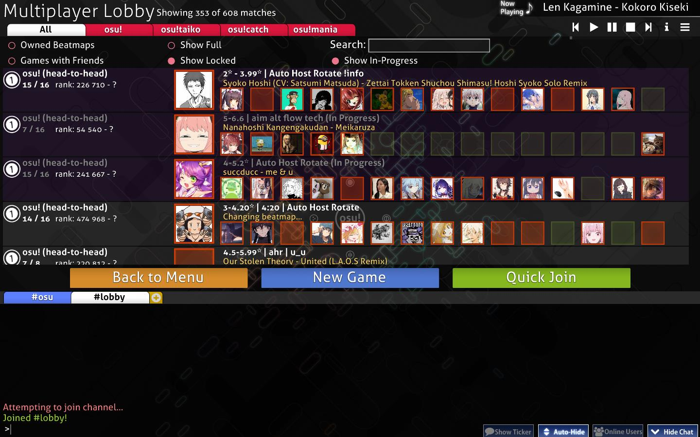

เมื่อเข้ามาแล้ว ผู้เล่นจะพบกับรายการห้องแข่งขันทั้งหมดที่มีอยู่ในปัจจุบัน

### ตัวเลือกการกรอง (Filter options)

คุณสามารถกรองรายการห้องแข่งขันได้โดยใช้ตัวเลือกที่มุมซ้ายบน ดังนี้:

| หัวข้อ | คำอธิบาย |
| :-: | :-- |
| `All` / `osu!` / `osu!taiko` / `osu!catch` / `osu!mania` | แสดงเฉพาะห้องที่เล่นโหมดเกมที่เลือก หรือแสดงทั้งหมด |
| `Owned Beatmaps` | แสดงเฉพาะห้องที่เล่น Beatmap ที่คุณมีอยู่ในเครื่องเท่านั้น |
| `Show Full` | แสดงห้องแม้ว่าจะไม่มีที่ว่างเหลืออยู่ก็ตาม |
| `Search` | ค้นหาจากชื่อ Beatmap หรือชื่อโฮสต์ผ่านแถบค้นหา เมื่อค้นหา ตัวกรองอื่นๆ จะถูกละเว้นชั่วคราวยกเว้น `Show In-progress` |
| `Games with Friends` | แสดงเฉพาะห้องที่เพื่อนของคุณกำลังเล่นอยู่ ตัวเลือกนี้จะทับตัวกรองอื่นๆ ทั้งหมด |
| `Show Locked` | แสดงห้องที่ต้องใส่รหัสผ่านเพื่อเข้าเล่น |
| `Show In-progress` | แสดงห้องที่กำลังเริ่มเล่นไปแล้ว คุณยังคงเข้าห้องเหล่านี้ได้หากมีที่ว่าง โดยห้องเหล่านี้จะมีชื่อเป็นสีเทาและมีคำว่า `(In progress)` ต่อท้าย |

### ห้องแข่งขัน (Matches)

พื้นที่ส่วนกลางของหน้าจอจะแสดงรายการห้องแข่งขันที่เปิดอยู่

ห้องส่วนใหญ่จะมีพื้นหลังสีขาวนวล ซึ่งหมายถึง [ห้องที่สร้างขึ้นตามปกติผ่านหน้าจอเกม](#การสร้างห้องใหม่) ส่วนห้องที่มีพื้นหลังสีม่วงคือ *Tournament matches* ซึ่งสร้างและจัดการผ่าน [คำสั่งแชทสำหรับการจัดการล็อบบี้](/wiki/osu!_tournament_client/osu!tourney/Tournament_management_commands) เช่น `!mp make` หรือ `!mp makeprivate`

ข้อมูลต่างๆ จะถูกแสดงในแต่ละห้อง ตัวอย่างเช่น ช่องผู้เล่นทางด้านขวาจะมี 3 สีดังนี้:

| สี | คำอธิบาย |
| :-: | :-- |
| แดง | มีผู้เล่นอยู่ในช่องนั้นแล้ว |
| เขียว | ช่องว่างที่สามารถเข้าได้ |
| ไม่มีสี | ช่องนั้นถูกล็อกไว้ |

คลิกที่ห้องใดก็ได้เพื่อเข้าร่วมการแข่งขัน

### ตัวเลือกทั่วไป

ปุ่ม 3 ปุ่มที่อยู่เหนือ [หน้าต่างแชท](/wiki/Client/Interface/Chat_console) คือคำสั่งหลักของหน้านี้:

| หัวข้อ | คำอธิบาย |
| :-- | :-- |
| `Back to Menu` | ออกจากล็อบบี้และกลับสู่เมนูหลัก |
| `New Game` | สร้างห้องแข่งขันใหม่ ดูรายละเอียดได้ที่หัวข้อถัดไป |
| `Quick Join` | สุ่มเข้าร่วมห้องที่มีว่าง โดยอิงจาก [อันดับ Performance points](/wiki/Ranking#performance-points-ranking) ของผู้เล่นในปัจจุบัน |

## การสร้างห้องใหม่ (Creating a new game)

::: Infobox
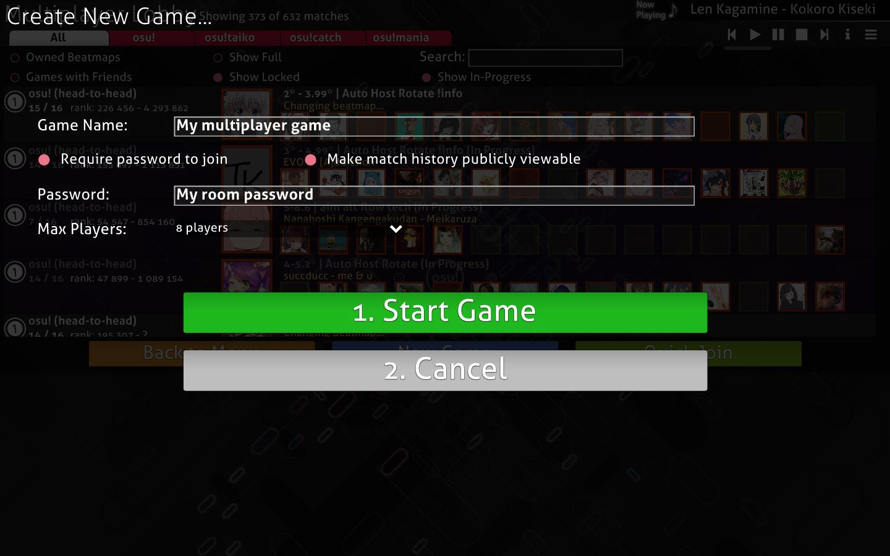
:::

| หัวข้อ | คำอธิบาย |
| :-- | :-- |
| `Game Name` | ชื่อห้องแข่งขัน ค่าเริ่มต้นจะเป็น `{account name}'s game` |
| `Require password to join` | ตั้งค่าให้ห้องเป็นแบบส่วนตัว |
| `Password` | กำหนดรหัสผ่านสำหรับเข้าห้อง จะปรากฏเมื่อเปิดใช้งานการใช้รหัสผ่าน |
| `Make match history publicly viewable` | อนุญาตให้คนอื่นดูประวัติการแข่งขันย้อนหลังผ่านลิงก์ตรงได้ จะปรากฏเมื่อเปิดใช้งานการใช้รหัสผ่าน |
| `Max Players` | จำนวนผู้เล่นสูงสุด (รวมโฮสต์) ตั้งได้ตั้งแต่ 2 ถึง 16 คน (ค่าเริ่มต้นคือ 8) สามารถปรับเพิ่มลดได้ภายหลังโดยการล็อก/ปลดล็อกช่องผู้เล่น |

คลิกปุ่ม `1. Start Game` เพื่อสร้างห้องโดยใช้เพลงที่กำลังฟังอยู่ในขณะนั้นเป็น Beatmap เริ่มต้น หรือคลิก `2. Cancel` เพื่อกลับสู่หน้าล็อบบี้

## หน้าตั้งค่าห้องแข่งขัน (Match setup)

::: Infobox
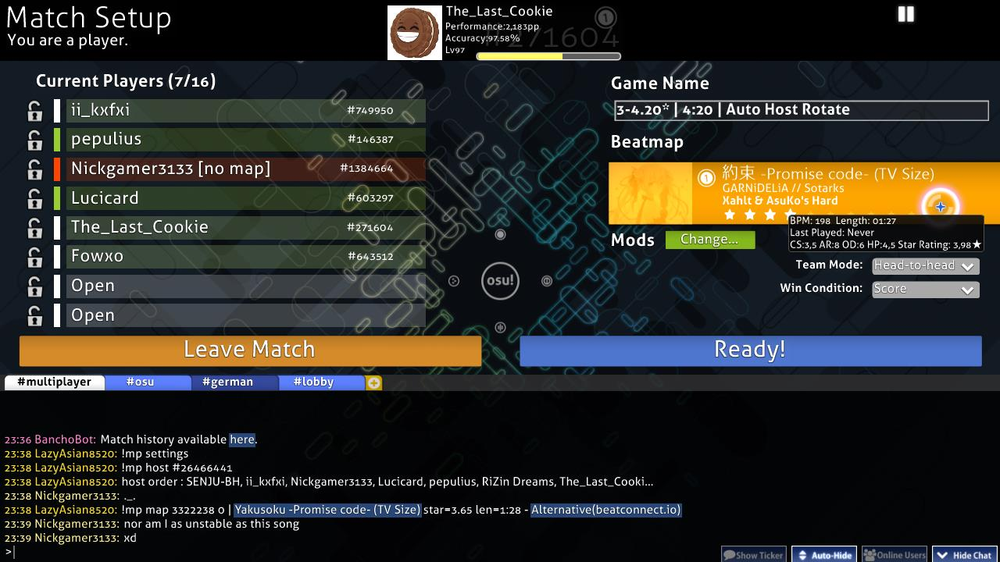
:::

หลังจากเข้าร่วมหรือสร้างห้อง หน้าตั้งค่าห้องแข่งขันจะปรากฏขึ้น ข้อมูลจะแบ่งเป็นส่วนต่างๆ จากบนลงล่างและซ้ายไปขวาดังนี้:

คุณสามารถเข้าถึง [เมนูการตั้งค่า (Options)](/wiki/Client/Options) ได้โดยกด `Ctrl` + `O` ในขณะที่อยู่ในห้อง

### ส่วนหัว (Header section)

ข้อความที่มุมซ้ายบนจะระบุว่าคุณเป็นโฮสต์ (Host) หรือผู้เล่นปกติ ส่วนตรงกลางจะแสดงแผงข้อมูลผู้ใช้ของคุณ (pp, Accuracy, Level, Rank และโหมดที่เลือก) และทางขวาจะมีปุ่มสำหรับหยุดเพลงที่กำลังฟังอยู่

### รายชื่อผู้เล่นปัจจุบัน (Current players list)

::: Infobox
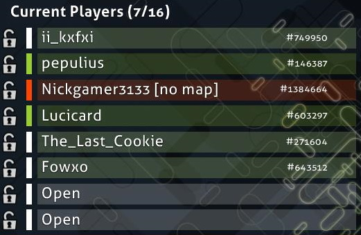
:::

รายชื่อผู้เล่นจะแสดงช่องทั้งหมดในห้อง ตัวเลขในวงเล็บข้างคำว่า `Current Players` คือจำนวนผู้เล่นที่อยู่ในห้องต่อจำนวนช่องที่เปิดอยู่

คุณสามารถเปลี่ยนช่องที่นั่งได้โดยการคลิกที่ช่องว่างที่ไม่ได้ถูกล็อก โฮสต์สามารถล็อกหรือปลดล็อกช่องที่นั่งได้ผ่านไอคอนด้านซ้าย รวมถึงสามารถเตะ (Kick) ผู้เล่นออกได้ โฮสต์สามารถโอนสิทธิ์ความเป็นโฮสต์ให้คนอื่นได้โดยการคลิกขวาที่ชื่อแล้วเลือก `Transfer host privileges` และสามารถเปลี่ยนสีทีมระหว่างน้ำเงินและแดงได้หากเล่นในโหมด Team VS

การวางเมาส์เหนือชื่อผู้เล่นจะแสดงเลเวล, ประเทศ และ [ความแม่นยำรวม](/wiki/Gameplay/Accuracy) ของผู้เล่นคนนั้น

สถานะของผู้เล่นจะแสดงผ่านสีที่แตกต่างกัน 4 สีดังนี้:

| สี | ความหมาย |
| :-: | :-- |
| **แดง (no map)** | ผู้เล่นไม่มี Beatmap นี้ โดยจะมีคำว่า `[no map]` กำกับไว้จนกว่าจะดาวน์โหลดเสร็จ |
| **ขาว (not ready)** | ผู้เล่นมีแมพแล้วแต่ยังไม่กด Ready ในสถานะนี้จะสามารถเปลี่ยน [Mod](/wiki/Gameplay/Game_modifier) ได้ |
| **เขียว (ready)** | ผู้เล่นพร้อมแล้ว ไม่สามารถเปลี่ยน Mod ได้ในสถานะนี้ โฮสต์จะเริ่มเกมได้เมื่อทุกคนกด Ready และผู้ที่ Ready จะได้เข้าเล่น |
| **ฟ้าอ่อน (playing)** | ผู้เล่นกำลังเล่นอยู่ โดยจะมีคำว่า `[playing]` กำกับไว้จนกว่าจะจบเพลง |

### การตั้งค่าห้อง (Match settings)

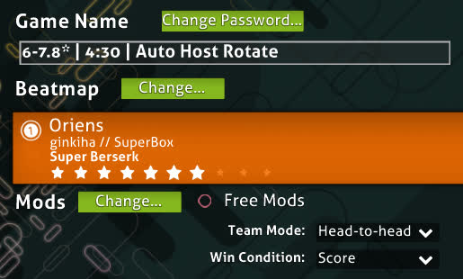

#### ชื่อห้องและรหัสผ่าน

`Game Name` คือชื่อห้องที่ปรากฏในรายการ การตั้งรหัสผ่านมีประโยชน์สำหรับการเล่นกับเพื่อนหรือใช้ในทัวร์นาเมนต์ สามารถเปลี่ยนได้ผ่านปุ่ม `Change Password`

#### Beatmap (บีทแมพ)

::: Infobox
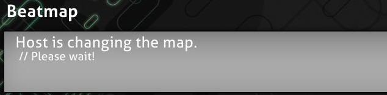
:::

::: Infobox
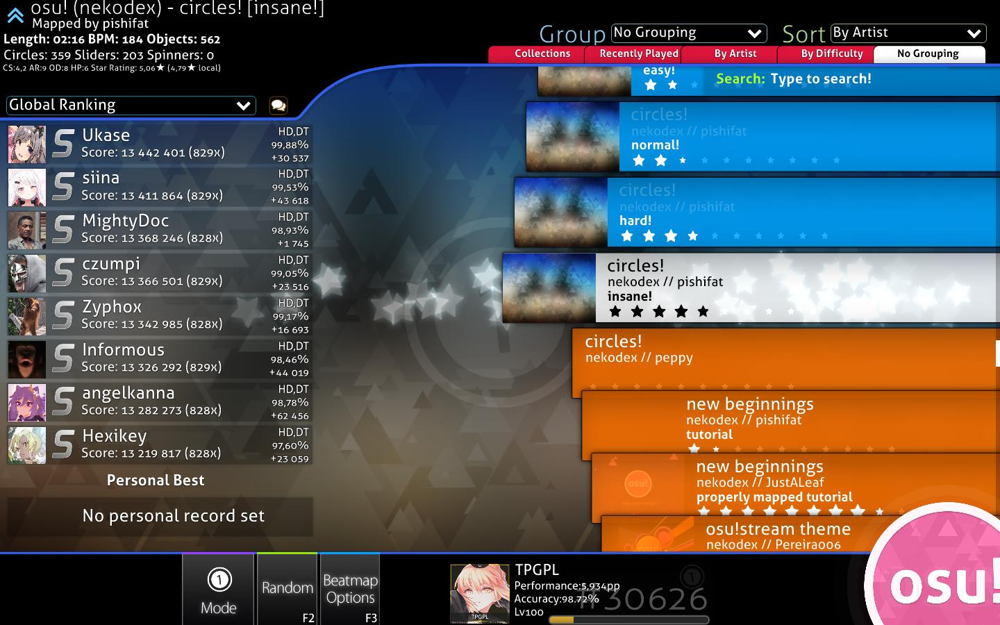
:::

ส่วนของ Beatmap จะแสดงแมพที่จะใช้เล่น การคลิกปุ่มด้านบนจะเปิดหน้าจอเลือกเพลงขึ้นมา

การ์ด Beatmap จะแสดงภาพพื้นหลัง, ไอคอนโหมดเกม, ชื่อเพลงและศิลปิน, ชื่อผู้สร้างแมพ, ระดับความยาก และระดับดาวของแมพนั้นๆ

::: Infobox
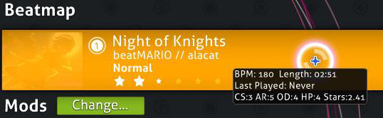
:::

เมื่อวางเมาส์เหนือการ์ด จะมีป๊อปอัปแสดงข้อมูลสถิติดังนี้:

| ค่าสถิติ | คำอธิบาย |
| :-: | :-- |
| `BPM` | จังหวะความเร็วของเพลง |
| `Length` | ความยาวรวมของแมพ |
| `Last Played` | เล่นครั้งล่าสุดเมื่อไหร่ |
| `CS` | ขนาดวงกลม |
| `AR` | ความเร็วการปรากฏโน้ต |
| `OD` | ความยากในการทำความแม่นยำ |
| `HP` | อัตราการลดของพลังชีวิต |
| `Stars` | ระดับดาวของแมพ |

หากผู้เล่นยังไม่มีแมพ ระบบจะแสดงสถานะดังนี้:

| สถานะบีทแมพ | คำอธิบาย |
| :-: | :-- |
| `Ranked` / `Approved` / `Pending` / `Graveyard` | [หมวดหมู่บีทแมพ](/wiki/Beatmap/Category) การคลิกที่การ์ดจะเป็นการเปิดหน้าเว็บเพื่อให้ [ดาวน์โหลด](/wiki/Beatmap#ดาวน์โหลด-บีทแมพ) |
| `Not uploaded or not up-to-date` | บีทแมพนี้ยังไม่ถูกอัปโหลดหรือมีเวอร์ชันใหม่กว่า โฮสต์ควรส่งลิงก์แมพให้ผู้เล่นอื่น |
| `Cannot update the beatmap` | โฮสต์กำลังใช้แมพเวอร์ชันที่ถูกดัดแปลง (Modified version) |

#### Mods (ม็อด)

::: Infobox
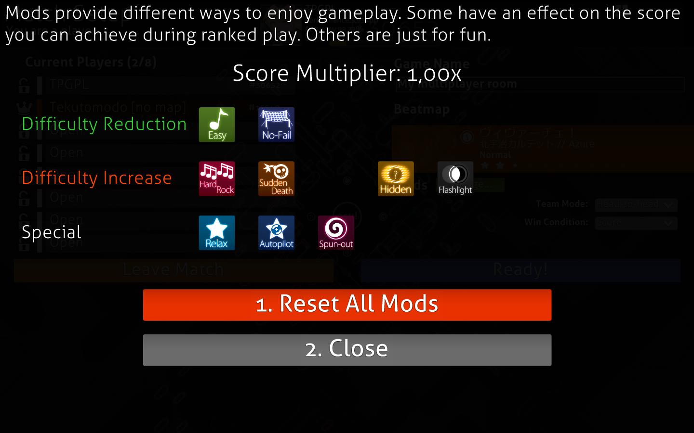
:::

ส่วนนี้จะแสดง [Mod](/wiki/Gameplay/Game_modifier) ที่ใช้ในการแข่งขันครั้งนี้

โฮสต์สามารถเปิดใช้งาน `Free Mods` เพื่ออนุญาตให้ผู้เล่นเลือกใช้ Mod อะไรก็ได้ ยกเว้น Mod ที่เปลี่ยนความเร็วของเพลง ([Double Time (DT)](/wiki/Gameplay/Game_modifier/Double_Time), [Nightcore (NC)](/wiki/Gameplay/Game_modifier/Nightcore) และ [Half Time (HT)](/wiki/Gameplay/Game_modifier/Half_Time))

#### โหมดทีม (Team mode)

*สำหรับข้อมูลเพิ่มเติม ดูหัวข้อ [เกมเพลย์ของโหมดทีม](#โหมดทีม-gameplay)*

มีรูปแบบการแข่งขัน 4 ประเภท:

| โหมดทีม | คำอธิบาย |
| :-- | :-- |
| `Head-to-head` | แข่งขันกันเองแบบเดี่ยวเพื่อชิงอันดับ 1 ในตารางคะแนนของห้อง |
| `Team VS` | แบ่งฝ่ายแข่งขันกันระหว่างทีมสีแดงและสีน้ำเงิน |
| `Tag co-op` (เฉพาะโหมด osu!, ไม่มีคะแนน Ranked) | ร่วมมือกันเล่นจนจบแมพ โดยสลับกันเล่นคนละหนึ่งคอมโบ |
| `Tag-team VS` (เฉพาะโหมด osu!, ไม่มีคะแนน Ranked) | เหมือนกับ Tag co-op แต่เป็นการแข่งกันระหว่างสองทีม |

##### สีประจำคอมโบ (Tag Colour)

::: Infobox
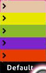
:::

หากตั้งโหมดทีมเป็น `Tag co-op` หรือ `Tag-team VS` จะมีส่วนของ `Tag Colour` ปรากฏขึ้น เพื่อให้ผู้เล่นแต่ละคนเลือกสีประจำตัวได้ หากตั้งเป็น `Default` จะใช้สีคอมโบเดิมของแมพ

#### เงื่อนไขการชนะ (Win condition)

มี 4 รูปแบบในการตัดสินผู้ชนะ:

| หัวข้อ | คำอธิบาย |
| :-: | :-- |
| `Score` | ผู้ที่ทำคะแนนรวมสูงสุดเป็นผู้ชนะ |
| `Accuracy` | ผู้ที่มีความแม่นยำสูงสุดเป็นผู้ชนะ หากเท่ากันที่ 100% ผู้ที่ทำคะแนนจากการหมุน Spinner ได้มากกว่าจะเป็นผู้ชนะ |
| `Combo` | ผู้ที่ถือคอมโบสูงสุด *ณ ตอนจบแมพ* เป็นผู้ชนะ หากคอมโบเท่ากันจะตัดสินที่คะแนนรวม |
| `Score v2` | ผู้ที่ทำคะแนนสูงสุดตามมาตรฐาน Score v2 เป็นผู้ชนะ |

### ปุ่มคำสั่งในห้องแข่งขัน

มีปุ่มขนาดใหญ่สองสีอยู่เหนือ [หน้าต่างแชท](/wiki/Client/Interface/Chat_console)

ปุ่มสีส้ม `Leave Match` ใช้สำหรับออกจากห้อง หากโฮสต์กดออก สิทธิ์การเป็นโฮสต์จะถูกโอนไปยังผู้เล่นคนถัดไปตามลำดับห้องโดยอัตโนมัติ หากไม่มีใครเหลืออยู่ในห้อง ห้องจะปิดตัวลงทันที (ยกเว้นห้องที่สร้างผ่านคำสั่ง `!mp` ซึ่งจะรอ 30 นาทีก่อนปิด)

ปุ่มสีน้ำเงินใช้สำหรับควบคุมสถานะความพร้อมและเริ่มเกม:

| หัวข้อ | คำอธิบาย |
| :-: | :-- |
| `Ready!` | ยืนยันความพร้อม (ชื่อจะกลายเป็นสีเขียว) |
| `Not Ready` | ยกเลิกความพร้อม (ชื่อจะเป็นสีขาว) |
| `Start Game!` | เริ่มการแข่งขัน (ปรากฏเฉพาะโฮสต์ เมื่อทุกคนพร้อมแล้ว) |
| `Force Start Game! ({ready}/{total})` | บังคับเริ่มเกมแม้คนจะไม่ครบ (ปรากฏเฉพาะโฮสต์ เมื่อมีคน Ready บางส่วน) |

### ประวัติการแข่งขัน (Match history)

::: Infobox
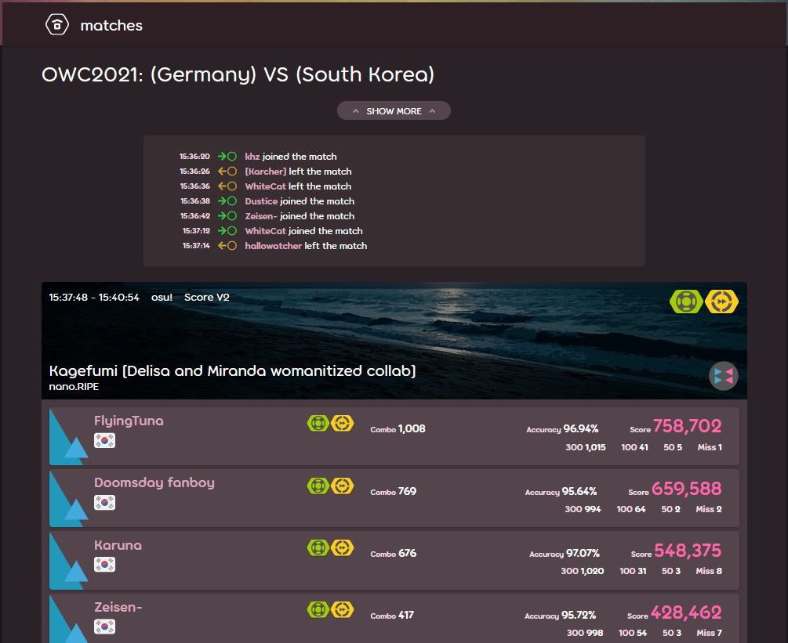
:::

ส่วนล่างของหน้าจอคือ [หน้าต่างแชท](/wiki/Client/Interface/Chat_console) ทุกห้องแข่งขันจะมีแชนแนลเฉพาะชื่อ `#multiplayer` โดยจะมี [BanchoBot](/wiki/BanchoBot) แจ้งลิงก์ไปยังหน้าประวัติการแข่งขันในบรรทัดแรกเสมอ

สำหรับโหมด Head-to-head ผลการแข่งจะแสดงเป็นการส่วนตัวในแถบ `#userlog` หลังจากจบเพลง

## ในระหว่างการเล่น

### ทั่วไป

#### การออกจากห้องระหว่างเล่น
ในมัลติเพลเยอร์ไม่มีการกดหยุด (Pause) หากกด `Esc` ครั้งแรกจะมีการแจ้งเตือนที่มุมขวาล่าง และหากกดอีกครั้งจะเป็นการออกจากแมพนั้นทันที

#### การตั้งค่าภาพ (Visual settings)
ในขณะที่กำลังโหลดเข้าแมพ คุณสามารถเลื่อนเมาส์ไปที่ด้านล่างเพื่อเปิดแผง [Visual settings](/wiki/Client/Interface/Visual_settings) ได้

#### พลังชีวิต (Health)
เมื่อพลังชีวิตหมดลง ผู้เล่นยังคงเล่นต่อไปได้จนจบ แต่สถานะจะถือว่าไม่ผ่าน (Failed) และคะแนนจะไม่ถูกบันทึกในตารางคะแนน ผู้เล่นสามารถ "ฟื้นคืนชีพ" ได้หากเก็บพลังชีวิตจนเต็มอีกครั้ง (ยกเว้นกรณีใช้ Mod Sudden Death)

ในโหมด Team VS หากผู้เล่นคนใดอยู่ในสถานะ Failed เมื่อจบแมพ คะแนนของเขาจะไม่ถูกนับรวมเข้ากับคะแนนทีม หากสมาชิกทุกคนในทีม Failed ทีมฝั่งตรงข้ามจะชนะทันที

#### การบันทึก Replay
สามารถกด `F2` เพื่อบันทึกไฟล์ Replay ได้หลังจากจบแมพ (ยกเว้นในโหมด Tag co-op และ Tag-team VS)

#### ตารางคะแนนมัลติเพลเยอร์
ในขณะเล่น จะมีการแสดงสถิติแบบสดๆ ของผู้เล่นทุกคนที่ด้านข้างจอ ตามเงื่อนไขการชนะที่ตั้งไว้

สีของแถบชื่อผู้เล่นในตารางคะแนนขณะเล่น:

| สถานะ | ความหมาย |
| :-: | :-- |
| ปกติ (Normal) | พลังชีวิตมากกว่าครึ่ง (สีจะเปลี่ยนจากฟ้าเป็นแดงตามระดับเลือด) |
| อันตราย (Danger) | พลังชีวิตเหลือน้อยกว่าครึ่ง |
| ไม่ผ่าน (Failed) | พลังชีวิตเหลือ 0 |
| Tag | (โหมด Tag) แสดงเป็นสีเขียว พร้อมลูกศรชี้คนที่จะต้องเล่นคนถัดไป |
| ข้าม (Skipped) | ผู้เล่นที่กดขอข้ามท่อนนำเพลง (Intro) |
| ออก (Quit) | ผู้เล่นที่ออกจากแมพไปแล้ว (ชื่อจะเป็นสีแดงพร้อมคำว่า `[Quit]`) |

### โหมดทีม (Team mode)

#### Head-to-head (แข่งขันรายบุคคล)
เป็นโหมดพื้นฐานที่ผู้เล่นทุกคนสลับกันชิงอันดับ 1 ในห้อง ไม่มีคุณสมบัติพิเศษในเกมเพลย์นอกจากแข่งขันกันทำคะแนนให้สูงที่สุด

#### Team VS (แข่งขันแบบทีม)
แบ่งฝ่ายน้ำเงิน (ซ้าย) และแดง (ขวา) จะมีสัญลักษณ์มงกุฎที่ขยับไปมาตรงกลางเพื่อบอกว่าทีมไหนกำลังนำอยู่ ไม่มีการต่อแต้มให้ทีมที่มีคนน้อยกว่า และสามารถเริ่มเกมได้แม้จะมีทีมเพียงฝ่ายเดียว

#### Tag co-op / Tag-team VS (โหมดสลับกันเล่น)
*หมายเหตุ: โหมดนี้ไม่มีการบันทึกคะแนน Ranked และมีเฉพาะในโหมด osu! เท่านั้น*

ผู้เล่นทุกคนในห้องต้องร่วมมือกันเล่นจนจบแมพ โดยสลับกันเล่นคนละหนึ่งคอมโบตามลำดับที่นั่งในห้อง จะมีลูกศรสีเขียวชี้ชื่อคนที่ต้องเล่น และมีลูกศรแจ้งเตือนเมื่อกำลังจะถึงตาคุณ

- ทุกคนต้องช่วยกันหมุน Spinner มิฉะนั้นคอมโบจะหลุด
- ทุกคนใช้แถบพลังชีวิตร่วมกัน (ใน Tag-team VS จะแยกแถบพลังชีวิตตามทีม)
- หากใครใช้ Mod Sudden Death แล้วกดพลาด จะทำให้ทั้งห้องแพ้ทันที

## เกร็ดน่ารู้ (Trivia)

- ระบบมัลติเพลเยอร์เปิดใช้งานครั้งแรกเมื่อวันที่ 3 มิถุนายน 2008 ในรุ่น b335
- ในยุคแรก ห้องมัลติเพลเยอร์รองรับผู้เล่นได้สูงสุดเพียง 8 คนเท่านั้น
- เดิมที Mod "No Video" เคยเป็น Mod เดียวที่อนุญาตให้เลือกใช้ในห้องได้ ก่อนจะย้ายไปอยู่ใน [Visual settings](/wiki/Client/Interface/Visual_settings)
