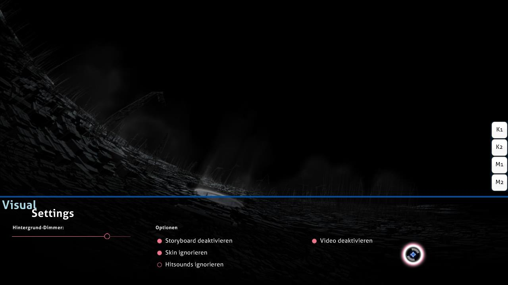

# Visuelle Einstellungen

**Visuelle Einstellungen** ist ein im unteren Spielfeld verstecktes Overlay. Es kann während des Ladens der Beatmap oder während das Spiel pausiert ist darauf zugegriffen werden. Wenn das Overlay sichtbar ist, wird das Laden der Beatmap verzögert, bis der Cursor das Overlay verlässt.

*Hinweis: Änderungen in den visuellen Einstellungen werden pro Beatmap gespeichert, aber manche davon gehen nach dem Schließen von osu! verloren. Um diese global zu setzen (und für immer), benutze die [Optionen](/wiki/Client/Options).*

Alternativ ist es auch möglich durch das Pausieren des Spiels auf die visuellen Einstellungen zuzugreifen. Jedoch funktioniert diese Methode nicht in [Mehrspieler](/wiki/Client/Interface/Multiplayer)-Spielen, da das als Versuch, das Spiel zu verlassen, interpretiert wird und stattdessen der Raum verlassen wird.

## Einstellungen

| Name | Effekt | Notizen |
| :-- | :-- | :-- |
| `Hintergrund-Dimmer` | Verdunkelt das Spielfeld (dazu gehören auch Storyboards und/oder Hintergrundvideos). | Während Pausen wird die Dimmung zu 30% heruntergesetzt (maximal 0%) (dieses Verhalten kann in den Optionen ausgestellt werden). *Anmerkung: Änderungen der Hintergrund-Dimmung werden pro Beatmap gespeichert, aber gehen nach dem Schließen von osu! verloren.* |
| `Storyboard deaktivieren` | Entfernt alle Storyboard-Elemente. Das beeinflusst nicht die [Kiai Time](/wiki/Gameplay/Kiai_time) und das Hintergrundvideo, falls vorhanden. | Das wird für Spieler mit Epilepsie empfohlen, wenn die Beatmap eine Epilepsiewarnung anzeigt. Diese Option ist deaktiviert, falls kein Storyboard verfügbar ist. |
| `Skin ignorieren` | Benutzt den Skin, den der Spieler ausgewählt hat, anstelle des in der Beatmap enthaltenen Skins. | Das benötigt einen Neustart, bevor es wirksam wird. |
| `Hitsounds ignorieren` | Benutzt die Hitsounds des vom Spieler ausgewählten Skins anstelle der Hitsounds der Beatmap, falls vorhanden. | Das benötigt einen Neustart, bevor es wirksam wird. |
| `Video deaktivieren` | Spielt kein Hintergrundvideo ab. Das entfernt nicht das Storyboard. | Das benötigt einen Neustart, sofern es nach dem Spielbeginn aktiviert wurde. Diese Option ist deaktiviert, wenn kein Hintergrundvideo verfügbar ist. |
