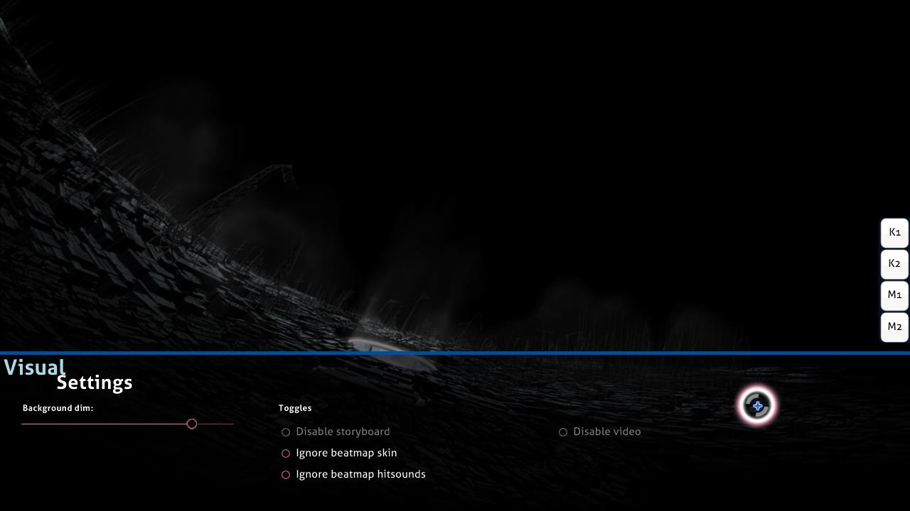

# Visual settings

**Visual settings** is a hidden customisation overlay located at the bottom of the playfield. It can be accessed while the beatmap is loading or when gameplay is paused. When the visual settings overlay is shown, the beatmap will be delayed until the cursor leaves the visual settings overlay.

*Notice: Visual settings changes are saved per beatmap but some of them will be lost after closing osu!. To set these globally (and forever) use the [options](/wiki/Client/Options) sidebar.*

Alternatively, it is possible to access visual settings overlay by pausing the game. However, this method does not work in [Multi](/wiki/Client/Interface/Multiplayer) matches as it will be treated as attempting to quit the match and leave the room instead.

## Settings

| Name | Effect | Notes |
| :-- | :-- | :-- |
| `Background dim` | Darken the playfield (including storyboards and/or background videos). | During breaks, the dim is decreased by 30% (max 0%) (this behaviour can be disabled in the options). *Note: Background dim changes are saved per beatmap but will be lost after closing osu!.* |
| `Disable storyboard` | Remove all storyboard elements. This does not affect [Kiai Time](/wiki/Gameplay/Kiai_time) and the background video, if any. | This is recommended for players with epilepsy issues for when the beatmap displays an epilepsy warning. This option is disabled if there is no storyboard to play. |
| `Ignore beatmap skin` | Use the player's selected skin instead of the beatmap's included skin. | This requires a retry to take effect. |
| `Ignore beatmap hitsounds` | Use the player's selected skin's hitsounds instead of the beatmap's custom hitsounds, if any. | This requires a retry to take effect. |
| `Disable video` | Do not play the background video. This does not remove the storyboard. | This requires a retry if activated after the gameplay begins. This option is disabled if there is no background video to play. |
