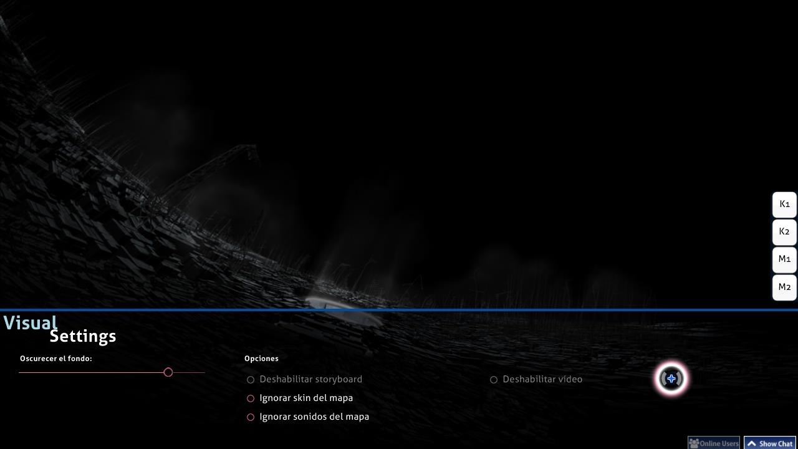

# Configuración visual

La **configuración visual** es una superposición de personalización oculta ubicada en la parte inferior del campo de juego. Se puede acceder mientras se carga el beatmap o cuando el juego está en pausa. Cuando se muestra la superposición de la configuración visual, el beatmap se retrasará hasta que el cursor abandone la superposición de la configuración visual.

*Aviso: los cambios de la configuración visual se guardan por beatmap, pero algunos de ellos se perderán después de cerrar osu!. Para configurarlos globalmente (y para siempre), usa la barra lateral de [opciones](/wiki/Client/Options).*

Alternativamente, es posible acceder a la superposición de la configuración visual al pausar el juego. Sin embargo, este método no funciona en partidas [multijugador](/wiki/Client/Interface/Multiplayer) ya que se tratará como un intento de abandonar la partida y abandonar la sala.

## Configuraciones

| Nombre | Efecto | Notas |
| :-- | :-- | :-- |
| `Oscurecer el fondo` | Oscurecer el campo de juego (incluidos storyboards y/o vídeos de fondo). | Durante los descansos, la oscuridad se reduce en un 30 % (máximo 0 %) (este comportamiento se puede desactivar en las opciones). *Nota: Los cambios de atenuación del fondo se guardan por beatmap, pero se perderán después de cerrar osu!.* |
| `Deshabilitar storyboard` | Eliminar todos los elementos del storyboard. Esto no afecta al [Kiai Time](/wiki/Gameplay/Kiai_time) ni al vídeo de fondo, si lo hay. | Esto se recomienda para jugadores con problemas de epilepsia cuando el beatmap muestra una advertencia de epilepsia. Esta opción está deshabilitada si no hay storyboard para reproducir. |
| `Ignorar skin del mapa` | Usa la skin seleccionada por el jugador en lugar de la skin incluida en el beatmap. | Esto requiere un reintento para que surta efecto. |
| `Ignorar sonidos del mapa` | Usa los hitsounds de la skin seleccionada por el jugador en lugar de los hitsounds personalizados del beatmap, si los hay. | Esto requiere un reintento para que surta efecto. |
| `Deshabilitar vídeo` | No reproduce el vídeo de fondo. Esto no elimina el storyboard. | Esto requiere un reintento si se activa después de que comience el juego. Esta opción está deshabilitada si no hay vídeo de fondo para reproducir. |
