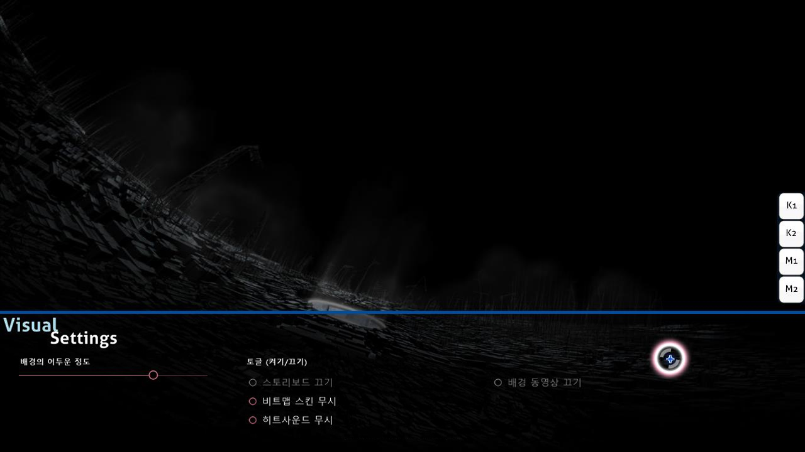

# 시각적 설정

**시각적 설정**은 플레이 화면 밑에 가려져 있는 숨겨진 설정입니다. 게임 플레이 도중 일시정지를 했을 때나, 비트맵을 불러오고 있을 때 변경 가능합니다. 커서가 설정창 안에서 벗어나기 전까지 비트맵은 일시정지된 상태로 유지됩니다.

*중요: 시각적 설정을 변경한 것은 osu!를 끌 경우 초기화 됩니다. 모든 비트맵에 설정을 적용하고 싶은 경우나 변경한 설정을 유지하고 싶은 경우에는 [옵션](/wiki/Client/Options)항목을 참조해주세요.*

게임 일시정지 버튼으로 시각적 설정창을 띄울 수 있지만 [멀티플레이](/wiki/Client/Interface/Multiplayer)의 경우 방에서 나가지니 주의하세요.

## 설정

| 이름 | 효과 | 부가설명 |
| :-- | :-- | :-- |
| `배경의 어두운 정도` | 플레이 화면의 어두운 정도를 조절합니다. (스토리보드와 배경 비디오 포함) | 쉬는시간 동안 어두운 정도가 최대 30%까지 밝아집니다. (밝게 하고 싶지 않을 경우 option 항목을 이용해주세요) |
| `스토리보드 끄기` | 스토리보드를 끕니다([kiai time](/wiki/Gameplay/Kiai_time) 배경 비디오 등 포함). | 이 설정은 간질 위험이 있는 비트맵을 플레이할 때 추천됩니다. 만약 비트맵에 스토리보드가 없다면 활성화 되지 않습니다. |
| `비트맵 스킨 무시` | 비트맵에 포함되어 있는 스킨이 아닌 유저가 선택한 스킨으로 플레이합니다. | 이 설정을 바꿀 경우 적용되려면 비트맵을 재시작해야 적용됩니다. |
| `비트맵 히트사운드 무시` | 비트맵이 설정한 히트사운드가 아닌 유저가 선택한 스킨에 있는 히트사운드를 사용합니다. | 이 설정을 바꿀경우 적용되려면 비트맵을 재시작해야 적용됩니다. |
| `배경 동영상 끄기` | 배경 동영상이 실행되지 않습니다. 스토리 보드에 있는 영상이 삭제되는 것은 아닙니다. | 이 세팅은 게임이 시작한 이후 활성화 하려면 재시작이 필요합니다. 배경 동영상이 없을 경우 활성화 되지 않습니다. |
