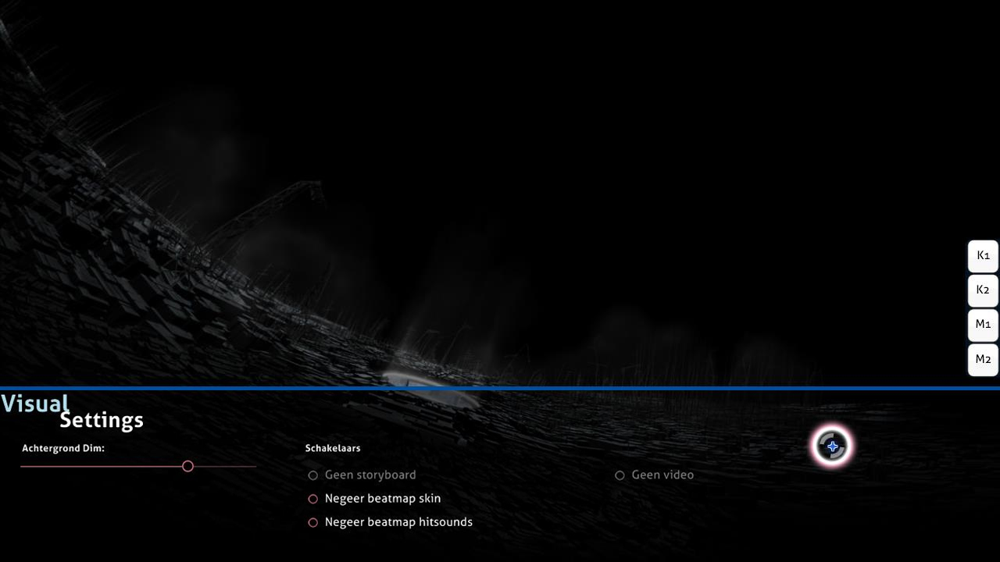

# Visuele instellingen

**Visuele instellingen** is een verborgen aanpassingsoverlay aan de onderkant van het speelveld. Je kan deze overlay gebruiken wanneer een beatmap aan het laden is of wanneer de gameplay gepauzeerd is. Als de visuele instellingen-overlay geopend is zal de beatmap niet starten totdat jouw cursor dit menu verlaat.

*Opmerking: Visuele instellingen worden opgeslagen per beatmap maar zullen verloren gaan wanneer je osu! sluit. Om deze instellingen op alle beatmaps toe te passen (voor altijd) kan je het [opties](/wiki/Client/Options)-menu gebruiken.*

Het is ook mogelijk om de visuele instellingen te bereiken door het spel te pauzeren. Dit werkt echter niet in [Multi](/wiki/Client/Interface/Multiplayer) matches, omdat dit zal worden beschouwd als een poging om de match te beëindigen en de lobby te verlaten.

## Instellingen

| Naam | Effect | Opmerkingen |
| :-- | :-- | :-- |
| `Achtergrond dim` | Verduistert het speelveld (inclusief storyboards en/of achtergrondvideo’s). | Tijdens breaks wordt de verduistering verminderd met 30% (max. 0%) (dit kan uitgeschakeld worden in de instellingen). |
| `Geen storyboard` | Verwijdert alle storyboard-elementen. Dit heeft geen invloed op [Kiai-Tijd](/wiki/Gameplay/Kiai_time) en de eventuele achtergrondvideo. | Dit is aanbevolen voor spelers met epilipsie wanneer de beatmap een epilepsiewaarschuwing weergeeft. Deze optie is automatisch uitgeschakeld als er geen storyboard is om af te spelen. |
| `Negeer beatmap skin` | Gebruikt de skin die door de speler werd geselecteerd in plaats van de skin die inbegrepen is met de beatmap. | Een beatmap-herstart is nodig als deze instelling na het begin van de map werd veranderd. |
| `Negeer beatmap hitsounds` | Gebruikt de hitsounds uit de skin die door de speler werd geselecteerd in plaats van gepersonaliseerde hitsounds uit de beatmap. | Een beatmap-herstart is nodig als deze instelling na het begin van de map werd veranderd. |
| `Geen video` | Speelt de achtergrondvideo niet af. Dit heeft geen invloed op het storyboard. | Een beatmap-herstart is nodig als deze instelling na het begin van de map werd veranderd. Deze optie is automatisch uitgeschakeld als er geen video is om af te spelen. |
