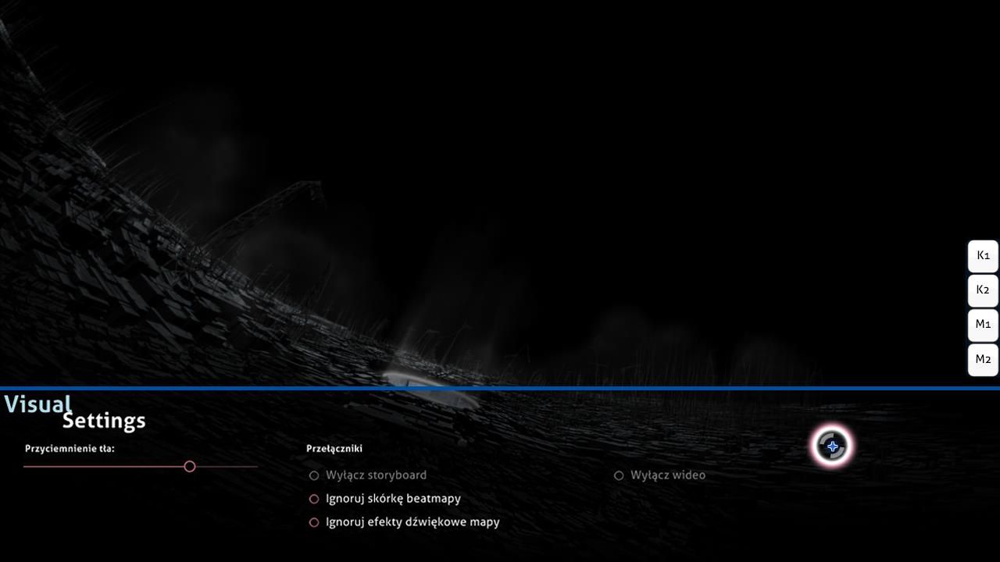

# Ustawienia wizualne

**Ustawienia wizualne** to ukryta nakładka, która znajduje się w dolnej części obszaru gry. Można do niej uzyskać dostęp, gdy beatmapa jest ładowana. Rozpoczęcie beatmapy zostanie opóźnione do czasu, aż kursor opuści obszar nakładki.

Nakładkę można także przywołać poprzez spauzowanie gry. Jednakże metoda ta nie zadziała w trakcie meczu w [trybie wieloosobowym](/wiki/Multi "Tryb wieloosobowy"), ponieważ zostanie to uznane jako próba wyjścia z meczu i gracz opuści pokój.

*Ważne:* Zmiany w ustawieniach wizualnych są zapisywane osobno dla każdej beatmapy i nie są zachowywane po wyłączeniu osu!. Globalne ustawienia znajdują się w nakładce [opcji](/wiki/Options "Opcje").

## Dostępne opcje

| Nazwa | Efekt | Adnotacje |
| :-- | :-- | :-- |
| Przyciemnienie tła | Przyciemnia obszar gry. | W zależności od ustawionej wartości bazowej, tło podczas przerw zostaje przyciemnione do ok. 30% lub nie jest przyciemniane wcale. Przy ustawieniu wartości na 100% elementy scenorysu są całkowicie przyciemnione. |
| Wyłącz storyboard | Usuwa wszystkie elementy scenorysu. Nie ma wpływu na czas [kiai](/wiki/Gameplay/Kiai_time) ani na wideo w tle. | Włączenie tej opcji jest zalecane dla beatmap z ostrzeżeniem dot. epilepsji. Opcja ta zostanie automatycznie wyłączona, jeżeli beatmapa nie posiada scenorysu. |
| Ignoruj skórkę beatmapy | Ignoruje elementy skórki beatmapy, jeżeli owe występują. W takiej sytuacji zostaną użyte elementy ze skórki użytkownika. | Aby ta opcja zadziałała, należy zrestartować beatmapę. |
| Ignoruj efekty dźwiękowe beatmapy | Ignoruje efekty dźwiękowe beatmapy, jeżeli owe występują. W takiej sytuacji zostaną użyte efekty dźwiękowe ze skórki użytkownika. | Aby ta opcja zadziałała, należy zrestartować beatmapę. |
| Wyłącz wideo | Wyłącza wideo w tle. Nie ma jednak żadnego wpływu na scenorys. | Należy zrestartować beatmapę, jeżeli opcja została aktywowana po rozpoczęciu piosenki. Opcja ta zostanie automatycznie wyłączona, jeżeli beatmapa nie posiada wideo w tle. |
