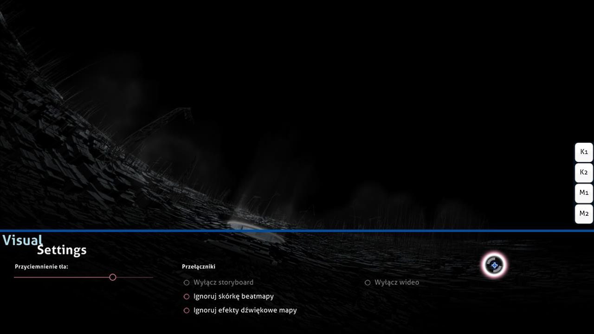

# Ustawienia wizualne

**Ustawienia wizualne** (ang. `Visual Settings`) to ukryta nakładka znajdująca się w dolnej części obszaru gry. Można ją otworzyć podczas ładowania beatmapy lub gdy rozgrywka jest spauzowana. Rozpoczęcie beatmapy zostanie opóźnione do czasu, aż kursor opuści obszar nakładki.

::: alert-notice
Zmiany ustawień wizualnych są zapisywane osobno dla każdej beatmapy, a niektóre z nich nie zostaną zachowane po wyłączeniu osu!. Globalne ustawienia można znaleźć w  [opcjach](/wiki/Options).
:::

Nakładkę można także otworzyć poprzez spauzowanie rozgrywki. Metoda ta nie zadziała w trakcie meczu w [trybie wieloosobowym](/wiki/Multi "Tryb wieloosobowy"), ponieważ zostanie to uznane za próbę wyjścia z meczu, powodując wyjście z pokoju.

## Dostępne opcje

| Nazwa | Efekt | Dodatkowe informacje |
| :-- | :-- | :-- |
| `Przyciemnienie tła` | Przyciemnia obszar gry (wliczając storyboardy i/lub wideo w tle). |  Podczas przerw przyciemnienie jest zmniejszone o 30% (do maksymalnie 0%) (można wyłączyć w opcjach). *Uwaga: Zmiany przyciemnienia tła są zapisywane dla każdej beatmapy osobno, jednak zostaną zresetowane po zamknięciu osu!.* |
| `Wyłącz storyboard` | Usuwa wszystkie elementy storyboardu. Nie ma wpływu na [czas kiai](/wiki/Gameplay/Kiai_time) ani na wideo w tle (jeżeli mapa je posiada). | Włączenie tej opcji jest zalecane osobom cierpiącym na epilepsję w przypadku beatmap z ostrzeżeniem dot. epilepsji. Opcja ta zostanie automatycznie wyłączona, jeżeli beatmapa nie posiada storyboardu. |
| `Ignoruj skórkę beatmapy` | Podczas rozgrywki zostanie użyta wybrana przez gracza skórka zamiast tej zawartej w beatmapie. | Wymaga zrestartowania beatmapy. |
| `Ignoruj efekty dźwiękowe beatmapy` | Jeżeli mapa posiada własne hitsoundy, zamiast nich zostaną użyte te z wybranej skórki gracza. | Wymaga zrestartowania beatmapy. |
| `Wyłącz wideo` | Wyłącza wideo w tle. Nie ma wpływu na storyboard. | Wymaga zrestartowania beatmapy, jeżeli opcja została aktywowana po rozpoczęciu beatmapy. Zostanie automatycznie wyłączona, jeżeli beatmapa nie posiada wideo w tle. |
